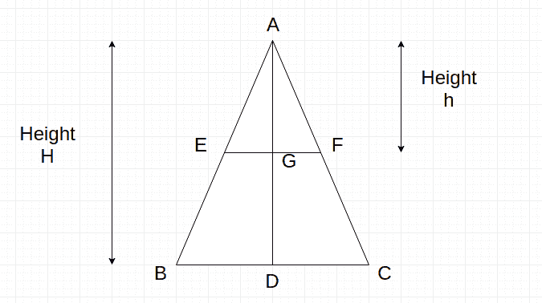

# 将等腰三角形一分为二，面积比为 n:m

> 原文:[https://www . geeksforgeeks . org/等腰三角形二等分三角形，面积比为 nm/](https://www.geeksforgeeks.org/divide-an-isosceles-triangle-triangle-in-two-part-with-ratio-of-area-as-nm/)

给定一个等腰三角形的高度和两个整数、。任务是找到三角形顶部的高度，这样如果我们从顶部平行于底部在高度 h 处进行切割，那么三角形必须被分成两部分，它们的面积之比等于 **n:m** 。
**示例** :

```
Input : H = 4, n = 1, m = 1
Output : 2.82843

Input : H = 4, n = 1, m = 0
Output : 4
```

首先，在继续之前，让我们先来谈谈等腰三角形的一些基本性质。
设▲ABC 为等腰三角形，AB = AC，BC 为三角形不等边不等底。如果 D 是 BC 的中点，那么 AD 就是我们的高度 h。另外，如果我们画一条平行于 BC 的线，分别在 E 点和 F 点切割 AB 和 AC，G 是 EF 的中点，那么▲AEG 类似于▲ABD，▲AFG 类似于▲ACD，▲AEF 类似于▲ABC，利用相似三角形的性质，我们可以得出以下结论:
**AE/AB = AG/AD = EG/BD = EF/BC = AF/AC–(I**



根据问题的要求，我们必须求出高度 h，使得▲AEF 面积与梯形 EFCB 面积之比= n:m

> 让，h 是从三角形顶部切下的高度。
> 现在，▲AEF 的面积= 0.5 * AG * EF，梯形 EFCB 的面积= 0.5 * GD * (EF+BC)
> 同样，两者之比为 n:m.
> 所以，我们可以说▲AEF 的面积与▲ABC 的面积之比等于 n :(n+m)。
> =>AEF 面积/▲ABC 面积= n/(n+m)
> =>/(0.5 * AG * EF)/(0.5 * AD * BC)= n/(n+m)
> =>(AG/AD)*(EF/BC)= n/(n+m)
> =>(EF/BC)*(EF/BC)= n/(n+m)
> =>H<sup>2</sup>

以下是上述方法的实现:

## C++

```
// C++ program, to find height h
// which divide isosceles triangle
// into ratio n:m
#include <bits/stdc++.h>
using namespace std;

// Function to return the height
float heightCalculate(int H, int n, int m)
{
    // type cast the n, m into float
    float N = n * 1.0;
    float M = m * 1.0;
    // calculate the height for cut
    float h = H * sqrt(N / (N + M));
    return h;
}

// Driver code
int main()
{
    int H = 10, n = 3, m = 4;
    cout << heightCalculate(H, n, m);
    return 0;
}
```

## Java 语言(一种计算机语言，尤用于创建网站)

```
// Java program, to find height h
// which divide isosceles triangle
// into ratio n:m

import java.io.*;

class GFG {

// Function to return the height
static float heightCalculate(int H, int n, int m)
{
    // type cast the n, m into float
    float N = (float)(n * 1.0);
    float M = (float)(m * 1.0);
    // calculate the height for cut
    float h = H *(float) Math.sqrt(N / (N + M));
    return h;
}

// Driver code

    public static void main (String[] args) {
            int H = 10, n = 3, m = 4;
    System.out.print( heightCalculate(H, n, m));
    }
}
```

## 蟒蛇 3

```
# Python 3 program, to find height
# h which divide isosceles triangle
# into ratio n:m
from math import sqrt

# Function to return the height
def heightCalculate(H, n, m):

    # type cast the n, m into float
    N = n * 1.0
    M = m * 1.0

    # calculate the height for cut
    h = H * sqrt(N / (N + M))
    return h

# Driver code
if __name__ == '__main__':
    H = 10
    n = 3
    m = 4
    print("{0:.6}" .
    format(heightCalculate(H, n, m)));

# This code is contributed
# by Surendra_Gangwar
```

## C#

```
// C# program, to find height h
// which divide isosceles triangle
// into ratio n:m
using System;

class GFG
{

// Function to return the height
static float heightCalculate(int H,
                             int n, int m)
{
    // type cast the n, m into float
    float N = (float)(n * 1.0);
    float M = (float)(m * 1.0);

    // calculate the height for cut
    float h = H * (float) Math.Sqrt(N / (N + M));
    return h;
}

// Driver code
public static void Main ()
{
    int H = 10, n = 3, m = 4;
    Console.WriteLine(heightCalculate(H, n, m));
}
}

// This code is contributed
// by inder_verma
```

## 服务器端编程语言（Professional Hypertext Preprocessor 的缩写）

```
<?php
// PHP program, to find height h
// which divide isosceles triangle
// into ratio n:m

// Function to return the height
function heightCalculate($H, $n, $m)
{
    // type cast the n, m into float
    $N = $n * 1.0;
    $M = $m * 1.0;

    // calculate the height for cut
    $h = $H * sqrt($N / ($N + $M));
    return $h;
}

// Driver code
$H = 10; $n = 3; $m = 4;
echo heightCalculate($H, $n, $m);

// This code is contributed
// by anuj_67
?>
```

## java 描述语言

```
<script>

// JavaScript program, to find height h
// which divide isosceles triangle
// into ratio n:m

// Function to return the height
function heightCalculate(H, n, m)
{
    // type cast the n, m into float
    let N = n * 1.0;
    let M = m * 1.0;
    // calculate the height for cut
    let h = H * Math.sqrt(N / (N + M));
    return h;
}

// Driver code

    let H = 10, n = 3, m = 4;
    document.write(heightCalculate(H, n, m));

// This code is contributed by Surbhi Tyagi.

</script>
```

**Output:** 

```
6.54654
```