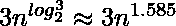
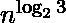

# 分而治之算法|简介

> 原文:[https://www . geesforgeks . org/分治算法-简介/](https://www.geeksforgeeks.org/divide-and-conquer-algorithm-introduction/)

在本文中，我们将讨论分而治之技术如何有所帮助，以及如何使用数模转换器技术来解决这个问题。在本节中，我们将讨论以下主题。

```
1. Introduction to DAC.
2. Algorithms under DAC techniques.
3. Recurrence Relation for DAC algorithm.
4. Problems using DAC technique.
```

**分治**
这种手法可以分为以下三个部分:

1.  **划分:**这涉及到将问题划分为更小的子问题。
2.  **征服:**递归调用解决子问题，直到解决。
3.  **合并:**将子问题合并，得到整个问题的最终解。

以下是一些遵循分治算法的标准算法。

1.  [**快速排序**](https://www.geeksforgeeks.org/quick-sort/)**是一种排序算法。该算法选取一个透视元素，并重新排列数组元素，以便所有小于选取的透视元素的元素移动到透视的左侧，所有较大的元素移动到右侧。最后，该算法递归地对枢轴元素左侧和右侧的子阵列进行排序。**
2.  **[**合并排序**](https://www.geeksforgeeks.org/merge-sort/) 也是一种排序算法。该算法将数组分成两半，递归排序，最后将排序后的两半合并。**
3.  **[**【最近点对】**](https://www.geeksforgeeks.org/closest-pair-of-points-using-divide-and-conquer-algorithm/) 问题是在 x-y 平面的一组点中找到最近点对。这个问题可以在 O(n^2 时间内通过计算每对点的距离并比较这些距离来找到最小值来解决。分治算法在 O(N ^ log N)时间内解决了这个问题。**
4.  **[**斯特拉森算法**](https://www.geeksforgeeks.org/strassens-matrix-multiplication/) 是一种高效的两个矩阵相乘的算法。两个矩阵相乘的简单方法需要 3 个嵌套循环，这就是 O(n^3).Strassen 的算法在 O(n^2.8974 时间乘以两个矩阵。**
5.  **[**库利–图基快速傅里叶变换(FFT)算法**](http://en.wikipedia.org/wiki/Cooley%E2%80%93Tukey_FFT_algorithm) 是 FFT 最常用的算法。它是一种在 O(N ^ log N)时间内工作的分治算法。**
6.  **[**Karatsuba 快速乘法算法**](https://www.geeksforgeeks.org/karatsuba-algorithm-for-fast-multiplication-using-divide-and-conquer-algorithm/) 最多做两个 *n 个*位数的乘法运算**

### ****

**一般的一位数乘法(当 *n* 是 2 的幂时，正好是)。因此，它比[经典](http://en.wikipedia.org/wiki/Long_multiplication)算法更快，后者需要 *n* <sup>2</sup> 个一位数的产品。特别是如果 *n* = 2 <sup> 10 </sup> = 1024，则准确的计数分别为 3 <sup> 10 </sup> = 59，049 和(2 <sup> 10 </sup> ) <sup> 2 </sup> = 1，048，576。**

**哪些不符合“分而治之”的条件:**

**二分搜索法是一种搜索算法。在每个步骤中，算法将输入元素 x 与数组中中间元素的值进行比较。如果值匹配，返回中间的索引。否则，如果 x 小于中间元素，则算法在中间元素的左侧递归，否则在中间元素的右侧递归。与普遍的看法相反，这不是“分而治之”的例子，因为每一步只有一个子问题(分而治之要求必须有两个或两个以上的子问题)，因此这是“减少和征服”的情况。**

****分而治之算法:****

```
DAC(a, i, j)
{
    if(small(a, i, j))
      return(Solution(a, i, j))
    else 
      m = divide(a, i, j)               // f1(n)
      b = DAC(a, i, mid)                 // T(n/2)
      c = DAC(a, mid+1, j)            // T(n/2)
      d = combine(b, c)                 // f2(n)
   return(d)
}
```

****DAC 算法的递归关系:**
这是上述程序的递归关系。**

```
 O(1) if n is small
T(n) =     f1(n) + 2T(n/2) + f2(n)
```

****例:**
求给定数组中的最大和最小元素。**

```
**Input:** { 70, 250, 50, 80, 140, 12, 14 }
**Output:** The minimum number in a given array is : 12
The maximum number in a given array is : 250
```

****方法:**从给定数组中寻找最大和最小元素是分治的一个应用。在这个问题中，我们将找到给定数组中的最大和最小元素。在这个问题中，我们使用的是分治法(DAC)，它有三个步骤:分治和合并。**

****对于最大值:**
在这个问题中，我们使用递归方法来寻找最大值，在这里我们将看到只剩下两个元素，然后我们可以很容易地使用条件，即 if(a[index] > a[index+1]。)
在程序行中，一个[index]和一个[index+1]条件将确保只剩下两个元素。**

> **if(index > = l-2)
> {
> if(a[index]>a[index+1])
> {
> /(a[index]
> //现在，我们可以说最后一个元素在给定的数组中将是最大的。
> }
> else
> {
> //(a[index+1]
> //现在，我们可以说最后一个元素在给定的数组中将是最大的。
> }
> }**

**在上述条件下，我们已经检查了左侧条件，以找出最大值。现在，我们将看到右侧条件，以找到最大值。
递归函数，用于检查数组当前索引处的右侧。**

> **max = DAC_Max(a，索引+1，l)；
> //递归调用**

**现在，我们将比较条件，并检查给定数组当前索引的右侧。
在给定的程序中，我们将实现这个逻辑来检查当前索引右侧的条件。**

> **//右元素将是最大值。
> if(a[index] > max)
> 返回 a[index]；
> // max 将是给定数组中的最大元素。
> 否则
> 返回 max
> }**

****求最小值:**
在这个问题中，我们将实现递归方法来寻找给定数组中的最小值。**

> **int DAC_Min(int a[]，int index，int l)
> //递归调用函数求给定数组中的最小编号。
> 如果(index > = l-2)
> //检查左边会有两个元素的条件
> ，那么我们就可以很容易地找到给定数组中的最小元素。
> {
> //这里我们将检查条件
> 是否(a[index] < a[index+1])
> 返回 a[index]；
> else
> 返回一个[index+1]；
> }**

**现在，我们将检查给定数组右侧的条件。**

> **//给定数组中右侧的递归调用。
> min = DAC_Min(a，索引+1，l)；**

**现在，我们将检查条件以找到右侧的最小值。**

> **//如果(a[index] < min)
> 返回 a[index]，右元素将是最小值
> ；
> //在给定的数组中，这里的最小值为最小值。
> 目不斜视
> 归来敏；**

****实施:****

## **C++**

```
// C++ code to demonstrate Divide and
// Conquer Algorithm#include<iostream>
# include<iostream>
using namespace std;

// function to find the maximum no.
// in a given array.
int DAC_Max(int arr[], int index, int l)
{
    int max;
    if(index >= l - 2)
    {
        if(arr[index] > arr[index + 1])
          return arr[index];
        else
          return arr[index + 1];
    } 
    max = DAC_Max(arr, index + 1, l);   
    if(arr[index] > max)
       return arr[index];
    else
       return max;
}

// Function to find the minimum no.
// in a given array
int DAC_Min(int arr[], int index, int l)
{
    int min;
    if(index >= l - 2)
    {
        if(arr[index] < arr[index + 1])
          return arr[index];
        else
          return arr[index + 1];
    }

    min = DAC_Min(arr, index + 1, l);  
    if(arr[index] < min)
       return arr[index];
    else
       return min;
}

// Driver code
int main()
{
    int arr[] = {120, 34, 54, 32, 58, 11, 90};
    int n = sizeof(arr) / sizeof(arr[0]);
    int max, min;
    max = DAC_Max(arr, 0, n);
    min = DAC_Min(arr, 0, n);
    cout << "Maximum: " << max << endl;
    cout << "Minimum: " << min << endl;
    return 0;
}

// This code is contributed by probinsah.
```

## **C**

```
// C code to demonstrate Divide and
// Conquer Algorithm
#include <stdio.h>
int DAC_Max(int a[], int index, int l);
int DAC_Min(int a[], int index, int l);

// function to find the maximum no.
// in a given array.
int DAC_Max(int a[], int index, int l)
{
    int max;
    if (index >= l - 2) {
        if (a[index] > a[index + 1])
            return a[index];
        else
            return a[index + 1];
    }

    // logic to find the Maximum element
    // in the given array.
    max = DAC_Max(a, index + 1, l);

    if (a[index] > max)
        return a[index];
    else
        return max;
}

// Function to find the minimum no.
// in a given array.
int DAC_Min(int a[], int index, int l)
{
    int min;
    if (index >= l - 2) {
        if (a[index] < a[index + 1])
            return a[index];
        else
            return a[index + 1];
    }

    // Logic to find the Minimum element
    // in the given array.
    min = DAC_Min(a, index + 1, l);

    if (a[index] < min)
        return a[index];
    else
        return min;
}

// Driver Code
int main()
{
    // Defining the variables
    int min, max, N;

    // Initializing the array
    int a[7] = { 70, 250, 50, 80, 140, 12, 14 };

    // recursion - DAC_Max function called
    max = DAC_Max(a, 0, 7);

    // recursion - DAC_Max function called
    min = DAC_Min(a, 0, 7);
    printf("The minimum number in a given array is : %d\n", min);
    printf("The maximum number in a given array is : %d", max);
    return 0;
}

// This code is contributed by Ashish Rana (GFG Team)
```

## **Java 语言(一种计算机语言，尤用于创建网站)**

```
// Java code to demonstrate Divide and
// Conquer Algorithm
class GFG{

// Function to find the maximum no.
// in a given array.
static int DAC_Max(int a[], int index, int l)
{
    int max;

    if (index >= l - 2)
    {
        if (a[index] > a[index + 1])
            return a[index];
        else
            return a[index + 1];
    }

    // Logic to find the Maximum element
    // in the given array.
    max = DAC_Max(a, index + 1, l);

    if (a[index] > max)
        return a[index];
    else
        return max;
}

// Function to find the minimum no.
// in a given array.
static int DAC_Min(int a[], int index, int l)
{
    int min;
    if (index >= l - 2)
    {
        if (a[index] < a[index + 1])
            return a[index];
        else
            return a[index + 1];
    }

    // Logic to find the Minimum element
    // in the given array.
    min = DAC_Min(a, index + 1, l);

    if (a[index] < min)
        return a[index];
    else
        return min;
}

// Driver Code
public static void main(String[] args)
{

    // Defining the variables
    int min, max;

    // Initializing the array
    int a[] = { 70, 250, 50, 80, 140, 12, 14 };

    // Recursion - DAC_Max function called
    max = DAC_Max(a, 0, 7);

    // Recursion - DAC_Max function called
    min = DAC_Min(a, 0, 7);

    System.out.printf("The minimum number in " +
                      "a given array is : %d\n", min);
    System.out.printf("The maximum number in " +
                      "a given array is : %d", max);
}
}

// This code is contributed by Princi Singh
```

## **C#**

```
// C# code to demonstrate Divide and
// Conquer Algorithm
using System;
class GFG
{

// Function to find the maximum no.
// in a given array.
static int DAC_Max(int []a, int index, int l)
{
    int max;

    if (index >= l - 2)
    {
        if (a[index] > a[index + 1])
            return a[index];
        else
            return a[index + 1];
    }

    // Logic to find the Maximum element
    // in the given array.
    max = DAC_Max(a, index + 1, l);

    if (a[index] > max)
        return a[index];
    else
        return max;
}

// Function to find the minimum no.
// in a given array.
static int DAC_Min(int []a, int index, int l)
{
    int min;
    if (index >= l - 2)
    {
        if (a[index] < a[index + 1])
            return a[index];
        else
            return a[index + 1];
    }

    // Logic to find the Minimum element
    // in the given array.
    min = DAC_Min(a, index + 1, l);

    if (a[index] < min)
        return a[index];
    else
        return min;
}

// Driver Code
public static void Main(String[] args)
{

    // Defining the variables
    int min, max;

    // Initializing the array
    int []a = {70, 250, 50, 80, 140, 12, 14};

    // Recursion - DAC_Max function called
    max = DAC_Max(a, 0, 7);

    // Recursion - DAC_Max function called
    min = DAC_Min(a, 0, 7);

    Console.Write("The minimum number in " +
                      "a given array is : {0}\n", min);
    Console.Write("The maximum number in " +
                      "a given array is : {0}", max);
}
}

// This code contributed by shikhasingrajput
```

## **蟒蛇 3**

```
# Python3 code to demonstrate Divide and
# Conquer Algorithm

# Function to find the maximum no.
# in a given array.
def DAC_Max(a, index, l):
    max = -1;

    if (index >= l - 2):
        if (a[index] > a[index + 1]):
            return a[index];
        else:
            return a[index + 1];

    # Logic to find the Maximum element
    # in the given array.
    max = DAC_Max(a, index + 1, l);

    if (a[index] > max):
        return a[index];
    else:
        return max;

# Function to find the minimum no.
# in a given array.
def DAC_Min(a, index, l):
    min = 0;
    if (index >= l - 2):
        if (a[index] < a[index + 1]):
            return a[index];
        else:
            return a[index + 1];

    # Logic to find the Minimum element
    # in the given array.
    min = DAC_Min(a, index + 1, l);

    if (a[index] < min):
        return a[index];
    else:
        return min;

# Driver Code
if __name__ == '__main__':

    # Defining the variables
    min, max = 0, -1;

    # Initializing the array
    a = [70, 250, 50, 80, 140, 12, 14];

    # Recursion - DAC_Max function called
    max = DAC_Max(a, 0, 7);

    # Recursion - DAC_Max function called
    min = DAC_Min(a, 0, 7);
    print("The minimum number in a given array is : ", min);
    print("The maximum number in a given array is : ", max);

# This code is contributed by 29AjayKumar
```

## **java 描述语言**

```
<script>
// Javascript code to demonstrate Divide and
// Conquer Algorithm

// Function to find the maximum no.
// in a given array.
function DAC_Max(a,index,l)
{
    let max;

    if (index >= l - 2)
    {
        if (a[index] > a[index + 1])
            return a[index];
        else
            return a[index + 1];
    }

    // Logic to find the Maximum element
    // in the given array.
    max = DAC_Max(a, index + 1, l);

    if (a[index] > max)
        return a[index];
    else
        return max;
}

// Function to find the minimum no.
// in a given array.
function DAC_Min(a,index,l)
{
    let min;
    if (index >= l - 2)
    {
        if (a[index] < a[index + 1])
            return a[index];
        else
            return a[index + 1];
    }

    // Logic to find the Minimum element
    // in the given array.
    min = DAC_Min(a, index + 1, l);

    if (a[index] < min)
        return a[index];
    else
        return min;
}

// Driver Code
let min, max;
let a=[70, 250, 50, 80, 140, 12, 14];

// Recursion - DAC_Max function called
max = DAC_Max(a, 0, 7);

// Recursion - DAC_Max function called
min = DAC_Min(a, 0, 7);

document.write("The minimum number in " +
                  "a given array is : ", min+"<br>");
document.write("The maximum number in " +
                  "a given array is : "+ max+"<br>");

// This code is contributed by rag2127
</script>
```

****Output**

```
Maximum: 120
Minimum: 11
```** 

*****【分而治之】(D & C) vs 动态规划(DP)***
两种范式(D & C 和 DP)都是将给定的问题划分为子问题并求解子问题。如何为给定的问题选择其中一个？当同一子问题没有被多次评估时，应该使用分治法。否则，应使用动态编程或记忆。例如，快速排序是一种分治算法，我们再也不会评估相同的子问题。另一方面，对于计算第 n 个斐波那契数，应首选动态编程(详见[本](https://www.geeksforgeeks.org/overlapping-subproblems-property-in-dynamic-programming-dp-1/))。
**参考文献**
[Sanjoy Dasgupta，Christos Papadimitriou，umish Vazirani](http://www.flipkart.com/algorithms-0070636613/p/itmczynvb7p2zacz?pid=9780070636613&affid=sandeepgfg)
[Clifford Stein，Thomas H. Cormen，Charles E. Leiserson，Ronald l .](http://www.flipkart.com/introduction-algorithms-8120340078/p/itmczynzhyhxv2gs?pid=9788120340077&affid=sandeepgfg)
[http://en.wikipedia.org/wiki/Karatsuba_algorithm](http://en.wikipedia.org/wiki/Karatsuba_algorithm)
算法导论如果您发现任何不正确的地方，请写评论，或者您想分享更多关于以上讨论主题的信息。**