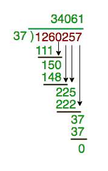

# 将表示为字符串的大数除以

> 原文:[https://www . geesforgeks . org/divide-大数表示-string/](https://www.geeksforgeeks.org/divide-large-number-represented-string/)

给定一个必须除以另一个数(表示为 int 数据类型)的大数(表示为字符串)。这个大数字可能非常大，甚至不适合 C++中的长整型。任务是找出这些数的除法。
**例:**

```
Input : number  = 1260257
        divisor = 37
Output : 34061
(See below diagram)

Input : number  = 12313413534672234
        divisor = 754
Output : 16330787181262

Input : number  = 1248163264128256512
        divisor = 125
Output : 9985306113026052
```

我们已经讨论过[乘以表示为字符串的大数](https://www.geeksforgeeks.org/multiply-large-numbers-represented-as-strings/)。
我们使用如下例所示的基础学校数学。



由于股息和结果可能非常大，我们将其存储在字符串中。我们首先取可被数整除的数字。之后，取每个数字，并将结果存储在字符串中。

## C++

```
// C++ program to implement division with large
// number
#include <bits/stdc++.h>
using namespace std;

// A function to perform division of large numbers
string longDivision(string number, int divisor)
{
    // As result can be very large store it in string
    string ans;

    // Find prefix of number that is larger
    // than divisor.
    int idx = 0;
    int temp = number[idx] - '0';
    while (temp < divisor)
        temp = temp * 10 + (number[++idx] - '0');

    // Repeatedly divide divisor with temp. After
    // every division, update temp to include one
    // more digit.
    while (number.size() > idx) {
        // Store result in answer i.e. temp / divisor
        ans += (temp / divisor) + '0';

        // Take next digit of number
        temp = (temp % divisor) * 10 + number[++idx] - '0';
    }

    // If divisor is greater than number
    if (ans.length() == 0)
        return "0";

    // else return ans
    return ans;
}

// Driver program to test longDivison()
int main()
{
    string number = "1248163264128256512";
    int divisor = 125;
    cout << longDivision(number, divisor);
    return 0;
}
```

## Java 语言(一种计算机语言，尤用于创建网站)

```
// Java program to implement division
// with large number
class GFG {
    public static String longDivision(
        String number,
        int divisor)
    {

        // As result can be very
        // large store it in string
        // but since we need to modify
        // it very often so using
        // string builder
        StringBuilder result
            = new StringBuilder();

        // We will be iterating
        // the dividend so converting
        // it to char array
        char[] dividend
            = number.toCharArray();

        // Initially the carry
        // would be zero
        int carry = 0;

        // Iterate the dividend
        for (
            int i = 0;
            i < dividend.length; i++) {
            // Prepare the number to
            // be divided
            int x
                = carry * 10
                  + Character.getNumericValue(
                        dividend[i]);

            // Append the result with
            // partial quotient
            result.append(x / divisor);

            // Prepare the carry for
            // the next Iteration
            carry = x % divisor;
        }

        // Remove any leading zeros
        for (
            int i = 0;
            i < result.length(); i++) {
            if (
                result.charAt(i) != '0') {
                // Return the result
                return result.substring(i);
            }
        }
        // Return empty string
        // if number is empty
        return "";
    }

    // Driver code
    public static void main(
        String[] args)
    {
        String number
            = "1248163264128256512";
        int divisor = 125;
        System.out.println(
            longDivision(
                number, divisor));
    }
}

// This code is contributed by Saurabh321Gupta.
```

## 蟒蛇 3

```
# Python3 program to implement division
# with large number
import math

# A function to perform division of
# large numbers
def longDivision(number, divisor):

    # As result can be very large
    # store it in string
    ans = "";

    # Find prefix of number that
    # is larger than divisor.
    idx = 0;
    temp = ord(number[idx]) - ord('0');
    while (temp < divisor):
        temp = (temp * 10 + ord(number[idx + 1]) -
                            ord('0'));
        idx += 1;

    idx += 1;

    # Repeatedly divide divisor with temp.
    # After every division, update temp to
    # include one more digit.
    while ((len(number)) > idx):

        # Store result in answer i.e. temp / divisor
        ans += chr(math.floor(temp // divisor) + ord('0'));

        # Take next digit of number
        temp = ((temp % divisor) * 10 + ord(number[idx]) -
                                        ord('0'));
        idx += 1;

    ans += chr(math.floor(temp // divisor) + ord('0'));

    # If divisor is greater than number
    if (len(ans) == 0):
        return "0";

    # else return ans
    return ans;

# Driver Code
number = "1248163264128256512";
divisor = 125;
print(longDivision(number, divisor));

# This code is contributed by mits
```

## C#

```
// C# program to implement division
// with large number
using System;

class GFG {

    // A function to perform division of large numbers
    static string longDivision(string number, int divisor)
    {
        // As result can be very large store it in string
        string ans = "";

        // Find prefix of number that is larger
        // than divisor.
        int idx = 0;
        int temp = (int)(number[idx] - '0');
        while (temp < divisor) {
            temp = temp * 10 + (int)(number[idx + 1] - '0');
            idx++;
        }
        ++idx;

        // Repeatedly divide divisor with temp. After
        // every division, update temp to include one
        // more digit.
        while (number.Length > idx) {
            // Store result in answer i.e. temp / divisor
            ans += (char)(temp / divisor + '0');

            // Take next digit of number
            temp = (temp % divisor) * 10 + (int)(number[idx] - '0');
            idx++;
        }
        ans += (char)(temp / divisor + '0');

        // If divisor is greater than number
        if (ans.Length == 0)
            return "0";

        // else return ans
        return ans;
    }

    // Driver code
    static void Main()
    {
        string number = "1248163264128256512";
        int divisor = 125;
        Console.WriteLine(longDivision(number, divisor));
    }
}

// This code is contributed by mits
```

## 服务器端编程语言（Professional Hypertext Preprocessor 的缩写）

```
<?php
// PHP program to implement division
// with large number

// A function to perform division of
// large numbers
function longDivision($number, $divisor)
{
    // As result can be very large
    // store it in string
    $ans = "";

    // Find prefix of number that is
    // larger than divisor.
    $idx = 0;
    $temp = ord($number[$idx]) - 48;
    while ($temp < $divisor)
        $temp = $temp * 10 +
            ord($number[++$idx]) - 48;

    // Repeatedly divide divisor with temp.
    // After every division, update temp to
    // include one more digit.
    ++$idx;
    while (strlen($number) > $idx)
    {
        // Store result in answer i.e. temp / divisor
        $ans .= chr((int)($temp / $divisor) + 48);

        // Take next digit of number
        $temp = ($temp % $divisor) * 10 +
             ord($number[$idx]) - 48;
        ++$idx;
    }
    $ans .= chr((int)($temp / $divisor) + 48);

    // If divisor is greater than number
    if (strlen($ans) == 0)
        return "0";

    // else return ans
    return $ans;
}

// Driver Code
$number = "1248163264128256512";
$divisor = 125;
print(longDivision($number, $divisor));

// This code is contributed by mits
?>
```

## java 描述语言

```
<script>

// Javascript program to implement division
// with large number

    function longDivision(number,divisor)
    {
        // As result can be very
        // large store it in string
        // but since we need to modify
        // it very often so using
        // string builder
        let ans="";

        // We will be iterating
        // the dividend so converting
        // it to char array

        // Initially the carry
        // would be zero
        let idx = 0;
          let temp=number[idx]-'0';
        while (temp < divisor)
        {
            temp = (temp * 10 +
            (number[idx + 1]).charCodeAt(0) -
                   ('0').charCodeAt(0));
            idx += 1;
        }
        idx += 1;

        while(number.length>idx)
        {
            // Store result in answer i.e. temp / divisor
            ans += String.fromCharCode
            (Math.floor(temp / divisor) +
            ('0').charCodeAt(0));

            // Take next digit of number
            temp = ((temp % divisor) * 10 +
            (number[idx]).charCodeAt(0) -
                  ('0').charCodeAt(0));
            idx += 1;
        }

        ans += String.fromCharCode
        (Math.floor(temp / divisor) +
        ('0').charCodeAt(0));

        //If divisor is greater than number
        if(ans.length==0)
            return "0";
        //else return ans
        return ans;
    }

    // Driver Code
    let number = "1248163264128256512";
    let divisor = 125;
    document.write(longDivision(
                number, divisor));

    // This code is contributed
    // by avanitrachhadiya2155

</script>
```

**输出:**

```
9985306113026052
```

本文由 [**核素**](https://www.facebook.com/nuclode) 供稿。如果你喜欢 GeeksforGeeks 并想投稿，你也可以使用[contribute.geeksforgeeks.org](http://www.contribute.geeksforgeeks.org)写一篇文章或者把你的文章邮寄到 contribute@geeksforgeeks.org。看到你的文章出现在极客博客主页上，帮助其他极客。
如果发现有不正确的地方，或者想分享更多关于上述话题的信息，请写评论。