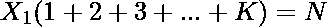
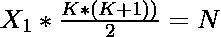
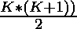
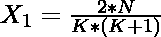

# 对于 X 的某个值

，以(X，2X，…，KX)的形式将 N 分成 K 个部分

> 原文:[https://www . geesforgeks . org/divide-n-in-k-parts-in-form-x-2x-kx-for-some-value-of-x/](https://www.geeksforgeeks.org/divide-n-into-k-parts-in-the-form-x-2x-kx-for-some-value-of-x/)

给定一个正整数 **N** 和 **K** ，任务是将 **N** 分成 **K** 个部分，第一部分有一个值 **X** ，第二部分有 **2X** ，以此类推，得到 **X** 的某个值。如果无法进行这种划分，则打印 **-1** 。

**示例:**

> **输入:** N = 10，K = 4
> **输出:** 1 2 3 4
> **解释:**
> 如果我们把 1 作为第一个数，第二个数将是 2，第三个数将是第一个数的 3 倍，也就是 3，最后一个数将是第三个数的 4 倍，所以最后一个数是 4。我们可以注意到总和=1+2+3+4=10，这是所需的总和。
> 
> **输入** N = 10，K = 3
> **输出:** -1
> **说明:**
> 在给定约束条件下将 N 分配到 3 个零件是不可能的。

**方法:**为了解决上面提到的问题，让我们来理解它的数学实现。设除法为 X <sub>1</sub> 、X <sub>2</sub> 、X <sub>3</sub> 直到 X <sub>K</sub> ，其中第二个整数为 X <sub>1</sub> * 2，第三个整数为 X <sub>1</sub> * 3，第 K 个整数为 X <sub>1</sub> * K

> 我们知道，
> =>
> =>
> =>
> =>，其中(1 + 2 + 3 + … + K) = 
> = > 

因此，要解决这个问题，我们必须遵循下面给出的步骤:

*   计算 **K * (K + 1)** 的值，将 **2 * N** 除以 **K * (K + 1)** ，得到 X <sub>1</sub> 的值。
*   如果在上述步骤中 X <sub>1</sub> 不是整数，那么打印 **-1** ，因为没有这样的除法是可能的。
*   为了得到 X <sub>2</sub> 的值，我们将 X <sub>1</sub> 乘以 2。同样，要得到 X <sub>K</sub> 将 X <sub>1</sub> 乘以 **K** 。
*   找到所有值后打印出来。

以下是上述方法的实现:

## C++

```
// C++ program for the above approach
#include <iostream>
using namespace std;
typedef long long int ll;

// Function to find the division
void solve(int n, int k)
{
    int x1, d;

    // Calculating value of x1
    d = k * (k + 1);

    // Print -1 if division
    // is not possible
    if ((2 * n) % d != 0) {
        cout << "-1";
        return;
    }

    x1 = 2 * n / d;

    // Get the first number ie x1
    // then successively multiply
    // it by x1 k times by index number
    // to get the required answer
    for (int i = 1; i <= k; i++) {
        cout << x1 * i << " ";
    }
    cout << endl;
}

// Driver Code
int main()
{
    // Given N and K
    int n = 10, k = 4;

    // Function Call
    solve(n, k);
}
```

## Java 语言(一种计算机语言，尤用于创建网站)

```
// Java program for the above approach
import java.util.*;
class GFG{

// Function to find the division
static void solve(int n, int k)
{
    int x1, d;

    // Calculating value of x1
    d = k * (k + 1);

    // Print -1 if division
    // is not possible
    if ((2 * n) % d != 0)
    {
        System.out.print("-1");
        return;
    }

    x1 = 2 * n / d;

    // Get the first number ie x1
    // then successively multiply
    // it by x1 k times by index number
    // to get the required answer
    for (int i = 1; i <= k; i++)
    {
        System.out.print(x1 * i+ " ");
    }
    System.out.println();
}

// Driver Code
public static void main(String[] args)
{
    // Given N and K
    int n = 10, k = 4;

    // Function Call
    solve(n, k);
}
}

// This code is contributed by 29AjayKumar
```

## 蟒蛇 3

```
# Python3 program for the above approach

# Function to find the division
def solve(n, k):

    # Calculating value of x1
    d = k * (k + 1);

    # Print -1 if division
    # is not possible
    if ((2 * n) % d != 0):
        print("-1");
        return;

    x1 = 2 * n // d;

    # Get the first number ie x1
    # then successively multiply
    # it by x1 k times by index number
    # to get the required answer
    for i in range(1, k + 1):
        print(x1 * i, end = " ");

# Driver Code

# Given N and K
n = 10; k = 4;

# Function Call
solve(n, k);

# This code is contributed by Code_Mech
```

## C#

```
// Java program for the above approach
import java.util.*;
class GFG{

// Function to find the division
static void solve(int n, int k)
{
    int x1, d;

    // Calculating value of x1
    d = k * (k + 1);

    // Print -1 if division
    // is not possible
    if ((2 * n) % d != 0)
    {
        System.out.print("-1");
        return;
    }

    x1 = 2 * n / d;

    // Get the first number ie x1
    // then successively multiply
    // it by x1 k times by index number
    // to get the required answer
    for (int i = 1; i <= k; i++)
    {
        System.out.print(x1 * i+ " ");
    }
    System.out.println();
}

// Driver Code
public static void main(String[] args)
{
    // Given N and K
    int n = 10, k = 4;

    // Function Call
    solve(n, k);
}
}

// This code is contributed by 29AjayKumar
```

**Output:**

```
1 2 3 4

```

**时间复杂度:***O(K)*
T5】辅助空间: *O(1)*