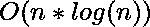

# 将阵列分成最小数量的具有唯一元素的子阵列

> 原文:[https://www . geesforgeks . org/将数组划分为具有唯一元素的最小数量的子数组/](https://www.geeksforgeeks.org/divide-the-array-into-minimum-number-of-sub-arrays-having-unique-elements/)

给定一个数组 **arr** 。任务是将阵列分成包含唯一元素的最小数量的子阵列，并返回这些子阵列的计数。
**注**:一个数组元素不能出现在多个子数组中。
**例:**

```
Input : arr[] = {1, 2, 1, 1, 2, 3}
Output : 3
Explanation : The subarrays having unique elements are 
{ 1, 2 }, { 1 }, and { 1, 2, 3 }

Input : arr[] = {1, 2, 3, 4, 5}
Output : 1
Explanation : The subarray having unique elements is 
{ 1, 2, 3, 4, 5 }
```

**进场:**
思路是穿越阵时保持一个集合。遍历时，如果在集合中已经找到一个元素，那么将子阵列的计数增加 1，因为我们必须在下一个子阵列中包含当前元素，并为新的子阵列清除集合。然后，以自相似的方式继续处理整个阵列。存储计数的变量就是答案。
以下是上述办法的实施:

## C++

```
// C++ program to count minimum subarray having
// unique elements
#include <bits/stdc++.h>
using namespace std;

// Function to count minimum number of subarrays
int minimumSubarrays(int ar[], int n)
{
    set<int> se;

    int cnt = 1;

    for (int i = 0; i < n; i++) {
        // Checking if an element already exist in
        // the current sub-array
        if (se.count(ar[i]) == 0) {
            // inserting the current element
            se.insert(ar[i]);
        }
        else {
            cnt++;
            // clear set for new possible value of subarrays
            se.clear();
            // inserting the current element
            se.insert(ar[i]);
        }
    }

    return cnt;
}

// Driver Code
int main()
{
    int ar[] = { 1, 2, 1, 3, 4, 2, 4, 4, 4 };
    int n = sizeof(ar) / sizeof(ar[0]);
    cout << minimumSubarrays(ar, n);
    return 0;
}
```

## Java 语言(一种计算机语言，尤用于创建网站)

```
// Java implementation of the approach
import java.util.*;

class GFG
{

    // Function to count minimum number of subarrays
    static int minimumSubarrays(int ar[], int n)
    {
        Vector se = new Vector();

        int cnt = 1;

        for (int i = 0; i < n; i++)
        {

            // Checking if an element already exist in
            // the current sub-array
            if (se.contains(ar[i]) == false)
            {
                // inserting the current element
                se.add(ar[i]);
            }
            else
            {
                cnt++;

                // clear set for new possible value
                // of subarrays
                se.clear();

                // inserting the current element
                se.add(ar[i]);
            }
        }
        return cnt;
    }

    // Driver Code
    public static void main (String[] args)
    {
        int ar[] = { 1, 2, 1, 3, 4, 2, 4, 4, 4 };
        int n = ar.length ;

        System.out.println(minimumSubarrays(ar, n));
    }
}

// This code is contributed by AnkitRai01
```

## 蟒蛇 3

```
# Python 3 implementation of the approach

# Function to count minimum number of subarrays
def minimumSubarrays(ar, n) :
    se = []

    cnt = 1;

    for i in range(n) :

        # Checking if an element already exist in
        # the current sub-array
        if se.count(ar[i]) == 0 :

            # inserting the current element
            se.append(ar[i])
        else :
            cnt += 1

            # clear set for new possible value
            # of subarrays
            se.clear()

            # inserting the current element
            se.append(ar[i])
    return cnt

# Driver Code
ar = [ 1, 2, 1, 3, 4, 2, 4, 4, 4 ]
n = len(ar)
print(minimumSubarrays(ar, n))

# This code is contributed by
# divyamohan123
```

## C#

```
// C# implementation of the approach
using System;
using System.Collections.Generic;            

class GFG
{

    // Function to count minimum number of subarrays
    static int minimumSubarrays(int []ar, int n)
    {
        List<int> se = new List<int>();

        int cnt = 1;

        for (int i = 0; i < n; i++)
        {

            // Checking if an element already exist in
            // the current sub-array
            if (se.Contains(ar[i]) == false)
            {
                // inserting the current element
                se.Add(ar[i]);
            }
            else
            {
                cnt++;

                // clear set for new possible value
                // of subarrays
                se.Clear();

                // inserting the current element
                se.Add(ar[i]);
            }
        }
        return cnt;
    }

    // Driver Code
    public static void Main(String[] args)
    {
        int []ar = { 1, 2, 1, 3, 4, 2, 4, 4, 4 };
        int n = ar.Length ;

        Console.WriteLine(minimumSubarrays(ar, n));
    }
}

// This code is contributed by 29AjayKumar
```

## java 描述语言

```
<script>

    // Javascript implementation of the approach

    // Function to count minimum number of subarrays
    function minimumSubarrays(ar, n)
    {
        let se = new Set();

        let cnt = 1;

        for (let i = 0; i < n; i++)
        {

            // Checking if an element already exist in
            // the current sub-array
            if (se.has(ar[i]) == false)
            {
                // inserting the current element
                se.add(ar[i]);
            }
            else
            {
                cnt++;

                // clear set for new possible value
                // of subarrays
                se.clear();

                // inserting the current element
                se.add(ar[i]);
            }
        }
        return cnt;
    }

    // Driver code

        let ar = [ 1, 2, 1, 3, 4, 2, 4, 4, 4 ];
        let n = ar.length ;

        document.write(minimumSubarrays(ar, n));

// This code is contributed by susmitakundugoaldanga.
</script>
```

**Output:** 

```
5
```

**时间复杂度:** 