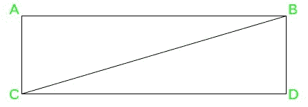
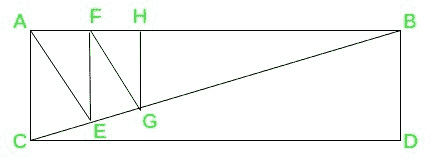
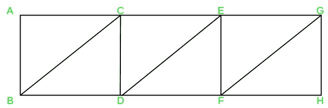
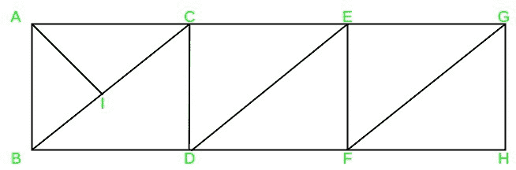

# 将矩形分成 n 个直角三角形

> 原文:[https://www . geesforgeks . org/将矩形分成 n 个直角三角形/](https://www.geeksforgeeks.org/dividing-the-rectangle-into-n-right-angled-triangles/)

**拼图:**找到 n > 1 的所有值，可以将一个矩形分成 n 个直角三角形。

**答案:**
我们可以把任意一个矩形分成 **n 个直角三角形，对于任意 n 个> 1** 。

有两种划分方法:

*   **方法 1:**
    1.  **Case 1: n = 2**, we can get two right-angled triangles by cutting the rectangle along the diagonal as shown in the figure.

        **例如:**在矩形 ABDC 中，我们画一条对角线 BC，得到两个直角三角形，BDC 和 ABC。

        

    2.  **Case 2: n > 2**, we first cut the rectangle along the diagonal and continue with n-2 cuts of any of the available right-angled triangles into two [right-angled triangles](https://www.geeksforgeeks.org/find-dimensions-right-angled-triangle/), by cutting them along the height onto its [hypotenuse](https://www.geeksforgeeks.org/find-the-hypotenuse-of-a-right-angled-triangle-with-given-two-sides/).

        **例如:**考虑 n = 6 的情况，在矩形 ABDC 中，我们先画对角线 BC，然后(n-2)即在三角形 ABC 上沿斜边上的高度做 4 个切口，得到 6 个直角三角形。这些是 BDC、ACE、AEF、FEG、FGH、HGB。

        

*   **方法 2:** 我们也可以通过逐案考虑来解决这个难题。
    1.  **Case 1: n is even**: divide the rectangle into n/2 small rectangles and then can divide each of the smaller rectangle obtained, along its diagonal.

        **例如:**对于 n=6，在矩形 AGHB 中，我们首先形成 3 个较小的矩形，分别为 ABCD、CEFD、EGHF。然后，我们把每个矩形分别沿着它的斜边 BC，de，FG 划分，得到 6 个直角三角形

        

    2.  **Case 2: n is odd:** In this case, first, divide the rectangle into n-1 small triangles using the approach mentioned above and then can cut any of the triangles along with the height onto its hypotenuse.

        **例如:**对于 n=7，我们首先形成上述点中提到的 6 个三角形，然后我们将三角形 ABC 连同高度切割到它的斜边上，以获得第 7 个三角形 AIB。

        