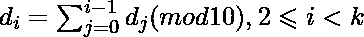

# 除以 3，其中每个数字是以 10 为模的所有前缀数字的总和

> 原文:[https://www . geesforgeks . org/可除性-3 位数-和-前缀-位数-模-10/](https://www.geeksforgeeks.org/divisibility-3-digit-sum-prefix-digits-modulo-10/)

给定 K，位数，以及 d0 和 d1 这两个数字组成 K 大小的整数。任务是检查用 d0 和 d1 组成的 k 大小的数是否能被 3 整除。
对于每个 I，d <sub>i</sub> 是前面所有(更有效的)数字的和，以 10 为模——更正式地说，以下公式必须成立:

**示例:**

```
Input : K = 5 d0 = 3 d1 = 4
Output : NO
Explanation : 
The whole number N is 34748 (Starting from 
third digit, every digit is some of preceding
digits mod 10). Since 34748 is not divisible 
by 3, answer is NO.

Input : K = 13 d0 = 8 d1 = 1
Output : YES
Explanation :
The whole number N is 8198624862486, 
which is divisible by 3, so the answer
is YES.
```

k 可能很长，所以生成整个数字，计算数字的总和，然后检查 3 的倍数是很麻烦的。解决方案背后的关键思想是，在长度为 4 的周期中，数字在一段时间后开始重复，然后可以在 O(1)步中确定数字的总和。
我们知道 d0 和 d1，
所以， D2 =(d0+D1)mod 10
D3 =(D2+D1+d0)mod 10 =((d0+D1)mod 10+(d0+D1))mod 10 = 2 *(d0+D1)mod 10
D4 =(D3+D2+D1+d0)mod 10 = 4 *(d0+D1)mod 10
D5 =(D4+D3+D2+D1+d0)mod 10 = 8 *(d0+D1) mod 10
D6 =(D5+…+D1+d0)mod 10 = 16 *(d0+D1)mod 10 = 6 *(d0+D1)mod 10
D7 =(D6+…+D1+d0)mod 10 = 32 *(d0+D1)mod 10 = 2 *(d0+D1)mod 10
如果我们继续获取 **di** ，我们会看到结果只是在循环相同的值。 我们可以看到(d0 + d1)对 d2 的贡献是**的 1 倍，对 d3 的贡献是 2 倍，对 d4 的贡献是 4 倍，对 d5 的贡献是 8 倍，…，对 dk 的贡献是 2^(k 的 2 倍**。
但是，由于模 10 下 2 的幂从 1 开始循环， **2，4，8，6，** 2，4。这里，周期长度为 4，其中 d2 不存在于周期中。设，S =(2 *(d0+D1))mod 10+(4 *(d0+D1))mod 10+(8 *(d0+D1))mod 10+(6 *(d0+D1))mod 10，这是重复的循环。
所以，**位数之和=(d0+D1+D2)+S *(k–3)/4)+x**。在这里，前 **3 项将被 d0、d1、d2** 覆盖，之后的**4 组将被 S** 覆盖，但是这个公式在最后仍然没有将一些项相加。这是由 x 标注的**残留物。
**以下是上述方法的实施:**** 

## C++

```
// CPP code to check divisibility by 3
#include <bits/stdc++.h>
using namespace std;

// Function to check the divisibility
string check(long int k, int d0, int d1)
{

    // Cycle
    long int s = (2 * (d0 + d1)) % 10 +
                 (4 * (d0 + d1)) % 10 +
                 (8 * (d0 + d1)) % 10 +
                 (6 * (d0 + d1)) % 10;

    // no of residual terms
    int a = (k - 3) % 4;

    // sum of residual terms
    int x;

    switch(a)
    {

        // if no of residue term = 0
        case 0:

        x = 0;
        break;

        // if no of residue term = 1
        case 1:

        x = (2 * (d0 + d1)) % 10;
        break;

        // if no of residue term = 2
        case 2:

        x = (2 * (d0 + d1)) % 10 +
            (4 * (d0 + d1)) % 10;
        break;

        // if no of residue term = 3
        case 3:

        x = (2 * (d0 + d1)) % 10 +
            (4 * (d0 + d1)) % 10 +
            (8 * (d0 + d1)) % 10;

        break;
    }

    // sum of all digits
    long int sum = d0 + d1 + ((k - 3) / 4) * s + x;

    // divisibility check
    if(sum % 3 == 0)
        return "YES";
    return "NO";
}

// Driver code
int main()
{

    long int k, d0, d1;

    k = 13;
    d0 = 8;
    d1 = 1;

    cout << check(k, d0, d1) << endl;

    k = 5;
    d0 = 3;
    d1 = 4;

    cout << check(k, d0, d1) << endl;

    return 0;
}
```

## Java 语言(一种计算机语言，尤用于创建网站)

```
// Java code to check divisibility by 3

import java.util.*;
import java.io.*;

class GFG {
    // Function to check the divisibility
static String check( int k, int d0, int d1)
{

    // Cycle
     int s = (2 * (d0 + d1)) % 10 +
                (4 * (d0 + d1)) % 10 +
                (8 * (d0 + d1)) % 10 +
                (6 * (d0 + d1)) % 10;

    // no of residual terms
    int a = (k - 3) % 4;

    // sum of residual terms
    int x=0;

    switch(a)
    {

        // if no of residue term = 0
        case 0:

        x = 0;
        break;

        // if no of residue term = 1
        case 1:

        x = (2 * (d0 + d1)) % 10;
        break;

        // if no of residue term = 2
        case 2:

        x = (2 * (d0 + d1)) % 10 +
            (4 * (d0 + d1)) % 10;
        break;

        // if no of residue term = 3
        case 3:

        x = (2 * (d0 + d1)) % 10 +
            (4 * (d0 + d1)) % 10 +
            (8 * (d0 + d1)) % 10;

        break;
    }

    // sum of all digits
     int sum = d0 + d1 + (((k - 3) / 4) * s + x );

    // divisibility check
    if(sum % 3 == 0)
        return "YES";
    return "NO";
}

    //Code driven

    public static void main (String[] args) {

     int k, d0, d1;

    k = 13;
    d0 = 8;
    d1 = 1;

    System.out.println (check(k, d0, d1));

    k = 5;
    d0 = 3;
    d1 = 4;

        System.out.println (check(k, d0, d1));

    }
}
```

## 蟒蛇 3

```
# Python3 code to check divisibility by 3

# Function to check the divisibility
def check(k, d0, d1):

    # Cycle
    s = ((2 * (d0 + d1)) % 10 +
        (4 * (d0 + d1)) % 10 +
        (8 * (d0 + d1)) % 10 +
        (6 * (d0 + d1)) % 10)

    # no of residual terms
    a = (k - 3) % 4

    # if no of residue term = 0
    if(a == 0):
        x = 0

    # if no of residue term = 1
    elif(a == 1):
        x = (2 * (d0 + d1)) % 10

    # if no of residue term = 2
    elif(a == 2):
        x = ((2 * (d0 + d1)) % 10 +
            (4 * (d0 + d1)) % 10)

    # if no of residue term = 3
    elif(a == 3):
        x = ((2 * (d0 + d1)) % 10 +
            (4 * (d0 + d1)) % 10 +
            (8 * (d0 + d1)) % 10)

    # sum of all digits
    sum = d0 + d1 + ((k - 3) // 4) * s + x

    # divisibility check
    if(sum % 3 == 0):
        return "YES"
    else:
        return "NO"

# Driver code
if __name__=='__main__':
    k = 13
    d0 = 8
    d1 = 1

    print(check(k, d0, d1))

    k = 5
    d0 = 3
    d1 = 4

    print(check(k, d0, d1))

# This code is contributed by
# Sanjit_Prasad
```

## C#

```
// C# code to check divisibility by 3
using System;

class GFG
{
// Function to check the divisibility
static String check(int k, int d0, int d1)
{

    // Cycle
    int s = (2 * (d0 + d1)) % 10 +
            (4 * (d0 + d1)) % 10 +
            (8 * (d0 + d1)) % 10 +
            (6 * (d0 + d1)) % 10;

    // no of residual terms
    int a = (k - 3) % 4;

    // sum of residual terms
    int x = 0;

    switch(a)
    {

        // if no of residue term = 0
        case 0:

        x = 0;
        break;

        // if no of residue term = 1
        case 1:

        x = (2 * (d0 + d1)) % 10;
        break;

        // if no of residue term = 2
        case 2:

        x = (2 * (d0 + d1)) % 10 +
            (4 * (d0 + d1)) % 10;
        break;

        // if no of residue term = 3
        case 3:

        x = (2 * (d0 + d1)) % 10 +
            (4 * (d0 + d1)) % 10 +
            (8 * (d0 + d1)) % 10;

        break;
    }

    // sum of all digits
    int sum = d0 + d1 + (((k - 3) / 4) * s + x );

    // divisibility check
    if(sum % 3 == 0)
        return "YES";
    return "NO";
}

// Driver Code
static public void Main ()
{

    int k, d0, d1;
    k = 13;
    d0 = 8;
    d1 = 1;

    Console.WriteLine (check(k, d0, d1));

    k = 5;
    d0 = 3;
    d1 = 4;

    Console.WriteLine(check(k, d0, d1));
}
}

// This code is contributed by Sach_Code
```

## 服务器端编程语言（Professional Hypertext Preprocessor 的缩写）

```
<?php
// PHP code to check
// divisibility by 3

// Function to check
// the divisibility
function check($k, $d0,$d1)
{

    // Cycle
    $s = (2 * ($d0 + $d1)) % 10 +
         (4 * ($d0 + $d1)) % 10 +
         (8 * ($d0 + $d1)) % 10 +
         (6 * ($d0 + $d1)) % 10;

    // no of residual terms
    $a = ($k - 3) % 4;

    // sum of residual
    // terms
    $x;

    switch($a)
    {

        // if no of residue
        // term = 0
        case 0:

        $x = 0;
        break;

        // if no of residue
        // term = 1
        case 1:

        $x = (2 * ($d0 +
                   $d1)) % 10;
        break;

        // if no of residue
        // term = 2
        case 2:

        $x = (2 * ($d0 + $d1)) % 10 +
             (4 * ($d0 + $d1)) % 10;
        break;

        // if no of
        // residue term = 3
        case 3:

        $x = (2 * ($d0 + $d1)) % 10 +
             (4 * ($d0 + $d1)) % 10 +
             (8 * ($d0 + $d1)) % 10;

        break;
    }

    // sum of all digits
    $sum = $d0 + $d1 +
           (int)(($k - 3) /
              4) * $s + $x;

    // divisibility check
    if($sum % 3 == 0)
        return "YES";
    return "NO";
}

// Driver code
$k; $d0; $d1;

$k = 13;
$d0 = 8;
$d1 = 1;

echo check($k, $d0, $d1), "\n";

$k = 5;
$d0 = 3;
$d1 = 4;

echo check($k, $d0, $d1), "\n";

// This code is contributed by ajit
?>
```

## java 描述语言

```
<script>
// Javascript code to check
// divisibility by 3

// Function to check
// the divisibility
function check(k, d0,d1)
{

    // Cycle
    let s = (2 * (d0 + d1)) % 10 +
        (4 * (d0 + d1)) % 10 +
        (8 * (d0 + d1)) % 10 +
        (6 * (d0 + d1)) % 10;

    // no of residual terms
    let a = (k - 3) % 4;

    // sum of residual
    // terms
    let x;

    switch(a)
    {

        // if no of residue
        // term = 0
        case 0:

        x = 0;
        break;

        // if no of residue
        // term = 1
        case 1:

        x = (2 * (d0 +
                d1)) % 10;
        break;

        // if no of residue
        // term = 2
        case 2:

        x = (2 * (d0 + d1)) % 10 +
            (4 * (d0 + d1)) % 10;
        break;

        // if no of
        // residue term = 3
        case 3:

        x = (2 * (d0 + d1)) % 10 +
            (4 * (d0 + d1)) % 10 +
            (8 * (d0 + d1)) % 10;

        break;
    }

    // sum of all digits
    let sum = d0 + d1 +
        parseInt((k - 3) /
            4) * s + x;

    // divisibility check
    if(sum % 3 == 0)
        return "YES";
    return "NO";
}

// Driver code
let k, d0, d1;

k = 13;
d0 = 8;
d1 = 1;

document.write(check(k, d0, d1) + "<br>");

k = 5;
d0 = 3;
d1 = 4;

document.write(check(k, d0, d1) + "<br>");

// This code is contributed by gfgking.
</script>
```

**Output:** 

```
YES
NO
```

**时间复杂度:** O(1)