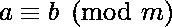

# 大数可被 37 整除

> 原文:[https://www.geeksforgeeks.org/divisible-37-large-numbers/](https://www.geeksforgeeks.org/divisible-37-large-numbers/)

给定一个大数 n，我们需要检查它是否能被 37 整除。如果可被 37 整除，则打印 true，否则打印 False。
**例:**

```
Input  : 74
Output : True

Input : 73
Output : False

Input : 8955795758 (10 digit number)
Output : True
```

一个 r 位数 m，其数字形式为**(ar-1 ar-2…a2 a1 A0)**可被 37 整除当且仅当一系列数的和**(a2 a1 A0)+(a5 a4 a3)+(A8 a7 a6)+…**可被 37 整除。括号内的三位数代表数字形式的 3 位数。

> 给定的数 n 可以写成 1000 次幂的和，如下所示。
> n =(a2 a1 A0)+(a5 a4 a3)* 1000+(A8 a7 a6)*(1000 * 1000)+…。
> As 1000 = (1)(mod 37)，根据同余关系为 1000。
> 对于一个正整数 n，如果两个数 a 和 b 的差
> (a–b)是 n 的整数倍(也就是说，如果有一个整数 k 使得 a–b = kn)，则称这两个数 a 和 b 是全等模 n。当 a 和 b 是整数时，通常会考虑这种同余关系，表示为
> 
> 因此我们可以写:
> n = {(a2a1a 0)+(a5a4a 3)*(1)+(a8a 7a 6)*(1)*(1)+…..}(mod 37)，
> 因此，当且仅当数列可被 37 整除时，n 可被 37 整除。

**例:**

```
Input : 8955795758 (10 digit number)
Output : True
Explanation:
     We express the number in terms of 
     triplets of digits as follows.
     (008)(955)(795)(758)
     Now, 758 + 795 + 955 + 8 = 2516
     For 2516, the triplets will be:
     (002)(516)
     Now 516 + 2 = 518 which is divisible 
     by 37\. Hence the number is divisible 
     by 37.

Input : 189710809179199 (15 digit number)
Output : False
```

一个简单而有效的方法是以字符串的形式输入(如果需要，通过在数字的左边添加 0，使其长度为 3*m)，然后您必须从右向左添加三个块中的数字，直到它成为 3 位数，以形成一个系列。计算级数的和。如果数列的和超过 3 位数，再次递归调用这个函数。
最后检查结果和是否能被 37 整除。
下面是用 37 检查可除性的程序实现。

## C++

```
// CPP program for checking divisibility by 37
// function divisible37 which returns True if
// number is divisible by 37 otherwise False
#include <bits/stdc++.h>
using namespace std;

int divisibleby37(string n){
    int l = n.length();
    if (n == "0")
        return 0;

    // Append required 0's at the beginning
    if (l % 3 == 1){
        n = "00"+ n;
        l += 2;
    }
    else if (l % 3 == 2){
        n = "0"+ n;
        l += 1;
    }

    int gSum = 0;

    while (l != 0){

    // group saves 3-digit group
    string group = n.substr(l - 3, l);
        l = l - 3;
    int gvalue = (group[0] - '0') * 100 +
                 (group[1] - '0') * 10 +
                 (group[2] - '0') * 1;

    // add the series
    gSum = gSum + gvalue;
    }

    // if sum of series gSum has minimum 4
    // digits in it, then again recursive
    // call divisibleby37 function
    if (gSum >= 1000)
        return (divisibleby37(to_string(gSum)));
    else
        return (gSum % 37 == 0);

}

// drive program to test the above function
int main(){

    string s="8955795758";

    if (divisibleby37(s))
    cout<<"True";
    else
    cout<<"False";
    return 0;
}
// This code is contributed by Prerna Saini
```

## Java 语言(一种计算机语言，尤用于创建网站)

```
// Java program for checking
// divisibility by 37

class GFG
{
// function divisible37 which
// returns True if number is
// divisible by 37 otherwise False
static int divisibleby37(String n1)
{
    int l = n1.length();
    if (n1 == "0")
        return 0;

    // Append required 0's
    // at the beginning
    if (l % 3 == 1)
    {
        n1 = "00"+ n1;
        l += 2;
    }
    else if (l % 3 == 2)
    {
        n1 = "0"+ n1;
        l += 1;
    }
    char[]  n= n1.toCharArray();
    int gSum = 0;
    while (l != 0)
    {

    // group saves 3-digit group
    int gvalue;
    if(l == 2)
        gvalue = ((int)n[(l - 2)] - 48) * 100 +
                ((int)n[(l - 1)] - 48) * 10;
    else if(l == 1)
        gvalue = ((int)n[(l - 1)] - 48) * 100;
    else
        gvalue = ((int)n[(l - 3)] - 48) * 100 +
                ((int)n[(l - 2)] - 48) * 10 +
                ((int)n[(l - 1)] - 48) * 1;
    l = l - 3;

    // add the series
    gSum = gSum + gvalue;
    }

    // if sum of series gSum has minimum 4
    // digits in it, then again recursive
    // call divisibleby37 function
    if (gSum >= 1000)
        return (divisibleby37(String.valueOf(gSum)));
    else
        return (gSum % 37 == 0) ? 1 : 0;

}

// Driver Code
public static void main(String[] args)
{
    String s="8955795758";

    if (divisibleby37(s) == 1)
    System.out.println("True");
    else
    System.out.println("False");
}
}

// This code is contributed by mits
```

## 蟒蛇 3

```
# Python code for checking divisibility by 37
# function divisible37 which returns True if
# number is divisible by 37 otherwise False
def divisibleby37(n):
    l = len(n)
    if (n == 0):
        return True

    # Append required 0's at the beginning
    if (l%3 == 1):
        n = "00"+ n
        l += 2
    elif (l%3 == 2):
        n = "0"+ n
        l += 1

    gSum = 0
    while (l != 0):

        # group saves 3-digit group
        group = int(n[l-3:l])
        l = l-3

        # add the series
        gSum = gSum + group

    # if sum of series gSum has minimum 4
    # digits in it, then again recursive
    # call divisibleby37 function
    if (gSum >= 1000):
        return(divisibleby37(str(gSum)))
    else:
        return (gSum%37==0)

# Driver method to test the above function
print(divisibleby37("8955795758"))
```

## C#

```
// C# program for checking
// divisibility by 37
using System;

class GFG
{
// function divisible37 which
// returns True if number is
// divisible by 37 otherwise False
static int divisibleby37(string n)
{
    int l = n.Length;
    if (n == "0")
        return 0;

    // Append required 0's
    // at the beginning
    if (l % 3 == 1)
    {
        n = "00"+ n;
        l += 2;
    }
    else if (l % 3 == 2)
    {
        n = "0"+ n;
        l += 1;
    }

    int gSum = 0;
    while (l != 0)
    {

    // group saves 3-digit group
    int gvalue;
    if(l == 2)
        gvalue = ((int)n[(l - 2)] - 48) * 100 +
                 ((int)n[(l - 1)] - 48) * 10;
    else if(l == 1)
        gvalue = ((int)n[(l - 1)] - 48) * 100;
    else
        gvalue = ((int)n[(l - 3)] - 48) * 100 +
                 ((int)n[(l - 2)] - 48) * 10 +
                 ((int)n[(l - 1)] - 48) * 1;
    l = l - 3;

    // add the series
    gSum = gSum + gvalue;
    }

    // if sum of series gSum has minimum 4
    // digits in it, then again recursive
    // call divisibleby37 function
    if (gSum >= 1000)
        return (divisibleby37(gSum.ToString()));
    else
        return (gSum % 37 == 0) ? 1 : 0;

}

// Driver Code
public static void Main()
{
    string s="8955795758";

    if (divisibleby37(s) == 1)
    Console.WriteLine("True");
    else
    Console.WriteLine("False");
}
}

// This code is contributed by mits
```

## 服务器端编程语言（Professional Hypertext Preprocessor 的缩写）

```
<?php
// PHP program for checking
// divisibility by 37

// function divisible37 which
// returns True if number is
// divisible by 37 otherwise
// False
function divisibleby37($n)
{
    $l = strlen($n);
    if ($n == '0')
        return 0;

    // Append required 0's
    // at the beginning
    if ($l % 3 == 1)
    {
        $n = "00" . $n;
        $l += 2;
    }
    else if ($l % 3 == 2)
    {
        $n = "0" . $n;
        $l += 1;
    }

    $gSum = 0;

    while ($l != 0)
    {

    // group saves 3-digit group
    $group = substr($n,$l - 3, $l);
        $l = $l - 3;
    $gvalue = (ord($group[0]) - 48) * 100 +
              (ord($group[1]) - 48) * 10 +
              (ord($group[2]) - 48) * 1;

    // add the series
    $gSum = $gSum + $gvalue;
    }

    // if sum of series gSum has
    // minimum 4 digits in it,
    // then again recursive call
    // divisibleby37 function
    if ($gSum >= 1000)
        return (divisibleby37((string)($gSum)));
    else
        return ($gSum % 37 == 0);

}

// Driver code
$s = "8955795758";

if (divisibleby37($s))
echo "True";
else
echo "False";

// This code is contributed
// by mits
?>
```

## java 描述语言

```
<script>
// Javascript program for checking
// divisibility by 37

// function divisible37 which
// returns True if number is
// divisible by 37 otherwise
// False
function divisibleby37(n)
{
    let l = n.length;
    if (n == '0')
        return 0;

    // Append required 0's
    // at the beginning
    if (l % 3 == 1)
    {
        n = "00" + n;
        l += 2;
    }
    else if (l % 3 == 2)
    {
        n = "0" + n;
        l += 1;
    }

    let gSum = 0;

    while (l != 0)
    {

    // group saves 3-digit group
    let group = n.substr(l - 3, l);
        l = l - 3;
    gvalue = (group.charCodeAt(0) - 48) * 100 +
             (group.charCodeAt(1) - 48) * 10 +
             (group.charCodeAt(2) - 48) * 1;

    // add the series
    gSum = gSum + gvalue;
    }

    // if sum of series gSum has
    // minimum 4 digits in it,
    // then again recursive call
    // divisibleby37 function
    if (gSum >= 1000)
        return (divisibleby37(`${gSum}`));
    else
        return (gSum % 37 == 0);

}

// Driver code
let s = "8955795758";

if (divisibleby37(s))
    document.write("True");
else
    document.write("False");

// This code is contributed
// by _saurabh_jaiswal.
</script>
```

**输出:**

```
True
```

**时间复杂度:** O(n)，其中 n 为字符串的长度。

**辅助空间:** O(1)

本文由 **Sruti Rai** 供稿。如果你喜欢 GeeksforGeeks 并想投稿，你也可以使用[write.geeksforgeeks.org](https://write.geeksforgeeks.org)写一篇文章或者把你的文章邮寄到 review-team@geeksforgeeks.org。看到你的文章出现在极客博客主页上，帮助其他极客。
如果你发现任何不正确的地方，或者你想分享更多关于上面讨论的话题的信息，请写评论。