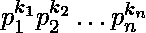

# 不是 n 的除数的 n 次方的除数

> 原文:[https://www . geesforgeks . org/divisions-n-square-not-divisions-n/](https://www.geeksforgeeks.org/divisors-n-square-not-divisors-n/)

给定一个正整数 n，计算 n 的除数 n <sup>2</sup> 不能被 n 的任何**除数**整除的个数(1 < = n < = 10 <sup>12</sup> )。

```
Input: 6
Output: 5
Explanation
Total divisors of 62 are 9 i.e.,
1, 2, 3, 4, 6, 9, 12, 18, 36
Total divisors of '6' are 4,
1, 2, 3, 6
Total divisor of '36' which are not
divisible by divisors of '6' are
'5' i.e., 4, 9, 12, 18, 36

Input: 8
Output: 3
```

**简单的**方法是遍历 n 的每个除数 <sup>2</sup> ，只计算那些不是“n”除数的除数。这种方法的时间复杂度为 O(n)。
**高效的**方法是使用素因子分解来计算 n 个 <sup>2</sup> 的总因子。数字“n”可以表示为素数的乘积。详见[本](https://www.geeksforgeeks.org/total-number-divisors-given-number/)。

```
Let  for some primes p1 and p2.

Squaring both the sides

Total factors of n2 will be,

Total factors of 'n' will be,

Difference between the two gives the required

answer
```

## C++

```
// C++ program to count number of
// divisors of n^2 which are not
// divisible by divisor of n
#include <bits/stdc++.h>
using namespace std;

// Function to count divisors of n^2
// having no factors of 'n'
int factors(long long n)
{
    unordered_map<int, int> prime;
    for (int i = 2; i <= sqrt(n); ++i) {
        while (n % i == 0) {

            // Increment count of i-th prime divisor
            ++prime[i];

            // Find next  prime divisor
            n = n / i;
        }
    }

    // Increment count if divisor still remains
    if (n > 2)
        ++prime[n];

    // Initialize variable for counting the factors
    // of  n^2 and n as ans1 and ans2 respectively
    int ans1 = 1, ans2 = 1;

    // Range based for-loop
    for (auto it : prime) {

        // Use formula as discussed in above
        ans1 *= 2 * it.second + 1;
        ans2 *= it.second + 1;
    }

    // return the difference of answers
    return ans1 - ans2;
}

// Driver code
int main()
{
    long long n = 5;
    cout << factors(n) << endl;
    n = 8;
    cout << factors(n);
    return 0;
}
```

## Java 语言(一种计算机语言，尤用于创建网站)

```
// Java program to count number of
// divisors of n^2 which are not
// divisible by divisor of n
import java.util.*;

class GFG
{

// Function to count divisors of n^2
// having no factors of 'n'
static int factors(int n)
{
    HashMap<Integer,
            Integer>prime = new HashMap<Integer,
                                        Integer>();
    for (int i = 2; i <= Math.sqrt(n); ++i)
    {
        while (n % i == 0)
        {

            // Increment count of i-th prime divisor
            if (prime.containsKey(i))
            {
                prime.put(i, prime.get(i) + 1);
            }

            else
            {
                prime.put(i, 1);
            }

            // Find next prime divisor
            n = n / i;
        }
    }

    // Increment count if divisor still remains
    if (n > 2)
    {
        if(prime.containsKey(n))
        {
            prime.put(n, prime.get(n) + 1);
        }
        else
        {
            prime.put(n, 1);
        }
    }

    // Initialize variable for counting the factors
    // of n^2 and n as ans1 and ans2 respectively
    int ans1 = 1, ans2 = 1;

    // Range based for-loop
    for (Map.Entry<Integer,
                   Integer> it : prime.entrySet())
    {

        // Use formula as discussed in above
        ans1 *= 2 * it.getValue() + 1;
        ans2 *= it.getValue() + 1;
    }

    // return the difference of answers
    return ans1 - ans2;
}

// Driver code
public static void main(String[] args)
{
    int n = 5;
    System.out.println(factors(n));
    n = 8;
    System.out.println(factors(n));
}
}

// This code is contributed by PrinciRaj1992
```

## 蟒蛇 3

```
# Python3 program to count number of
# divisors of n^2 which are not
# divisible by divisor of n
import math as mt

# Function to count divisors of n^2
# having no factors of 'n'
def factors(n):

    prime = dict()
    for i in range(2, mt.ceil(mt.sqrt(n + 1))):
        while (n % i == 0):

            # Increment count of i-th
            # prime divisor
            if i in prime.keys():
                prime[i] += 1
            else:
                prime[i] = 1

            # Find next prime divisor
            n = n // i

    # Increment count if divisor
    # still remains
    if (n > 2):
        if n in prime.keys():
            prime[n] += 1
        else:
            prime[n] = 1

    # Initialize variable for counting
    # the factors of n^2 and n as ans1
    # and ans2 respectively
    ans1 = 1
    ans2 = 1

    # Range based for-loop
    for it in prime:

        # Use formula as discussed in above
        ans1 *= 2 * prime[it] + 1
        ans2 *= prime[it] + 1

    # return the difference of answers
    return ans1 - ans2

# Driver code
n = 5
print(factors(n))
n = 8
print(factors(n))

# This code is contributed by
# Mohit kumar 29
```

## C#

```
// C# program to count number of
// divisors of n^2 which are not
// divisible by divisor of n
using System;
using System.Collections.Generic;

class GFG
{

// Function to count divisors of n^2
// having no factors of 'n'
static int factors(int n)
{
    Dictionary<int,
               int> prime = new Dictionary<int,
                                           int>();
    for (int i = 2; i <= Math.Sqrt(n); ++i)
    {
        while (n % i == 0)
        {

            // Increment count of i-th prime divisor
            if (prime.ContainsKey(i))
            {
                prime[i] = prime[i] + 1;
            }

            else
            {
                prime.Add(i, 1);
            }

            // Find next prime divisor
            n = n / i;
        }
    }

    // Increment count if divisor still remains
    if (n > 2)
    {
        if(prime.ContainsKey(n))
        {
            prime[n] = prime[n] + 1;
        }
        else
        {
            prime.Add(n, 1);
        }
    }

    // Initialize variable for counting the factors
    // of n^2 and n as ans1 and ans2 respectively
    int ans1 = 1, ans2 = 1;

    // Range based for-loop
    foreach(KeyValuePair<int, int> it in prime)
    {

        // Use formula as discussed in above
        ans1 *= 2 * it.Value + 1;
        ans2 *= it.Value + 1;
    }

    // return the difference of answers
    return ans1 - ans2;
}

// Driver code
public static void Main(String[] args)
{
    int n = 5;
    Console.WriteLine(factors(n));
    n = 8;
    Console.WriteLine(factors(n));
}
}

// This code is contributed by Rajput-Ji
```

## java 描述语言

```
<script>
// Javascript program to count number of
// divisors of n^2 which are not
// divisible by divisor of n

// Function to count divisors of n^2
// having no factors of 'n'
function factors(n)
{
    let prime = new Map();
    for (let i = 2; i <= Math.sqrt(n); ++i)
    {
        while (n % i == 0)
        {

            // Increment count of i-th prime divisor
            if (prime.has(i))
            {
                prime.set(i, prime.get(i) + 1);
            }

            else
            {
                prime.set(i, 1);
            }

            // Find next prime divisor
            n = Math.floor(n / i);
        }
    }

    // Increment count if divisor still remains
    if (n > 2)
    {
        if(prime.has(n))
        {
            prime.set(n, prime.get(n) + 1);
        }
        else
        {
            prime.set(n, 1);
        }
    }

    // Initialize variable for counting the factors
    // of n^2 and n as ans1 and ans2 respectively
    let ans1 = 1, ans2 = 1;

    // Range based for-loop
    for (let [key, value] of prime.entries())
    {

        // Use formula as discussed in above
        ans1 *= 2 * value + 1;
        ans2 *= value + 1;
    }

    // return the difference of answers
    return ans1 - ans2;
}

// Driver code
let n = 5;
document.write(factors(n)+"<br>");
n = 8;
document.write(factors(n)+"<br>");

// This code is contributed by unknown2108
</script>
```

**Output:** 

```
1
3
```

**时间复杂度:** O(sqrt(n))
**辅助空间:** O(1)