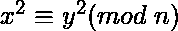
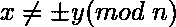
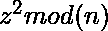
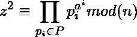

# 带实现的迪克森因式分解法

> 原文:[https://www . geeksforgeeks . org/dixons-因式分解-带实现的方法/](https://www.geeksforgeeks.org/dixons-factorization-method-with-implementation/)

狄克逊因子分解法是一种整数因子分解算法。在本文中，这个方法被解释为[寻找一个复合数](https://www.geeksforgeeks.org/find-the-total-number-of-composite-factor-for-a-given-number/)的因子。

迪克森因式分解是基于众所周知的[数论](https://www.geeksforgeeks.org/tag/number-theory/)的事实:

*   如果与一致，则**gcd(x–y，n)** 很可能是 **n** 的因子。

**例如:**

> 如果 N = 84923，
> 从 292 开始，第一个大于√N 的数字向上计数
> 5052 mod 84923 = 256 = 16 <sup>2</sup>
> 
> 所以(505–16)(505+16)= 0 mod 84923。
> 用欧几里德算法计算最大公约数 505–16 和 N，得到 163，是 N 的因子

<u>**迪克森因子分解算法:**</u>

*   **第一步:**选择一个界 B，确定所有小于或等于 B 的素数的因子基(P)
*   **Step 2:** Search for positive integer **z**, such that  is B-Smooth.

    (1) 

    **B-Smooth** :正整数的素因子都不大于 B 的称为 B- Smooth
    **例如:**

    > 720 的素因子分解为 2<sup>4</sup>* 3<sup>2</sup>* 5<sup>1</sup>
    > 因此 720 是 5 平滑的，因为它的素因子都不大于 5。

*   **第三步:**生成足够多的这些关系后(一般比 P 的大小多几个)，我们用线性代数的方法(如[高斯消去法](https://www.geeksforgeeks.org/gaussian-elimination/))把这些关系相乘在一起。重复这个步骤，直到我们形成足够数量的平滑正方形。
*   **第四步:**将所有这些关系相乘后，我们得到最后的等式说:

    ```
    a2 = b2 mod(N)

    ```

*   **第五步:**因此，上述方程的因子可以确定为:

    ```
    GCD(a - b, N), GCD(a + b, N)

    ```

<u>**逐步执行迪克森因子分解算法:**</u>

*   假设，我们想要使用绑定的 B = 7 来因子 N = 23449。因此，因子基数 P = {2，3，5，7}。
*   这里，x = ceil(sqrt(n)) = 154。所以，我们随机搜索 154 到 N 之间的整数，其平方是 B-Smooth。
*   如前所述，如果一个正整数的素因子都不大于 B，则称它为 B-Smooth。因此，假设我们找到两个数字，分别是 970 和 8621，它们的平方都不具有大于 7 的素因子。
*   从这里开始，我们得到的第一个相关方块是:
    *   970<sup>2</sup>% 23499 = 2940 = 2<sup>2</sup>* 3 * 5 * 7<sup>2</sup>
    *   8621<sup>2</sup>% 23499 = 11760 = 2<sup>4</sup>* 3 * 5 * 7<sup>2</sup>
*   所以，(970 * 8621)<sup>2</sup>=(2<sup>3</sup>* 3 * 5 * 7<sup>2</sup>)<sup>2</sup>% 23499。即:
    14256<sup>2</sup>= 5880<sup>2</sup>% 23499。
*   现在，我们发现:

    ```
    gcd(14256 - 5880, 23449) = 131
    gcd(14256 + 5880, 23449) = 179
    ```

*   因此，因素有:
    **N = 131 * 179**

下面是上述方法的实现:

## C++

```
// C++ implementation of Dixon factorization algo
#include<bits/stdc++.h>
using namespace std;
#include<vector>

// Function to find the factors of a number
// using the Dixon Factorization Algorithm
void factor(int n)
{

    // Factor base for the given number
    int base[4] = {2, 3, 5, 7};

    // Starting from the ceil of the root
    // of the given number N
    int start = int(sqrt(n));

    // Storing the related squares
    vector<vector<int> >pairs;

    // For every number from the square root 
    // Till N
    int len=sizeof(base)/sizeof(base[0]);
    for(int i = start; i < n; i++)
    {
        vector<int> v;

        // Finding the related squares 
        for(int j = 0; j < len; j++)
        {
            int lhs = ((int)pow(i,2))% n;
            int rhs = ((int)pow(base[j],2)) % n;

            // If the two numbers are the 
            // related squares, then append
            // them to the array 
            if(lhs == rhs)
            {
                v.push_back(i);
                v.push_back(base[j]);
                pairs.push_back(v);
            }

        }
    }

    vector<int>newvec;

    // For every pair in the array, compute the 
    // GCD such that 
    len = pairs.size();
    for (int i = 0; i < len;i++){
        int factor = __gcd(pairs[i][0] - pairs[i][1], n);

        // If we find a factor other than 1, then 
        // appending it to the final factor array
        if(factor != 1)
            newvec.push_back(factor);

    }
    set<int>s;
    for (int i = 0; i < newvec.size(); i++)
        s.insert(newvec[i]);
    for(auto i = s.begin(); i != s.end(); i++)
        cout<<(*i)<<" ";
}

// Driver Code
int main()
{
    factor(23449);
}

// This code is contributed by chitranayal
```

## 蟒蛇 3

```
# Python 3 implementation of Dixon factorization algo

from math import sqrt, gcd
import numpy as np

# Function to find the factors of a number
# using the Dixon Factorization Algorithm
def factor(n):

    # Factor base for the given number
    base = [2, 3, 5, 7]

    # Starting from the ceil of the root
    # of the given number N
    start = int(sqrt(n))

    # Storing the related squares
    pairs = []

    # For every number from the square root 
    # Till N
    for i in range(start, n):

        # Finding the related squares 
        for j in range(len(base)):
            lhs = i**2 % n
            rhs = base[j]**2 % n

            # If the two numbers are the 
            # related squares, then append
            # them to the array 
            if(lhs == rhs):
                pairs.append([i, base[j]])

    new = []

    # For every pair in the array, compute the 
    # GCD such that 
    for i in range(len(pairs)):
        factor = gcd(pairs[i][0] - pairs[i][1], n)

        # If we find a factor other than 1, then 
        # appending it to the final factor array
        if(factor != 1):
            new.append(factor)

    x = np.array(new)

    # Returning the unique factors in the array
    return(np.unique(x))

# Driver Code
if __name__ == "__main__":
    print(factor(23449))
```

**Output:**

```
[131 179]

```