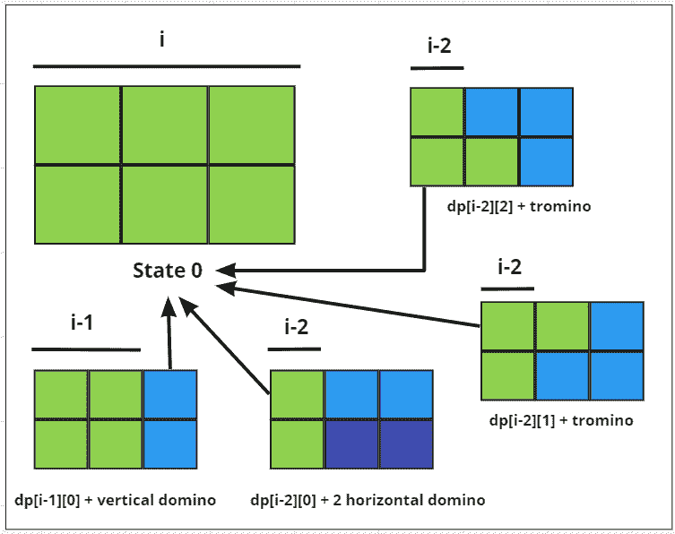

# 多米诺和特罗姆诺平铺问题

> 原文:[https://www . geesforgeks . org/domino-and-tromino-tiling-problem/](https://www.geeksforgeeks.org/domino-and-tromino-tiling-problem/)

给定一个正整数 **N** ，任务是找到用下面显示的尺寸为 **2 × 1** 、 **1 × 2** 、(也称为**多米诺**)和一个可以旋转 **90** 度的“ **L** ”形瓷砖(也称为**特罗米诺**)填充尺寸为 **2*N** 的木板的方法数。

```
The L shape tile:

XX
X
After rotating L shape tile by 90:

XX
 X
or
X
XX
```

**示例:**

> **输入:** N = 3
> **输出:** 5
> **解释:**
> 下图是说明所有组合的图:
> 
> 
> 
> **输入:**N = 1
> T3】输出: 1

**方法:**给定的问题可以通过以下方式基于以下观察来解决:

让我们定义一个 **2** 状态，[动态编程](https://www.geeksforgeeks.org/dynamic-programming/)说**DP【I，j】**表示列索引 **i** 中的以下排列之一。

*   如果前一列状态为 **0** ，则当前列可以填充状态为 **0** 的 **1，2 × 1** 多米诺骨牌。
*   如果**I–2**列的状态为 **0** ，则当前列可以水平填充 **2，1 × 2** 多米诺骨牌。
*   如果前一列的状态为 **0** ，则当前列可以填充状态为 **1** 和状态为 **2** 的“ **L** ”形多米诺骨牌。
*   如果前一列状态为 **2** ，则当前列可以填充状态为 **1** 的 **1 × 2** 形多米诺骨牌；如果前一列状态为 **1** ，则当前列可以填充状态为 **2** 。
*   因此，状态的转换可以定义如下:
    1.  **dp[i][0] = （dp[i – 1][0] + dp[i – 2][0]+ dp[i – 2][1] + dp[i – 2][2]）** .
    2.  **dp[i][1] = dp[i – 1][0] + dp[i – 1][2]** .
    3.  **dp[i][2] = dp[i – 1][0] + dp[i – 1][1]** .

[](https://media.geeksforgeeks.org/wp-content/uploads/20210224215128/calstate0r.PNG)

根据以上观察，按照以下步骤解决问题:

*   如果 **N** 的值小于 **3** ，则打印 **N** 作为总路数。
*   初始化一个[二维数组](https://www.geeksforgeeks.org/multidimensional-arrays-c-cpp/)，比如说**dp[]【3】**，存储 DP 的所有状态。
*   考虑**基本情况:**T2【DP[0][0]= DP[1][0]= DP[1][1]= DP[1][2]= 1。
*   [迭代给定范围](https://www.geeksforgeeks.org/range-based-loop-c/)**【2，N】**并使用变量 **i** 在 dp 中执行以下转换:
    *   **dp[i][0]** 等于**(DP[I–1][0]+DP[I–2][0]+DP[I–2][1]+DP[I–2][2])**。
    *   **dp[i][1]** 等于**DP[I–1][0]+DP[I–1][2]**。
    *   **dp[i][2]** 等于**DP[I–1][0]+DP[I–1][1]**。
*   完成以上步骤后，打印**DP【N】【0】**中存储的总路数。

下面是上述方法的实现:

## C++

```
// C++ program for the above approach

#include <bits/stdc++.h>
using namespace std;
const long long MOD = 1e9 + 7;

// Function to find the total number
// of ways to tile a 2*N board using
// the given types of tile
int numTilings(int N)
{
    // If N is less than 3
    if (N < 3) {
        return N;
    }

    // Store all dp-states
    vector<vector<long long> > dp(
        N + 1, vector<long long>(3, 0));

    // Base Case
    dp[0][0] = dp[1][0] = 1;
    dp[1][1] = dp[1][2] = 1;

    // Traverse the range [2, N]
    for (int i = 2; i <= N; i++) {

        // Update the value of dp[i][0]
        dp[i][0] = (dp[i - 1][0]
                    + dp[i - 2][0]
                    + dp[i - 2][1]
                    + dp[i - 2][2])
                   % MOD;

        // Update the value of dp[i][1]
        dp[i][1] = (dp[i - 1][0]
                    + dp[i - 1][2])
                   % MOD;

        // Update the value of dp[i][2]
        dp[i][2] = (dp[i - 1][0]
                    + dp[i - 1][1])
                   % MOD;
    }

    // Return the number of ways as
    // the value of dp[N][0]
    return dp[N][0];
}

// Driver Code
int main()
{
    int N = 3;
    cout << numTilings(N);

    return 0;
}
```

## Java 语言(一种计算机语言，尤用于创建网站)

```
// Java program for the above approach
import java.util.Arrays;

class GFG{

public static long MOD = 1000000007l;

// Function to find the total number
// of ways to tile a 2*N board using
// the given types of tile
public static long numTilings(int N)
{

    // If N is less than 3
    if (N < 3)
    {
        return N;
    }

    // Store all dp-states
    long[][] dp = new long[N + 1][3];

    for(long[] row : dp)
    {
        Arrays.fill(row, 0);
    }

    // Base Case
    dp[0][0] = dp[1][0] = 1;
    dp[1][1] = dp[1][2] = 1;

    // Traverse the range [2, N]
    for(int i = 2; i <= N; i++)
    {

        // Update the value of dp[i][0]
        dp[i][0] = (dp[i - 1][0] + dp[i - 2][0] +
                    dp[i - 2][1] + dp[i - 2][2]) % MOD;

        // Update the value of dp[i][1]
        dp[i][1] = (dp[i - 1][0] + dp[i - 1][2]) % MOD;

        // Update the value of dp[i][2]
        dp[i][2] = (dp[i - 1][0] + dp[i - 1][1]) % MOD;
    }

    // Return the number of ways as
    // the value of dp[N][0]
    return dp[N][0];
}

// Driver Code
public static void main(String args[])
{
    int N = 3;

    System.out.println(numTilings(N));
}
}

// This code is contributed by gfgking
```

## 蟒蛇 3

```
# Python3 program for the above approache9 + 7;

# Function to find the total number
# of ways to tile a 2*N board using
# the given types of tile
MOD = 1e9 + 7

def numTilings(N):

    # If N is less than 3
    if (N < 3):
        return N

    # Store all dp-states
    dp = [[0] * 3 for i in range(N + 1)]

    # Base Case
    dp[0][0] = dp[1][0] = 1
    dp[1][1] = dp[1][2] = 1

    # Traverse the range [2, N]
    for i in range(2, N + 1):

        # Update the value of dp[i][0]
        dp[i][0] = (dp[i - 1][0] +
                    dp[i - 2][0] +
                    dp[i - 2][1] +
                    dp[i - 2][2]) % MOD

        # Update the value of dp[i][1]
        dp[i][1] = (dp[i - 1][0] +
                    dp[i - 1][2]) % MOD

        # Update the value of dp[i][2]
        dp[i][2] = (dp[i - 1][0] +
                    dp[i - 1][1]) % MOD

    # Return the number of ways as
    # the value of dp[N][0]
    return int(dp[N][0])

# Driver Code
N = 3

print(numTilings(N))

# This code is contributed by gfgking
```

## C#

```
// C# program for the above approach
using System;
using System.Collections.Generic;

class GFG{

static int MOD = 1000000007;

// Function to find the total number
// of ways to tile a 2*N board using
// the given types of tile
static int numTilings(int N)
{
    // If N is less than 3
    if (N < 3) {
        return N;
    }

    // Store all dp-states
    int [,]dp = new int[N+1,3];

    // Base Case
    dp[0,0] = dp[1,0] = 1;
    dp[1,1] = dp[1,2] = 1;

    // Traverse the range [2, N]
    for (int i = 2; i <= N; i++) {

        // Update the value of dp[i,0]
        dp[i,0] = (dp[i - 1,0]
                    + dp[i - 2,0]
                    + dp[i - 2,1]
                    + dp[i - 2,2])
                   % MOD;

        // Update the value of dp[i,1]
        dp[i,1] = (dp[i - 1,0]
                    + dp[i - 1,2])
                   % MOD;

        // Update the value of dp[i,2]
        dp[i,2] = (dp[i - 1,0]
                    + dp[i - 1,1])
                   % MOD;
    }

    // Return the number of ways as
    // the value of dp[N,0]
    return dp[N,0];
}

// Driver Code
public static void Main()
{
    int N = 3;
    Console.Write(numTilings(N));
}
}

// This code is contributed by SURENDRA_GANGWAR.
```

## java 描述语言

```
<script>

        // JavaScript program for the above approache9 + 7;

        // Function to find the total number
        // of ways to tile a 2*N board using
        // the given types of tile
        const MOD = 1e9 + 7;
        function numTilings(N) {
            // If N is less than 3
            if (N < 3) {
                return N;
            }

            // Store all dp-states
            let dp = Array(N + 1).fill().map(() => Array(3).fill(0))

            // Base Case
            dp[0][0] = dp[1][0] = 1;
            dp[1][1] = dp[1][2] = 1;

            // Traverse the range [2, N]
            for (let i = 2; i <= N; i++) {

                // Update the value of dp[i][0]
                dp[i][0] = (dp[i - 1][0]
                    + dp[i - 2][0]
                    + dp[i - 2][1]
                    + dp[i - 2][2])
                    % MOD;

                // Update the value of dp[i][1]
                dp[i][1] = (dp[i - 1][0]
                    + dp[i - 1][2])
                    % MOD;

                // Update the value of dp[i][2]
                dp[i][2] = (dp[i - 1][0]
                    + dp[i - 1][1])
                    % MOD;
            }

            // Return the number of ways as
            // the value of dp[N][0]
            return dp[N][0];
        }

        // Driver Code

        let N = 3;
        document.write(numTilings(N));

// This code is contributed by Potta Lokesh
    </script>
```

**Output:** 

```
5
```

***时间复杂度:**O(N)*
T5**辅助空间:** O(N)