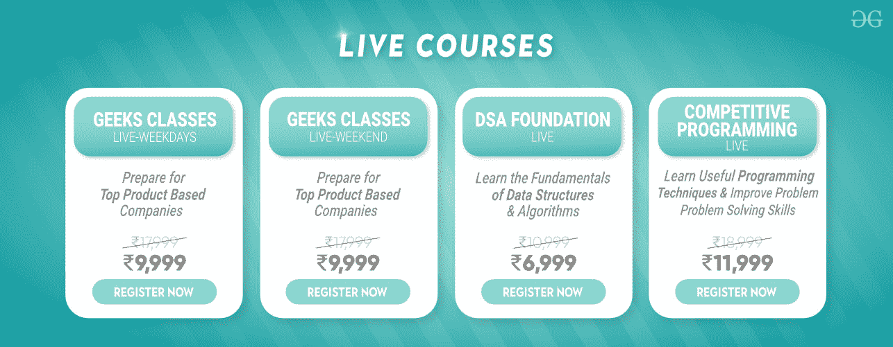
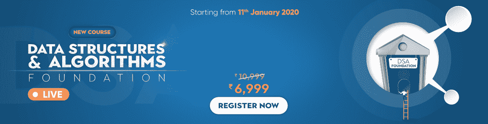
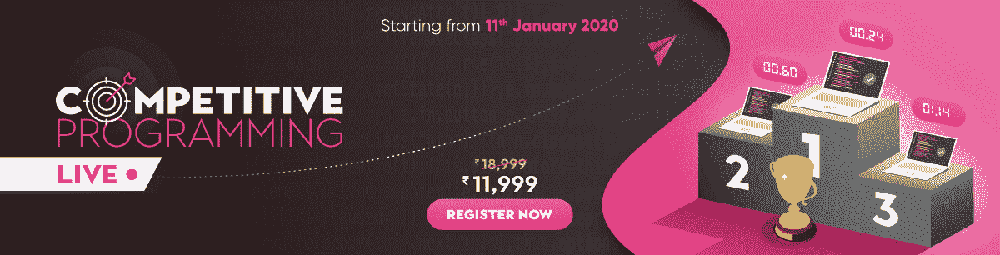

# 不要让你的地理位置成为你成功的障碍——极客直播课

> 原文:[https://www . geeksforgeeks . org/不要让你的地理位置成为你成功的障碍-geeksforgeeks 直播课/](https://www.geeksforgeeks.org/dont-let-your-geographical-location-be-a-barrier-in-your-success-live-classes-by-geeksforgeeks/)

**冬天来了，落点季也来了！**而且这段时间招聘的公司很多，包括产品型公司、创业型公司或者服务型公司。所以，如果你想成功并获得你梦想中的工作，彻底的面试准备是必须的！！！

现在我相信面试会吓到你，就像大多数候选人一样！！！但是你不需要担心，因为面试主要是测试你的基本能力。像 **[【数据结构】](https://www.geeksforgeeks.org/data-structures/)[算法](https://www.geeksforgeeks.org/fundamentals-of-algorithms/)** 这样的话题是大多数公司技术面试的基本部分。如果你准备得足够充分，那么你可能会得到任何你想要的工作！

**但你是否担心自己对数据结构和算法不够重视？**你认为你已经失去了对这些核心基本话题的接触，现在需要额外的帮助吗？为什么不从行业专家那里获得一些帮助，并立即解决您的所有疑问？

在这个安置季(以及以后)帮助你！) [**GeeksforGeeks**](http://geeksforgeeks.org/) 现在推出直播课程，帮助你实现所有可能有的技术目标。这些课程将教你计算机科学的基础，如数据结构和算法，以及其他技能，如竞争编程，这只会在未来帮助你。要了解更多信息，请继续阅读…

### 极客现场课程

**极客直播课程**是在线直播课程，您可以从任何地理位置参加。这些课程就像一个互动的现场会议，你可以像一个线下课堂程序一样向讲师提出你的疑问。因此，您可以在舒适的家中通过疑问解决设施获得现场教育。这真是两全其美！！！

查看 GeeksforGeeks 上的不同现场课程列表，您可以免费注册这些课程！这些课程将为你即将到来的就业季做好充分的准备，并增强你的知识。

### 1.极客课堂直播–工作日

这是一个广泛的在线直播课堂计划，旨在构建和增强您的**数据结构和算法**概念，由**桑德普·贾恩**(创始人&首席执行官，极客 forGeeks)指导。他有 7 年的教学经验和 6 年的行业经验。本课程旨在通过增强您对数据结构&算法的理解来提高您的问题解决和编码技能。本课程的主要目标是帮助您准备对亚马逊、微软、优步等顶级公司的**编码面试**。

课程将安排在**工作日**进行，因为这是一个工作日直播课程。课程将安排在每:

*   **周一**–晚上 8:30–晚上 11:00(IST)
*   **周三**–晚上 8:30–晚上 11:00(IST)
*   **周五**–下午 8:30–11:00(实际时间)

本课程的价格为**17，999 印度卢比**，但其报价为**9，999 印度卢比**。所以快点！！！点击下面的按钮，立即注册**极客课程直播-工作日**课程。

[立即注册](https://practice.geeksforgeeks.org/courses/geeks-classes-live-weekdays)

### 2.极客课堂直播——周末

如果你因大学或工作原因平日很忙，周末仍可参加**极客课堂直播**。这是一个广泛的在线直播课堂计划，旨在构建和增强您的**数据结构和算法**概念，由**桑德普·贾恩**(创始人&首席执行官，极客们指导。本课程旨在通过增强您对数据结构&算法的理解来提高您的问题解决和编码技能。本课程的主要目标是帮助您准备亚马逊、微软、优步等顶级公司的**编码面试**。课程安排在**周末**即周六&周日。

*   **上课时间:**晚上 8:00-11:00(IST)

本课程的价格为**17，999 印度卢比**，但其报价为**9，999 印度卢比**。所以快点！！！点击下方按钮，立即注册**极客课程直播-周末**课程。

[立即注册](https://practice.geeksforgeeks.org/courses/geeks-classes-live)

### 3.每日生活津贴基金会-直播

本课程是一个广泛的程序，将从头开始用 C++/Java 构建您的**数据结构和算法**概念。本课程是为 DSA 初学者以及想要更新知识的人设计的。您还将被要求在现场会议期间练习一些编码问题，以便您可以了解更多信息，并在出现任何疑问时当场提出。课程将安排在**周末**，即周六和周日。

*   **上课时间:**下午 2:00-5:00(IST)
*   **上课时间:**2020 年 1 月 11 日至 2020 年 2 月 9 日(10 节课，5 个周末)

本课程的价格为**10，999 印度卢比**，但报价为**6，999 印度卢比**。所以快点！！！点击下方按钮，立即注册**每日生活津贴基金会-现场课程**。

[立即注册](https://practice.geeksforgeeks.org/courses/dsa-foundation-live)

### 4.竞技节目–直播

如果你想征服你的编码技能，这就是适合你的课程！竞技编程直播课程将提升你的**解题技巧**，让你在编写高效、可靠、最优的代码时，能够跳出框框思考。本课程将由编程专家指导&，他们在全球竞争激烈的网站上排名很高。您还将了解现有的不同编程竞赛，以及在大多数竞赛中取得成功所需的技巧和诀窍。课程将安排在**周末**，即周六和周日。

*   **上课时间:**上午 10:00-下午 1:00(IST)
*   **上课时间:**2020 年 1 月 11 日至 2020 年 3 月 8 日(18 节课，9 个周末)
*   每周二晚上 9:00-10:00(IST)将有一个额外的(1 小时)会议用于疑问讨论

本课程的价格为**18，999 印度卢比**，但报价为**11，999 印度卢比**。停…停…优惠不到此结束，您可以使用优惠券 **EARLYBIRD** 获得**额外 1000 印度卢比优惠**。所以快点！！！点击下面的按钮，立即注册**竞技编程直播课程**。

[立即注册](https://practice.geeksforgeeks.org/courses/competitive-programming-live)

关于任何课程，您还有其他疑问吗？请致电 **1800 123 8622** 联系我们，或填写此 [**表格**](https://docs.google.com/forms/d/e/1FAIpQLSflT0YlXJ1QUpfF3uy6ivfAVdbgr43vjF9qeJz7aQU7OvGO_g/viewform) 以获得我们团队的回电。