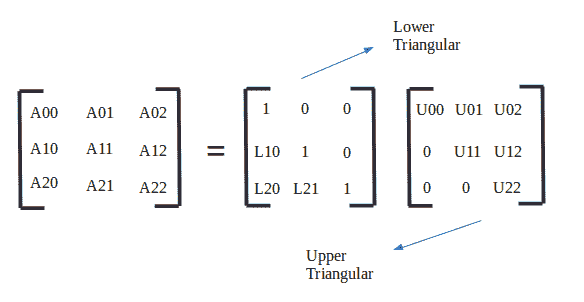
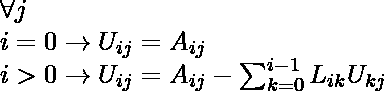
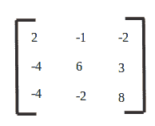
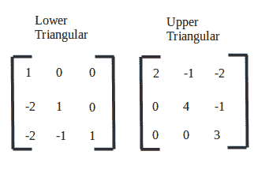

# 杜利特尔算法:LU 分解

> 原文:[https://www . geesforgeks . org/doo little-algorithm-Lu-decomposition/](https://www.geeksforgeeks.org/doolittle-algorithm-lu-decomposition/)

在数值分析和线性代数中， [LU 分解](https://www.geeksforgeeks.org/l-u-decomposition-system-linear-equations/)(其中‘LU’代表‘下上’，也叫 LU 因式分解)将矩阵因子化为下三角矩阵和上三角矩阵的乘积。计算机通常使用 LU 分解来求解线性方程组的平方，这也是求矩阵反相或计算矩阵行列式的关键步骤。LU 分解是由数学家塔德乌什·巴纳基耶维奇在 1938 年提出的。

设 A 为正方形矩阵。LU 分解指的是将具有适当的行和/或列顺序或排列的 A 分解成两个因子，下三角矩阵 L 和上三角矩阵 U， **A=LU** 。



**杜利特尔算法** :
将一个正方形矩阵分解成下三角矩阵和上三角矩阵总是可能的。也就是说，**【A】=【L】【U】**
杜利特尔的方法提供了一种替代方法，可以将 A 因子加入到 LU 分解中，而无需经历[高斯消去](https://www.geeksforgeeks.org/gaussian-elimination/)的麻烦。
对于一般的 n×n 矩阵 A，我们假设存在一个 LU 分解，并明确写出 L 和 U 的形式。然后，我们从方程中系统地求解 L 和 U 中的条目，这些方程是由 A=LU 所必需的乘法得到的。

矩阵的项由下式给出:



L 矩阵的术语:


**例**:

```
Input : 
```



```
Output :
```



## C++

```
// C++ Program to decompose a matrix into
// lower and upper triangular matrix
#include <bits/stdc++.h>
using namespace std;

const int MAX = 100;

void luDecomposition(int mat[][MAX], int n)
{
    int lower[n][n], upper[n][n];
    memset(lower, 0, sizeof(lower));
    memset(upper, 0, sizeof(upper));

    // Decomposing matrix into Upper and Lower
    // triangular matrix
    for (int i = 0; i < n; i++)
    {
        // Upper Triangular
        for (int k = i; k < n; k++)
        {
            // Summation of L(i, j) * U(j, k)
            int sum = 0;
            for (int j = 0; j < i; j++)
                sum += (lower[i][j] * upper[j][k]);

            // Evaluating U(i, k)
            upper[i][k] = mat[i][k] - sum;
        }

        // Lower Triangular
        for (int k = i; k < n; k++)
        {
            if (i == k)
                lower[i][i] = 1; // Diagonal as 1
            else
            {
                // Summation of L(k, j) * U(j, i)
                int sum = 0;
                for (int j = 0; j < i; j++)
                    sum += (lower[k][j] * upper[j][i]);

                // Evaluating L(k, i)
                lower[k][i]
                    = (mat[k][i] - sum) / upper[i][i];
            }
        }
    }

    // setw is for displaying nicely
    cout << setw(6)
         << "      Lower Triangular"
         << setw(32)
         << "Upper Triangular" << endl;

    // Displaying the result :
    for (int i = 0; i < n; i++)
    {
        // Lower
        for (int j = 0; j < n; j++)
            cout << setw(6) << lower[i][j] << "\t";
        cout << "\t";

        // Upper
        for (int j = 0; j < n; j++)
            cout << setw(6) << upper[i][j] << "\t";
        cout << endl;
    }
}

// Driver code
int main()
{
    int mat[][MAX]
        = { { 2, -1, -2 }, { -4, 6, 3 }, { -4, -2, 8 } };

    luDecomposition(mat, 3);
    return 0;
}
```

## Java 语言(一种计算机语言，尤用于创建网站)

```
// Java Program to decompose a matrix into
// lower and upper triangular matrix
class GFG {

    static int MAX = 100;
    static String s = "";
    static void luDecomposition(int[][] mat, int n)
    {
        int[][] lower = new int[n][n];
        int[][] upper = new int[n][n];

        // Decomposing matrix into Upper and Lower
        // triangular matrix
        for (int i = 0; i < n; i++)
        {
            // Upper Triangular
            for (int k = i; k < n; k++)
            {
                // Summation of L(i, j) * U(j, k)
                int sum = 0;
                for (int j = 0; j < i; j++)
                    sum += (lower[i][j] * upper[j][k]);

                // Evaluating U(i, k)
                upper[i][k] = mat[i][k] - sum;
            }

            // Lower Triangular
            for (int k = i; k < n; k++)
            {
                if (i == k)
                    lower[i][i] = 1; // Diagonal as 1
                else
                {
                    // Summation of L(k, j) * U(j, i)
                    int sum = 0;
                    for (int j = 0; j < i; j++)
                        sum += (lower[k][j] * upper[j][i]);

                    // Evaluating L(k, i)
                    lower[k][i]
                        = (mat[k][i] - sum) / upper[i][i];
                }
            }
        }

        // setw is for displaying nicely
        System.out.println(setw(2) + "     Lower Triangular"
                           + setw(10) + "Upper Triangular");

        // Displaying the result :
        for (int i = 0; i < n; i++)
        {
            // Lower
            for (int j = 0; j < n; j++)
                System.out.print(setw(4) + lower[i][j]
                                 + "\t");
            System.out.print("\t");

            // Upper
            for (int j = 0; j < n; j++)
                System.out.print(setw(4) + upper[i][j]
                                 + "\t");
            System.out.print("\n");
        }
    }
    static String setw(int noOfSpace)
    {
        s = "";
        for (int i = 0; i < noOfSpace; i++)
            s += " ";
        return s;
    }

    // Driver code
    public static void main(String arr[])
    {
        int mat[][] = { { 2, -1, -2 },
                        { -4, 6, 3 },
                        { -4, -2, 8 } };

        luDecomposition(mat, 3);
    }
}

/* This code contributed by PrinciRaj1992 */
```

## 蟒蛇 3

```
# Python3 Program to decompose
# a matrix into lower and
# upper triangular matrix
MAX = 100

def luDecomposition(mat, n):

    lower = [[0 for x in range(n)]
             for y in range(n)]
    upper = [[0 for x in range(n)]
             for y in range(n)]

    # Decomposing matrix into Upper
    # and Lower triangular matrix
    for i in range(n):

        # Upper Triangular
        for k in range(i, n):

            # Summation of L(i, j) * U(j, k)
            sum = 0
            for j in range(i):
                sum += (lower[i][j] * upper[j][k])

            # Evaluating U(i, k)
            upper[i][k] = mat[i][k] - sum

        # Lower Triangular
        for k in range(i, n):
            if (i == k):
                lower[i][i] = 1  # Diagonal as 1
            else:

                # Summation of L(k, j) * U(j, i)
                sum = 0
                for j in range(i):
                    sum += (lower[k][j] * upper[j][i])

                # Evaluating L(k, i)
                lower[k][i] = int((mat[k][i] - sum) /
                                  upper[i][i])

    # setw is for displaying nicely
    print("Lower Triangular\t\tUpper Triangular")

    # Displaying the result :
    for i in range(n):

        # Lower
        for j in range(n):
            print(lower[i][j], end="\t")
        print("", end="\t")

        # Upper
        for j in range(n):
            print(upper[i][j], end="\t")
        print("")

# Driver code
mat = [[2, -1, -2],
       [-4, 6, 3],
       [-4, -2, 8]]

luDecomposition(mat, 3)

# This code is contributed by mits
```

## C#

```
// C# Program to decompose a matrix into
// lower and upper triangular matrix
using System;

class GFG {

    static int MAX = 100;
    static String s = "";
    static void luDecomposition(int[, ] mat, int n)
    {
        int[, ] lower = new int[n, n];
        int[, ] upper = new int[n, n];

        // Decomposing matrix into Upper and Lower
        // triangular matrix
        for (int i = 0; i < n; i++)
        {
            // Upper Triangular
            for (int k = i; k < n; k++)
            {
                // Summation of L(i, j) * U(j, k)
                int sum = 0;
                for (int j = 0; j < i; j++)
                    sum += (lower[i, j] * upper[j, k]);

                // Evaluating U(i, k)
                upper[i, k] = mat[i, k] - sum;
            }

            // Lower Triangular
            for (int k = i; k < n; k++)
            {
                if (i == k)
                    lower[i, i] = 1; // Diagonal as 1
                else
                {
                    // Summation of L(k, j) * U(j, i)
                    int sum = 0;
                    for (int j = 0; j < i; j++)
                        sum += (lower[k, j] * upper[j, i]);

                    // Evaluating L(k, i)
                    lower[k, i]
                        = (mat[k, i] - sum) / upper[i, i];
                }
            }
        }

        // setw is for displaying nicely
        Console.WriteLine(setw(2) + "     Lower Triangular"
                          + setw(10) + "Upper Triangular");

        // Displaying the result :
        for (int i = 0; i < n; i++)
        {
            // Lower
            for (int j = 0; j < n; j++)
                Console.Write(setw(4) + lower[i, j] + "\t");
            Console.Write("\t");

            // Upper
            for (int j = 0; j < n; j++)
                Console.Write(setw(4) + upper[i, j] + "\t");
            Console.Write("\n");
        }
    }
    static String setw(int noOfSpace)
    {
        s = "";
        for (int i = 0; i < noOfSpace; i++)
            s += " ";
        return s;
    }

    // Driver code
    public static void Main(String[] arr)
    {
        int[, ] mat = { { 2, -1, -2 },
                        { -4, 6, 3 },
                        { -4, -2, 8 } };

        luDecomposition(mat, 3);
    }
}

// This code is contributed by Princi Singh
```

## 服务器端编程语言（Professional Hypertext Preprocessor 的缩写）

```
<?php
// PHP Program to decompose
// a matrix into lower and
// upper triangular matrix
$MAX = 100;

function luDecomposition($mat, $n)
{
    $lower;
    $upper;
    for($i = 0; $i < $n; $i++)
    for($j = 0; $j < $n; $j++)
    {
        $lower[$i][$j]= 0;
        $upper[$i][$j]= 0;
    }
    // Decomposing matrix
    // into Upper and Lower
    // triangular matrix
    for ($i = 0; $i < $n; $i++)
    {

        // Upper Triangular
        for ($k = $i; $k < $n; $k++)
        {

            // Summation of
            // L(i, j) * U(j, k)
            $sum = 0;
            for ($j = 0; $j < $i; $j++)
                $sum += ($lower[$i][$j] *
                         $upper[$j][$k]);

            // Evaluating U(i, k)
            $upper[$i][$k] = $mat[$i][$k] - $sum;
        }

        // Lower Triangular
        for ($k = $i; $k < $n; $k++)
        {
            if ($i == $k)
                $lower[$i][$i] = 1; // Diagonal as 1
            else
            {

                // Summation of L(k, j) * U(j, i)
                $sum = 0;
                for ($j = 0; $j < $i; $j++)
                    $sum += ($lower[$k][$j] *
                             $upper[$j][$i]);

                // Evaluating L(k, i)
                $lower[$k][$i] = (int)(($mat[$k][$i] -
                                $sum) / $upper[$i][$i]);
            }
        }
    }

    // setw is for
    // displaying nicely
    echo "\t\tLower Triangular";
    echo "\t\t\tUpper Triangular\n";

    // Displaying the result :
    for ($i = 0; $i < $n; $i++)
    {
        // Lower
        for ($j = 0; $j < $n; $j++)
            echo "\t" . $lower[$i][$j] . "\t";
        echo "\t";

        // Upper
        for ($j = 0; $j < $n; $j++)
        echo $upper[$i][$j] . "\t";
        echo "\n";
    }
}

// Driver code
$mat = array(array(2, -1, -2),
             array(-4, 6, 3),
             array(-4, -2, 8));

luDecomposition($mat, 3);

// This code is contributed by mits
?>
```

## java 描述语言

```
<script>

// Javascript Program to decompose a matrix
// into lower and upper triangular matrix   
// function MAX = 100;
var s = "";

function luDecomposition(mat, n)
{
    var lower = Array(n).fill(0).map(
           x => Array(n).fill(0));
    var upper = Array(n).fill(0).map(
           x => Array(n).fill(0));

    // Decomposing matrix into Upper and
    // Lower triangular matrix
    for(var i = 0; i < n; i++)
    {

        // Upper Triangular
        for(var k = i; k < n; k++)
        {

            // Summation of L(i, j) * U(j, k)
            var sum = 0;
            for(var j = 0; j < i; j++)
                sum += (lower[i][j] * upper[j][k]);

            // Evaluating U(i, k)
            upper[i][k] = mat[i][k] - sum;
        }

        // Lower Triangular
        for(var k = i; k < n; k++)
        {
            if (i == k)

                // Diagonal as 1
                lower[i][i] = 1;
            else
            {

                // Summation of L(k, j) * U(j, i)
                var sum = 0;
                for(var j = 0; j < i; j++)
                    sum += (lower[k][j] * upper[j][i]);

                // Evaluating L(k, i)
                lower[k][i] = parseInt((mat[k][i] - sum) /
                                      upper[i][i]);
            }
        }
    }

    // Setw is for displaying nicely
    document.write(setw(2) + "Lower Triangular" +
                   setw(10) + "Upper Triangular<br>");

    // Displaying the result :
    for(var i = 0; i < n; i++)
    {

        // Lower
        for(var j = 0; j < n; j++)
            document.write(setw(4) +
                           lower[i][j] + "\t");

        document.write(setw(10));

        // Upper
        for(var j = 0; j < n; j++)
            document.write(setw(4) +
                           upper[i][j] + "\t");

        document.write("<br>");
    }
}

function setw(noOfSpace)
{
    var s = "";
    for(i = 0; i < noOfSpace; i++)
        s += " ";

    return s;
}

// Driver code
var mat = [ [ 2, -1, -2 ],
            [ -4, 6, 3 ],
            [ -4, -2, 8 ] ];

luDecomposition(mat, 3);

// This code is contributed by Amit Katiyar

</script>
```

**输出:**

```
Lower Triangular    Upper Triangular
1    0      0       2    -1     -2    
-2   1      0       0     4     -1    
-2  -1      1       0     0      3    
```

本文由 [**舒巴姆拉纳**](https://auth.geeksforgeeks.org/profile.php?user=shubham_rana_77&list=practice) 供稿。如果你喜欢 GeeksforGeeks 并想投稿，你也可以使用[write.geeksforgeeks.org](https://write.geeksforgeeks.org)写一篇文章或者把你的文章邮寄到 review-team@geeksforgeeks.org。看到你的文章出现在极客博客主页上，帮助其他极客。
如果发现有不正确的地方，或者想分享更多关于上述话题的信息，请写评论。