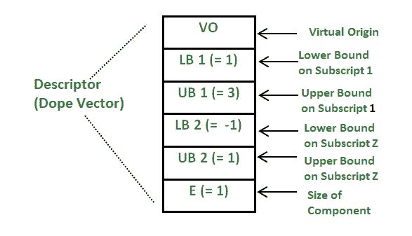

# 掺杂向量

> 原文:[https://www . geesforgeks . org/dope-vector-gap-buffer-arrays/](https://www.geeksforgeeks.org/dope-vector-gap-buffer-arrays/)

[掺杂向量](https://en.wikipedia.org/wiki/Dope_vector)是一种数据结构，编译器使用它来存储一些关于数组的元数据，如数组的总大小、一个单元的大小(也称为数组的跨距)等。这些用于描述数组和其他类似的结构，这些结构将一个数据类型的多个值存储为一个完整的内存块。它还可以描述包含数组和类似结构作为其组件的结构。掺杂向量有助于编译器轻松访问数组。编译器执行的不同检查，如**越界检查、数据类型检查**等。都是可能的，因为掺杂矢量与阵列相关联。
以下细节存储在特定阵列的掺杂向量中:

*   **E** 表示单个数组元素的大小，比如 E = 1 表示字符，E = 4 表示整数，等等。
*   **VO** 表示 RAM 内部阵列的虚拟起始内存。
*   **LU1** 表示数组的起始下限。
*   **UB1** 表示数组当前占用的上限。
*   **UB2** 表示数组可以填充的上限。

掺杂向量存储的详细信息因操作系统而异，但主要包含有关阵列的以下信息:

*   数组或的秩或维数
*   数组的基址。
*   存储在数组中的元素类型。
*   数组的跨度。
*   数组的范围。

和许多其他细节。
通过使用数组的掺杂向量的概念，以较小的计算开销(从掺杂向量获取数据)为代价，解决了许多问题，例如:

*   如果不使用掺杂向量，很难释放与阵列相关的额外内存。假设我们最初为阵列分配了 200KB 的内存。但是当它被使用时，它只需要 150 Kb 的内存。释放额外的内存变得非常容易使用掺杂矢量，因为它存储的范围内存目前所占的阵列。
*   没有掺杂向量，很难确定数组中元素的数量，因为它存储了数组总大小和步长的信息。它可以用来计算数组中元素的总数。