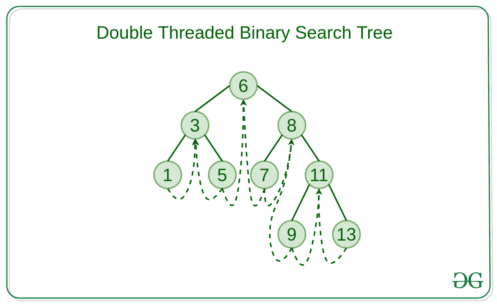

# 双螺纹二叉查找树

> 原文:[https://www . geesforgeks . org/多线程-二进制-搜索-树/](https://www.geeksforgeeks.org/double-threaded-binary-search-tree/)

**双线程二叉查找树:**是一个二叉查找树，其中节点不是每个左空指针都指向它的前序，而右空指针指向后序。
线程对于快速访问节点的祖先也很有用。

多线程二叉查找树是许多实时应用程序中使用最多的高级数据结构类型之一，例如最近插入和遍历搜索树所有元素的地方。



**双线程二叉查找树的创建算法:**

*   在双线程二叉查找树中，有五个字段，即数据字段、左指针、右指针、lbit 和 rbit，其中 lbit 和 rbit 是存储的布尔值，表示指向顺序后继节点或新子节点的右指针。类似地，lbit 表示左边的指针指向一个有序的前置节点或一个新的子节点。
*   创建双线程二叉查找树的基本条件是根节点是否存在，如果不存在，则创建一个新节点并存储它。
*   否则，将当前节点的数据与要插入的新数据进行比较，如果新数据小于当前数据，则遍历左侧子节点。否则，遍历到右边的子节点。
*   如果左边的子节点或右边的子节点不存在，那么将该节点插入到它的左边，并将它的左边和右边的子节点分别指向有序的前置任务和后续任务。

下面是上述方法的实现:

## C++

```
// C++ implementation of the double
// threaded binary searighth tree

#include <iostream>
using namespace std;

// Class of the Node
class Node {
    int lbit, rbit;
    int value;
    Node *left, *right;

public:
    // Constructor of the
    // Node of the Tree
    Node()
    {
        lbit = rbit = 0;
        value = 0;
        left = right = NULL;
    }
    friend class DTBT;
};

// Class of the Threaded
// Binary search tree
class DTBT {
    Node* root;

public:
    // Constructor of the
    // Threaded of the Binary
    // Search Tree
    DTBT()
    {
        root = new Node();

        // Initialise the dummy node
        // to any random value of
        // your choice.
        root->value = 9999;

        // Considering our whole
        // tree is at left of
        // dummy node
        root->rbit = 1;
        root->lbit = 0;

        // Consider your whole tree
        // lies to the left of
        // this dummy node.
        root->left = root;
        root->right = root;
    }
    void create();
    void insert(int value);
    void preorder();
    Node* preorderSuccessor(Node*);
    void inorder();
    Node* inorderSuccessor(Node*);
};

// Function to create the Binary
// search tree
void DTBT::create()
{
    int n = 9;

    // Insertion of the nodes
    this->insert(6);
    this->insert(3);
    this->insert(1);
    this->insert(5);
    this->insert(8);
    this->insert(7);
    this->insert(11);
    this->insert(9);
    this->insert(13);
}

// Function to insert the nodes
// into the threaded binary
// search tree
void DTBT::insert(int data)
{
    // Condition to check if there
    // is no node in the binary tree
    if (root->left == root
        && root->right == root) {

        Node* p = new Node();
        p->value = data;
        p->left = root->left;
        p->lbit = root->lbit;
        p->rbit = 0;
        p->right = root->right;

        // Inserting the node in the
        // left of the dummy node
        root->left = p;
        root->lbit = 1;
        return;
    }

    // New node
    Node* cur = new Node;
    cur = root->left;
    while (1) {
        // Condition to check if the
        // data to be inserted is
        // less than the current node
        if (cur->value < data) {
            Node* p = new Node();
            p->value = data;
            if (cur->rbit == 0) {
                p->right = cur->right;
                p->rbit = cur->rbit;
                p->lbit = 0;
                p->left = cur;

                // Inserting the node
                // in the right
                cur->rbit = 1;
                cur->right = p;
                return;
            }
            else
                cur = cur->right;
        }

        // Otherwise insert the node
        // in the left of current node
        if (cur->value > data) {
            Node* p = new Node();
            p->value = data;
            if (cur->lbit == 0) {
                p->left = cur->left;
                p->lbit = cur->lbit;
                p->rbit = 0;

                // Pointing the right child
                // to its inorder Successor
                p->right = cur;
                cur->lbit = 1;
                cur->left = p;
                return;
            }
            else
                cur = cur->left;
        }
    }
}

// In Threaded binary search tree
// the left pointer of every node
// points to its Inorder predecessor,
// whereas its right pointer points
// to the the Inorder Successor
void DTBT::preorder()
{
    Node* c = root->left;

    // Loop to traverse the tree in
    // the preorder fashion
    while (c != root) {
        cout << " " << c->value;
        c = preorderSuccessor(c);
    }
}

// Function to find the preorder
// Successor of the node
Node* DTBT::preorderSuccessor(Node* c)
{
    if (c->lbit == 1) {
        return c->left;
    }
    while (c->rbit == 0) {
        c = c->right;
    }
    return c->right;
}

// In Threaded binary search tree
// the left pointer of every node
// points to its Inorder predecessor
// whereas its right pointer points
// to the the Inorder Successor
void DTBT::inorder()
{
    Node* c;
    c = root->left;
    while (c->lbit == 1)
        c = c->left;

    // Loop to traverse the tree
    while (c != root) {
        cout << " " << c->value;
        c = inorderSuccessor(c);
    }
}

// Function to find the inorder
// successor of the node
Node* DTBT::inorderSuccessor(Node* c)
{
    if (c->rbit == 0)
        return c->right;
    else
        c = c->right;
    while (c->lbit == 1) {
        c = c->left;
    }
    return c;
}

// Driver Code
int main()
{
    DTBT t1;

    // Creation of the Threaded
    // Binary search tree
    t1.create();

    cout << "Inorder Traversal of DTBST\n";
    t1.inorder();

    cout << "\nPreorder Traversal of DTBST\n";
    t1.preorder();
    return 0;
}
```

**Output**

```
Inorder Traversal of DTBST
 1 3 5 6 7 8 9 11 13
Preorder Traversal of DTBST
 6 3 1 5 8 7 11 9 13
```