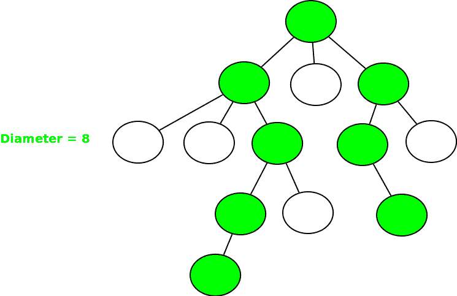
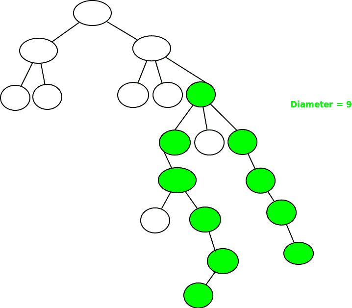

# 树上的直径|集合-3(N 元树的直径)

> 原文:[https://www . geesforgeks . org/DP-on-trees-set-3-直径为 n 元的树/](https://www.geeksforgeeks.org/dp-on-trees-set-3-diameter-of-n-ary-tree/)

给定 N 个节点的 N 元树 T，任务是计算任意两个节点之间的最长路径(也称为树的直径)。
**例 1:**



**例 2:**



解决这些问题的不同方法已经讨论过了:

*   [https://www.geeksforgeeks.org/diameter-n-ary-tree/](https://www.geeksforgeeks.org/diameter-n-ary-tree/)
*   [https://www . geesforgeks . org/diameter-n-ary-tree-using-bfs/](https://www.geeksforgeeks.org/diameter-n-ary-tree-using-bfs/)

在这篇文章中，我们将讨论一种在树上使用[动态编程的方法。
T3【先决条件】T4:](https://www.geeksforgeeks.org/dynamic-programming-trees-set-1/) 

*   [树上的 DP |第 1 集](https://www.geeksforgeeks.org/dynamic-programming-trees-set-1/)
*   [树上的 DP |第 2 集](https://www.geeksforgeeks.org/dynamic-programming-trees-set-2/)

直径存在两种可能性:

*   **情况 1** :假设直径从一个节点开始，在其子树的某个节点结束。假设存在一个节点 **x** ，使得最长的路径从节点 **x** 开始，进入其子树，并在子树本身的某个节点处结束。让我们通过 **dp1[x]** 来定义这个路径长度。
*   **情况 2** :假设直径或最长路径从一个节点 **x** 的子树开始，经过它，并在它的子树结束。让我们通过 **dp2[x]** 来定义这条路径。

如果对于所有节点 x，我们取最大值 dp1[x]，dp2[x]，那么我们将得到树的直径。
**对于情况-1** ，要找到 dp1【节点】，我们需要找到所有 dp1【x】的最大值，其中 x 是节点的子节点。并且 dp1[节点]将等于 **1 + max(dp1[children1]，dp1[children2]，..)**。
**对于情况-2** ，要找到 dp2【节点】，我们需要找到所有 dp1【x】的两个最大值，其中 x 是节点的子节点。并且 dp2[节点]将等于 **1 +最大 2(dp1[children 1]，dp1[children2]，..)**。
我们可以很容易地运行一个 [DFS](https://www.geeksforgeeks.org/depth-first-search-or-dfs-for-a-graph/) ，找到每一个的 dp1[节点]和 dp2[节点]的最大值，得到树的直径。
以下是上述方法的实施:

## C++

```
// C++ program to find diameter of a tree
// using DFS.
#include <bits/stdc++.h>
using namespace std;

int diameter = -1;

// Function to find the diameter of the tree
// using Dynamic Programming
int dfs(int node, int parent, int dp1[], int dp2[], list<int>* adj)
{

    // Store the first maximum and secondmax
    int firstmax = -1;
    int secondmax = -1;

    // Traverse for all children of node
    for (auto i = adj[node].begin(); i != adj[node].end(); ++i) {
        if (*i == parent)
            continue;

        // Call DFS function again
        dfs(*i, node, dp1, dp2, adj);

        // Find first max
        if (firstmax == -1) {
            firstmax = dp1[*i];
        }
        else if (dp1[*i] >= firstmax) // Secondmaximum
        {
            secondmax = firstmax;
            firstmax = dp1[*i];
        }
        else if (dp1[*i] > secondmax) // Find secondmaximum
        {
            secondmax = dp1[*i];
        }
    }

    // Base case for every node
    dp1[node] = 1;
    if (firstmax != -1) // Add
        dp1[node] += firstmax;

    // Find dp[2]
    if (secondmax != -1)
        dp2[node] = 1 + firstmax + secondmax;

    // Return maximum of both
    return max(dp1[node], dp2[node]);
}

// Driver Code
int main()
{
    int n = 5;

    /* Constructed tree is
         1
        / \
        2 3
       / \
       4  5 */
    list<int>* adj = new list<int>[n + 1];

    /*create undirected edges */
    adj[1].push_back(2);
    adj[2].push_back(1);
    adj[1].push_back(3);
    adj[3].push_back(1);
    adj[2].push_back(4);
    adj[4].push_back(2);
    adj[2].push_back(5);
    adj[5].push_back(2);

    int dp1[n + 1], dp2[n + 1];
    memset(dp1, 0, sizeof dp1);
    memset(dp2, 0, sizeof dp2);

    // Find diameter by calling function
    cout << "Diameter of the given tree is "
         << dfs(1, 1, dp1, dp2, adj) << endl;

    return 0;
}
```

## Java 语言(一种计算机语言，尤用于创建网站)

```
// Java program to find diameter of a tree using DFS.
import java.util.*;
public class Main
{
    // Function to find the diameter of the tree
    // using Dynamic Programming
    static int dfs(int node, int parent, int[] dp1, int[] dp2, Vector<Vector<Integer>> adj)
    {

        // Store the first maximum and secondmax
        int firstmax = -1;
        int secondmax = -1;

        // Traverse for all children of node
        for (int i = 0; i < adj.get(node).size(); ++i) {
            if (adj.get(node).get(i) == parent)
                continue;

            // Call DFS function again
            dfs(adj.get(node).get(i), node, dp1, dp2, adj);

            // Find first max
            if (firstmax == -1) {
                firstmax = dp1[adj.get(node).get(i)];
            }
            // Secondmaximum
            else if (dp1[adj.get(node).get(i)] >= firstmax)
            {
                secondmax = firstmax;
                firstmax = dp1[adj.get(node).get(i)];
            }
            // Find secondmaximum
            else if (dp1[adj.get(node).get(i)] > secondmax)
            {
                secondmax = dp1[adj.get(node).get(i)];
            }
        }

        // Base case for every node
        dp1[node] = 1;
        if (firstmax != -1) // Add
            dp1[node] += firstmax;

        // Find dp[2]
        if (secondmax != -1)
            dp2[node] = 1 + firstmax + secondmax;

        // Return maximum of both
        return Math.max(dp1[node], dp2[node]);
    }

    public static void main(String[] args) {
        int n = 5;

        /* Constructed tree is
             1
            / \
            2 3
           / \
           4  5 */
        Vector<Vector<Integer>> adj = new Vector<Vector<Integer>>();

        for(int i = 0; i < n + 1; i++)
        {
            adj.add(new Vector<Integer>());
        }

        /*create undirected edges */
        adj.get(1).add(2);
        adj.get(2).add(1);
        adj.get(1).add(3);
        adj.get(3).add(1);
        adj.get(2).add(4);
        adj.get(4).add(2);
        adj.get(2).add(5);
        adj.get(5).add(2);

        int[] dp1 = new int[n + 1];
        int[] dp2 = new int[n + 1];

        for(int i = 0; i < n + 1; i++)
        {
            dp1[i] = 0;
            dp2[i] = 0;
        }

        // Find diameter by calling function
        System.out.println("Diameter of the given tree is "
             + dfs(1, 1, dp1, dp2, adj));
    }
}

// This code is contributed by divyeshrabadiya07.
```

## 蟒蛇 3

```
# Python3 program to find diameter
# of a tree using DFS.

# Function to find the diameter of the
# tree using Dynamic Programming
def dfs(node, parent, dp1, dp2, adj):

    # Store the first maximum and secondmax
    firstmax, secondmax = -1, -1

    # Traverse for all children of node
    for i in adj[node]:
        if i == parent:
            continue

        # Call DFS function again
        dfs(i, node, dp1, dp2, adj)

        # Find first max
        if firstmax == -1:
            firstmax = dp1[i]

        elif dp1[i] >= firstmax: # Secondmaximum
            secondmax = firstmax
            firstmax = dp1[i]

        elif dp1[i] > secondmax: # Find secondmaximum
            secondmax = dp1[i]

    # Base case for every node
    dp1[node] = 1
    if firstmax != -1: # Add
        dp1[node] += firstmax

    # Find dp[2]
    if secondmax != -1:
        dp2[node] = 1 + firstmax + secondmax

    # Return maximum of both
    return max(dp1[node], dp2[node])

# Driver Code
if __name__ == "__main__":

    n, diameter = 5, -1

    adj = [[] for i in range(n + 1)]

    # create undirected edges
    adj[1].append(2)
    adj[2].append(1)
    adj[1].append(3)
    adj[3].append(1)
    adj[2].append(4)
    adj[4].append(2)
    adj[2].append(5)
    adj[5].append(2)

    dp1 = [0] * (n + 1)
    dp2 = [0] * (n + 1)

    # Find diameter by calling function
    print("Diameter of the given tree is",
                 dfs(1, 1, dp1, dp2, adj))

# This code is contributed by Rituraj Jain
```

## C#

```
// C# program to find diameter of a tree using DFS.
using System;
using System.Collections.Generic;
class GFG {

    // Function to find the diameter of the tree
    // using Dynamic Programming
    static int dfs(int node, int parent, int[] dp1, int[] dp2, List<List<int>> adj)
    {

        // Store the first maximum and secondmax
        int firstmax = -1;
        int secondmax = -1;

        // Traverse for all children of node
        for (int i = 0; i < adj[node].Count; ++i) {
            if (adj[node][i] == parent)
                continue;

            // Call DFS function again
            dfs(adj[node][i], node, dp1, dp2, adj);

            // Find first max
            if (firstmax == -1) {
                firstmax = dp1[adj[node][i]];
            }
            // Secondmaximum
            else if (dp1[adj[node][i]] >= firstmax)
            {
                secondmax = firstmax;
                firstmax = dp1[adj[node][i]];
            }
            // Find secondmaximum
            else if (dp1[adj[node][i]] > secondmax)
            {
                secondmax = dp1[adj[node][i]];
            }
        }

        // Base case for every node
        dp1[node] = 1;
        if (firstmax != -1) // Add
            dp1[node] += firstmax;

        // Find dp[2]
        if (secondmax != -1)
            dp2[node] = 1 + firstmax + secondmax;

        // Return maximum of both
        return Math.Max(dp1[node], dp2[node]);
    }

  static void Main() {
    int n = 5;

    /* Constructed tree is
         1
        / \
        2 3
       / \
       4  5 */
    List<List<int>> adj = new List<List<int>>();

    for(int i = 0; i < n + 1; i++)
    {
        adj.Add(new List<int>());
    }

    /*create undirected edges */
    adj[1].Add(2);
    adj[2].Add(1);
    adj[1].Add(3);
    adj[3].Add(1);
    adj[2].Add(4);
    adj[4].Add(2);
    adj[2].Add(5);
    adj[5].Add(2);

    int[] dp1 = new int[n + 1];
    int[] dp2 = new int[n + 1];

    for(int i = 0; i < n + 1; i++)
    {
        dp1[i] = 0;
        dp2[i] = 0;
    }

    // Find diameter by calling function
    Console.WriteLine("Diameter of the given tree is "
         + dfs(1, 1, dp1, dp2, adj));
  }
}

// This code is contributed by decode2207.
```

## java 描述语言

```
<script>

    // JavaScript program to find diameter of a tree using DFS.

    let diameter = -1;

    // Function to find the diameter of the tree
    // using Dynamic Programming
    function dfs(node, parent, dp1, dp2, adj)
    {

        // Store the first maximum and secondmax
        let firstmax = -1;
        let secondmax = -1;

        // Traverse for all children of node
        for (let i = 0; i < adj[node].length; ++i) {
            if (adj[node][i] == parent)
                continue;

            // Call DFS function again
            dfs(adj[node][i], node, dp1, dp2, adj);

            // Find first max
            if (firstmax == -1) {
                firstmax = dp1[adj[node][i]];
            }
            // Secondmaximum
            else if (dp1[adj[node][i]] >= firstmax)
            {
                secondmax = firstmax;
                firstmax = dp1[adj[node][i]];
            }
            // Find secondmaximum
            else if (dp1[adj[node][i]] > secondmax)
            {
                secondmax = dp1[adj[node][i]];
            }
        }

        // Base case for every node
        dp1[node] = 1;
        if (firstmax != -1) // Add
            dp1[node] += firstmax;

        // Find dp[2]
        if (secondmax != -1)
            dp2[node] = 1 + firstmax + secondmax;

        // Return maximum of both
        return Math.max(dp1[node], dp2[node]);
    }

    let n = 5;

    /* Constructed tree is
         1
        / \
        2 3
       / \
       4  5 */
    let adj = new Array(n + 1);
    for(let i = 0; i < n + 1; i++)
    {
        adj[i] = [];
    }

    /*create undirected edges */
    adj[1].push(2);
    adj[2].push(1);
    adj[1].push(3);
    adj[3].push(1);
    adj[2].push(4);
    adj[4].push(2);
    adj[2].push(5);
    adj[5].push(2);

    let dp1 = new Array(n + 1);
    let dp2 = new Array(n + 1);
    dp1.fill(0);
    dp2.fill(0);

    // Find diameter by calling function
    document.write("Diameter of the given tree is "
         + dfs(1, 1, dp1, dp2, adj));

</script>
```

**Output:** 

```
Diameter of the given tree is 4
```