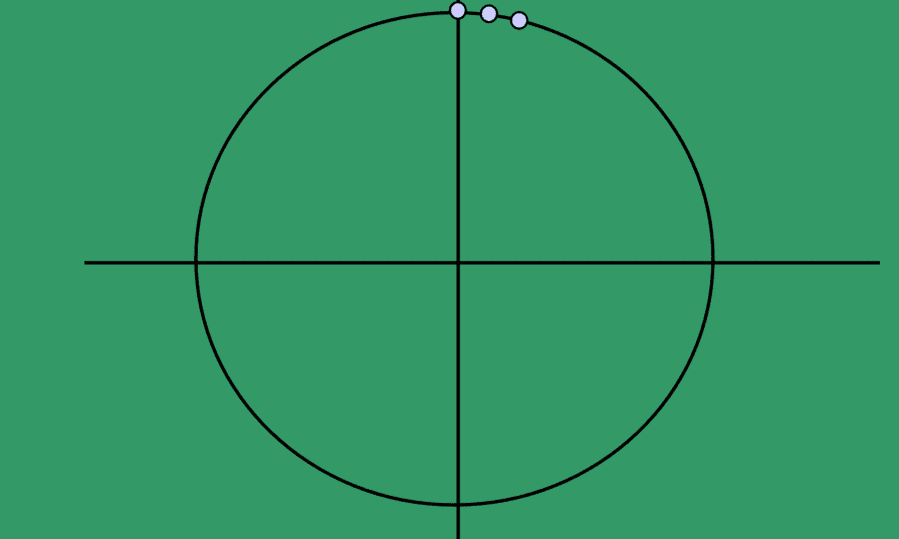
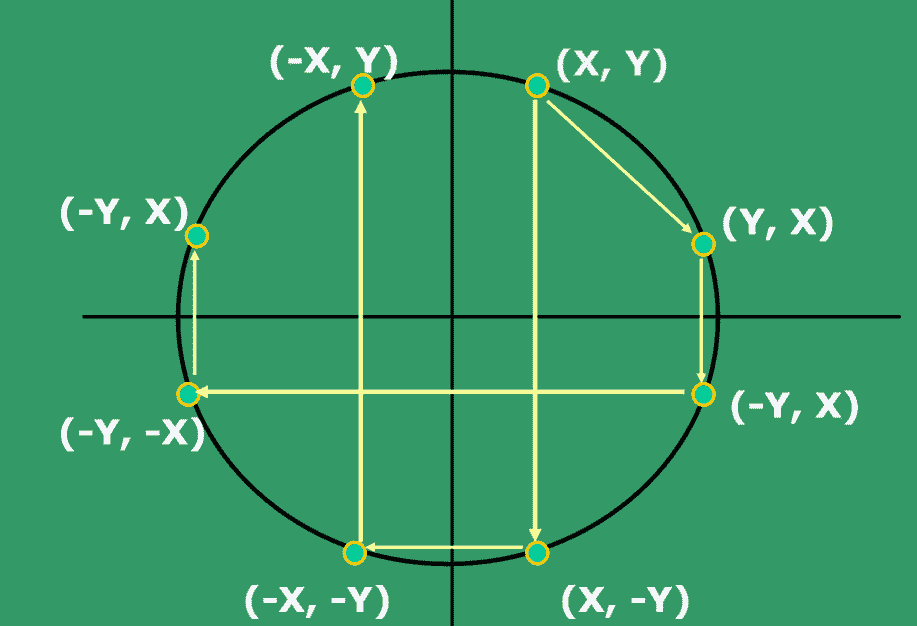
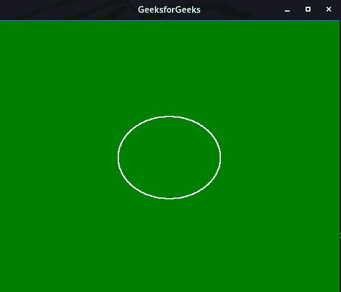
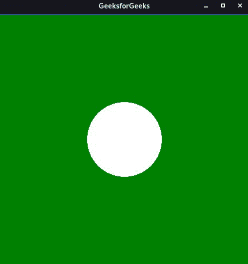

# 用极坐标方程和布雷森汉方程

画圆

> 原文:[https://www . geesforgeks . org/draw-circle-use-polar-equation-and-bresenhams-equation/](https://www.geeksforgeeks.org/draw-circle-using-polar-equation-and-bresenhams-equation/)

在本文中，我们将讨论[如何使用 Bresenham 方程和 Polar 方程绘制圆](https://www.geeksforgeeks.org/draw-circle-c-graphics/)。

### <u>画圆算法</u>

在电脑屏幕上显示连续平滑的弧线并不容易，因为我们的电脑屏幕是由以矩阵形式组织的像素组成的。因此，要在电脑屏幕上画一个圆，它应该总是从打印的像素中选择最近的像素，这样它们就可以形成一个弧 。

[](https://media.geeksforgeeks.org/wp-content/uploads/20201027004800/cirlce.png)

*   考虑以具有整数半径的原点为中心的圆。
*   可以应用翻译来获得非原点中心的圆。
*   圆的方程由下式给出:

> x<sup>2</sup>+y<sup>2</sup>= R<sup>2</sup>T6】y =+/-sqrt(R2-x2)

*   给定的方程可以写成:

> F(x，y)= x2+ y2-R2=0
> 5。

*   对称性的使用:只需要计算一个八分点。你可以在其他 7 个八度空间得到分数，如下所示:
    *   绘图点（x， y）
    *   绘图点（y， x）
    *   绘图点（x， -y）
    *   绘图点（-y， x）
    *   绘图点（-x， -y）
    *   绘图点（-y， -x）
    *   绘图点（-x， y）
    *   绘图点（-y， x）

### <u>用布雷森汉方程画圆</u>

Bresenham 方程利用了的关键特征一个高度对称的圆。所以，对于整 360 度圆，将其分成 8 个部分，每个部分为 45 度。为了说明，的思路是使用 [**布雷森汉姆圆算法**](https://www.geeksforgeeks.org/bresenhams-circle-drawing-algorithm/) 进行计算像素在第一个 45 度八分点的位置。它假设圆以原点为中心。所以对于每个像素 **(x，y)** 在圆的 8 个八分之一处各画一个像素，如下所示:



在 Bresenham 的算法中，在任意点 **(x，y)** 我们有两个选择，要么选择东部的下一个像素，即 **(x + 1，y)** ，要么选择东南部的像素，即 **(x + 1，y–1)**。这可以通过使用决策**参数 d** 作为来决定

*   如果 **d > 0** ，那么 **(x + 1，y–1)**将被选择为下一个像素，因为它将更接近圆弧。
*   否则选择 **(x + 1，y)** 作为下一个像素。

下面是布雷森汉方程的算法:

*   F(x，y) = x <sup>2</sup> + y <sup>2</sup> = 0 点位于圆上。
*   F(x，y) > 0 点位于圆外。
*   F(x，y) < 0 点位于圆内。
*   如果 d >= 0，那么将 x 更新为(x + 1)和 y =(y–1)，这给出了新的 d
*   如果 d < 0，那么将 x 更新为(x + 1)，给出 d 的新值

## C

```
// C program for the above approach
#include <GL/gl.h>
#include <GL/glut.h>
#include <math.h>
#include <stdio.h>

int xo, yo, r;

// Function to display the circle using
// the above algorithm
void Display(void)
{
    glClear(GL_COLOR_BUFFER_BIT);

    // Color of printing object
    glColor3f(1, 0, 0);

    // Giving the size of the point
    glPointSize(2);

    int x = 0;
    int y = r;
    float p = 5 / 4 - r;

    glColor3f(1, 0, 0);

    // Starting of drawing the circle
    glBegin(GL_POINTS);

    while (y > x) {
        if (p < 0) {

            // Increment x to x+1
            x++;
            p = p + 2 * x + 1;
        }
        else {

            // Increment x to x+1
            // and decrease y to y-1
            y--;
            x++;
            p = p + 2 * (x - y) + 1;
        }

        // Draw the coordinates
        glVertex2d(x + xo, y + yo);
        glVertex2d(-x + xo, y + yo);
        glVertex2d(x + xo, -y + yo);
        glVertex2d(-x + xo, -y + yo);
        glVertex2d(y + yo, x + xo);
        glVertex2d(-y + yo, x + xo);
        glVertex2d(y + yo, -x + xo);
        glVertex2d(-y + yo, -x + xo);
    }

    glEnd();

    // Its empties all the buffer
    // causing the issue
    glFlush();
}

// Driver Code
int main(int argc, char** argv)
{
    printf("X-coordinate Y-coordinate radius:");
    scanf("%d %d %d", &xo, &yo, &r);
    glutInit(&argc, argv);
    glutInitDisplayMode(GLUT_SINGLE | GLUT_RGB);

    // Assigning the size of window
    glutInitWindowSize(1000, 1000);

    // Assign the position of window
    // to be appeared
    glutInitWindowPosition(100, 100);

    // Defining the heading of the window
    glutCreateWindow("GeeksforGeeks");

    // Backgronnd Color
    glClearColor(1, 1, 1, 1);

    // limit of the coordinate points
    gluOrtho2D(-500, 500, -500, 500);

    // Calling the function
    glutDisplayFunc(Display);

    glutMainLoop();

    return 0;
}
```

**输出:**

[](https://media.geeksforgeeks.org/wp-content/uploads/20201027011016/Breshmen.JPG)

***时间复杂度:**O(N)*
T5**辅助空间:** O(1)

### <u>用极坐标方程画圆</u>

在极坐标方程系统中，想法是用一只手想一个时钟。移出一段距离 **r** ，有时称为 [模数](https://xaktly.com/MathPolarCoordinates.html#openModal0) ，沿着用将手从原点移开，然后将手向上(逆时针)旋转一个角度 **θ** 到达该点。下面是极坐标方程的算法:

1.  初始化变量 **rad，中心(x0，y0)** ，索引值或增量值 **i** ，使用极坐标 **θ_end = 100** 定义一个圆。
2.  如果 **θ_end < θ** ，则退出循环。
3.  求 **x** 的值为 **rad*cos(角度)**，求 **y** 的值为 **rad*sin(角度)**。
4.  画出对称找到的八个点，即当前 **(x，y)** 坐标的中心 **(x0，y0)** 。
    *   出图(x +轴，y + yo)
    *   出图(-x +轴，-y + yo)
    *   出图(y +轴、x + yo)
    *   出图(-y +轴，-x + yo)
    *   出图(-y+x+yo)
    *   出图(y +轴，-x + yo)
    *   出图(-x +轴，y + yo)
    *   出图(x +轴，-y + yo)
5.  将角度增加 **i*2*(M_PI/100)** 。

下面是实现上述方法的程序:

## C

```
// C program to demonstrate circle
// drawing using polar equation
#include <GL/glut.h>
#include <math.h>
#include <stdio.h>
#include <stdlib.h>
float xo, yo, rad;

// Function to display the circle
void display()
{
    glClear(GL_COLOR_BUFFER_BIT);

    // Color of printing object
    glColor3f(1, 1, 1);

    float angle;

    // Start to drawing the circle
    glBegin(GL_POLYGON);

    for (int i = 0; i < 100; i++) {

        // Change the angle
        angle = i * 2 * (M_PI / 100);
        glVertex2f(xo + (cos(angle) * rad),
                   yo + (sin(angle) * rad));
    }

    glEnd();

    // Its empties all the buffer
    // causing the issue
    glFlush();
}

// Driver Code
int main(int argc, char** argv)
{
    glutInit(&argc, argv);
    printf("Enter x y radius ");
    scanf("%f %f %f", &xo, &yo, &rad);

    glutInitDisplayMode(GLUT_SINGLE | GLUT_RGB);

    // Assigning the size of window
    glutInitWindowSize(500, 500);

    // Assign the position of window
    // to be appeared
    glutInitWindowPosition(200, 200);

    // Defining the heading of the window
    glutCreateWindow("GeeksforGeeks");

    // Backgronnd Color
    glClearColor(0, 1, 0, 1);

    // limit of the coordinate points
    gluOrtho2D(-500, 500, -500, 500);

    // Calling the function
    glutDisplayFunc(Display);

    glutMainLoop();

    return 0;
}
```

**输出:**

[](https://media.geeksforgeeks.org/wp-content/uploads/20201027011017/circlepolar.JPG)

***时间复杂度:**O(N)*
T5**辅助空间:** O(1)