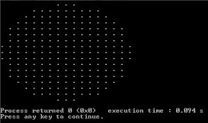

# 画一个没有浮点运算的圆

> 原文:[https://www . geesforgeks . org/draw-circle-不带浮点-算术-未发布/](https://www.geeksforgeeks.org/draw-circle-without-floating-point-arithmetic-unpublished/)

给定一个圆的半径，不使用浮点运算绘制圆。
下面的程序使用了一个简单的概念。设圆的半径为 r，考虑一个大小为(2r+1)*(2r+1)的正方形围绕要画的圆。现在走过广场内的每一个点。对于每个点(x，y)，如果(x，y)位于圆(或 x^2+ y^2 < r^2)内，则打印它，否则打印空间。

## C++

```
// C++ program to draw a circle without
// floating point arithmetic
#include <stdio.h>

void drawCircle(int r)
{
    // Consider a rectangle of size N*N
    int N = 2*r+1;

    int x, y;  // Coordinates inside the rectangle

    // Draw a square of size N*N.
    for (int i = 0; i < N; i++)
    {
        for (int j = 0; j < N; j++)
        {
            // Start from the left most corner point
            x = i-r;
            y = j-r;

            // If this point is inside the circle, print it
            if (x*x + y*y <= r*r+1 )
                printf(".");
            else // If outside the circle, print space
                printf(" ");
            printf(" ");
        }
        printf("\n");
    }
}

// Driver Program to test above function
int  main()
{
    drawCircle(8);
    return 0;
}
```

## Java 语言(一种计算机语言，尤用于创建网站)

```
// Java program to draw a circle without
// floating point arithmetic

import java.io.*;

class GFG {
static void drawCircle(int r)
{
    // Consider a rectangle of size N*N
    int N = (2*r+1);

    int x, y; // Coordinates inside the rectangle

    // Draw a square of size N*N.
    for (int i = 0; i < N; i++)
    {
        for (int j = 0; j < N; j++)
        {
            // Start from the left most corner point
            x = i-r;
            y = j-r;

            // If this point is inside the circle, print it
            if (x*x + y*y <= r*r+1 )
                    System.out.print(".");
            else // If outside the circle, print space
                    System.out.print(" ");
                System.out.print(" ");
        }
            System.out.println();
    }
}

// Driver Program to test above function
    public static void main (String[] args) {
        drawCircle(8);
    }
//This code is contributed by ajit.
}
```

## 蟒蛇 3

```
# Python3 program to draw a circle without
# floating point arithmetic
def drawCircle(r) :

    # Consider a rectangle of size N*N 
    N = 2*r + 1

    # Draw a square of size N*N. 
    for i in range(N) :    
        for j in range(N) :

            # Start from the left most corner point 
            x = i - r 
            y = j - r

            # If this point is inside the circle, print it 
            if (x * x + y * y <= r * r + 1 ) :
                print(".", end = "")
            else :# If outside the circle, print space 
                print(" ", end = "") 
            print(" ", end = "")

        print()

drawCircle(8)

# This code is contributed by divyeshrabadiya07.
```

## C#

```
// C#  program to draw a circle without
// floating point arithmetic

using System;

public class GFG{
    static void drawCircle(int r)
{
    // Consider a rectangle of size N*N
    int N = (2*r+1);

    int x, y; // Coordinates inside the rectangle

    // Draw a square of size N*N.
    for (int i = 0; i < N; i++)
    {
        for (int j = 0; j < N; j++)
        {
            // Start from the left most corner point
            x = i-r;
            y = j-r;

            // If this point is inside the circle, print it
            if (x*x + y*y <= r*r+1 )
                    Console.Write(".");
            else // If outside the circle, print space
                    Console.Write(" ");
                Console.Write(" ");
        }
            Console.WriteLine();
    }
}

// Driver Program to test above function
    static public void Main (){
        drawCircle(8);
    }
//This code is contributed by Sachin.
}
```

## 服务器端编程语言（Professional Hypertext Preprocessor 的缩写）

```
<?php
// PHP program to draw a circle without
// floating point arithmetic

function drawCircle($r)
{
    // Consider a rectangle
    // of size N*N
    $N = 2 * $r + 1;

    // Coordinates inside
    // the rectangle
    $x; $y;

    // Draw a square of size N*N.
    for ($i = 0; $i < $N; $i++)
    {
        for ($j = 0; $j < $N; $j++)
        {
            // Start from the left
            // most corner point
            $x = $i - $r;
            $y = $j - $r;

            // If this point is inside
            // the circle, print it
            if ($x * $x + $y * $y <= $r * $r + 1 )
                echo ".";

            // If outside the circle,
            // print space
            else
                echo " ";
            echo " ";
        }
        echo "\n";
    }
}

// Driver Code
drawCircle(8);

// This code is contributed by aj_36
?>
```

## java 描述语言

```
<script>
// javascript program to draw a circle without
// floating point arithmetic

    function drawCircle(r) {
        // Consider a rectangle of size N*N
        var N = (2 * r + 1);

        var x, y; // Coordinates inside the rectangle

        // Draw a square of size N*N.
        for (i = 0; i < N; i++)
        {
            for (j = 0; j < N; j++)
            {

                // Start from the left most corner point
                x = i - r;
                y = j - r;

                // If this point is inside the circle, prvar it
                if (x * x + y * y <= r * r + 1)
                    document.write(". ");
                else // If outside the circle, print space
                    document.write("  ");
                document.write("  ");
            }
            document.write("<br/>");
        }
    }

    // Driver Program to test above function
        drawCircle(8);

// This code is contributed by gauravrajput1
</script>
```

**输出:**



如果发现有不正确的地方，请写评论，或者想分享更多关于以上讨论话题的信息