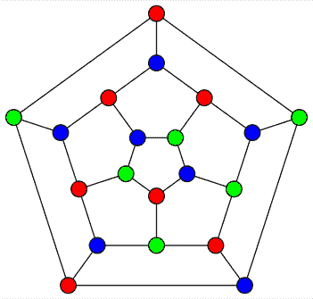

# 图着色的 DSatur 算法

> 原文:[https://www . geeksforgeeks . org/dsatur-图着色算法/](https://www.geeksforgeeks.org/dsatur-algorithm-for-graph-coloring/)

[图形着色](https://www.geeksforgeeks.org/graph-coloring-applications/)是为图形顶点分配颜色的任务，以便:

*   相邻顶点对被分配不同的颜色，并且
*   图表中使用的不同颜色的数量很少。

下图仅用三种颜色(红色、蓝色和绿色)进行了着色。这实际上是这个特定图形所需的最小颜色数，也就是说，我们不能使用少于三种颜色来给这个图形着色，同时确保相邻顶点的颜色不同。



图的适当三着色

给图形着色所需的最小颜色数 **G** 被称为**色数**，通常用 **χ(G)** 表示。确定图的色数是 [NP-hard](https://www.geeksforgeeks.org/difference-between-np-hard-and-np-complete-problem/) 。判定图 G 是否存在 **k** 着色的相应决策问题也是 [NP-complete](https://www.geeksforgeeks.org/np-completeness-set-1/) 。

[本网站类似帖子](https://www.geeksforgeeks.org/graph-coloring-set-2-greedy-algorithm/)已经描述了图着色的贪婪算法。该算法应用简单，但其解中使用的颜色数量在很大程度上取决于考虑顶点的顺序。在最好的情况下，正确的排序将产生使用 **χ(G)** 颜色的解决方案；然而，糟糕的排序会导致解决方案使用许多额外的颜色。

**DSatur 算法**(缩写自“**饱和度**”)具有与[贪婪算法](https://www.geeksforgeeks.org/greedy-algorithms/)相似的行为。区别在于它生成顶点排序的方式。具体来说，颜色的下一个顶点总是被选择为饱和度最高的未着色顶点。顶点的饱和度定义为当前分配给相邻顶点的不同颜色的数量。其他规则也被用来打破联系。

让 **G** 成为一个有 **n** 顶点和 **m** 边的图。另外，假设我们将使用颜色标签 **0，1，2，…，n-1** 。(解决方案中不需要超过 **n** 种颜色)。**数据分析算法**的操作如下

1.  设 **v** 为饱和度最大的 **G** 中的未着色顶点。在有联系的情况下，从这些顶点中选择在未着色顶点诱导的子图中度数最大的顶点。进一步的联系可以任意中断。
2.  将 **v** 分配给彩色 **i** ，其中 **i** 是集合 **{0，1，2，…，n}** 中当前未分配给 **v** 的任何邻居的最小整数。
3.  如果仍有未着色的顶点，请再次重复所有步骤，否则，在此步骤结束。

DSatur 算法类似于 Greedy 算法，因为一旦选择了一个顶点，它就被分配给最低的颜色标签，而不分配给它的任何邻居。因此，步骤 1 的动作提供了算法背后的主要力量，因为它们优先考虑被视为“**最受约束的**”的顶点，也就是说，当前具有最少可用颜色选项的顶点。因此，这些“更受约束”的顶点首先被处理，允许较不受约束的顶点稍后被着色。

**数据分析**

因为 DSatur 算法在执行过程中会生成顶点排序，所以它使用的颜色数量比贪婪算法更容易预测。它的解决方案比贪婪算法的颜色更少。该算法的一个特点是，如果一个图由多个组成部分组成，那么在考虑其他顶点之前，单个组成部分的所有顶点都将被着色。DSatur 对于包括二部图、圈图和轮图在内的几种图拓扑也是精确的。(使用这些图表，将始终产生使用 **χ(G)** 颜色的解决方案。)

DSatur 算法的整体复杂度为 **O(n <sup>2</sup> )** ，其中 **n** 是图中的顶点数。这可以通过执行 **n** 单独应用 **O(n)** 工艺来实现，该工艺:

*   根据 DSatur 的选择规则识别要着色的下一个顶点。
*   给这个顶点上色。

下面我们介绍 DSatur 的一个 C++实现，它在 **O((n + m) log n)** 时间内运行，其中 **m** 是图中的边数。除了最密集的图形，这比**0(n<sup>2</sup>)**要快得多。这个实现包括使用红-黑二叉树来存储所有尚未着色的顶点，以及它们的饱和度和它们在由未着色的顶点引起的子图中的度。红黑树是一种自平衡二叉树，与 C++标准模板库中的**集**容器一起使用。这允许在恒定时间内选择下一个要着色的顶点(根据 DSatur 的选择规则)。它还允许在对数时间内插入和移除项目。

## C++

```
// A C++ program to implement the DSatur algorithm for graph
// coloring

#include <iostream>
#include <set>
#include <tuple>
#include <vector>
using namespace std;

// Struct to store information
// on each uncoloured vertex
struct nodeInfo {
    int sat; // Saturation degree of the vertex
    int deg; // Degree in the uncoloured subgraph
    int vertex; // Index of vertex
};
struct maxSat {
    bool operator()(const nodeInfo& lhs,
                    const nodeInfo& rhs) const
    {
        // Compares two nodes by
        // saturation degree, then
        // degree in the subgraph,
        // then vertex label
        return tie(lhs.sat, lhs.deg, lhs.vertex)
               > tie(rhs.sat, rhs.deg, rhs.vertex);
    }
};

// Class representing
// an undirected graph
class Graph {

    // Number of vertices
    int n;

    // Number of vertices
    vector<vector<int> > adj;

public:
    // Constructor and destructor
    Graph(int numNodes)
    {
        n = numNodes;
        adj.resize(n, vector<int>());
    }
    ~Graph() { adj.clear(); }

    // Function to add an edge to graph
    void addEdge(int u, int v);

    // Colour the graph
    // using the DSatur algorithm
    void DSatur();
};

void Graph::addEdge(int u, int v)
{
    adj[u].push_back(v);
    adj[v].push_back(u);
}

// Assigns colors (starting from 0)
// to all vertices and
// prints the assignment of colors
void Graph::DSatur()
{
    int u, i;
    vector<bool> used(n, false);
    vector<int> c(n), d(n);
    vector<set<int> > adjCols(n);
    set<nodeInfo, maxSat> Q;
    set<nodeInfo, maxSat>::iterator maxPtr;

    // Initialise the data structures.
    // These are a (binary
    // tree) priority queue, a set
    // of colours adjacent to
    // each uncoloured vertex
    // (initially empty) and the
    // degree d(v) of each uncoloured
    // vertex in the graph
    // induced by uncoloured vertices
    for (u = 0; u < n; u++) {
        c[u] = -1;
        d[u] = adj[u].size();
        adjCols[u] = set<int>();
        Q.emplace(nodeInfo{ 0, d[u], u });
    }

    while (!Q.empty()) {

        // Choose the vertex u
        // with highest saturation
        // degree, breaking ties with d.
        // Remove u from the priority queue
        maxPtr = Q.begin();
        u = (*maxPtr).vertex;
        Q.erase(maxPtr);

        // Identify the lowest feasible
        // colour i for vertex u
        for (int v : adj[u])
            if (c[v] != -1)
                used] = true;
        for (i = 0; i < used.size(); i++)
            if (used[i] == false)
                break;
        for (int v : adj[u])
            if (c[v] != -1)
                used] = false;

        // Assign vertex u to colour i
        c[u] = i;

        // Update the saturation degrees and
        // degrees of all uncoloured neighbours;
        // hence modify their corresponding
        // elements in the priority queue
        for (int v : adj[u]) {
            if (c[v] == -1) {
                Q.erase(
                    { int(adjCols[v].size()),
                      d[v], v });
                adjCols[v].insert(i);
                d[v]--;
                Q.emplace(nodeInfo{
                    int(adjCols[v].size()),
                    d[v], v });
            }
        }
    }

    // The full graph has been coloured.
    // Print the result
    for (u = 0; u < n; u++)
        cout << "Vertex " << u
             << " --->  Color " << c[u]
             << endl;
}

// Driver Code
int main()
{
    Graph G1(5);
    G1.addEdge(0, 1);
    G1.addEdge(0, 2);
    G1.addEdge(1, 2);
    G1.addEdge(1, 3);
    G1.addEdge(2, 3);
    G1.addEdge(3, 4);
    cout << "Coloring of graph G1 \n";
    G1.DSatur();

    Graph G2(5);
    G2.addEdge(0, 1);
    G2.addEdge(0, 2);
    G2.addEdge(1, 2);
    G2.addEdge(1, 4);
    G2.addEdge(2, 4);
    G2.addEdge(4, 3);
    cout << "\nColoring of graph G2 \n";
    G2.DSatur();

    return 0;
}
```

**Output**

```
Coloring of graph G1 
Vertex 0 --->  Color 0
Vertex 1 --->  Color 2
Vertex 2 --->  Color 1
Vertex 3 --->  Color 0
Vertex 4 --->  Color 1

Coloring of graph G2 
Vertex 0 --->  Color 0
Vertex 1 --->  Color 2
Vertex 2 --->  Color 1
Vertex 3 --->  Color 1
Vertex 4 --->  Color 0
```

这个实现的第一部分涉及初始化数据结构。这包括遍历每个顶点并填充红黑树。这需要 **O(n log n)** 时间。在算法的主要部分，红黑树允许选择下一个顶点 **u** 在恒定时间内进行着色。一旦 **u** 被着色，对应于 **u** 的未着色邻居的项目需要在红黑树中更新。对每个顶点这样做导致总运行时间为 **O(m log n)** 。因此，总运行时间为**O((n log n)+(m log n))**=**O((n+m)log n)**。

关于该算法和其他图形着色算法的更多信息，可在《图形着色指南:算法和应用》 (2021)一书中找到