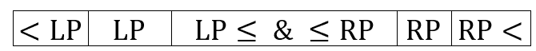
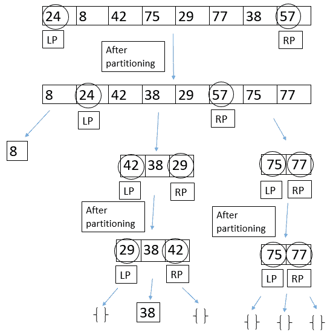

# 双枢轴快速排序

> 原文:[https://www.geeksforgeeks.org/dual-pivot-quicksort/](https://www.geeksforgeeks.org/dual-pivot-quicksort/)

我们知道，单枢轴[快速排序](https://www.geeksforgeeks.org/quick-sort/)从数组的一端取一个枢轴，对数组进行分区，这样所有在枢轴左边的元素都小于或等于枢轴，所有在枢轴右边的元素都大于枢轴。
双枢轴快速排序的思想是取两个枢轴，一个在数组的左端，第二个在数组的右端。左轴必须小于或等于右轴，所以我们在必要时交换它们。
然后，我们开始将数组划分为三部分:在第一部分中，所有元素都将小于左轴，在第二部分中，所有元素都将大于或等于左轴，也将小于或等于右轴，在第三部分中，所有元素都将大于右轴。然后，我们将两个枢轴移动到它们适当的位置，如下栏所示，然后我们开始递归地快速分类这三个部分，使用这个方法。



双枢轴快速排序比最初的单枢轴快速排序快一点。但是，当数组已经按照递增或递减的顺序排序时，最坏的情况仍然是 O(n^2)。
一个例子:



## C++

```
// C++ program to implement dual pivot QuickSort
#include <iostream>
using namespace std;

int partition(int* arr, int low, int high, int* lp);

void swap(int* a, int* b)
{
    int temp = *a;
    *a = *b;
    *b = temp;
}

void DualPivotQuickSort(int* arr, int low, int high)
{
    if (low < high) {
        // lp means left pivot, and rp means right pivot.
        int lp, rp;
        rp = partition(arr, low, high, &lp);
        DualPivotQuickSort(arr, low, lp - 1);
        DualPivotQuickSort(arr, lp + 1, rp - 1);
        DualPivotQuickSort(arr, rp + 1, high);
    }
}

int partition(int* arr, int low, int high, int* lp)
{
    if (arr[low] > arr[high])
        swap(&arr[low], &arr[high]);

    // p is the left pivot, and q is the right pivot.
    int j = low + 1;
    int g = high - 1, k = low + 1, p = arr[low], q = arr[high];
    while (k <= g) {

        // if elements are less than the left pivot
        if (arr[k] < p) {
            swap(&arr[k], &arr[j]);
            j++;
        }

        // if elements are greater than or equal
        // to the right pivot
        else if (arr[k] >= q) {
            while (arr[g] > q && k < g)
                g--;
            swap(&arr[k], &arr[g]);
            g--;
            if (arr[k] < p) {
                swap(&arr[k], &arr[j]);
                j++;
            }
        }
        k++;
    }
    j--;
    g++;

    // bring pivots to their appropriate positions.
    swap(&arr[low], &arr[j]);
    swap(&arr[high], &arr[g]);

    // returning the indices of the pivots.
    *lp = j; // because we cannot return two elements
    // from a function.

    return g;
}

// Driver code
int main()
{
    int arr[] = { 24, 8, 42, 75, 29, 77, 38, 57 };
    DualPivotQuickSort(arr, 0, 7);
    cout << "Sorted array: ";
    for (int i = 0; i < 8; i++)
        cout << arr[i] << " ";
    cout << endl;
}

// This code is contributed by SHUBHAMSINGH10
```

## C

```
// C program to implement dual pivot QuickSort
#include <stdio.h>

int partition(int* arr, int low, int high, int* lp);

void swap(int* a, int* b)
{
    int temp = *a;
    *a = *b;
    *b = temp;
}

void DualPivotQuickSort(int* arr, int low, int high)
{
    if (low < high) {
        // lp means left pivot, and rp means right pivot.
        int lp, rp;
        rp = partition(arr, low, high, &lp);
        DualPivotQuickSort(arr, low, lp - 1);
        DualPivotQuickSort(arr, lp + 1, rp - 1);
        DualPivotQuickSort(arr, rp + 1, high);
    }
}

int partition(int* arr, int low, int high, int* lp)
{
    if (arr[low] > arr[high])
        swap(&arr[low], &arr[high]);
    // p is the left pivot, and q is the right pivot.
    int j = low + 1;
    int g = high - 1, k = low + 1, p = arr[low], q = arr[high];
    while (k <= g) {

        // if elements are less than the left pivot
        if (arr[k] < p) {
            swap(&arr[k], &arr[j]);
            j++;
        }

        // if elements are greater than or equal
        // to the right pivot
        else if (arr[k] >= q) {
            while (arr[g] > q && k < g)
                g--;
            swap(&arr[k], &arr[g]);
            g--;
            if (arr[k] < p) {
                swap(&arr[k], &arr[j]);
                j++;
            }
        }
        k++;
    }
    j--;
    g++;

    // bring pivots to their appropriate positions.
    swap(&arr[low], &arr[j]);
    swap(&arr[high], &arr[g]);

    // returning the indices of the pivots.
    *lp = j; // because we cannot return two elements
    // from a function.

    return g;
}

// Driver code
int main()
{
    int arr[] = { 24, 8, 42, 75, 29, 77, 38, 57 };
    DualPivotQuickSort(arr, 0, 7);
    printf("Sorted array: ");
    for (int i = 0; i < 8; i++)
        printf("%d ", arr[i]);
    printf("\n");
    return 0;
}
```

## Java 语言(一种计算机语言，尤用于创建网站)

```
// Java program to implement
// dual pivot QuickSort
class GFG{

static void swap(int[] arr, int i, int j)
{
    int temp = arr[i];
    arr[i] = arr[j];
    arr[j] = temp;
}

static void dualPivotQuickSort(int[] arr, 
                               int low, int high)
{
    if (low < high)
    {

        // piv[] stores left pivot and right pivot.
        // piv[0] means left pivot and
        // piv[1] means right pivot
        int[] piv;
        piv = partition(arr, low, high);

        dualPivotQuickSort(arr, low, piv[0] - 1);
        dualPivotQuickSort(arr, piv[0] + 1, piv[1] - 1);
        dualPivotQuickSort(arr, piv[1] + 1, high);
    }
}

static int[] partition(int[] arr, int low, int high)
{
    if (arr[low] > arr[high])
        swap(arr, low, high);

    // p is the left pivot, and q 
    // is the right pivot.
    int j = low + 1;
    int g = high - 1, k = low + 1,
        p = arr[low], q = arr[high];

    while (k <= g) 
    {

        // If elements are less than the left pivot
        if (arr[k] < p)
        {
            swap(arr, k, j);
            j++;
        }

        // If elements are greater than or equal
        // to the right pivot
        else if (arr[k] >= q) 
        {
            while (arr[g] > q && k < g)
                g--;

            swap(arr, k, g);
            g--;

            if (arr[k] < p)
            {
                swap(arr, k, j);
                j++;
            }
        }
        k++;
    }
    j--;
    g++;

    // Bring pivots to their appropriate positions.
    swap(arr, low, j);
    swap(arr, high, g);

    // Returning the indices of the pivots
    // because we cannot return two elements
    // from a function, we do that using an array.
    return new int[] { j, g };
}

// Driver code
public static void main(String[] args)
{
    int[] arr = { 24, 8, 42, 75, 29, 77, 38, 57 };

    dualPivotQuickSort(arr, 0, 7);

    System.out.print("Sorted array: ");
    for (int i = 0; i < 8; i++)
        System.out.print(arr[i] + " ");

    System.out.println();
}
}

// This code is contributed by Gourish Sadhu
```

## 蟒蛇 3

```
# Python3 program to implement 
# dual pivot QuickSort
def dualPivotQuickSort(arr, low, high):

    if low < high:

        # lp means left pivot and rp 
        # means right pivot
        lp, rp = partition(arr, low, high)

        dualPivotQuickSort(arr, low, lp - 1)
        dualPivotQuickSort(arr, lp + 1, rp - 1)
        dualPivotQuickSort(arr, rp + 1, high)

def partition(arr, low, high):

    if arr[low] > arr[high]:
        arr[low], arr[high] = arr[high], arr[low]

    # p is the left pivot, and q is the right pivot.
    j = k = low + 1
    g, p, q = high - 1, arr[low], arr[high]

    while k <= g:

        # If elements are less than the left pivot
        if arr[k] < p:
            arr[k], arr[j] = arr[j], arr[k]
            j += 1

        # If elements are greater than or equal 
        # to the right pivot
        elif arr[k] >= q:
            while arr[g] > q and k < g:
                g -= 1

            arr[k], arr[g] = arr[g], arr[k]
            g -= 1

            if arr[k] < p:
                arr[k], arr[j] = arr[j], arr[k]
                j += 1

        k += 1

    j -= 1
    g += 1

    # Bring pivots to their appropriate positions.
    arr[low], arr[j] = arr[j], arr[low]
    arr[high], arr[g] = arr[g], arr[high]

    # Returning the indices of the pivots
    return j, g

# Driver code
arr = [ 24, 8, 42, 75, 29, 77, 38, 57 ]
dualPivotQuickSort(arr, 0, 7)

print('Sorted array: ', end = '')
for i in arr:
    print(i, end = ' ')

print()

# This code is contributed by Gourish Sadhu
```

**输出:**

```
Sorted array: 8 24 29 38 42 57 75 77 

```

本文由 [**什洛米·埃尔海亚尼**](https://www.facebook.com/shlomi.elhaiani) 供稿。如果你喜欢 GeeksforGeeks 并想投稿，你也可以使用[write.geeksforgeeks.org](https://write.geeksforgeeks.org)写一篇文章或者把你的文章邮寄到 review-team@geeksforgeeks.org。看到你的文章出现在极客博客主页上，帮助其他极客。
如果发现有不正确的地方，或者想分享更多关于上述话题的信息，请写评论。