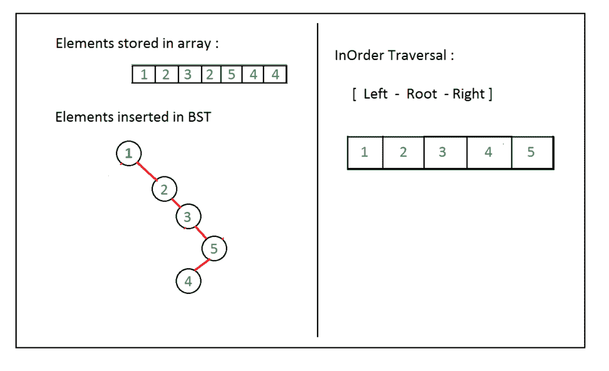

# 使用 BST 在数组中删除重复项

> 原文:[https://www . geesforgeks . org/duplicates-remove-in-array-using-BST/](https://www.geeksforgeeks.org/duplicates-removal-in-array-using-bst/)

给定整数数组 arr[]，任务是从给定数组中移除重复项。

**示例**:

```
Input: arr[] = {1, 2, 3, 2, 5, 4, 4}
Output: arr[] = {1, 2, 3, 4, 5} 

Input: arr[] = {127, 234, 127, 654, 355, 789, 355, 355, 999, 654}
Output: arr[] = {127, 234, 355, 654, 789, 999}
```

可以使用[二叉查找树](https://www.geeksforgeeks.org/binary-search-tree-set-1-search-and-insertion/)删除数组中的重复项。其思想是使用数组元素创建一个二叉查找树，条件是第一个元素作为根(父)元素，当元素“小于”出现时，它成为根的左子元素，“大于”元素成为根的右子元素。因为不存在“相等”的条件，所以当我们从数组元素中形成二叉查找树时，重复项会被自动移除。

> 对于数组，arr[] = {1，2，3，2，5，4，4}
> BST 将为:
> 
> 

**进场:**

*   使用数组元素形成 BST
*   使用任意[树遍历](https://www.geeksforgeeks.org/tree-traversals-inorder-preorder-and-postorder/)方法显示元素。

下面是上述方法的实现。

## C++

```
// C++ Program of above implementation
#include <iostream>
using namespace std;

// Struct declaration
struct Node {
    int data;
    struct Node* left;
    struct Node* right;
};

// Node creation
struct Node* newNode(int data)
{
    struct Node* nn
        = new Node;
    nn->data = data;
    nn->left = NULL;
    nn->right = NULL;
    return nn;
}

// Function to insert data in BST
struct Node* insert(struct Node* root, int data)
{
    if (root == NULL)
        return newNode(data);
    else {
        if (data < root->data)
            root->left = insert(root->left, data);
        if (data > root->data)
            root->right = insert(root->right, data);
        return root;
    }
}

// InOrder function to display value of array
// in sorted order
void inOrder(struct Node* root)
{
    if (root == NULL)
        return;
    else {
        inOrder(root->left);
        cout << root->data << " ";
        inOrder(root->right);
    }
}

// Driver code
int main()
{
    int arr[] = { 1, 2, 3, 2, 5, 4, 4 };

    // Finding size of array arr[]
    int n = sizeof(arr) / sizeof(arr[0]);

    struct Node* root = NULL;

    for (int i = 0; i < n; i++) {

        // Insert element of arr[] in BST
        root = insert(root, arr[i]);
    }

    // Inorder Traversal to print nodes of Tree
    inOrder(root);
    return 0;
}

// This code is contributed by shivanisingh
```

## C

```
// C Program of above implementation
#include <stdio.h>
#include <stdlib.h>

// Struct declaration
struct Node {
    int data;
    struct Node* left;
    struct Node* right;
};

// Node creation
struct Node* newNode(int data)
{
    struct Node* nn
        = (struct Node*)(malloc(sizeof(struct Node)));
    nn->data = data;
    nn->left = NULL;
    nn->right = NULL;
    return nn;
}

// Function to insert data in BST
struct Node* insert(struct Node* root, int data)
{
    if (root == NULL)
        return newNode(data);
    else {
        if (data < root->data)
            root->left = insert(root->left, data);
        if (data > root->data)
            root->right = insert(root->right, data);
        return root;
    }
}

// InOrder function to display value of array
// in sorted order
void inOrder(struct Node* root)
{
    if (root == NULL)
        return;
    else {
        inOrder(root->left);
        printf("%d ", root->data);
        inOrder(root->right);
    }
}

// Driver code
int main()
{
    int arr[] = { 1, 2, 3, 2, 5, 4, 4 };

    // Finding size of array arr[]
    int n = sizeof(arr) / sizeof(arr[0]);

    struct Node* root = NULL;

    for (int i = 0; i < n; i++) {

        // Insert element of arr[] in BST
        root = insert(root, arr[i]);
    }

    // Inorder Traversal to print nodes of Tree
    inOrder(root);
    return 0;
}
```

## Java 语言(一种计算机语言，尤用于创建网站)

```
// Java implementation of the approach
import java.util.Scanner;

// Node declaration
class Node
{
    int data;
    public Node left;
    public Node right;
    Node(int data)
    {
        this.data = data;
        left = right = null;
    }
}

class GFG
{

    // Function to insert data in BST
    public static Node insert(Node root, int data)
    {
        if (root == null)
            return new Node(data);
        if (data < root.data)
            root.left = insert(root.left, data);
        if (data > root.data)
            root.right = insert(root.right, data);
        return root;
    }

    // InOrder function to display value of array
    // in sorted order
    public static void inOrder(Node root)
    {
        if (root == null)
            return;
        inOrder(root.left);
        System.out.print(root.data+" ");
        inOrder(root.right);
    }

    // Driver Code
    public static void main(String []args){
        int arr[] = { 1, 2, 3, 2, 5, 4, 4 };

        // Finding size of array arr[]
        int n = arr.length;

        Node root = null;
        for (int i = 0; i < n; i++)
        {
            // Insert element of arr[] in BST
            root = insert(root,arr[i]);
        }

        // Inorder Traversal to print nodes of Tree
        inOrder(root);
    }
}

// This code is contributed by anishma
```

## 蟒蛇 3

```
# Python3 implementation of the approach

# Binary tree node consists of data, a
# pointer to the left child and a
# pointer to the right child
class newNode :
    def __init__(self,data) :
        self.data = data;
        self.left = None;
        self.right = None;

# Function to insert data in BST
def insert(root, data) :

    if (root == None) :
        return newNode(data);

    else :
        if (data < root.data) :
            root.left = insert(root.left, data);

        if (data > root.data) :
            root.right = insert(root.right, data);

        return root;

# InOrder function to display value of array
# in sorted order
def inOrder(root) :

    if (root == None) :
        return;

    else :
        inOrder(root.left);
        print(root.data, end = " ");
        inOrder(root.right);

# Driver code
if __name__ == "__main__" :

    arr = [ 1, 2, 3, 2, 5, 4, 4 ];

    # Finding size of array arr[]
    n = len(arr);

    root = None;

    for i in range(n) :

        # Insert element of arr[] in BST
        root = insert(root, arr[i]);

    # Inorder Traversal to print nodes of Tree
    inOrder(root);

# This code is contributed by AnkitRai01
```

## C#

```
// C# program of above implementation
using System;

// Node declaration 
public class Node 
{ 
    public int data; 
    public Node left; 
    public Node right;

    public Node(int data)
    {
        this.data = data;
        left = right = null;
    }
}

class GFG{

// Function to insert data in BST 
public static Node insert(Node root, int data)
{
    if (root == null)
        return new Node(data);
    if (data < root.data) 
        root.left = insert(root.left, data); 
    if (data > root.data)
        root.right = insert(root.right, data);

    return root; 
} 

// InOrder function to display value of array 
// in sorted order 
public static void inOrder(Node root)
{ 
    if (root == null) 
        return; 

    inOrder(root.left); 
    Console.Write(root.data + " ");
    inOrder(root.right); 
}

// Driver Code   
static void Main()
{
    int[] arr = { 1, 2, 3, 2, 5, 4, 4 }; 

    // Finding size of array arr[] 
    int n = arr.Length; 

    Node root = null; 
    for(int i = 0; i < n; i++) 
    { 

        // Insert element of arr[] in BST
        root = insert(root, arr[i]);
    } 

    // Inorder Traversal to print nodes of Tree 
    inOrder(root);
}
}

// This code is contributed by divyeshrabadiya07
```

## java 描述语言

```
<script>

// JavaScript program of above implementation

// Node declaration 
class Node 
{ 
    constructor(data)
    {
        this.data = data;
        this.left = null;
        this.right = null;
    }
}

// Function to insert data in BST 
function insert(root, data)
{
    if (root == null)
        return new Node(data);
    if (data < root.data) 
        root.left = insert(root.left, data); 
    if (data > root.data)
        root.right = insert(root.right, data);

    return root; 
} 

// InOrder function to display value of array 
// in sorted order 
function inOrder(root)
{ 
    if (root == null) 
        return; 

    inOrder(root.left); 
    document.write(root.data + " ");
    inOrder(root.right); 
}

// Driver Code   
var arr = [1, 2, 3, 2, 5, 4, 4 ]; 

// Finding size of array arr[] 
var n = arr.length; 

var root = null; 
for(var i = 0; i < n; i++) 
{ 

    // Insert element of arr[] in BST
    root = insert(root, arr[i]);
} 

// Inorder Traversal to print nodes of Tree 
inOrder(root);

</script>
```

**Output:** 

```
1 2 3 4 5
```

**时间复杂度:** 在最坏的情况下(当数组排序时)其中 N 是给定数组的大小。
**辅助空间** : O(N)。