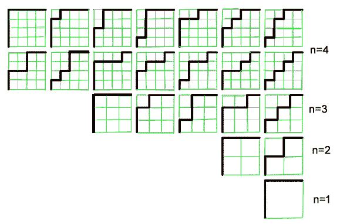
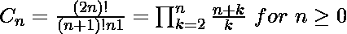

# Dyck 路径

> 原文:[https://www.geeksforgeeks.org/dyck-path/](https://www.geeksforgeeks.org/dyck-path/)

考虑左上角索引为(0，0)的 n×n 网格。Dyck path 是从左下方，即(n-1，0)到右上方，即(0，n-1)的楼梯行走，位于对角线单元格(或从左下方到右上方的一行单元格)上方。
任务是统计从(n-1，0)到(0，n-1)的 Dyck 路径数。
**举例:**

```
Input : n = 1
Output : 1

Input : n = 2
Output : 2

Input : n = 3
Output : 5

Input : n = 4
Output : 14
```



从(n-1，0)到(0，n-1)的 Dyck 路径的数量可以由[加泰罗尼亚数字](https://www.geeksforgeeks.org/program-nth-catalan-number/) C(n)给出。


## [我们强烈建议您点击此处进行练习，然后再进入解决方案。](https://practice.geeksforgeeks.org/problems/dyck-path1028/1)

下面是查找 Dyck 路径(或第 n 个加泰罗尼亚数字)计数的实现。

## C++

```
// C++ program to count
// number of Dyck Paths
#include<iostream>
using namespace std;

// Returns count Dyck
// paths in n x n grid
int countDyckPaths(unsigned int n)
{
    // Compute value of 2nCn
    int res = 1;
    for (int i = 0; i < n; ++i)
    {
        res *= (2 * n - i);
        res /= (i + 1);
    }

    // return 2nCn/(n+1)
    return res / (n+1);
}

// Driver Code
int main()
{
    int n = 4;
    cout << "Number of Dyck Paths is "
         << countDyckPaths(n);
    return 0;
}
```

## Java 语言(一种计算机语言，尤用于创建网站)

```
// Java program to count
// number of Dyck Paths
class GFG
{
    // Returns count Dyck
    // paths in n x n grid
    public static int countDyckPaths(int n)
    {
        // Compute value of 2nCn
        int res = 1;
        for (int i = 0; i < n; ++i)
        {
            res *= (2 * n - i);
            res /= (i + 1);
        }

        // return 2nCn/(n+1)
        return res / (n + 1);
    }

    // Driver code
    public static void main(String args[])
    {
        int n = 4;
        System.out.println("Number of Dyck Paths is " +
                                    countDyckPaths(n));
    }
}
```

## 蟒蛇 3

```
# Python3 program to count
# number of Dyck Paths

# Returns count Dyck
# paths in n x n grid
def countDyckPaths(n):

    # Compute value of 2nCn
    res = 1
    for i in range(0, n):
        res *= (2 * n - i)
        res /= (i + 1)

    # return 2nCn/(n+1)
    return res / (n+1)

# Driver Code
n = 4
print("Number of Dyck Paths is ",
    str(int(countDyckPaths(n))))

# This code is contributed by
# Prasad Kshirsagar
```

## C#

```
// C# program to count
// number of Dyck Paths
using System;

class GFG {

    // Returns count Dyck
    // paths in n x n grid
    static int countDyckPaths(int n)
    {

        // Compute value of 2nCn
        int res = 1;
        for (int i = 0; i < n; ++i)
        {
            res *= (2 * n - i);
            res /= (i + 1);
        }

        // return 2nCn/(n+1)
        return res / (n + 1);
    }

    // Driver code
    public static void Main()
    {
        int n = 4;
        Console.WriteLine("Number of "
                  + "Dyck Paths is " +
                   countDyckPaths(n));
    }
}

// This code is contributed by anuj_67.
```

## 服务器端编程语言（Professional Hypertext Preprocessor 的缩写）

```
<?php
// PHP program to count
// number of Dyck Paths

// Returns count Dyck
// paths in n x n grid
function countDyckPaths( $n)
{
    // Compute value of 2nCn
    $res = 1;
    for ( $i = 0; $i < $n; ++$i)
    {
        $res *= (2 * $n - $i);
        $res /= ($i + 1);
    }

    // return 2nCn/(n+1)
    return $res / ($n + 1);
}

// Driver Code
$n = 4;
echo "Number of Dyck Paths is " ,
              countDyckPaths($n);

// This code is contributed by anuj_67.
?>
```

## java 描述语言

```
<script>

// JavaScript program to count
// number of Dyck Paths

    // Returns count Dyck
    // paths in n x n grid
    function countDyckPaths(n)
    {

        // Compute value of 2nCn
        let res = 1;
        for (let i = 0; i < n; ++i)
        {
            res *= (2 * n - i);
            res /= (i + 1);
        }

        // return 2nCn/(n+1)
        return res / (n + 1);
    }

// Driver Code

        let n = 4;
        document.write("Number of Dyck Paths is " +
                                    countDyckPaths(n));

    // This code is contributed by target_2.
</script>
```

**输出:**

```
Number of Dyck Paths is 14
```

**锻炼:**T2】

1.  找出 1 和-1 的序列数，使每个序列遵循以下约束:
    a)序列的长度为 2n
    b)有相等数量的 1 和-1，即 n ^ 1，n -1s
    c)每个序列的前缀之和大于或等于 0。例如，1，-1，1，-1 和 1，1，-1，-1 有效，但-1，-1，1，1 无效。
2.  从(m-1，0)到(0，n-1)长度为 m + n 的路径数量，仅限于东台阶和北台阶。

本文由**阿迪亚查特吉**供稿。如果你喜欢极客博客并想投稿，你也可以写一篇文章并把你的文章邮寄到 review-team@geeksforgeeks.org。看到你的文章出现在极客博客主页上，帮助其他极客。

如果您发现任何不正确的地方，或者您想分享更多关于上面讨论的主题的信息，请写评论