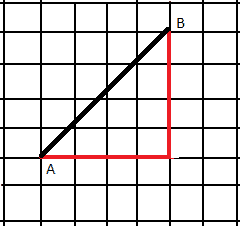

# 给定长度的单词

> 原文:[https://www.geeksforgeeks.org/dyck-words-of-given-length/](https://www.geeksforgeeks.org/dyck-words-of-given-length/)

给定一个整数 **n** ，任务是计算可能长度的 Dyck 单词 **n** 。DYCK 单词是仅包含字符**‘X’**和**‘Y’**的单词，因此在单词**的每个前缀中，频率(‘X’)≥频率(‘Y’)**
**示例:**

> **输入:** n = 2
> **输出:**2
> “XY”和“XX”是长度为 2 的唯一可能的 DYCK 单词。
> **输入:** n = 5
> **输出:** 42

**进场:**

> **几何解释:**基于 DYCK 路径的思想。
> 
>  
> 
> 上图表示从(0，0)到(n，n)的 DYCK PATHS。

一条 DYCK PATH 包含 n 条水平线段和 n 条不与线段 AB 相交的垂直线段。
这个问题背后的主要思想是求从(0，0)到(n，n)的 DYCK 路径总数。
处理这个问题的主要思想是找出曼哈顿距离在(0，0)到(n，n)之间的路径总数，排除所有那些穿过 AB 段的路径。

> 如何计算跨 AB 段的路径数？
> 让我们称所有那些穿越 AB 的路径为‘不正确’。穿过 AB 的“不正确”路径必须通过 CD 线。
> 
> 1.  取点 A 在直线 A 上的对称性
> 2.  以光盘为基准，画一条不正确的线的对称线。


一条对称的线。


FG-不正确线的对称线。

> 所有与 AB 相交的线，它们的对称线从 F 开始，到 G(n-1，n+1)结束。
> 因此错误行数为:
> <sup>2 * n</sup>C<sub>n–1</sub>
> 因此带有 n 'X '和 n 'Y '的 DYCK 单词数为:
> <sup>2 * n</sup>C<sub>n</sub>–<sup>2 * n</sup>C<sub>n–1</sub>=(2 * n)！/ (n)！* (n + 1)！

以下是上述方法的实现:

## C++

```
// C++ implementation of the approach
#include <iostream>
using namespace std;

// Function to return the count of
// Dyck Words of length n possible
long long int count_Dyck_Words(unsigned int n)
{
    // Calculate the value of 2nCn
    long long int res = 1;
    for (int i = 0; i < n; ++i) {
        res *= (2 * n - i);
        res /= (i + 1);
    }

    // Return 2nCn/(n+1)
    return (res / (n + 1));
}

// Driver Code
int main()
{
    int n = 5;
    cout << count_Dyck_Words(n);
    return 0;
}
```

## Java 语言(一种计算机语言，尤用于创建网站)

```
// Java implementation of the approach
class GFG
{

// Function to return the count of
// Dyck Words of length n possible
static int count_Dyck_Words( int n)
{
    // Calculate the value of 2nCn
    int res = 1;
    for (int i = 0; i < n; ++i)
    {
        res *= (2 * n - i);
        res /= (i + 1);
    }

    // Return 2nCn/(n+1)
    return (res / (n + 1));
}

// Driver Code
public static void main(String[] args)
{
    int n = 5;
    System.out.println(count_Dyck_Words(n));
}
}

// This code is Contributed by Code_Mech.
```

## 蟒蛇 3

```
# Python3 implementation of the approach

# Function to return the count of
# Dyck Words of length n possible
def count_Dyck_Words(n) :

    # Calculate the value of 2nCn
    res = 1;
    for i in range(n) :
        res *= (2 * n - i);
        res //= (i + 1);

    # Return 2nCn/(n+1)
    return (res / (n + 1));

# Driver Code
if __name__ == "__main__" :

    n = 5;
    print(count_Dyck_Words(n));

# This code is contributed by Ryuga
```

## C#

```
// C# implementation of the approach
using System;

class GFG
{

// Function to return the count of
// Dyck Words of length n possible
static int count_Dyck_Words( int n)
{
    // Calculate the value of 2nCn
    int res = 1;
    for (int i = 0; i < n; ++i)
    {
        res *= (2 * n - i);
        res /= (i + 1);
    }

    // Return 2nCn/(n+1)
    return (res / (n + 1));
}

// Driver Code
public static void Main()
{
    int n = 5;
    Console.WriteLine(count_Dyck_Words(n));
}
}

// This code is Contributed by Code_Mech.
```

## 服务器端编程语言（Professional Hypertext Preprocessor 的缩写）

```
<?php
// PHP implementation of the approach

// Function to return the count of
// Dyck Words of length n possible
function count_Dyck_Words( $n)
{
    // Calculate the value of 2nCn
    $res = 1;
    for ($i = 0; $i < $n; ++$i)
    {
        $res *= (2 * $n - $i);
        $res /= ($i + 1);
    }

    // Return 2nCn/(n+1)
    return ($res / ($n + 1));
}

// Driver Code
$n = 5;
echo(count_Dyck_Words($n));

// This code is contributed
// by Code_Mech.
?>
```

## java 描述语言

```
<script>
    // Javascript implementation of the approach

    // Function to return the count of
    // Dyck Words of length n possible
    function count_Dyck_Words(n)
    {
        // Calculate the value of 2nCn
        let res = 1;
        for (let i = 0; i < n; ++i)
        {
            res *= (2 * n - i);
            res = parseInt(res / (i + 1), 10);
        }

        // Return 2nCn/(n+1)
        return parseInt(res / (n + 1), 10);
    }

    let n = 5;
    document.write(count_Dyck_Words(n));

    // This code is contributed by suresh07.
</script>
```

**Output:** 

```
42
```