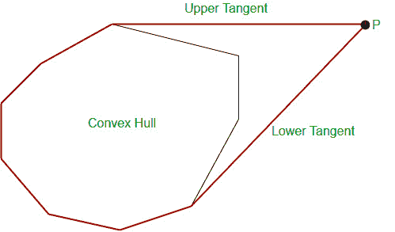
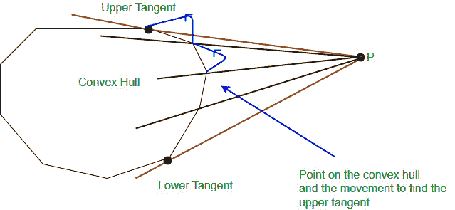

# 动态凸包|向现有凸包添加点

> 原文:[https://www . geesforgeks . org/dynamic-凸包-添加点-现有-凸包/](https://www.geeksforgeeks.org/dynamic-convex-hull-adding-points-existing-convex-hull/)

给定一个凸包，我们需要在凸包中添加给定数量的点，并在每次添加点后打印凸包。在添加每个点之后，这些点应该以逆时针顺序排列。
示例:

```
Input : 
Convex Hull : (0, 0), (3, -1), (4, 5), (-1, 4)
Point to add : (100, 100)

Output :
New convex hull : (-1, 4) (0, 0) (3, -1) (100, 100)
```

我们首先检查该点是否在给定的凸包内。如果是，那么什么都不用做，我们直接返回给定的凸包。如果该点在凸包外，我们找到上下切线，然后将该点与给定的凸包合并，找到新的凸包，如图所示。



红色轮廓显示了合并点和给定凸包后的新凸包。
为了找到上切线，我们首先在船体上选择一个距离给定点最近的点。然后，当连接凸包上的点和给定点的线穿过凸包时，我们逆时针移动，直到得到切线。



该图显示了在凸包上寻找上切线的点的移动。
**注意:**这里假设初始凸包的输入是逆时针顺序，否则我们首先要按逆时针顺序排序，然后应用下面的代码。

**代码:**

## 卡片打印处理机（Card Print Processor 的缩写）

```
// C++ program to add given a point p to a given
// convext hull. The program assumes that the
// point of given convext hull are in anti-clockwise
// order.
#include<bits/stdc++.h>
using namespace std;

// checks whether the point crosses the convex hull
// or not
int orientation(pair<int, int> a, pair<int, int> b,
                pair<int, int> c)
{
    int res = (b.second-a.second)*(c.first-b.first) -
              (c.second-b.second)*(b.first-a.first);

    if (res == 0)
        return 0;
    if (res > 0)
        return 1;
    return -1;
}

// Returns the square of distance between two input points
int sqDist(pair<int, int> p1, pair<int, int> p2)
{
    return (p1.first-p2.first)*(p1.first-p2.first) +
           (p1.second-p2.second)*(p1.second-p2.second);
}

// Checks whether the point is inside the convex hull or not
bool inside(vector<pair<int, int>> a, pair<int, int> p)
{
    // Initialize the centroid of the convex hull
    pair<int, int> mid = {0, 0};

    int n = a.size();

    // Multiplying with n to avoid floating point
    // arithmetic.
    p.first *= n;
    p.second *= n;
    for (int i=0; i<n; i++)
    {
        mid.first += a[i].first;
        mid.second += a[i].second;
        a[i].first *= n;
        a[i].second *= n;
    }

    // if the mid and the given point lies always
    // on the same side w.r.t every edge of the
    // convex hull, then the point lies inside
    // the convex hull
    for (int i=0, j; i<n; i++)
    {
        j = (i+1)%n;
        int x1 = a[i].first, x2 = a[j].first;
        int y1 = a[i].second, y2 = a[j].second;
        int a1 = y1-y2;
        int b1 = x2-x1;
        int c1 = x1*y2-y1*x2;
        int for_mid = a1*mid.first+b1*mid.second+c1;
        int for_p = a1*p.first+b1*p.second+c1;
        if (for_mid*for_p < 0)
            return false;
    }

    return true;
}

// Adds a point p to given convex hull a[]
void addPoint(vector<pair<int, int>> &a, pair<int, int> p)
{
    // If point is inside p
    if (inside(a, p))
        return;

    // point having minimum distance from the point p
    int ind = 0;
    int n = a.size();
    for (int i=1; i<n; i++)
        if (sqDist(p, a[i]) < sqDist(p, a[ind]))
            ind = i;

    // Find the upper tangent
    int up = ind;
    while (orientation(p, a[up], a[(up+1)%n])>=0)
        up = (up + 1) % n;

    // Find the lower tangent
    int low = ind;
    while (orientation(p, a[low], a[(n+low-1)%n])<=0)
        low = (n+low - 1) % n;

    // Initialize result
    vector<pair<int, int>>ret;

    // making the final hull by traversing points
    // from up to low of given convex hull.
    int curr = up;
    ret.push_back(a[curr]);
    while (curr != low)
    {
        curr = (curr+1)%n;
        ret.push_back(a[curr]);
    }

    // Modify the original vector
    ret.push_back(p);
    a.clear();
    for (int i=0; i<ret.size(); i++)
        a.push_back(ret[i]);
}

// Driver code
int main()
{
    // the set of points in the convex hull
    vector<pair<int, int> > a;
    a.push_back({0, 0});
    a.push_back({3, -1});
    a.push_back({4, 5});
    a.push_back({-1, 4});
    int n = a.size();

    pair<int, int> p = {100, 100};
    addPoint(a, p);

    // Print the modified Convex Hull
    for (auto e : a)
        cout << "(" << e.first << ", "
              << e.second << ") ";

    return 0;
}
```

## Java 语言(一种计算机语言，尤用于创建网站)

```
// Java program to add given a point p to a given
// convext hull. The program assumes that the
// point of given convext hull are in anti-clockwise
// order.

import java.io.*;
import java.util.*;
class GFG
{

  // checks whether the point crosses the convex hull
  // or not
  static int orientation(ArrayList<Integer> a,
                         ArrayList<Integer> b,
                         ArrayList<Integer> c)
  {
    int res = (b.get(1) - a.get(1)) * (c.get(0) - b.get(0)) -
      (c.get(1) - b.get(1)) * (b.get(0)-a.get(0));
    if (res == 0)
      return 0;
    if (res > 0)
      return 1;
    return -1;
  }

  // Returns the square of distance between two input points
  static int sqDist(ArrayList<Integer>p1, ArrayList<Integer>p2)
  {
    return (p1.get(0) - p2.get(0)) * (p1.get(0) - p2.get(0)) +
      (p1.get(1) - p2.get(1)) * (p1.get(1) - p2.get(1));
  }

  // Checks whether the point is inside the convex hull or not
  static boolean inside(ArrayList<ArrayList<Integer>> A,ArrayList<Integer>p)
  {

    // Initialize the centroid of the convex hull
    ArrayList<Integer> mid = new ArrayList<Integer>(Arrays.asList(0,0));

    int n = A.size();

    for (int i = 0; i < n; i++)
    {
      mid.set(0,mid.get(0) + A.get(i).get(0));
      mid.set(1,mid.get(1) + A.get(i).get(1));

    }

    // if the mid and the given point lies always
    // on the same side w.r.t every edge of the
    // convex hull, then the point lies inside
    // the convex hull
    for (int i = 0, j; i < n; i++)
    {
      j = (i + 1) % n;
      int x1 = A.get(i).get(0)*n, x2 = A.get(j).get(0)*n;
      int y1 = A.get(i).get(1)*n, y2 = A.get(j).get(1)*n;
      int a1 = y1 - y2;
      int b1 = x2 - x1;
      int c1 = x1 * y2 - y1 * x2;
      int for_mid = a1 * mid.get(0) + b1 * mid.get(1) + c1;
      int for_p = a1 * p.get(0) * n + b1 * p.get(1) * n + c1;
      if (for_mid*for_p < 0)
        return false;
    }
    return true;
  }

  // Adds a point p to given convex hull a[]
  static void addPoint(ArrayList<ArrayList<Integer>> a,ArrayList<Integer> p)
  {

    // If point is inside p
    if (inside(a, p))
      return;

    // point having minimum distance from the point p
    int ind = 0;
    int n = a.size();
    for (int i = 1; i < n; i++)
    {
      if (sqDist(p, a.get(i)) < sqDist(p, a.get(ind)))
      {
        ind = i;
      }
    }

    // Find the upper tangent
    int up = ind;
    while (orientation(p, a.get(up), a.get((up+1)%n))>=0)
      up = (up + 1) % n;

    // Find the lower tangent
    int low = ind;
    while (orientation(p, a.get(low), a.get((n+low-1)%n))<=0)
      low = (n+low - 1) % n;

    // Initialize result
    ArrayList<ArrayList<Integer>> ret = new ArrayList<ArrayList<Integer>>();

    // making the final hull by traversing points
    // from up to low of given convex hull.
    int curr = up;
    ret.add(a.get(curr));

    while (curr != low)
    {
      curr = (curr + 1) % n;
      ret.add(a.get(curr));
    }

    // Modify the original vector

    ret.add(p);
    a.clear();
    for (int i = 0; i < ret.size(); i++)
    {
      a.add(ret.get(i));
    }
  }

  // Driver code
  public static void main (String[] args)
  {

    // the set of points in the convex hull
    ArrayList<ArrayList<Integer>> a = new ArrayList<ArrayList<Integer>>();

    a.add(new ArrayList<Integer>(Arrays.asList(0, 0)));
    a.add(new ArrayList<Integer>(Arrays.asList(3, -1)));
    a.add(new ArrayList<Integer>(Arrays.asList(4, 5)));
    a.add(new ArrayList<Integer>(Arrays.asList(-1, 4)));

    int n = a.size();

    ArrayList<Integer> p = new ArrayList<Integer>(Arrays.asList(100,100));

    addPoint(a, p);
    // Print the modified Convex Hull
    for(ArrayList<Integer> e:a )
    {
      System.out.print("(" + e.get(0) + ", " + e.get(1) + ") ");
    }
  }
}

// This code is contributed by rag2127
```

## 蟒蛇 3

```
# Python 3 program to add given a point p to a given
# convext hull. The program assumes that the
# point of given convext hull are in anti-clockwise
# order.
import copy

# checks whether the point crosses the convex hull
# or not
def orientation(a, b, c):

    res = ((b[1] - a[1]) * (c[0] - b[0]) -
              (c[1] - b[1]) * (b[0] - a[0]))

    if (res == 0):
        return 0;
    if (res > 0):
        return 1;
    return -1;

# Returns the square of distance between two input points
def sqDist(p1, p2):

    return ((p1[0] - p2[0]) * (p1[0] - p2[0]) +
           (p1[1] - p2[1]) * (p1[1] - p2[1]));

# Checks whether the point is inside the convex hull or not
def inside( a, p ):

    # Initialize the centroid of the convex hull
    mid = [0, 0]

    n = len(a)

    # Multiplying with n to avoid floating point
    # arithmetic.
    p[0] *= n;
    p[1] *= n;
    for i in range(n):

        mid[0] += a[i][0];
        mid[1] += a[i][1];
        a[i][0] *= n;
        a[i][1] *= n;

    # if the mid and the given point lies always
    # on the same side w.r.t every edge of the
    # convex hull, then the point lies inside
    # the convex hull
    for i in range( n ):

        j = (i + 1) % n;
        x1 = a[i][0]
        x2 = a[j][0]
        y1 = a[i][1]
        y2 = a[j][1]
        a1 = y1 - y2;
        b1 = x2 - x1;
        c1 = x1 * y2 - y1 * x2;
        for_mid = a1 * mid[0] + b1 * mid[1] + c1;
        for_p = a1 * p[0] + b1*p[1]+c1;
        if (for_mid*for_p < 0):
            return False;

    return True;

# Adds a point p to given convex hull a[]
def addPoint( a, p):

    # If point is inside p
    arr= copy.deepcopy(a)
    prr =p.copy()

    if (inside(arr, prr)):
        return;

    # point having minimum distance from the point p
    ind = 0;
    n = len(a)
    for i in range(1, n):
        if (sqDist(p, a[i]) < sqDist(p, a[ind])):
            ind = i

    # Find the upper tangent
    up = ind;
    while (orientation(p, a[up], a[(up + 1) % n]) >= 0):
        up = (up + 1) % n;

    # Find the lower tangent
    low = ind;
    while (orientation(p, a[low], a[(n + low - 1) % n]) <= 0):
        low = (n + low - 1) % n

    # Initialize result
    ret = []

    # making the final hull by traversing points
    # from up to low of given convex hull.
    curr = up;
    ret.append(a[curr]);
    while (curr != low):
        curr = (curr + 1) % n;
        ret.append(a[curr]);

    # Modify the original vector
    ret.append(p);
    a.clear();
    for i in range(len(ret)):
        a.append(ret[i]);

# Driver code
if __name__ == "__main__":

    # the set of points in the convex hull
    a = []
    a.append([0, 0]);
    a.append([3, -1]);
    a.append([4, 5]);
    a.append([-1, 4]);
    n = len(a)

    p = [100, 100]
    addPoint(a, p);

    # Print the modified Convex Hull
    for e in a :
        print("(" , e[0], ", ",
              e[1] , ") ",end=" ")

# This code is contributed by chitranayal
```

## C#

```
// C# program to add given a point p to a given
// convext hull. The program assumes that the
// point of given convext hull are in anti-clockwise
// order.

using System;
using System.Collections.Generic;

public class GFG{

  // checks whether the point crosses the convex hull
  // or not
  static int orientation(List<int> a,List<int> b,List<int> c)
  {
    int res=(b[1]-a[1]) * (c[0]-b[0]) - (c[1]-b[1]) * (b[0]-a[0]);
    if (res == 0)
      return 0;
    if (res > 0)
      return 1;
    return -1;
  }
  // Returns the square of distance between two input points
  static int sqDist(List<int>p1, List<int>p2)
  {
    return (p1[0] - p2[0]) * (p1[0] - p2[0]) +
      (p1[1] - p2[1]) * (p1[1] - p2[1]);
  }

  // Checks whether the point is inside the convex hull or not
  static bool inside(List<List<int>> A,List<int>p)
  {

    // Initialize the centroid of the convex hull
    List<int> mid = new List<int>(){0,0};

    int n = A.Count;

    for (int i = 0; i < n; i++)
    {
      mid[0]+=A[i][0];
      mid[1]+=A[i][1];

    }  

    // if the mid and the given point lies always
    // on the same side w.r.t every edge of the
    // convex hull, then the point lies inside
    // the convex hull
    for (int i = 0, j; i < n; i++)
    {
      j = (i + 1) % n;
      int x1 = A[i][0]*n, x2 = A[j][0]*n;
      int y1 = A[i][1]*n, y2 = A[j][1]*n;
      int a1 = y1 - y2;
      int b1 = x2 - x1;
      int c1 = x1 * y2 - y1 * x2;
      int for_mid = a1 * mid[0] + b1 * mid[1] + c1;
      int for_p = a1 * p[0] * n + b1 * p[1] * n + c1;
      if (for_mid*for_p < 0)
        return false;
    }
    return true;
  }

  // Adds a point p to given convex hull a[]
  static void addPoint(List<List<int>> a,List<int> p)
  {

    // If point is inside p
    if (inside(a, p))
      return;

    // point having minimum distance from the point p
    int ind = 0;
    int n = a.Count;
    for (int i = 1; i < n; i++)
    {
      if (sqDist(p, a[i]) < sqDist(p, a[ind]))
      {
        ind = i;
      }
    }

    // Find the upper tangent
    int up = ind;
    while (orientation(p, a[up], a[(up+1)%n])>=0)
      up = (up + 1) % n;

    // Find the lower tangent
    int low = ind;
    while (orientation(p, a[low], a[(n+low-1)%n])<=0)
      low = (n+low - 1) % n;

    // Initialize result
    List<List<int>> ret = new List<List<int>>();

    // making the final hull by traversing points
    // from up to low of given convex hull.
    int curr = up;
    ret.Add(a[curr]);

    while (curr != low)
    {
      curr = (curr + 1) % n;
      ret.Add(a[curr]);
    }

    // Modify the original vector

    ret.Add(p);
    a.Clear();
    for (int i = 0; i < ret.Count; i++)
    {
      a.Add(ret[i]);
    }
  }

  // Driver code

  static public void Main (){
    // the set of points in the convex hull
    List<List<int>> a = new List<List<int>>();

    a.Add(new List<int>(){0,0});
    a.Add(new List<int>(){3,-1});
    a.Add(new List<int>(){4,5});
    a.Add(new List<int>(){-1,4});

    int n=a.Count;
    List<int> p = new List<int>(){100,100};
    addPoint(a, p);
    // Print the modified Convex Hull
    foreach(List<int> e in a)
    {
      Console.Write("(" + e[0] + ", " + e[1] + ") ");
    }

  }
}

// This code is contributed by avanitrachhadiya2155
```

## java 描述语言

```
<script>
// Javascript program to add given a point p to a given
// convext hull. The program assumes that the
// point of given convext hull are in anti-clockwise
// order.

// checks whether the point crosses the convex hull
  // or not
function orientation(a,b,c)
{
    let res = (b[1] - a[1]) * (c[0] - b[0]) -
      (c[1] - b[1]) * (b[0]-a[0]);
    if (res == 0)
      return 0;
    if (res > 0)
      return 1;
    return -1;
}

// Returns the square of distance between two input points
function sqDist(p1,p2)
{
    return (p1[0] - p2[0]) * (p1[0] - p2[0]) +
      (p1[1] - p2[1]) * (p1[1] - p2[1]);
}

// Checks whether the point is inside the convex hull or not
function inside(A,p)
{
    // Initialize the centroid of the convex hull
    let mid = [0,0];

    let n = A.length;

    for (let i = 0; i < n; i++)
    {
     mid[0]+=A[i][0];
      mid[1]+=A[i][1];

    }

    // if the mid and the given point lies always
    // on the same side w.r.t every edge of the
    // convex hull, then the point lies inside
    // the convex hull
    for (let i = 0, j; i < n; i++)
    {
      j = (i + 1) % n;
      let x1 = A[i][0]*n, x2 = A[j][0]*n;
      let y1 = A[i][1]*n, y2 = A[j][1]*n;
      let a1 = y1 - y2;
      let b1 = x2 - x1;
      let c1 = x1 * y2 - y1 * x2;
      let for_mid = a1 * mid[0] + b1 * mid[1] + c1;
      let for_p = a1 * p[0] * n + b1 * p[1] * n + c1;
      if (for_mid*for_p < 0)
        return false;
    }
    return true;
}

// Adds a point p to given convex hull a[]
function addPoint(a,p)
{
    // If point is inside p
    if (inside(a, p))
      return;

    // point having minimum distance from the point p
    let ind = 0;
    let n = a.length;
    for (let i = 1; i < n; i++)
    {
      if (sqDist(p, a[i]) < sqDist(p, a[ind]))
      {
        ind = i;
      }
    }

    // Find the upper tangent
    let up = ind;
    while (orientation(p, a[up], a[(up+1)%n])>=0)
      up = (up + 1) % n;

    // Find the lower tangent
    let low = ind;
    while (orientation(p, a[low], a[(n+low-1)%n])<=0)
      low = (n+low - 1) % n;

    // Initialize result
    let ret = [];

    // making the final hull by traversing points
    // from up to low of given convex hull.
    let curr = up;
    ret.push(a[curr]);

    while (curr != low)
    {
      curr = (curr + 1) % n;
      ret.push(a[curr]);
    }

    // Modify the original vector

    ret.push(p);
    a=[];
    for (let i = 0; i < ret.length; i++)
    {
      a.push(ret[i]);
    }
    return a;
}

// Driver code

// the set of points in the convex hull
let a = []
a.push([0, 0]);
a.push([3, -1]);
a.push([4, 5]);
a.push([-1, 4]);

let n=a.length;
let p=[100,100];
a=addPoint(a, p);
// Print the modified Convex Hull
for(let e=0;e<a.length;e++ )
{
    document.write("(" + a[e][0] + ", " + a[e][1] + ") ");
}

// This code is contributed by ab2127
</script>
```

输出:

```
(-1, 4) (0, 0) (3, -1) (100, 100)
```

**时间复杂度:**
上述算法的时间复杂度为 O(n*q)，其中 q 为待加点数。
本文由[阿姆利则瓦格米](https://www.facebook.com/amritya.vagmi)投稿，想要投稿的话，也可以使用[write.geeksforgeeks.org](https://write.geeksforgeeks.org)写篇文章或者把文章邮寄到 review-team@geeksforgeeks.org。看到你的文章出现在极客博客主页上，帮助其他极客。
如果发现有不正确的地方，或者想分享更多关于上述话题的信息，请写评论。