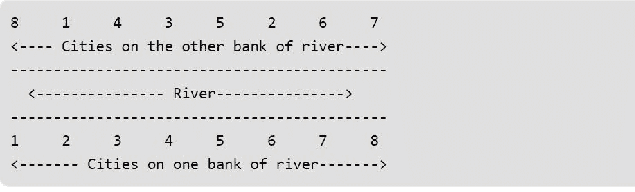

# 动态规划|造桥

> 原文:[https://www . geesforgeks . org/dynamic-programming-building-bridges/](https://www.geeksforgeeks.org/dynamic-programming-building-bridges/)

考虑一张中心有一条水平河流通过的二维地图。南岸有 n 个城市，x 坐标为 a(1) … a(n)，北岸有 n 个城市，x 坐标为 b(1) … b(n)。你想用桥连接尽可能多的南北城市对，这样就不会有两座桥交叉。连接城市时，您只能将北岸的城市 a(i)连接到南岸的城市 b(i)。在上述限制条件下，连接南北对的最大桥梁数量。



上排的值可以认为是城市的北 x 坐标，下排的值可以认为是北 x 坐标城市可以连接的城市的对应南 x 坐标。
示例:

```
Input : 6 4 2 1
        2 3 6 5
Output : Maximum number of bridges = 2
Explanation: Let the north-south x-coordinates
be written in increasing order.

1  2  3  4  5  6
  \  \
   \  \        For the north-south pairs
    \  \       (2, 6) and (1, 5)
     \  \      the bridges can be built.
      \  \     We can consider other pairs also,
       \  \    but then only one bridge can be built 
        \  \   because more than one bridge built will
         \  \  then cross each other.
          \  \
1  2  3  4  5  6 

Input : 8 1 4 3 5 2 6 7 
        1 2 3 4 5 6 7 8
Output : Maximum number of bridges = 5
```

**方法:**是 [LIS](https://www.geeksforgeeks.org/dynamic-programming-set-3-longest-increasing-subsequence/) 问题的变种。以下是解决问题的步骤。

1.  根据南 x 坐标的递增顺序对南北对进行排序。
2.  如果两个南 x 坐标相同，则按北 x 坐标递增顺序排序。
3.  现在找到北 x 坐标的[最长增加子序列](https://www.geeksforgeeks.org/dynamic-programming-set-3-longest-increasing-subsequence/)。
4.  需要注意的一点是，在递增子序列中，一个值可以更大，也可以等于它的前一个值。

我们也可以在北 x 坐标的基础上进行排序，在南 x 坐标上找到 LIS。

## 卡片打印处理机（Card Print Processor 的缩写）

```
// C++ implementation of building bridges
#include <bits/stdc++.h>

using namespace std;

// north-south coordinates
// of each City Pair
struct CityPairs
{
    int north, south;
};

// comparison function to sort
// the given set of CityPairs
bool compare(struct CityPairs a, struct CityPairs b)
{
    if (a.south == b.south)
        return a.north < b.north;
    return a.south < b.south;
}

// function to find the maximum number
// of bridges that can be built
int maxBridges(struct CityPairs values[], int n)
{
    int lis[n];
    for (int i=0; i<n; i++)
        lis[i] = 1;

    sort(values, values+n, compare);

    // logic of longest increasing subsequence
    // applied on the northern coordinates
    for (int i=1; i<n; i++)
        for (int j=0; j<i; j++)
            if (values[i].north >= values[j].north
                && lis[i] < 1 + lis[j])
                lis[i] = 1 + lis[j];

    int max = lis[0];
    for (int i=1; i<n; i++)
        if (max < lis[i])
            max = lis[i];

    // required number of bridges
    // that can be built       
    return max;       
}

// Driver program to test above
int main()
{
    struct CityPairs values[] = {{6, 2}, {4, 3}, {2, 6}, {1, 5}};
    int n = 4;
    cout << "Maximum number of bridges = "
             << maxBridges(values, n);   
    return 0;
}
```

## Java 语言(一种计算机语言，尤用于创建网站)

```
// Java Program for maximizing the no. of bridges
// such that none of them cross each other

import java.util.*;

class CityPairs // Create user-defined class
{
    int north, south;
    CityPairs(int north, int south) // Constructor
    {
        this.north = north;
        this.south = south;
    }
}
// Use Comparator for manual sorting
class MyCmp implements Comparator<CityPairs>
{
    public int compare(CityPairs cp1, CityPairs cp2)
    {
        // If 2 cities have same north coordinates
        // then sort them in increasing order
        // according to south coordinates.
        if (cp1.north == cp2.north)
            return cp1.south - cp2.south;

        // Sort in increasing order of
        // north coordinates.
        return cp1.north - cp2.north;
    }
}
public class BuildingBridges {
    // function to find the max. number of bridges
    // that can be built
    public static int maxBridges(CityPairs[] pairs, int n)
    {
        int[] LIS = new int[n];
        // By default single city has LIS = 1.
        Arrays.fill(LIS, 1);

        Arrays.sort(pairs, new MyCmp()); // Sorting->
                                         // calling
        // our self made comparator

        // Logic for Longest increasing subsequence
        // applied on south coordinates.
        for (int i = 1; i < n; i++) {
            for (int j = 0; j < i; j++) {
                if (pairs[i].south >= pairs[j].south)
                    LIS[i] = Math.max(LIS[i], LIS[j] + 1);
            }
        }
        int max = LIS[0];
        for (int i = 1; i < n; i++) {
            max = Math.max(max, LIS[i]);
        }

        // Return the max number of bridges that can be
        // built.
        return max;
    }

    // Driver Program to test above
    public static void main(String[] args)
    {
        int n = 4;
        CityPairs[] pairs = new CityPairs[n];
        pairs[0] = new CityPairs(6, 2);
        pairs[1] = new CityPairs(4, 3);
        pairs[2] = new CityPairs(2, 6);
        pairs[3] = new CityPairs(1, 5);
        System.out.println("Maximum number of bridges = "
                           + maxBridges(pairs, n));
    }
}
```

输出:

```
Maximum number of bridges = 2
```

时间复杂度:O(n <sup>2</sup> )

**方法 LIS 中的优化)**

**注–**这是最长递增子序列(LIS)的变异/应用。

首先让一边在桥的北面，另一边在桥的南面。

让我们取北侧，根据元素的位置对元素进行排序。

步骤 3-根据北侧分类，因此它是增加的，如果我们在南侧应用 LIS，那么我们将能够得到不重叠的桥梁。

**注意–**最长递增子序列可以在 O(NlogN)中使用耐心排序完成。

> 主要的优化在于最小的元素在 LIS 中有更高的贡献机会。
> 
> 输入:6 4 2 1
> 
>           2 3 6 5
> 
> 步骤 1–在桥的北面位置对输入进行排序。
> 
> 1 2 4 6  
> 
> 5 6 3 2
> 
> 步骤 2-在南岸应用 LIS，即 5 6 3 2
> 
> 在 LIS 的优化中，如果我们找到一个比当前元素小的元素，那么我们替换它，停止当前流，用新的更小的元素开始。如果我们找到比当前元素更大的元素，我们就增加答案。
> 
> 5——-> 6(答案=2) HALT 我们发现 3 比 6 小
> 
> 3(答案= 1) HALT 我们发现 2 比 3 小
> 
> 2(答案=1)
> 
> 最终答案= 2

## C++

```
#include<bits/stdc++.h>
using namespace std;

int non_overlapping_bridges(vector<pair<int,int>> &temp,int n)
{
    //Step - 1 Sort the north side.
    sort(temp.begin(),temp.end());
    // Create the Dp array to store the flow of non overlapping bridges.
    // ans-->Store the final max number of non-overlapping bridges.
    vector<int> dp(n+1,INT_MAX);
    int ans=0;
    for(int i=0;i<n;i++)
    {
        int idx=lower_bound(dp.begin(),dp.end(),temp[i].second)-dp.begin();
        dp[idx]=temp[i].second;
        ans=max(ans,idx+1);
    }
    return ans;
}

int main()
{
    int n=4;
    vector<pair<int,int>> temp;
    temp.push_back(make_pair(6,2));
    temp.push_back(make_pair(4,3));
    temp.push_back(make_pair(2,6));
    temp.push_back(make_pair(1,5));

    cout<<non_overlapping_bridges(temp,n)<<endl;
    return 0;
}
```

**输出–2**

**时间复杂度–O(NlogN)**

**空间复杂度–O(N)**

问题参考:
[https://www . geeksforgeeks . org/dynamic-programming-set-14-variations-of-lis/](https://www.geeksforgeeks.org/dynamic-programming-set-14-variations-of-lis/)
解决方案参考:
[https://www.youtube.com/watch?v=w6tSmS86C4w](https://www.youtube.com/watch?v=w6tSmS86C4w)
本文由**阿育什·乔哈里**供稿。如果你喜欢 GeeksforGeeks 并想投稿，你也可以使用[contribute.geeksforgeeks.org](http://contribute.geeksforgeeks.org)写一篇文章或者把你的文章邮寄到 contribute@geeksforgeeks.org。看到你的文章出现在极客博客主页上，帮助其他极客。
如果发现有不正确的地方，或者想分享更多关于上述话题的信息，请写评论。