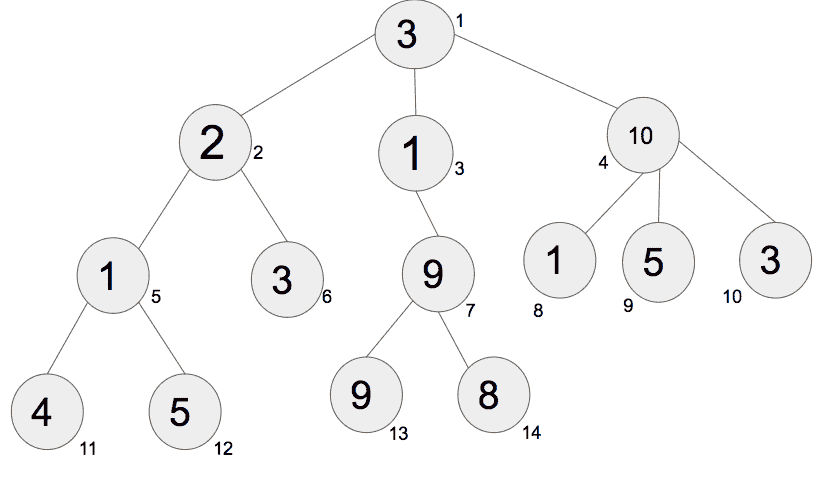
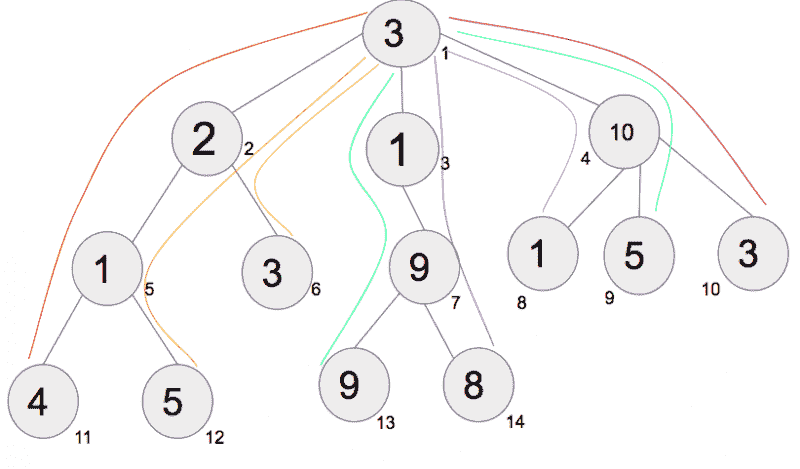
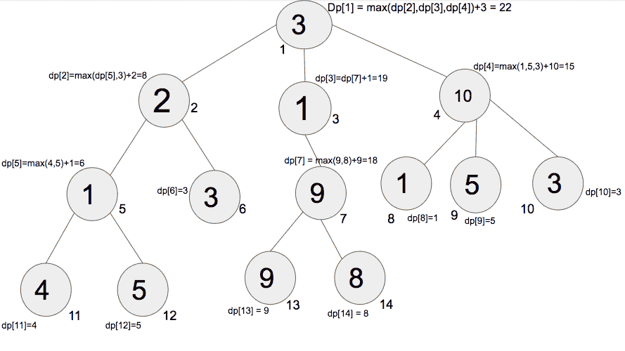

# 树上的动态规划|集合-1

> 原文:[https://www . geesforgeks . org/dynamic-programming-trees-set-1/](https://www.geeksforgeeks.org/dynamic-programming-trees-set-1/)

动态规划是一种通过将问题分解成遵循最优子结构的重叠子问题来解决问题的技术。使用 DP 有各种问题，如子集和、背包、硬币兑换等。DP 也可以应用在树上来解决一些特定的问题。
**先决条件:** [DFS](https://www.geeksforgeeks.org/depth-first-traversal-for-a-graph/)
给定一棵有 N 个节点和 N-1 条边的树，计算从根到任何叶子的节点值的最大和，而不需要重新访问任何节点。



上面给出的是一棵树的示意图，其中 **N=14 个**节点和 **N-1=13 个**边。对于节点 1、2、3、4…14，节点处的值分别为 **3、2、1、10、1、3、9、1、5、3、4、5、9 和 8。**
下图显示了从根到叶的所有路径:



所有路径用不同的颜色标注:
路径 1(红色，3-2-1-4):所有节点值之和= 10
路径 2(橙色，3-2-1-5):所有节点值之和= 11
路径 3(黄色，3-2-3):所有节点值之和= 8
路径 4(绿色，3-1-9-9):所有节点值之和= 22
路径 5(紫色，3-1-9-8):所有节点值之和= 21 3-10-1):所有节点值之和= 14
路径 7(蓝色，3-10-5):所有节点值之和= 18
路径 8(棕色，3-10-3):所有节点值之和= 16
答案是 22，因为路径 4 在其从根到叶的路径中具有最大的节点值之和。

**贪婪的方法在这种情况下失败**。从根开始，贪婪地从第一级拿 3，从下一级拿 10，从第三级拿 5。如果遵循贪婪方法，结果是路径-7，因此不要在这里应用贪婪方法。
这个问题可以通过在树上使用**动态规划来解决。**从叶子开始记忆，把最多的叶子添加到每棵子树的根部。在最后一步，将有根和它下面的子树，将节点处的值和子树的最大值相加，将给出从根到任何叶子的节点值的最大和。



上图展示了如何**从叶子开始，将一棵子树的最大叶子数加到它的根**上。向上移动，重复相同的过程，存储每个子树叶子的最大值，并将其添加到其根部。在这个例子中，取节点 11 和 12 的最大值进行计数，然后加到节点 5 上(**在这个子树中，5 是根，11，12 是它的叶子**)。类似地，取节点 13 和 14 的最大值进行计数，然后加到节点 7。对每个子树重复这些步骤，直到我们到达节点。

设 DP <sub>i</sub> 为 I 与其任何向下移动的叶子之间的路径中节点值的最大和。**使用 DFS 遍历**遍历树。存储子树所有叶子的最大值，并将其添加到子树的根。最后，DP <sub>1</sub> 将具有从根到任何叶子的节点值的最大和，而无需重新访问任何节点。
以下是上述思路的实现:

## C++

```
// C++ code to find the maximum path sum
#include <bits/stdc++.h>
using namespace std;

vector<int> dp;

// function for dfs traversal and to store the
// maximum value in dp[] for every node till the leaves
void dfs(int a[], vector<int> v[], int u, int parent)
{
    // initially dp[u] is always a[u]
    dp[u] = a[u - 1];

    // stores the maximum value from nodes
    int maximum = 0;

    // traverse the tree
    for (int child : v[u]) {

        // if child is parent, then we continue
        // without recursing further
        if (child == parent)
            continue;

        // call dfs for further traversal
        dfs(a, v, child, u);

        // store the maximum of previous visited node
        // and present visited node
        maximum = max(maximum, dp[child]);
    }

    // add the maximum value returned to the parent node
    dp[u] += maximum;
}

// function that returns the maximum value
int maximumValue(int a[], vector<int> v[])
{
    dfs(a, v, 1, 0);
    return dp[1];
}

// Driver Code
int main()
{
    // number of nodes
    int n = 14;

    // adjacency list
    vector<int> v[n + 1];

    // create undirected edges
    // initialize the tree given in the diagram
    v[1].push_back(2), v[2].push_back(1);
    v[1].push_back(3), v[3].push_back(1);
    v[1].push_back(4), v[4].push_back(1);
    v[2].push_back(5), v[5].push_back(2);
    v[2].push_back(6), v[6].push_back(2);
    v[3].push_back(7), v[7].push_back(3);
    v[4].push_back(8), v[8].push_back(4);
    v[4].push_back(9), v[9].push_back(4);
    v[4].push_back(10), v[10].push_back(4);
    v[5].push_back(11), v[11].push_back(5);
    v[5].push_back(12), v[12].push_back(5);
    v[7].push_back(13), v[13].push_back(7);
    v[7].push_back(14), v[14].push_back(7);

    // values of node 1, 2, 3....14
    int a[] = { 3, 2, 1, 10, 1, 3, 9, 1, 5, 3, 4, 5, 9, 8 };
    // initialise dp
      dp = vector<int>(n+1,0);
    // function call
    cout << maximumValue(a, v);

    return 0;
}
```

## Java 语言(一种计算机语言，尤用于创建网站)

```
// Java code to find the maximum path sum
import java.util.Vector;

class GFG
{
    static int[] dp = new int[100];

    // function for dfs traversal and to
    // store the maximum value in dp[]
    // for every node till the leaves
    static void dfs(int[] a, Vector<Integer>[] v,
                    int u, int parent)
    {

        // initially dp[u] is always a[u]
        dp[u] = a[u - 1];

        // stores the maximum value from nodes
        int maximum = 0;

        // traverse the tree
        for (int child : v[u])
        {

            // if child is parent, then we continue
            // without recursing further
            if (child == parent)
                continue;

            // call dfs for further traversal
            dfs(a, v, child, u);

            // store the maximum of previous visited
            // node and present visited node
            maximum = Math.max(maximum, dp[child]);
        }

        // add the maximum value returned
        // to the parent node
        dp[u] += maximum;
    }

    // function that returns the maximum value
    static int maximumValue(int[] a,
                            Vector<Integer>[] v)
    {
        dfs(a, v, 1, 0);
        return dp[1];
    }

    // Driver Code
    public static void main(String[] args)
    {

        // Driver Code
        int n = 14;

        // adjacency list
        @SuppressWarnings("unchecked")
        Vector<Integer>[] v = new Vector[n + 1];

        for (int i = 0; i < v.length; i++)
            v[i] = new Vector<>();

        // create undirected edges
        // initialize the tree given in the diagram
        v[1].add(2); v[2].add(1);
        v[1].add(3); v[3].add(1);
        v[1].add(4); v[4].add(1);
        v[2].add(5); v[5].add(2);
        v[2].add(6); v[6].add(2);
        v[3].add(7); v[7].add(3);
        v[4].add(8); v[8].add(4);
        v[4].add(9); v[9].add(4);
        v[4].add(10); v[10].add(4);
        v[5].add(11); v[11].add(5);
        v[5].add(12); v[12].add(5);
        v[7].add(13); v[13].add(7);
        v[7].add(14); v[14].add(7);

        // values of node 1, 2, 3....14
        int a[] = { 3, 2, 1, 10, 1, 3, 9,
                    1, 5, 3, 4, 5, 9, 8 };

        // function call
        System.out.println(maximumValue(a, v));
    }
}

// This code is contributed by
// sanjeev2552
```

## 蟒蛇 3

```
# Python3 code to find the maximum path sum
dp = [0]*100

# Function for dfs traversal and
# to store the maximum value in
# dp[] for every node till the leaves
def dfs(a, v, u, parent):

    # Initially dp[u] is always a[u]
    dp[u] = a[u - 1]

    # Stores the maximum value from nodes
    maximum = 0

    # Traverse the tree
    for child in v[u]:

        # If child is parent, then we continue
        # without recursing further
        if child == parent:
            continue

        # Call dfs for further traversal
        dfs(a, v, child, u)

        # Store the maximum of previous visited 
        # node and present visited node
        maximum = max(maximum, dp[child])

    # Add the maximum value
    # returned to the parent node
    dp[u] += maximum

# Function that returns the maximum value
def maximumValue(a, v):
    dfs(a, v, 1, 0)
    return dp[1]

# Driver Code
def main():

    # Number of nodes
    n = 14

    # Adjacency list as a dictionary
    v = {}
    for i in range(n + 1):
        v[i] = []

    # Create undirected edges
    # initialize the tree given in the diagram
    v[1].append(2), v[2].append(1)
    v[1].append(3), v[3].append(1)
    v[1].append(4), v[4].append(1)
    v[2].append(5), v[5].append(2)
    v[2].append(6), v[6].append(2)
    v[3].append(7), v[7].append(3)
    v[4].append(8), v[8].append(4)
    v[4].append(9), v[9].append(4)
    v[4].append(10), v[10].append(4)
    v[5].append(11), v[11].append(5)
    v[5].append(12), v[12].append(5)
    v[7].append(13), v[13].append(7)
    v[7].append(14), v[14].append(7)

    # Values of node 1, 2, 3....14
    a = [ 3, 2, 1, 10, 1, 3, 9,
          1, 5, 3, 4, 5, 9, 8 ]

    # Function call
    print(maximumValue(a, v))
main()

# This code is contributed by stutipathak31jan 
```

## C#

```
// C# code to find the maximum path sum
using System;
using System.Collections.Generic;

class GFG
{
    static int[] dp = new int[100];

    // function for dfs traversal and to
    // store the maximum value in []dp
    // for every node till the leaves
    static void dfs(int[] a, List<int>[] v,
                    int u, int parent)
    {

        // initially dp[u] is always a[u]
        dp[u] = a[u - 1];

        // stores the maximum value from nodes
        int maximum = 0;

        // traverse the tree
        foreach(int child in v[u])
        {

            // if child is parent, then we continue
            // without recursing further
            if (child == parent)
                continue;

            // call dfs for further traversal
            dfs(a, v, child, u);

            // store the maximum of previous visited
            // node and present visited node
            maximum = Math.Max(maximum, dp[child]);
        }

        // add the maximum value returned
        // to the parent node
        dp[u] += maximum;
    }

    // function that returns the maximum value
    static int maximumValue(int[] a,
                            List<int>[] v)
    {
        dfs(a, v, 1, 0);
        return dp[1];
    }

    // Driver Code
    public static void Main(String[] args)
    {

        // Driver Code
        int n = 14;

        // adjacency list

        List<int>[] v = new List<int>[n + 1];

        for (int i = 0; i < v.Length; i++)
            v[i] = new List<int>();

        // create undirected edges
        // initialize the tree given in the diagram
        v[1].Add(2); v[2].Add(1);
        v[1].Add(3); v[3].Add(1);
        v[1].Add(4); v[4].Add(1);
        v[2].Add(5); v[5].Add(2);
        v[2].Add(6); v[6].Add(2);
        v[3].Add(7); v[7].Add(3);
        v[4].Add(8); v[8].Add(4);
        v[4].Add(9); v[9].Add(4);
        v[4].Add(10); v[10].Add(4);
        v[5].Add(11); v[11].Add(5);
        v[5].Add(12); v[12].Add(5);
        v[7].Add(13); v[13].Add(7);
        v[7].Add(14); v[14].Add(7);

        // values of node 1, 2, 3....14
        int []a = { 3, 2, 1, 10, 1, 3, 9,
                    1, 5, 3, 4, 5, 9, 8 };

        // function call
        Console.WriteLine(maximumValue(a, v));
    }
}

// This code is contributed by PrinciRaj1992
```

## java 描述语言

```
<script>

// JavaScript code to find the maximum path sum
var dp = Array(100).fill(0);

// function for dfs traversal and to
// store the maximum value in []dp
// for every node till the leaves
function dfs(a, v, u, parent)
{
    // initially dp[u] is always a[u]
    dp[u] = a[u - 1];
    // stores the maximum value from nodes
    var maximum = 0;
    // traverse the tree
    for(var child of v[u])
    {
        // if child is parent, then we continue
        // without recursing further
        if (child == parent)
            continue;
        // call dfs for further traversal
        dfs(a, v, child, u);
        // store the maximum of previous visited
        // node and present visited node
        maximum = Math.max(maximum, dp[child]);
    }
    // add the maximum value returned
    // to the parent node
    dp[u] += maximum;
}
// function that returns the maximum value
function maximumValue(a, v)
{
    dfs(a, v, 1, 0);
    return dp[1];
}
// Driver Code
// Driver Code
var n = 14;
// adjacency list
var v = Array.from(Array(n+1), ()=>Array());
for (var i = 0; i < v.length; i++)
    v[i] = [];
// create undirected edges
// initialize the tree given in the diagram
v[1].push(2); v[2].push(1);
v[1].push(3); v[3].push(1);
v[1].push(4); v[4].push(1);
v[2].push(5); v[5].push(2);
v[2].push(6); v[6].push(2);
v[3].push(7); v[7].push(3);
v[4].push(8); v[8].push(4);
v[4].push(9); v[9].push(4);
v[4].push(10); v[10].push(4);
v[5].push(11); v[11].push(5);
v[5].push(12); v[12].push(5);
v[7].push(13); v[13].push(7);
v[7].push(14); v[14].push(7);
// values of node 1, 2, 3....14
var a = [3, 2, 1, 10, 1, 3, 9,
            1, 5, 3, 4, 5, 9, 8];
// function call
document.write(maximumValue(a, v));

</script>
```

**Output**

```
22
```

**时间复杂度:** O(N)，其中 N 为节点数。