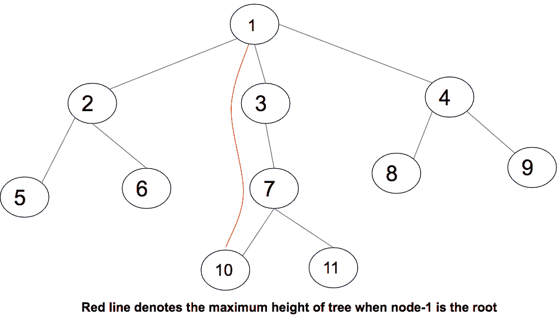
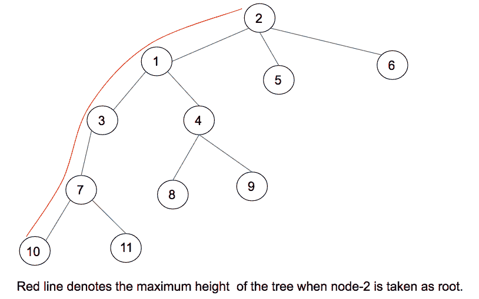
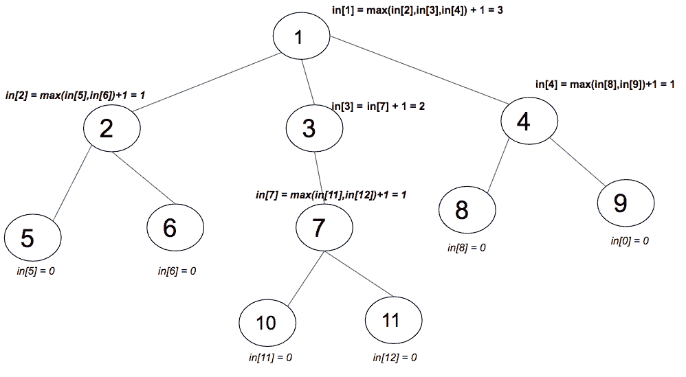
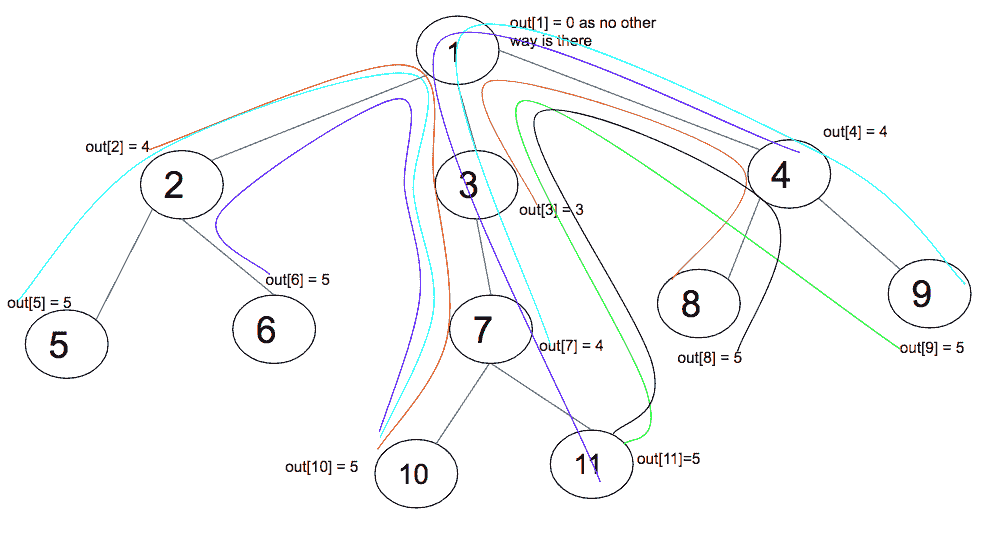
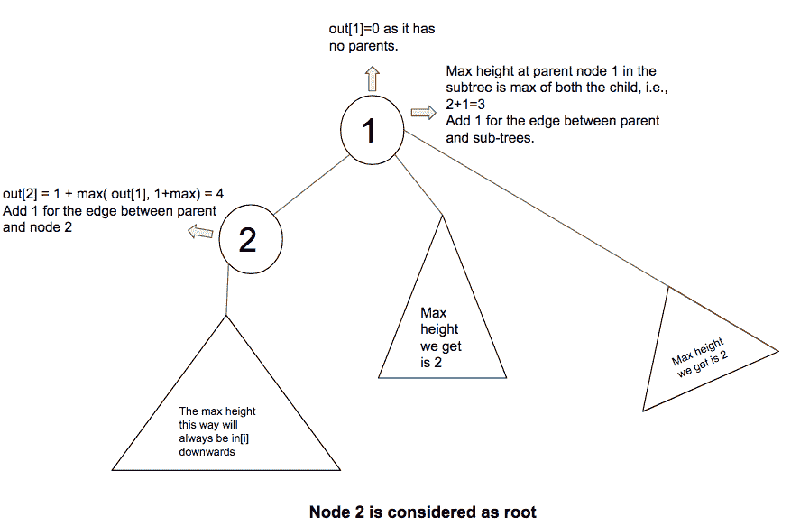
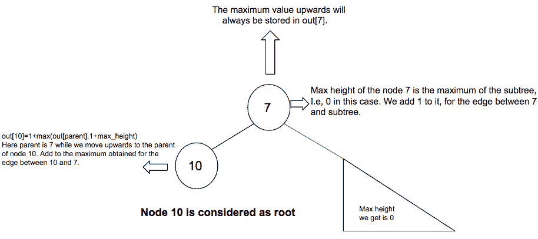

# 树上的动态规划|集合 2

> 原文:[https://www . geesforgeks . org/dynamic-programming-trees-set-2/](https://www.geeksforgeeks.org/dynamic-programming-trees-set-2/)

给定一棵有 N 个节点和 N-1 条边的树，当树中的任意节点**被认为是树的根时，求树的**最大高度**。**



上图表示了一棵有 **11 个节点****10 条边**的树，以及当节点 1 被认为是根时给我们最大高度的路径。最大高度为 3。



在上图中，当 2 被认为是根时，那么找到的最长路径是红色的。一种**简单的方法**是对每个节点使用 [DFS 遍历](https://www.geeksforgeeks.org/depth-first-traversal-for-a-graph/)遍历树，并计算当节点被视为树根时的最大高度。树的 DFS 遍历的时间复杂度是 O(N)。**所有 N 个节点的 DFS 整体时间复杂度为 O(N)*N，即 O(N <sup>2</sup> )** 。

使用**树上动态规划可以解决上述问题。**为了解决这个问题，为每个节点预先计算两件事。一个将是最大的高度，而通过它的树枝向下移动到叶子。而另一个将是通过其母体向上行进到任何叶子时的最大高度。
**最优子结构:**
当节点 I 被认为是根时，【I】中的
**是我们通过其子树和叶子向下行进时树的最大高度。
此外， **out[i]** 是树经由其母体向上行进时的最大高度。**

> 当节点 I 为
> 被认为是根时，树的最大高度将为 **max(in[i]，out[i])** 。

**in[I]的计算:**



在上图中，已经为每个节点 I 计算了[i]中的值。取每个子树的最大值，并将 1 加到该子树的父节点上。为父树和子树之间的边添加 1。使用 DFS 遍历树，并将[i]中的**计算为每个节点的最大值(在[i]中，1+在[子]中)**。
**计算出【我】:**



上图显示了所有 out[i]值和路径。对于 out[i]的计算，向上移动到节点 I 的父节点，从节点 I 的父节点，有两种方法可以移入，一种是在父节点的所有分支中。另一个方向是移动到节点 I 的父节点(称之为 parent1)的父节点(为避免混淆，称之为 parent2)，通过 parent2 向上的最大高度是**出【parent 1】**本身。通常，out[节点 i]为 1+max(out[i]，所有分支中的 1+max)。为节点和父节点之间的边添加 1。



上图解释了当 2 被认为是树根时 out[i]的计算。节点 2 的分支不计算在内，因为通过该路径的最大高度已经计算并存储在 i[2]中。向上移动，在这种情况下，2 的父代，即 1，没有父代。因此，在计算最大值时，除了具有节点的分支之外，其他分支都被考虑在内。



上图解释了 out[10]的计算。节点 10 的父节点，即 7，有一个父节点和一个分支节点(在这种情况下正好是一个子节点)。因此，在存在父代和分支的情况下，这两者的最大高度都被计算在内。
**如果是一个父节点的多个分支，取其中最长的进行计数(不包括节点所在的分支)**
**计算所有连接到父节点的分支的最大高度:**
在【I】中存储向下移动时的最大高度。不需要存储所有长度的分支。只有所有分支中的第一个和第二个最大长度才会给出答案。由于所使用的算法是基于 DFS 的，因此将考虑连接到父节点的所有分支，包括具有该节点的分支。如果由此获得的第一条最大路径与[i]中的相同，那么 maximum1 就是节点 I 所在分支的长度。在这种情况下，我们最长的路径将是 maximum2。
**输入[i]和输出[i]的循环关系:**

> in[i] = max(in[i]，1+in[子])
> out[I]= 1+max(out[I 的父项]，1+I 的父项的所有分支的最长路径)

下面是上述想法的实现:

## C++

```
// C++ code to find the maximum path length
// considering any node as root
#include <bits/stdc++.h>
using namespace std;

vector<int> in,out;

// function to pre-calculate the array in[]
// which stores the maximum height when travelled
// via branches
void dfs1(vector<int> v[], int u, int parent)
{
    // initially every node has 0 height
    in[u] = 0;

    // traverse in the subtree of u
    for (int child : v[u]) {

        // if child is same as parent
        if (child == parent)
            continue;

        // dfs called
        dfs1(v, child, u);

        // recursively calculate the max height
        in[u] = max(in[u], 1 + in[child]);
    }
}

// function to pre-calculate the array ouut[]
// which stores the maximum height when traveled
// via parent
void dfs2(vector<int> v[], int u, int parent)
{
    // stores the longest and second
    // longest branches
    int mx1 = -1, mx2 = -1;

    // traverse in the subtress of u
    for (int child : v[u]) {
        if (child == parent)
            continue;

        // compare and store the longest
        // and second longest
        if (in[child] >= mx1) {
            mx2 = mx1;
            mx1 = in[child];
        }

        else if (in[child] > mx2)
            mx2 = in[child];
    }

    // traverse in the subtree of u
    for (int child : v[u]) {
        if (child == parent)
            continue;

        int longest = mx1;

        // if longest branch has the node, then
        // consider the second longest branch
        if (mx1 == in[child])
            longest = mx2;

        // recursively calculate out[i]
        out[child] = 1 + max(out[u], 1 + longest);

        // dfs function call
        dfs2(v, child, u);
    }
}

// function to print all the maximum heights
// from every node
void printHeights(vector<int> v[], int n)
{
    // traversal to calculate in[] array
    dfs1(v, 1, 0);

    // traversal to calculate out[] array
    dfs2(v, 1, 0);

    // print all maximum heights
    for (int i = 1; i <= n; i++)
        cout << "The maximum height when node "
             << i << " is considered as root"
             << " is " << max(in[i], out[i])
             << "\n";
}

// Driver Code
int main()
{
    int n = 11;
    vector<int> v[n + 1];

    // initialize the tree given in the diagram
    v[1].push_back(2), v[2].push_back(1);
    v[1].push_back(3), v[3].push_back(1);
    v[1].push_back(4), v[4].push_back(1);
    v[2].push_back(5), v[5].push_back(2);
    v[2].push_back(6), v[6].push_back(2);
    v[3].push_back(7), v[7].push_back(3);
    v[7].push_back(10), v[10].push_back(7);
    v[7].push_back(11), v[11].push_back(7);
    v[4].push_back(8), v[8].push_back(4);
    v[4].push_back(9), v[9].push_back(4);

      // initialise in and out vectors
      in.resize(n+1,0);
      out.resize(n+1,0);
    // function to print the maximum height from every node
    printHeights(v, n);

    return 0;
}
```

## Java 语言(一种计算机语言，尤用于创建网站)

```
// Java code to find the maximum path length
// considering any node as root
import java.io.*;
import java.util.*;

class GFG{

static final int MAX_NODES = 100;
static int in[] = new int[MAX_NODES];
static int out[] = new int[MAX_NODES];

// Function to pre-calculate the array in[]
// which stores the maximum height when travelled
// via branches
static void dfs1(ArrayList<ArrayList<Integer>> v,
                 int u, int parent)
{

    // Initially every node has 0 height
    in[u] = 0;

    // Traverse in the subtree of u
    for(int j = 0; j < v.get(u).size(); j++)
    {
        int child = v.get(u).get(j);

        // If child is same as parent
        if (child == parent)
            continue;

        // dfs called
        dfs1(v, child, u);

        // Recursively calculate the max height
        in[u] = Math.max(in[u], 1 + in[child]);
    }
}

// Function to pre-calculate the array ouut[]
// which stores the maximum height when traveled
// via parent
static void dfs2(ArrayList<ArrayList<Integer>> v,
                 int u, int parent)
{

    // Stores the longest and second
    // longest branches
    int mx1 = -1, mx2 = -1;

    // Traverse in the subtress of u
    for(int j = 0; j < v.get(u).size(); j++)
    {
        int child = v.get(u).get(j);
        if (child == parent)
            continue;

        // Compare and store the longest
        // and second longest
        if (in[child] >= mx1)
        {
            mx2 = mx1;
            mx1 = in[child];
        }

        else if (in[child] > mx2)
            mx2 = in[child];
    }

    // Traverse in the subtree of u
    for(int j = 0; j < v.get(u).size(); j++)
    {
        int child = v.get(u).get(j);
        if (child == parent)
            continue;

        int longest = mx1;

        // If longest branch has the node, then
        // consider the second longest branch
        if (mx1 == in[child])
            longest = mx2;

        // Recursively calculate out[i]
        out[child] = 1 + Math.max(out[u], 1 + longest);

        // dfs function call
        dfs2(v, child, u);
    }
}

static void addEdge(ArrayList<ArrayList<Integer>> adj,
                    int u, int v)
{
    adj.get(u).add(v);
    adj.get(v).add(u);
}

// Function to print all the maximum heights
// from every node
static void printHeights(ArrayList<ArrayList<Integer>> v,
                         int n)
{

    // Traversal to calculate in[] array
    dfs1(v, 1, 0);

    // Traversal to calculate out[] array
    dfs2(v, 1, 0);

    // Print all maximum heights
    for(int i = 1; i < n; i++)
        System.out.println(
            "The maximum height when node " + i +
            " is considered as root is " +
            Math.max(in[i], out[i]));
}

// Driver Code
public static void main(String[] args)
{

    // Creating a graph with 11 vertices
    int V = 12;
    ArrayList<ArrayList<
              Integer>> adj = new ArrayList<ArrayList<
                              Integer>>(V + 1);
    for(int i = 0; i < V; i++)
        adj.add(new ArrayList<Integer>());

    // Initialize the tree given in the diagram
    addEdge(adj, 1, 2);
    addEdge(adj, 1, 3);
    addEdge(adj, 1, 4);
    addEdge(adj, 2, 5);
    addEdge(adj, 2, 6);
    addEdge(adj, 3, 7);
    addEdge(adj, 7, 10);
    addEdge(adj, 7, 11);
    addEdge(adj, 4, 8);
    addEdge(adj, 4, 9);

    // Function to print the maximum height
    // from every node
    printHeights(adj, V);
}
}

// This code is contributed by decoding
```

## 蟒蛇 3

```
# Python3 code to find the maximum path length
# considering any node as root
inn = [0] * 100
out = [0] * 100

# function to pre-calculate the array inn[]
# which stores the maximum height when travelled
# via branches
def dfs1(v, u, parent):
    global inn, out

    # initially every node has 0 height
    inn[u] = 0

    # traverse in the subtree of u
    for child in v[u]:

        # if child is same as parent
        if (child == parent):
            continue

        # dfs called
        dfs1(v, child, u)

        # recursively calculate the max height
        inn[u] = max(inn[u], 1 + inn[child])

# function to pre-calculate the array ouut[]
# which stores the maximum height when traveled
# via parent
def dfs2(v, u, parent):
    global inn, out

    # stores the longest and second
    # longest branches
    mx1, mx2 = -1, -1

    # traverse in the subtress of u
    for child in v[u]:
        if (child == parent):
            continue

        # compare and store the longest
        # and second longest
        if (inn[child] >= mx1):
            mx2 = mx1
            mx1 = inn[child]

        elif (inn[child] > mx2):
            mx2 = inn[child]

    # traverse in the subtree of u
    for child in v[u]:
        if (child == parent):
            continue

        longest = mx1

        # if longest branch has the node, then
        # consider the second longest branch
        if (mx1 == inn[child]):
            longest = mx2

        # recursively calculate out[i]
        out[child] = 1 + max(out[u], 1 + longest)

        # dfs function call
        dfs2(v, child, u)

# function to prall the maximum heights
# from every node
def printHeights(v, n):
    global inn, out

    # traversal to calculate inn[] array
    dfs1(v, 1, 0)

    # traversal to calculate out[] array
    dfs2(v, 1, 0)

    # prall maximum heights
    for i in range(1, n + 1):
        print("The maximum height when node", i, "is considered as root is", max(inn[i], out[i]))

# Driver Code
if __name__ == '__main__':
    n = 11
    v = [[] for i in range(n + 1)]

    # initialize the tree given in the diagram
    v[1].append(2)
    v[2].append(1)
    v[1].append(3)
    v[3].append(1)
    v[1].append(4)
    v[4].append(1)
    v[2].append(5)
    v[5].append(2)
    v[2].append(6)
    v[6].append(2)
    v[3].append(7)
    v[7].append(3)
    v[7].append(10)
    v[10].append(7)
    v[7].append(11)
    v[11].append(7)
    v[4].append(8)
    v[8].append(4)
    v[4].append(9)
    v[9].append(4)

    # function to print the maximum height from every node
    printHeights(v, n)

# This code is contributed by mohit kumar 29.
```

## C#

```
using System;
using System.Collections.Generic;

public class GFG{

    static int MAX_NODES = 100;
static int[] In = new int[MAX_NODES];
static int[] Out = new int[MAX_NODES];

// Function to pre-calculate the array in[]
// which stores the maximum height when travelled
// via branches
static void dfs1(List<List<int>> v,
                 int u, int parent)
{

    // Initially every node has 0 height
    In[u] = 0;

    // Traverse in the subtree of u
    for(int j = 0; j < v[u].Count; j++)
    {
        int child = v[u][j];

        // If child is same as parent
        if (child == parent)
            continue;

        // dfs called
        dfs1(v, child, u);

        // Recursively calculate the max height
        In[u] = Math.Max(In[u], 1 + In[child]);
    }
}

// Function to pre-calculate the array ouut[]
// which stores the maximum height when traveled
// via parent
static void dfs2(List<List<int>> v,
                 int u, int parent)
{

    // Stores the longest and second
    // longest branches
    int mx1 = -1, mx2 = -1;

    // Traverse in the subtress of u
    for(int j = 0; j < v[u].Count; j++)
    {
        int child = v[u][j];
        if (child == parent)
            continue;

        // Compare and store the longest
        // and second longest
        if (In[child] >= mx1)
        {
            mx2 = mx1;
            mx1 = In[child];
        }

        else if (In[child] > mx2)
            mx2 = In[child];
    }

    // Traverse in the subtree of u
    for(int j = 0; j < v[u].Count; j++)
    {
        int child = v[u][j];
        if (child == parent)
            continue;

        int longest = mx1;

        // If longest branch has the node, then
        // consider the second longest branch
        if (mx1 == In[child])
            longest = mx2;

        // Recursively calculate out[i]
        Out[child] = 1 + Math.Max(Out[u], 1 + longest);

        // dfs function call
        dfs2(v, child, u);
    }
}

static void addEdge(List<List<int>> adj,
                    int u, int v)
{
    adj[u].Add(v);
    adj[v].Add(u);
}

// Function to print all the maximum heights
// from every node
static void printHeights(List<List<int>> v,
                         int n)
{

    // Traversal to calculate in[] array
    dfs1(v, 1, 0);

    // Traversal to calculate out[] array
    dfs2(v, 1, 0);

    // Print all maximum heights
    for(int i = 1; i < n; i++)
        Console.WriteLine(
            "The maximum height when node " + i +
            " is considered as root is " +
            Math.Max(In[i], Out[i]));
}

// Driver Code

    static public void Main (){

        // Creating a graph with 11 vertices
    int V = 12;
    List<List<int>> adj = new List<List<
                              int>>();
    for(int i = 0; i < V; i++)
        adj.Add(new List<int>());

    // Initialize the tree given in the diagram
    addEdge(adj, 1, 2);
    addEdge(adj, 1, 3);
    addEdge(adj, 1, 4);
    addEdge(adj, 2, 5);
    addEdge(adj, 2, 6);
    addEdge(adj, 3, 7);
    addEdge(adj, 7, 10);
    addEdge(adj, 7, 11);
    addEdge(adj, 4, 8);
    addEdge(adj, 4, 9);

    // Function to print the maximum height
    // from every node
    printHeights(adj, V);

    }
}

// This code is contributed by avanitrachhadiya2155
```

## java 描述语言

```
<script>
// Javascript code to find the maximum path length
// considering any node as root

let MAX_NODES = 100;

let In = new Array(MAX_NODES);
let out=new Array(MAX_NODES);
for(let i=0;i<MAX_NODES;i++)
{
    In[i]=0;
    out[i]=0;
}
// Function to pre-calculate the array in[]
// which stores the maximum height when travelled
// via branches
function dfs1(v,u,parent)
{
    // Initially every node has 0 height
    In[u] = 0;

    // Traverse in the subtree of u
    for(let j = 0; j < v[u].length; j++)
    {
        let child = v[u][j];

        // If child is same as parent
        if (child == parent)
            continue;

        // dfs called
        dfs1(v, child, u);

        // Recursively calculate the max height
        In[u] = Math.max(In[u], 1 + In[child]);
    }
}

// Function to pre-calculate the array ouut[]
// which stores the maximum height when traveled
// via parent
function dfs2(v,u,parent)
{
    // Stores the longest and second
    // longest branches
    let mx1 = -1, mx2 = -1;

    // Traverse in the subtress of u
    for(let j = 0; j < v[u].length; j++)
    {
        let child = v[u][j];
        if (child == parent)
            continue;

        // Compare and store the longest
        // and second longest
        if (In[child] >= mx1)
        {
            mx2 = mx1;
            mx1 = In[child];
        }

        else if (In[child] > mx2)
            mx2 = In[child];
    }

    // Traverse in the subtree of u
    for(let j = 0; j < v[u].length; j++)
    {
        let child = v[u][j];
        if (child == parent)
            continue;

        let longest = mx1;

        // If longest branch has the node, then
        // consider the second longest branch
        if (mx1 == In[child])
            longest = mx2;

        // Recursively calculate out[i]
        out[child] = 1 + Math.max(out[u], 1 + longest);

        // dfs function call
        dfs2(v, child, u);
    }
}

function addEdge(adj,u,v)
{
    adj[u].push(v);
    adj[v].push(u);
}

// Function to print all the maximum heights
// from every node
function printHeights(v,n)
{
    // Traversal to calculate in[] array
    dfs1(v, 1, 0);

    // Traversal to calculate out[] array
    dfs2(v, 1, 0);

    // Print all maximum heights
    for(let i = 1; i < n; i++)
        document.write(
            "The maximum height when node " + i +
            " is considered as root is " +
            Math.max(In[i], out[i])+"<br>");
}

// Driver Code

let V = 12;
let adj = new Array(V+1);
for(let i = 0; i <= V; i++)
    adj[i]=[];

// Initialize the tree given in the diagram
addEdge(adj, 1, 2);
addEdge(adj, 1, 3);
addEdge(adj, 1, 4);
addEdge(adj, 2, 5);
addEdge(adj, 2, 6);
addEdge(adj, 3, 7);
addEdge(adj, 7, 10);
addEdge(adj, 7, 11);
addEdge(adj, 4, 8);
addEdge(adj, 4, 9);

// Function to print the maximum height
// from every node
printHeights(adj, V);

// This code is contributed by patel2127
</script>
```

**Output :** 

```
The maximum height when node 1 is considered as root is 3
The maximum height when node 2 is considered as root is 4
The maximum height when node 3 is considered as root is 3
The maximum height when node 4 is considered as root is 4
The maximum height when node 5 is considered as root is 5
The maximum height when node 6 is considered as root is 5
The maximum height when node 7 is considered as root is 4
The maximum height when node 8 is considered as root is 5
The maximum height when node 9 is considered as root is 5
The maximum height when node 10 is considered as root is 5
The maximum height when node 11 is considered as root is 5
```

**时间复杂度:**O(N)
T3】辅助空间: O(N)