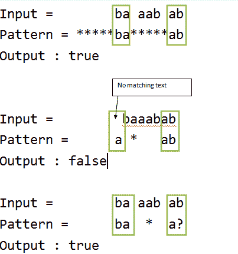

# 动态编程|通配符模式匹配|线性时间和恒定空间

> 原文:[https://www . geesforgeks . org/dynamic-programming-通配符-模式匹配-线性-时间-常数-空间/](https://www.geeksforgeeks.org/dynamic-programming-wildcard-pattern-matching-linear-time-constant-space/)

给定文本和通配符模式，查找通配符模式是否与文本匹配。匹配应该覆盖整个文本(而不是部分文本)。
通配符模式可以包括字符“？”和' *:

*   '?'–匹配任何单个字符
*   *–匹配任何字符序列(包括空序列)

**先决条件:** [动态编程](https://www.geeksforgeeks.org/dynamic-programming/) | [通配符模式匹配](https://www.geeksforgeeks.org/wildcard-pattern-matching/)
**示例:**

```
Text = "baaabab",
Pattern = “*****ba*****ab", output : true
Pattern = "baaa?ab", output : true
Pattern = "ba*a?", output : true
Pattern = "a*ab", output : false 
```



每次出现“？”通配符模式中的字符可以替换为任何其他字符，并且每次出现“*”时都可以替换为一系列字符，以便替换后通配符模式与输入字符串相同。

我们在这里讨论了一个解决方案，它具有 O(m x n)时间和 O(m x n)空间复杂度。
为了应用优化，我们将首先注意 **BASE CASE** ，它说，如果模式的长度为零，那么只有当我们必须与之匹配的文本的长度也为零时，答案才为真。
**算法:**

1.  让我成为指向文本当前字符的标记。
    让 j 作为指向图案当前字符的标记。
    让 index_txt 作为标记，指向我们在模式中遇到“*”的文本字符。
    让 index_pat 成为指向模式中“*”位置的标记。
2.  在任何时刻，如果我们观察到 txt[i] == pat[j]，那么我们增加 I 和 j，因为在这种情况下不需要执行任何操作。
3.  如果我们遇到帕特[j] == '？'，则它类似于步骤–( 2)中提到的情况，即“？”具有与任何单个字符匹配的属性。
4.  如果我们遇到 pat[j] == '* '，那么我们更新 index_txt 的值，并且 index_pat 作为' * '具有匹配任何字符序列(包括空序列)的属性，并且我们将增加 j 的值，以将模式的下一个字符与文本的当前字符进行比较。(因为我所代表的人物还没有回答)。
5.  现在如果 txt[i] == pat[j]，并且我们之前遇到过一个' * '，那么就说明' * '包含了空序列，否则如果 txt[i]！= pat[j]，一个字符需要由' * '提供，这样当前的字符匹配就发生了，然后我需要随着它现在被应答而递增，但是由 j 表示的字符仍然需要被应答，因此，j = index_pat + 1，i = index_txt + 1(作为' * '也可以捕获其他字符)，index_txt++(作为文本中的当前字符被匹配)。
6.  如果步骤–( 5)无效，这意味着 txt[i]！= pat[j]，我们也没有遇到“*”，这意味着模式不可能与字符串匹配。(返回 false)。
7.  检查 j 是否达到最终值，然后返回最终答案。

**让我们看看上面的算法在起作用，然后我们将进入编码部分:**
text = " baabab "
pattern = " * * * * * ba * * * * * ab "
**NOW application THE ALGORITHM**
Step–(1):I = 0(I–>' b ')
j = 0(j–>' *)
index _ txt =-1
index _ pat =-1
**注:T0**
**第一个比较:-**
正如我们在这里看到的那样，pat[j] == '* '，因此直接跳到 step –( 4)。
Step –( 4):index _ txt = I(index _ txt–>' b ')
index _ pat = j(index _ pat–>' *)
j++(j–>' *)
经过四次以上的比较:I = 0(I–>' b ')
j = 5(j–>' b ')
index _ txt = 0(index _ txt–【】
Step –( 5):I = 1(I–>' a ')
j = 6(j–>' a ')
index _ txt = 0(index _ txt–>' b ')
index _ pat = 4(index _ pat–>' *)
**第七次比较:-**
Step–(5):I = 2(I–>' a ')

**eighth COMPARISON:-**
Step –( 4):I = 2(I–>' a ')
j = 8(j–>' *)
index _ txt = 2(index _ txt–>' a ')
index _ pat = 7(index _ pat–>' *)
经过四次以上的比较:I = 2(I–>' a ')

**第十三次比较:-**
Step –( 5):I = 3(I–>' a ')
j = 13(j–>' b ')
index _ txt = 2(index _ txt–>' a ')
index _ pat = 11(index _ pat–>' *)
**第十四次比较:-**
Step–
index _ pat = 11(index _ pat–>' *)
**第十五次比较:-**
Step –( 5):I = 4(I–>' b ')
j = 13(j–>' b ')
index _ txt = 3(index _ txt–>' a ')
index _ pat = 11(index _ pat–

index _ txt = 3(index _ txt–>' a ')
index _ pat = 11(index _ pat–>' *)
**第十七次比较:-**
Step–(5):I = 4(I–>' b ')
j = 12(j–>' a ')
index _ txt = 4(index _ txt–>' b ')

j = 12(j–>' a ')
index _ txt = 5(index _ txt–>' a ')
index _ pat = 11(index _ pat–>' *)
**第十九次比较:-**
Step –( 5):I = 6(I–>' b ')
j = 13(j–>' :I = 7(I–>end)
j = 14(j–>end)
index _ txt = 5(index _ txt–>' a ')
index _ pat = 11(index _ pat–>' *)
**注:现在我们将脱离循环运行 STEP–7。**
Step –( 7):j 已经出现在其结束位置，因此答案为真。

下面是上述方法的实现:

## C++

```
// C++ program to implement wildcard
// pattern matching algorithm
#include <bits/stdc++.h>
using namespace std;

// Function that matches input text
// with given wildcard pattern
bool strmatch(char txt[], char pat[],
              int n, int m)
{

    // empty pattern can only
    // match with empty string.
    // Base Case :
    if (m == 0)
        return (n == 0);

    // step-1 :
    // initialize markers :
    int i = 0, j = 0, index_txt = -1,
                       index_pat = -1;

    while (i < n)
    {

        // For step - (2, 5)
        if (j < m && txt[i] == pat[j])
        {
            i++;
            j++;
        }

        // For step - (3)
        else if (j < m && pat[j] == '?')
        {
            i++;
            j++;
        }

        // For step - (4)
        else if (j < m && pat[j] == '*')
        {
            index_txt = i;
            index_pat = j;
            j++;
        }

        // For step - (5)
        else if (index_pat != -1)
        {
            j = index_pat + 1;
            i = index_txt + 1;
            index_txt++;
        }

        // For step - (6)
        else
        {
            return false;
        }
    }

    // For step - (7)
    while (j < m && pat[j] == '*')
    {
        j++;
    }

    // Final Check
    if (j == m)
    {
        return true;
    }

    return false;
}

// Driver code
int main()
{

    char str[] = "baaabab";
    char pattern[] = "*****ba*****ab";
    // char pattern[] = "ba*****ab";
    // char pattern[] = "ba*ab";
    // char pattern[] = "a*ab";

    if (strmatch(str, pattern,
                 strlen(str), strlen(pattern)))
        cout << "Yes" << endl;
    else
        cout << "No" << endl;

    char pattern2[] = "a*****ab";
    if (strmatch(str, pattern2,
                 strlen(str), strlen(pattern2)))
        cout << "Yes" << endl;
    else
        cout << "No" << endl;

    return 0;
}
```

## Java 语言(一种计算机语言，尤用于创建网站)

```
// Java program to implement wildcard
// pattern matching algorithm
class GFG {

    // Function that matches input text
    // with given wildcard pattern
    static boolean strmatch(char txt[], char pat[],
                            int n, int m)
    {
        // empty pattern can only
        // match with empty string.
        // Base Case :
        if (m == 0)
            return (n == 0);

        // step-1 :
        // initialize markers :
        int i = 0, j = 0, index_txt = -1,
            index_pat = -1;

        while (i < n)
        {

            // For step - (2, 5)
            if (j < m && txt[i] == pat[j])
            {
                i++;
                j++;
            }

            // For step - (3)
            else if (j < m && pat[j] == '?')
            {
                i++;
                j++;
            }

            // For step - (4)
            else if (j < m && pat[j] == '*')
            {
                index_txt = i;
                index_pat = j;
                j++;
            }

            // For step - (5)
            else if (index_pat != -1)
            {
                j = index_pat + 1;
                i = index_txt + 1;
                index_txt++;
            }

            // For step - (6)
            else
            {
                return false;
            }
        }

        // For step - (7)
        while (j < m && pat[j] == '*')
        {
            j++;
        }

        // Final Check
        if (j == m)
        {
            return true;
        }

        return false;
    }

    // Driver code
    public static void main(String[] args)
    {

        char str[] = "baaabab".toCharArray();
        char pattern[] = "*****ba*****ab".toCharArray();
        // char pattern[] = "ba*****ab";
        // char pattern[] = "ba*ab";
        // char pattern[] = "a*ab";

        if (strmatch(str, pattern, str.length,
                     pattern.length))
            System.out.println("Yes");
        else
            System.out.println("No");

        char pattern2[] = "a*****ab".toCharArray();
        if (strmatch(str, pattern2, str.length,
                     pattern2.length))
            System.out.println("Yes");
        else
            System.out.println("No");
    }
}

// This code is contributed by Rajput-Ji
```

## 蟒蛇 3

```
# Python3 program to implement
# wildcard pattern matching
# algorithm

# Function that matches input
# txt with given wildcard pattern
def stringmatch(txt, pat, n, m):

    # empty pattern can only
    # match with empty sting
    # Base case
    if (m == 0):
        return (n == 0)

    # step 1
    # initialize markers :
    i = 0
    j = 0
    index_txt = -1
    index_pat = -1
    while(i < n - 2):

        # For step - (2, 5)
        if (j < m and txt[i] == pat[j]):
            i += 1
            j += 1

        # For step - (3)
        elif(j < m and pat[j] == '?'):
            i += 1
            j += 1

        # For step - (4)
        elif(j < m and pat[j] == '*'):
            index_txt = i
            index_pat = j
            j += 1

        # For step - (5)
        elif(index_pat != -1):
            j = index_pat + 1
            i = index_txt + 1
            index_txt += 1

        # For step - (6)
        else:
            return False
    # For step - (7)
    while (j < m and pat[j] == '*'):
        j += 1

    # Final Check
    if(j == m):
        return True

    return False

# Driver code
strr = "baaabab"
pattern = "*****ba*****ab"

# char pattern[] = "ba*****ab"
# char pattern[] = "ba * ab"
# char pattern[] = "a * ab"
if (stringmatch(strr, pattern, len(strr),
                               len(pattern))):
    print("Yes")
else:
    print( "No")

pattern2 = "a*****ab";
if (stringmatch(strr, pattern2, len(strr),
                                len(pattern2))):
    print("Yes")
else:
    print( "No")

# This code is contributed
# by sahilhelangia
```

## C#

```
// C# program to implement wildcard
// pattern matching algorithm
using System;

class GFG {

    // Function that matches input text
    // with given wildcard pattern
    static Boolean strmatch(char[] txt, char[] pat,
                            int n, int m)
    {
        // empty pattern can only
        // match with empty string.
        // Base Case :
        if (m == 0)
            return (n == 0);

        // step-1 :
        // initialize markers :
        int i = 0, j = 0, index_txt = -1,
            index_pat = -1;

        while (i < n) {

            // For step - (2, 5)
            if (j < m && txt[i] == pat[j]) {
                i++;
                j++;
            }

            // For step - (3)
            else if (j < m && pat[j] == '?') {
                i++;
                j++;
            }

            // For step - (4)
            else if (j < m && pat[j] == '*') {
                index_txt = i;
                index_pat = j;
                j++;
            }

            // For step - (5)
            else if (index_pat != -1) {
                j = index_pat + 1;
                i = index_txt + 1;
                index_txt++;
            }

            // For step - (6)
            else {
                return false;
            }
        }

        // For step - (7)
        while (j < m && pat[j] == '*') {
            j++;
        }

        // Final Check
        if (j == m) {
            return true;
        }

        return false;
    }

    // Driver code
    public static void Main(String[] args)
    {
        char[] str = "baaabab".ToCharArray();
        char[] pattern = "*****ba*****ab".ToCharArray();
        // char pattern[] = "ba*****ab";
        // char pattern[] = "ba*ab";
        // char pattern[] = "a*ab";

        if (strmatch(str, pattern, str.Length,
                     pattern.Length))
            Console.WriteLine("Yes");
        else
            Console.WriteLine("No");

        char[] pattern2 = "a*****ab".ToCharArray();
        if (strmatch(str, pattern2, str.Length,
                     pattern2.Length))
            Console.WriteLine("Yes");
        else
            Console.WriteLine("No");
    }
}

// This code is contributed by Rajput-Ji
```

## java 描述语言

```
<script>
    // Javascript program to implement wildcard
    // pattern matching algorithm

    // Function that matches input text
    // with given wildcard pattern
    function strmatch(txt, pat, n, m)
    {
        // empty pattern can only
        // match with empty string.
        // Base Case :
        if (m == 0)
            return (n == 0);

        // step-1 :
        // initialize markers :
        let i = 0, j = 0, index_txt = -1,
            index_pat = -1;

        while (i < n) {

            // For step - (2, 5)
            if (j < m && txt[i] == pat[j]) {
                i++;
                j++;
            }

            // For step - (3)
            else if (j < m && pat[j] == '?') {
                i++;
                j++;
            }

            // For step - (4)
            else if (j < m && pat[j] == '*') {
                index_txt = i;
                index_pat = j;
                j++;
            }

            // For step - (5)
            else if (index_pat != -1) {
                j = index_pat + 1;
                i = index_txt + 1;
                index_txt++;
            }

            // For step - (6)
            else {
                return false;
            }
        }

        // For step - (7)
        while (j < m && pat[j] == '*') {
            j++;
        }

        // Final Check
        if (j == m) {
            return true;
        }

        return false;
    }

    let str = "baaabab".split('');
    let pattern = "*****ba*****ab".split('');

    if (strmatch(str, pattern, str.length, pattern.length))
      document.write("Yes" + "</br>");
    else
      document.write("No" + "</br>");

    let pattern2 = "a*****ab".split('');
    if (strmatch(str, pattern2, str.length, pattern2.length))
      document.write("Yes" + "</br>");
    else
      document.write("No");

</script>
```

**Output:** 

```
Yes
No
```

**复杂度分析:**

*   **时间复杂度:** O(m + n)，其中‘m’和‘n’分别是文本和模式的长度。
*   **辅助空间:** O(1)。
    不使用任何数据结构来存储值