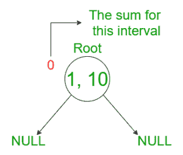
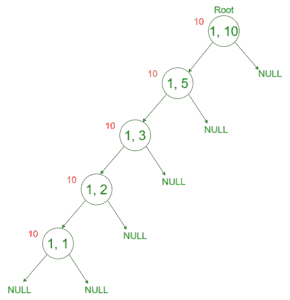
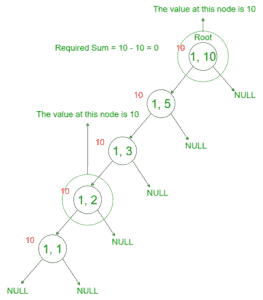
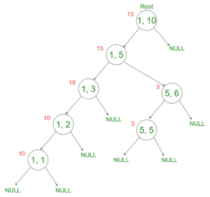

# 动态段树:带点更新的范围和在线查询

> 原文:[https://www . geesforgeks . org/dynamic-segment-trees-online-query-for-range-sum-with-point-updates/](https://www.geeksforgeeks.org/dynamic-segment-trees-online-queries-for-range-sum-with-point-updates/)

**先决条件:** [段树](http://www.geeksforgeeks.org/segment-tree-set-1-sum-of-given-range/)
给定一个数字 **N** ，该数字代表初始化为 0 的数组的大小和 **Q** 要处理的查询，其中有两种类型的查询:

1.  1 P V:将数值 **V** 置于 **P** 位置。
2.  2 L R:输出 **L** 到 **R** 的数值之和。

任务是回答这些问题。

**约束:**

*   1 ≤ N ≤ 10 <sup>18</sup>
*   Q ≤ 10 <sup>5</sup>
*   1≤r≤n

**注:**查询在线。因此:

*   l =(pre usnsworth+l)% n+1
*   R =(先前答案+ R) % N + 1

**示例:**

> **输入:** N = 5，Q = 5，arr[][] = {{1，2，3}，{1，1，4}，{1，3，5}，{1，4，7}，{2，3，4 } }
> T3】输出:12
> T6】解释:
> 有五个查询。由于 N = 5，因此，最初，数组为{0，0，0，0，0}
> 对于查询 1: 1 2 3 数组= {0，3，0，0，0}
> 对于查询 2: 1 1 4 数组= {4，3，0，0，0}，
> 对于查询 3: 1 3 5 数组= {4，3，5，0，0}
> 对于查询 4: 1 4 7 数组= {4，3，5，7，0}
> 对于查询 5
> 
> **输入:** N = 3，Q = 2，arr[][] = {{1，1，1}，{1，2，2}，{1，3，3}}
> **输出:** 0

**进场:**这里，由于更新量较高，[卡丹的算法](https://www.geeksforgeeks.org/largest-sum-contiguous-subarray/)不太好用。此外，由于假设查询是在线的，简单的段树将不能解决这个问题，因为元素数量的约束非常高。因此，在这个问题中使用了一种新的数据结构，即动态段树。
**动态段树:**动态段树不是新的数据结构。与[段树](http://www.geeksforgeeks.org/segment-tree-set-1-sum-of-given-range/)非常相似。以下是动态段树的属性:

*   每当要更新新的间隔时，都会创建一个节点，而不是使用数组来表示间隔。
*   以下是动态段树的节点结构:

## C++

```
// Every node contains the value and
// the left subtree and right subtree
struct Node {
    long long value;
    struct Node *L, *R;
};

struct Node* getnode()
{
    struct Node* temp = new struct Node;
    temp->value = 0;
    temp->L = NULL;
    temp->R = NULL;
    return temp;
}
```

*   显然，上面的结构与一个[二叉查找树](http://www.geeksforgeeks.org/binary-search-tree-set-1-search-and-insertion/)相同。在每个节点中，我们存储节点的值和指向左右子树的两个指针。
*   根的间隔是从[1，N]开始，左边子树的间隔是[1，N/2]，右边子树的间隔是[N/2 + 1，N]。
*   同样，对于每个节点，我们可以计算它所代表的区间。假设当前节点的区间为[L，R]。然后，其左右子树的区间分别为[L，(L + R)/2]和[(L + R)/2+1，R]。
*   由于我们只在需要时才创建新节点，因此[段树](http://www.geeksforgeeks.org/segment-tree-set-1-sum-of-given-range/)中的 build()函数被完全删除。

在进入运算算法之前，让我们定义一下本文中使用的术语:

*   **节点的间隔:**是节点所代表的间隔。
*   **所需间隔:**要计算总和的间隔。
*   **所需索引:**需要更新的索引。

以下是用于对具有上述属性的树进行操作的算法:

1.  **点更新:**点更新使用以下算法:
    1.  从根节点开始。
    2.  如果节点处的间隔与所需的索引不重叠，则返回。
    3.  如果该节点为空条目，则创建一个具有适当间隔的新节点，并针对创建的每个新子节点返回步骤 2，进入该节点。
    4.  如果间隔和存储值的索引相等，则在该节点将值存储到中。
    5.  如果节点处的间隔与所需索引部分重叠，则下降到其子节点，并从步骤 2 继续执行。
2.  **求每个查询的和:**使用以下算法求每个查询的和:
    1.  从根节点开始。
    2.  如果节点为空，或者该节点的间隔与所需间隔不重叠，则返回 0。
    3.  如果节点上的间隔与所需的间隔完全重叠，则返回存储在节点上的值。
    4.  如果节点处的间隔与所需间隔部分重叠，则下降到其子节点，并对其两个子节点继续执行步骤 2。

**示例:**让我们用一个示例来可视化更新和求和。假设 N = 10，需要在树上执行的操作如下:

1.  在位置 1 插入 10。
2.  求从 2 到 8 的指数值之和。
3.  在位置 5 插入 3。
4.  求 3 到 6 的指数值之和。

*   最初，对于值 N = 10，树是空的。因此:



*   在位置 1 插入 10。为此，创建一个新节点，直到我们获得所需的时间间隔。因此:



*   求从 2 到 8 的指数值之和。为了做到这一点，从[1，8]中找到和，并从中减去值[1，2]。由于节点[1，8]尚未创建，因此[1，8]的值是根[1，10]的值。因此:



*   在位置 5 插入 3。为此，创建一个新节点，直到我们获得所需的时间间隔。因此:



下面是上述方法的实现:

## C++

```
// C++ program for the implementation
// of the Dynamic segment tree and
// perform the range updates on the
// given queries

#include <bits/stdc++.h>

using namespace std;
typedef long long ll;

// Structure of the node
struct Node {

    ll value;
    struct Node *L, *R;
};

// Structure to get the newly formed
// node
struct Node* getnode()
{
    struct Node* temp = new struct Node;
    temp->value = 0;
    temp->L = NULL;
    temp->R = NULL;
    return temp;
}

// Creating the Root node
struct Node* root;

// Function to perform the point update
// on the dynamic segment tree
void UpdateHelper(struct Node* curr, ll index,
                  ll L, ll R, ll val)
{

    // If the index is not overlapping
    // with the index
    if (L > index || R < index)
        return;

    // If the index is completely overlapping
    // with the index
    if (L == R && L == index) {

        // Update the value of the node
        // to the given value
        curr->value = val;
        return;
    }

    // Computing the middle index if none
    // of the above base cases are satisfied
    ll mid = L - (L - R) / 2;
    ll sum1 = 0, sum2 = 0;

    // If the index is in the left subtree
    if (index <= mid) {

        // Create a new node if the left
        // subtree is is null
        if (curr->L == NULL)
            curr->L = getnode();

        // Recursively call the function
        // for the left subtree
        UpdateHelper(curr->L, index, L, mid, val);
    }

    // If the index is in the right subtree
    else {

        // Create a new node if the right
        // subtree is is null
        if (curr->R == NULL)
            curr->R = getnode();

        // Recursively call the function
        // for the right subtree
        UpdateHelper(curr->R, index, mid + 1, R, val);
    }

    // Storing the sum of the left subtree
    if (curr->L)
        sum1 = curr->L->value;

    // Storing the sum of the right subtree
    if (curr->R)
        sum2 = curr->R->value;

    // Storing the sum of the children into
    // the node's value
    curr->value = sum1 + sum2;
    return;
}

// Function to find the sum of the
// values given by the range
ll queryHelper(struct Node* curr, ll a,
               ll b, ll L, ll R)
{

    // Return 0 if the root is null
    if (curr == NULL)
        return 0;

    // If the index is not overlapping
    // with the index, then the node
    // is not created. So sum is 0
    if (L > b || R < a)
        return 0;

    // If the index is completely overlapping
    // with the index, return the node's value
    if (L >= a && R <= b)
        return curr->value;

    ll mid = L - (L - R) / 2;

    // Return the sum of values stored
    // at the node's children
    return queryHelper(curr->L, a, b, L, mid)
           + queryHelper(curr->R, a, b, mid + 1, R);
}

// Function to call the queryHelper
// function to find the sum for
// the query
ll query(int L, int R)
{
    return queryHelper(root, L, R, 1, 10);
}

// Function to call the UpdateHelper
// function for the point update
void update(int index, int value)
{
    UpdateHelper(root, index, 1, 10, value);
}

// Function to perform the operations
// on the tree
void operations()
{
    // Creating an empty tree
    root = getnode();

    // Update the value at position 1 to 10
    update(1, 10);

    // Update the value at position 3 to 5
    update(3, 5);

    // Finding sum for the range [2, 8]
    cout << query(2, 8) << endl;

    // Finding sum for the range [1, 10]
    cout << query(1, 10) << endl;

}

// Driver code
int main()
{
    operations();

    return 0;
}
```

## Java 语言(一种计算机语言，尤用于创建网站)

```
// Java program for the implementation
// of the Dynamic segment tree and
// perform the range updates on the
// given queries

class GFG {

    // Structure of the node
    static class Node {
        int value;
        Node L, R;

    }

    // Structure to get the newly formed
    // node
    static Node getnode() {
        Node temp = new Node();
        temp.value = 0;
        temp.L = null;
        temp.R = null;
        return temp;
    }

    // Creating the Root node
    static Node root = new Node();

    // Function to perform the point update
    // on the dynamic segment tree
    static void UpdateHelper(Node curr, int index, int L, int R, int val) {

        // If the index is not overlapping
        // with the index
        if (L > index || R < index)
            return;

        // If the index is completely overlapping
        // with the index
        if (L == R && L == index) {

            // Update the value of the node
            // to the given value
            curr.value = val;
            return;
        }

        // Computing the middle index if none
        // of the above base cases are satisfied
        int mid = L - (L - R) / 2;
        int sum1 = 0, sum2 = 0;

        // If the index is in the left subtree
        if (index <= mid) {

            // Create a new node if the left
            // subtree is is null
            if (curr.L == null)
                curr.L = getnode();

            // Recursively call the function
            // for the left subtree
            UpdateHelper(curr.L, index, L, mid, val);
        }

        // If the index is in the right subtree
        else {

            // Create a new node if the right
            // subtree is is null
            if (curr.R == null)
                curr.R = getnode();

            // Recursively call the function
            // for the right subtree
            UpdateHelper(curr.R, index, mid + 1, R, val);
        }

        // Storing the sum of the left subtree
        if (curr.L != null)
            sum1 = curr.L.value;

        // Storing the sum of the right subtree
        if (curr.R != null)
            sum2 = curr.R.value;

        // Storing the sum of the children into
        // the node's value
        curr.value = sum1 + sum2;
        return;
    }

    // Function to find the sum of the
    // values given by the range
    static int queryHelper(Node curr, int a, int b, int L, int R) {

        // Return 0 if the root is null
        if (curr == null)
            return 0;

        // If the index is not overlapping
        // with the index, then the node
        // is not created. So sum is 0
        if (L > b || R < a)
            return 0;

        // If the index is completely overlapping
        // with the index, return the node's value
        if (L >= a && R <= b)
            return curr.value;

        int mid = L - (L - R) / 2;

        // Return the sum of values stored
        // at the node's children
        return queryHelper(curr.L, a, b, L, mid) + queryHelper(curr.R, a, b, mid + 1, R);
    }

    // Function to call the queryHelper
    // function to find the sum for
    // the query
    static int query(int L, int R) {
        return queryHelper(root, L, R, 1, 10);
    }

    // Function to call the UpdateHelper
    // function for the point update
    static void update(int index, int value) {
        UpdateHelper(root, index, 1, 10, value);
    }

    // Function to perform the operations
    // on the tree
    static void operations() {
        // Creating an empty tree
        root = getnode();

        // Update the value at position 1 to 10
        update(1, 10);

        // Update the value at position 3 to 5
        update(3, 5);

        // Finding sum for the range [2, 8]
        System.out.println(query(2, 8));

        // Finding sum for the range [1, 10]
        System.out.println(query(1, 10));

    }

    // Driver code
    public static void main(String[] args) {
        operations();
    }
}

// This code is contributed by sanjeev2552
```

## java 描述语言

```
<script>

// Javascript program for the implementation
// of the Dynamic segment tree and perform
// the range updates on the given queries

// Structure of the node
class Node
{
    constructor()
    {
        this.L = null;
        this.R = null;
        this.value = 0;
    }
}

// Structure to get the newly formed
// node
function getnode()
{
    let temp = new Node();
    return temp;
}

// Creating the Root node
let root = new Node();

// Function to perform the point update
// on the dynamic segment tree
function UpdateHelper(curr, index, L, R, val)
{

    // If the index is not overlapping
    // with the index
    if (L > index || R < index)
        return;

    // If the index is completely overlapping
    // with the index
    if (L == R && L == index)
    {

        // Update the value of the node
        // to the given value
        curr.value = val;
        return;
    }

    // Computing the middle index if none
    // of the above base cases are satisfied
    let mid = L - parseInt((L - R) / 2, 10);
    let sum1 = 0, sum2 = 0;

    // If the index is in the left subtree
    if (index <= mid)
    {

        // Create a new node if the left
        // subtree is is null
        if (curr.L == null)
            curr.L = getnode();

        // Recursively call the function
        // for the left subtree
        UpdateHelper(curr.L, index, L, mid, val);
    }

    // If the index is in the right subtree
    else
    {

        // Create a new node if the right
        // subtree is is null
        if (curr.R == null)
            curr.R = getnode();

        // Recursively call the function
        // for the right subtree
        UpdateHelper(curr.R, index, mid + 1, R, val);
    }

    // Storing the sum of the left subtree
    if (curr.L != null)
        sum1 = curr.L.value;

    // Storing the sum of the right subtree
    if (curr.R != null)
        sum2 = curr.R.value;

    // Storing the sum of the children into
    // the node's value
    curr.value = sum1 + sum2;
    return;
}

// Function to find the sum of the
// values given by the range
function queryHelper(curr, a, b, L, R)
{

    // Return 0 if the root is null
    if (curr == null)
        return 0;

    // If the index is not overlapping
    // with the index, then the node
    // is not created. So sum is 0
    if (L > b || R < a)
        return 0;

    // If the index is completely overlapping
    // with the index, return the node's value
    if (L >= a && R <= b)
        return curr.value;

    let mid = L - parseInt((L - R) / 2, 10);

    // Return the sum of values stored
    // at the node's children
    return queryHelper(curr.L, a, b, L, mid) +
           queryHelper(curr.R, a, b, mid + 1, R);
}

// Function to call the queryHelper
// function to find the sum for
// the query
function query(L, R)
{
    return queryHelper(root, L, R, 1, 10);
}

// Function to call the UpdateHelper
// function for the point update
function update(index, value)
{
    UpdateHelper(root, index, 1, 10, value);
}

// Function to perform the operations
// on the tree
function operations()
{

    // Creating an empty tree
    root = getnode();

    // Update the value at position 1 to 10
    update(1, 10);

    // Update the value at position 3 to 5
    update(3, 5);

    // Finding sum for the range [2, 8]
    document.write(query(2, 8) + "</br>");

    // Finding sum for the range [1, 10]
    document.write(query(1, 10) + "</br>");
}

// Driver code
operations();

// This code is contributed by mukesh07

</script>
```

## 蟒蛇 3

```
# C++ program for the implementation
# of the Dynamic segment tree and
# perform the range updates on the
# given queries

# Structure of the node
class Node:
    def __init__(self):
        self.value=-1
        self.L, self.R=None,None

# Structure to get the newly formed
# node
def getnode():
    temp = Node()
    temp.value = 0
    temp.L = None
    temp.R = None
    return temp

# Creating the Root node
root=None

# Function to perform the point update
# on the dynamic segment tree
def UpdateHelper(curr, index, L, R, val):

    # If the index is not overlapping
    # with the index
    if (L > index or R < index):
        return

    # If the index is completely overlapping
    # with the index
    if (L == R and L == index) :

        # Update the value of the node
        # to the given value
        curr.value = val
        return

    # Computing the middle index if none
    # of the above base cases are satisfied
    mid = int(L - (L - R) / 2)
    sum1 = 0; sum2 = 0

    # If the index is in the left subtree
    if (index <= mid) :

        # Create a new node if the left
        # subtree is is None
        if (curr.L == None):
            curr.L = getnode()

        # Recursively call the function
        # for the left subtree
        UpdateHelper(curr.L, index, L, mid, val)

    # If the index is in the right subtree
    else :

        # Create a new node if the right
        # subtree is is None
        if (curr.R == None):
            curr.R = getnode()

        # Recursively call the function
        # for the right subtree
        UpdateHelper(curr.R, index, mid + 1, R, val)

    # Storing the sum of the left subtree
    if (curr.L):
        sum1 = curr.L.value

    # Storing the sum of the right subtree
    if (curr.R):
        sum2 = curr.R.value

    # Storing the sum of the children into
    # the node's value
    curr.value = sum1 + sum2
    return

# Function to find the sum of the
# values given by the range
def queryHelper(curr, a, b, L, R):

    # Return 0 if the root is None
    if (curr == None):
        return 0

    # If the index is not overlapping
    # with the index, then the node
    # is not created. So sum is 0
    if (L > b or R < a):
        return 0

    # If the index is completely overlapping
    # with the index, return the node's value
    if (L >= a and R <= b):
        return curr.value

    mid = int(L - (L - R) / 2)

    # Return the sum of values stored
    # at the node's children
    return queryHelper(curr.L, a, b, L, mid) + queryHelper(curr.R, a, b, mid + 1, R)

# Function to call the queryHelper
# function to find the sum for
# the query
def query(L, R):
    return queryHelper(root, L, R, 1, 10)

# Function to call the UpdateHelper
# function for the point update
def update(index, value):
    UpdateHelper(root, index, 1, 10, value)

# Function to perform the operations
# on the tree
def operations():
    global root
    # Creating an empty tree
    root = getnode()

    # Update the value at position 1 to 10
    update(1, 10)

    # Update the value at position 3 to 5
    update(3, 5)

    # Finding sum for the range [2, 8]
    print(query(2, 8))

    # Finding sum for the range [1, 10]
    print(query(1, 10))

# Driver code
if __name__ == '__main__':
    operations()
```

**Output:** 

```
5
15
```

**时间复杂度:**O(Q * logN)
T3】辅助空间: O(N)