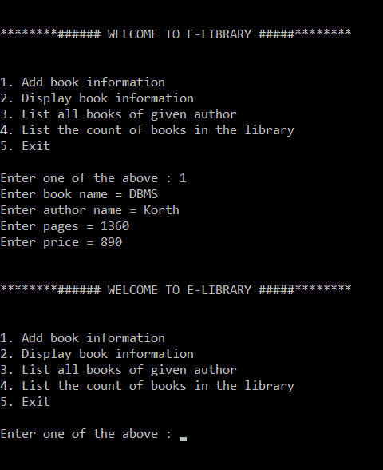
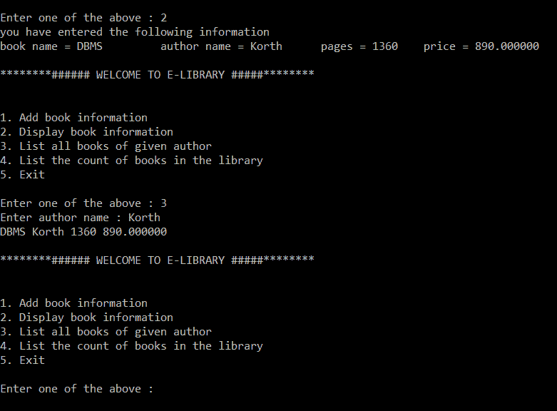
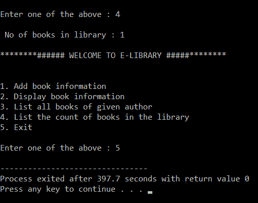

# 电子图书馆管理系统

> 原文:[https://www.geeksforgeeks.org/e-library-management-system/](https://www.geeksforgeeks.org/e-library-management-system/)

在本文中，我们将讨论创建电子图书馆管理系统的方法，其中用户有以下选项:

*   添加图书信息。
*   显示图书信息。
*   列出给定作者的所有书籍。
*   列出图书馆的藏书数量。

**所需功能:**

*   如果用户试图添加一本书，那么用户必须提供以下关于该书的具体信息:
    *   输入图书名称:
    *   输入作者姓名:
    *   输入页面:
    *   输入价格:
*   当用户试图显示特定作者的所有书籍时，用户必须输入作者的姓名:
    *   输入作者姓名:
*   电子图书馆管理系统还必须能够清点图书馆中所有可用的书籍。

以下是实施电子图书馆管理系统的程序:

## C

```
// C program for the E-library
// Management System
#include <stdio.h>
#include <stdlib.h>
#include <string.h>

// Create Structure of Library
struct library {
    char book_name[20];
    char author[20];
    int pages;
    float price;
};

// Driver Code
int main()
{
    // Create a instance
    struct library lib[100];

    char ar_nm[30], bk_nm[30];

    // Keep the track of the number of
    // of books available in the library
    int i, input, count;

    i = input = count = 0;

    // Iterate the loop
    while (input != 5) {

        printf("\n\n********######"
               "WELCOME TO E-LIBRARY "
               "#####********\n");
        printf("\n\n1\. Add book infor"
               "mation\n2\. Display "
               "book information\n");
        printf("3\. List all books of "
               "given author\n");
        printf(
            "4\. List the count of book"
            "s in the library\n");
        printf("5\. Exit");

        // Enter the book details
        printf("\n\nEnter one of "
               "the above: ");
        scanf("%d", &input);

        // Process the input
        switch (input) {

        // Add book
        case 1:

            printf("Enter book name = ");
            scanf("%s", lib[i].book_name);

            printf("Enter author name = ");
            scanf("%s", lib[i].author);

            printf("Enter pages = ");
            scanf("%d", &lib[i].pages);

            printf("Enter price = ");
            scanf("%f", &lib[i].price);
            count++;

            break;

        // Print book information
        case 2:
            printf("you have entered"
                   " the following "
                   "information\n");
            for (i = 0; i < count; i++) {

                printf("book name = %s",
                       lib[i].book_name);

                printf("\t author name = %s",
                       lib[i].author);

                printf("\t  pages = %d",
                       lib[i].pages);

                printf("\t  price = %f",
                       lib[i].price);
            }
            break;

        // Take the author name as input
        case 3:
            printf("Enter author name : ");
            scanf("%s", ar_nm);
            for (i = 0; i < count; i++) {

                if (strcmp(ar_nm,
                           lib[i].author)
                    == 0)
                    printf("%s %s %d %f",
                           lib[i].book_name,
                           lib[i].author,
                           lib[i].pages,
                           lib[i].price);
            }
            break;

        // Print total count
        case 4:
            printf("\n No of books in "
                   "brary : %d",
                   count);
            break;
        case 5:
            exit(0);
        }
    }
    return 0;
}
```

**输出:**

*   显示选项 1 的功能和输入:
    
*   对于选择 2 和 3:
    [](https://media.geeksforgeeks.org/wp-content/uploads/20210129011554/Screenshot112.png)
*   对于选择 4 和 5:
    [](https://media.geeksforgeeks.org/wp-content/uploads/20210129011841/Screenshot114.png)