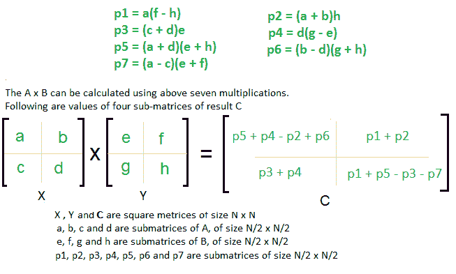
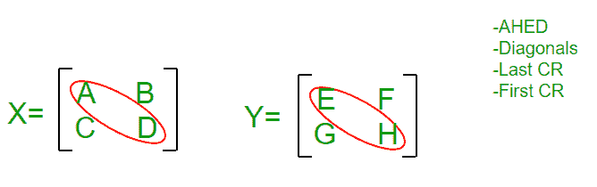
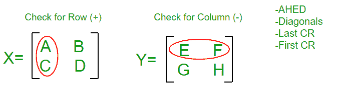
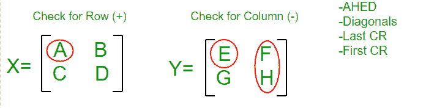
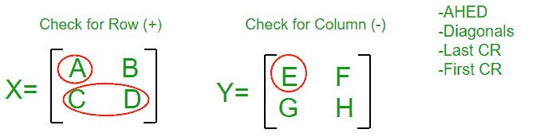
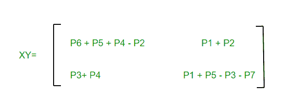

# 记忆斯特拉森矩阵方程的简单方法

> 原文:[https://www . geesforgeks . org/easy-way-memory-strassens-matrix-equation/](https://www.geeksforgeeks.org/easy-way-remember-strassens-matrix-equation/)

斯特拉森矩阵是一种分治法，帮助我们将两个矩阵相乘(大小为 n×n)。

你可以参考链接，先了解一下斯特拉森矩阵:
[分而治之|第五集(斯特拉森矩阵乘法)](https://www.geeksforgeeks.org/strassens-matrix-multiplication/)

但是这个方法需要死记几个方程，所以我来告诉你记住那些最简单的方法:

你只需要记住 4 条规则:

*   学习为“前进”
*   斜的
*   最后一次注册
*   第一华润

此外，将 X 视为(行+)，将 Y 视为(列-)矩阵

遵循以下步骤:

*   写 P1 = A；P2 = H；P3 =东；P4 = D
*   For P5 we will use Diagonal Rule i.e.
    (Sum the Diagonal Elements Of Matrix X ) * (Sum the Diagonal Elements Of Matrix Y ), we get
    P5 = (A + D)* (E + H)

    
    P1 = A
    P2 = H
    P3 = E
    P4 = D
    P5 =(A+D)*(E+H)

*   对于 P6，我们将使用最后一个 CR 规则，即 X 的最后一列和 Y 的最后一行，并记住行+和列-因此，即(B–D)*(G+H)，我们得到
    P6 =(B–D)*(G+H)
*   For P7 we will use First CR Rule i.e. First Column of X and First Row of Y and remember that Row+ and Column- so i.e. (A – C) * (E + F), we get
    P7 = (A – C) * (E + F)

    
    P1 = A
    P2 = H
    P3 = E
    P4 = D
    P5 =(A+D)*(E+H)
    P6 =(B–D)*(G+H)
    P7 =(A–C)*(E+F)

*   Come Back to P1 : we have A there and it’s adjacent element in Y Matrix is E, since Y is Column Matrix so we select a column in Y such that E won’t come, we find F H Column, so multiply A with (F – H)
    So, finally P1 = A * (F – H)

    
    P1 = A *(F–H)
    P2 = H
    P3 = E
    P4 = D
    P5 =(A+D)*(E+H)
    P6 =(B–D)*(G+H)
    P7 =(A–C)*(E+F)

*   回到 P2:我们在那里有 H，它在 X 矩阵中的相邻元素是 D，因为 X 是行矩阵，所以我们在 X 中选择一行，这样 D 就不会出现，我们找到 A B 列，所以将 H 乘以(A + B)
    所以，最后 P2 = (A + B) * H
*   Come Back to P3 : we have E there and it’s adjacent element in X Matrix is A, since X is Row Matrix so we select a Row in X such that A won’t come, we find C D Column, so multiply E with (C + D)
    So, finally P3 = (C + D) * E

    
    P1 = A *(F–H)
    P2 = H *(A+B)
    P3 = E *(C+D)
    P4 = D
    P5 =(A+D)*(E+H)
    P6 =(B–D)*(G+H)
    P7 =(A–C)*(E+F)

*   Come Back to P4 : we have D there and it’s adjacent element in Y Matrix is H, since Y is Column Matrix so we select a column in Y such that H won’t come, we find G E Column, so multiply D with (G – E)
    So, finally P4 = D * (G – E)

    我们已经完成了 P1-P7 方程，现在我们来看最终矩阵 C 中的 C1-C4 方程:

*   记住计数:在 C2 写 P1 + P2
*   将 P3 + P4 写在其对角线位置，即 C3
*   将 P4 +五常+ P6 写在第一位，减去 P2，即 C1 = P4 +五常+P6-P2
*   Write odd values at last Position with alternating – and + sign i.e. P1 P3 P5 P7 becomes
    C4 = P1 – P3 + P5 – P7

    

本文由 **莫希特·古普塔供稿🙂** 。如果你喜欢 GeeksforGeeks 并想投稿，你也可以使用[contribute.geeksforgeeks.org](http://www.contribute.geeksforgeeks.org)写一篇文章或者把你的文章邮寄到 contribute@geeksforgeeks.org。看到你的文章出现在极客博客主页上，帮助其他极客。

如果你发现任何不正确的地方，或者你想分享更多关于上面讨论的话题的信息，请写评论。