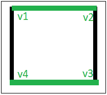

# 图的边着色

> 原文:[https://www.geeksforgeeks.org/edge-coloring-of-a-graph/](https://www.geeksforgeeks.org/edge-coloring-of-a-graph/)

在图论中，图的边着色是将“颜色”分配给图的边，使得没有两个相邻的边具有相同的颜色和最佳数量的颜色。如果两条边连接到同一个顶点，则称它们相邻。没有已知的多项式时间算法来对每个具有最佳颜色数的图进行边着色。然而，已经开发了许多算法来放宽这些标准中的一个或多个，它们只对图形的子集起作用，或者它们不总是使用最佳数量的颜色，或者它们不总是在多项式时间内运行。
**例** :

```
Input : u1 = 1, v1 = 4 
        u2 = 1, v2 = 2
        u3 = 2, v3 = 3
        u4 = 3, v4 = 4
Output : Edge 1 is of color 1
         Edge 2 is of color 2
         Edge 3 is of color 1
         Edge 4 is of color 2

The above input shows the pair of vertices(ui, vi)
who have an edge between them. The output shows the color 
assigned to the respective edges.
```



边着色是几种不同类型的图着色问题之一。上图用绿色和黑色显示了图的边着色，其中没有相邻的边具有相同的颜色。
下面是一个解决边缘着色问题的算法，可能没有使用最佳的颜色数:
**算法:**

1.  使用 BFS 遍历开始遍历图。
2.  拾取任意顶点，并为与其相连的所有边赋予不同的颜色，并将这些边标记为彩色。
3.  穿过它的一个边缘。
4.  使用新顶点重复步骤至，直到所有边都着色。

以下是上述方法的实现:

## C++

```
// C++ program to illustrate Edge Coloring
#include <bits/stdc++.h>
using namespace std;

// function to determine the edge colors
void colorEdges(int ptr, vector<vector<pair<int, int> > >& gra,
                vector<int>& edgeColors, bool isVisited[])
{
    queue<int> q;
    int c = 0;

    unordered_set<int> colored;

    // return if isVisited[ptr] is true
    if (isVisited[ptr])
        return;

    // Mark the current node visited
    isVisited[ptr] = 1;

    // Traverse all edges of current vertex
    for (int i = 0; i < gra[ptr].size(); i++) {
        // if already colored, insert it into the set
        if (edgeColors[gra[ptr][i].second] != -1)
            colored.insert(edgeColors[gra[ptr][i].second]);
    }

    for (int i = 0; i < gra[ptr].size(); i++) {
        // if not visited, inset into the queue
        if (!isVisited[gra[ptr][i].first])
            q.push(gra[ptr][i].first);

        if (edgeColors[gra[ptr][i].second] == -1) {
            // if col vector -> negative
            while (colored.find(c) != colored.end())

                // increment the color
                c++;

            // copy it in the vector
            edgeColors[gra[ptr][i].second] = c;

            // then add it to the set
            colored.insert(c);
            c++;
        }
    }

    // while queue's not empty
    while (!q.empty()) {
        int temp = q.front();
        q.pop();

        colorEdges(temp, gra, edgeColors, isVisited);
    }

    return;
}

// Driver Function
int main()
{
    set<int> empty;

    // declaring vector of vector of pairs, to define Graph
    vector<vector<pair<int, int> > > gra;

    vector<int> edgeColors;

    bool isVisited[100000] = { 0 };

    // Enter the Number of Vertices
    // and the number of edges
    int ver = 4;
    int edge = 4;

    gra.resize(ver);
    edgeColors.resize(edge, -1);

    // Enter edge & vertices of edge
    // x--; y--;
    // Since graph is undirected, push both pairs
    // (x, y) and (y, x)
    // graph[x].push_back(make_pair(y, i));
    // graph[y].push_back(make_pair(x, i));
    gra[0].push_back(make_pair(1, 0));
    gra[1].push_back(make_pair(0, 0));

    gra[1].push_back(make_pair(2, 1));
    gra[2].push_back(make_pair(1, 1));

    gra[2].push_back(make_pair(3, 2));
    gra[3].push_back(make_pair(2, 2));

    gra[0].push_back(make_pair(3, 3));
    gra[3].push_back(make_pair(0, 3));

    colorEdges(0, gra, edgeColors, isVisited);

    // printing all the edge colors
    for (int i = 0; i < edge; i++)
        cout << "Edge " << i + 1 << " is of color "
             << edgeColors[i] + 1 << "\n";

    return 0;
}
```

## 蟒蛇 3

```
# Python3 program to illustrate Edge Coloring

from queue import Queue
# function to determine the edge colors
def colorEdges(ptr, gra, edgeColors, isVisited):
    q=Queue()
    c = 0

    colored=set()

    # return if isVisited[ptr] is true
    if (isVisited[ptr]):
        return

    # Mark the current node visited
    isVisited[ptr] = True

    # Traverse all edges of current vertex
    for i in range(len(gra[ptr])) :
        # if already colored, insert it into the set
        if (edgeColors[gra[ptr][i][1]] != -1):
            colored.add(edgeColors[gra[ptr][i][1]])

    for i in range(len(gra[ptr])) :
        # if not visited, inset into the queue
        if not isVisited[gra[ptr][i][0]]:
            q.put(gra[ptr][i][0])

        if (edgeColors[gra[ptr][i][1]] == -1) :
            # if col vector -> negative
            while c in colored:

                # increment the color
                c+=1

            # copy it in the vector
            edgeColors[gra[ptr][i][1]] = c

            # then add it to the set
            colored.add(c)
            c+=1

    # while queue's not empty
    while not q.empty() :
        temp = q.get()

        colorEdges(temp, gra, edgeColors, isVisited)

    return

# Driver Function
if __name__=='__main__':
    empty=set()

    # declaring vector of vector of pairs, to define Graph
    gra=[]

    edgeColors=[]

    isVisited=[False]*100000

    # Enter the Number of Vertices
    # and the number of edges
    ver = 4
    edge = 4

    gra=[[] for _ in range(ver)]
    edgeColors=[-1]*edge

    # Enter edge & vertices of edge
    # x-- y--
    # Since graph is undirected, push both pairs
    # (x, y) and (y, x)
    # graph[x].append((y, i))
    # graph[y].append((x, i))
    gra[0].append((1, 0))
    gra[1].append((0, 0))

    gra[1].append((2, 1))
    gra[2].append((1, 1))

    gra[2].append((3, 2))
    gra[3].append((2, 2))

    gra[0].append((3, 3))
    gra[3].append((0, 3))

    colorEdges(0, gra, edgeColors, isVisited)

    # printing all the edge colors
    for i in range(edge):
        print("Edge {} is of color {}".format(i + 1,edgeColors[i] + 1))
```

**Output:** 

```
Edge 1 is of color 1
Edge 2 is of color 2
Edge 3 is of color 1
Edge 4 is of color 2
```

**时间复杂度:** O(N)其中 N 是图中的节点数。
**辅助空间:** O(N)
**参考:**[https://en.wikipedia.org/wiki/Edge_coloring](https://en.wikipedia.org/wiki/Edge_coloring)