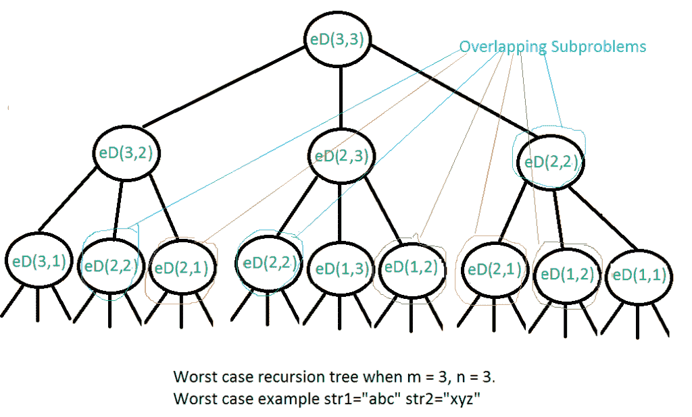

# 编辑距离| DP-5

> 原文:[https://www.geeksforgeeks.org/edit-distance-dp-5/](https://www.geeksforgeeks.org/edit-distance-dp-5/)

给定两个字符串 str1 和 str2 以及以下可以在 str1 上执行的操作。查找将“str1”转换为“str2”所需的最小编辑(操作)次数。

1.  插入
2.  去除
3.  替换

上述所有操作的成本相同。

**示例:**

```
Input:   str1 = "geek", str2 = "gesek"
Output:  1
We can convert str1 into str2 by inserting a 's'.

Input:   str1 = "cat", str2 = "cut"
Output:  1
We can convert str1 into str2 by replacing 'a' with 'u'.

Input:   str1 = "sunday", str2 = "saturday"
Output:  3
Last three and first characters are same.  We basically
need to convert "un" to "atur".  This can be done using
below three operations. 
Replace 'n' with 'r', insert t, insert a
```

**这种情况下有哪些子问题？**
这个想法是从两个字符串的左侧或右侧开始，逐个处理所有字符。
让我们从右上角遍历，每一对被遍历的角色都有两种可能。

```
m: Length of str1 (first string)
n: Length of str2 (second string)
```

1.  如果两个字符串的最后一个字符相同，就没什么可做的了。忽略最后一个字符，并获取剩余字符串的计数。所以我们重复长度 m-1 和 n-1。
2.  否则(如果最后一个字符不相同)，我们考虑“str1”上的所有操作，考虑第一个字符串最后一个字符上的所有三个操作，递归计算所有三个操作的最小开销，取三个值中的最小值。
    1.  插入:m 和 n-1 的重复
    2.  移除:重复 m-1 和 n
    3.  替换:重复 m-1 和 n-1

下面是上述朴素递归解决方案的实现。

## C++

```
// A Naive recursive C++ program to find minimum number
// operations to convert str1 to str2
#include <bits/stdc++.h>
using namespace std;

// Utility function to find minimum of three numbers
int min(int x, int y, int z) { return min(min(x, y), z); }

int editDist(string str1, string str2, int m, int n)
{
    // If first string is empty, the only option is to
    // insert all characters of second string into first
    if (m == 0)
        return n;

    // If second string is empty, the only option is to
    // remove all characters of first string
    if (n == 0)
        return m;

    // If last characters of two strings are same, nothing
    // much to do. Ignore last characters and get count for
    // remaining strings.
    if (str1[m - 1] == str2[n - 1])
        return editDist(str1, str2, m - 1, n - 1);

    // If last characters are not same, consider all three
    // operations on last character of first string,
    // recursively compute minimum cost for all three
    // operations and take minimum of three values.
    return 1
           + min(editDist(str1, str2, m, n - 1), // Insert
                 editDist(str1, str2, m - 1, n), // Remove
                 editDist(str1, str2, m - 1,
                          n - 1) // Replace
             );
}

// Driver code
int main()
{
    // your code goes here
    string str1 = "sunday";
    string str2 = "saturday";

    cout << editDist(str1, str2, str1.length(),
                     str2.length());

    return 0;
}
```

## Java 语言(一种计算机语言，尤用于创建网站)

```
// A Naive recursive Java program to find minimum number
// operations to convert str1 to str2
class EDIST {
    static int min(int x, int y, int z)
    {
        if (x <= y && x <= z)
            return x;
        if (y <= x && y <= z)
            return y;
        else
            return z;
    }

    static int editDist(String str1, String str2, int m,
                        int n)
    {
        // If first string is empty, the only option is to
        // insert all characters of second string into first
        if (m == 0)
            return n;

        // If second string is empty, the only option is to
        // remove all characters of first string
        if (n == 0)
            return m;

        // If last characters of two strings are same,
        // nothing much to do. Ignore last characters and
        // get count for remaining strings.
        if (str1.charAt(m - 1) == str2.charAt(n - 1))
            return editDist(str1, str2, m - 1, n - 1);

        // If last characters are not same, consider all
        // three operations on last character of first
        // string, recursively compute minimum cost for all
        // three operations and take minimum of three
        // values.
        return 1
            + min(editDist(str1, str2, m, n - 1), // Insert
                  editDist(str1, str2, m - 1, n), // Remove
                  editDist(str1, str2, m - 1,
                           n - 1) // Replace
              );
    }

    // Driver Code
    public static void main(String args[])
    {
        String str1 = "sunday";
        String str2 = "saturday";

        System.out.println(editDist(
            str1, str2, str1.length(), str2.length()));
    }
}
/*This code is contributed by Rajat Mishra*/
```

## 计算机编程语言

```
# A Naive recursive Python program to fin minimum number
# operations to convert str1 to str2

def editDistance(str1, str2, m, n):

    # If first string is empty, the only option is to
    # insert all characters of second string into first
    if m == 0:
        return n

    # If second string is empty, the only option is to
    # remove all characters of first string
    if n == 0:
        return m

    # If last characters of two strings are same, nothing
    # much to do. Ignore last characters and get count for
    # remaining strings.
    if str1[m-1] == str2[n-1]:
        return editDistance(str1, str2, m-1, n-1)

    # If last characters are not same, consider all three
    # operations on last character of first string, recursively
    # compute minimum cost for all three operations and take
    # minimum of three values.
    return 1 + min(editDistance(str1, str2, m, n-1),    # Insert
                   editDistance(str1, str2, m-1, n),    # Remove
                   editDistance(str1, str2, m-1, n-1)    # Replace
                   )

# Driver code
str1 = "sunday"
str2 = "saturday"
print editDistance(str1, str2, len(str1), len(str2))

# This code is contributed by Bhavya Jain
```

## C#

```
// A Naive recursive C# program to
// find minimum numberoperations
// to convert str1 to str2
using System;

class GFG {
    static int min(int x, int y, int z)
    {
        if (x <= y && x <= z)
            return x;
        if (y <= x && y <= z)
            return y;
        else
            return z;
    }

    static int editDist(String str1, String str2, int m,
                        int n)
    {
        // If first string is empty, the only option is to
        // insert all characters of second string into first
        if (m == 0)
            return n;

        // If second string is empty, the only option is to
        // remove all characters of first string
        if (n == 0)
            return m;

        // If last characters of two strings are same,
        // nothing much to do. Ignore last characters and
        // get count for remaining strings.
        if (str1[m - 1] == str2[n - 1])
            return editDist(str1, str2, m - 1, n - 1);

        // If last characters are not same, consider all
        // three operations on last character of first
        // string, recursively compute minimum cost for all
        // three operations and take minimum of three
        // values.
        return 1
            + min(editDist(str1, str2, m, n - 1), // Insert
                  editDist(str1, str2, m - 1, n), // Remove
                  editDist(str1, str2, m - 1,
                           n - 1) // Replace
              );
    }

    // Driver code
    public static void Main()
    {
        String str1 = "sunday";
        String str2 = "saturday";
        Console.WriteLine(
            editDist(str1, str2, str1.Length, str2.Length));
    }
}

// This Code is Contributed by Sam007
```

## 服务器端编程语言（Professional Hypertext Preprocessor 的缩写）

```
<?php 
// A Naive recursive Python program  
// to find minimum number operations 
// to convert str1 to str2 
function editDistance($str1, $str2, 
                      $m, $n)
{ 
    // If first string is empty, 
    // the only option is to insert.
    // all characters of second
    // string into first 
    if ($m == 0)
        return $n; 

    // If second string is empty,
    // the only option is to 
    // remove all characters of 
    // first string 
    if ($n == 0) 
        return $m; 

    // If last characters of two 
    // strings are same, nothing 
    // much to do. Ignore last 
    // characters and get count 
    // for remaining strings. 
    if ($str1[$m - 1] == $str2[$n - 1])
    { 
        return editDistance($str1, $str2, 
                            $m - 1, $n - 1); 
    }

    // If last characters are not same, 
    // consider all three operations on 
    // last character of first string, 
    // recursively compute minimum cost 
    // for all three operations and take 
    // minimum of three values. 

    return 1 + min(editDistance($str1, $str2, 
                                $m, $n - 1), // Insert 
                   editDistance($str1, $str2, 
                                $m - 1, $n), // Remove 
                   editDistance($str1, $str2, 
                                $m - 1, $n - 1)); // Replace 
} 

// Driver Code
$str1 = "sunday";
$str2 = "saturday";
echo editDistance($str1, $str2, strlen($str1), 
                                strlen($str2)); 

// This code is contributed 
// by Shivi_Aggarwal
?>
```

## java 描述语言

```
<script>

// Javascript program to
// find minimum numberoperations
// to convert str1 to str2
function min(x, y, z)
{
    if (x <= y && x <= z)
        return x;
    if (y <= x && y <= z)
        return y;
    else
        return z;
}

function editDist(str1, str2, m, n)
{

    // If first string is empty, the 
    // only option is to insert all 
    // characters of second string into first
    if (m == 0)
        return n;

    // If second string is empty, the only
    // option is to remove all characters 
    // of first string
    if (n == 0)
        return m;

    // If last characters of two strings are
    // same, nothing much to do. Ignore last 
    // characters and get count for remaining 
    // strings.
    if (str1[m - 1] == str2[n - 1])
        return editDist(str1, str2, m - 1, n - 1);

    // If last characters are not same, consider all
    // three operations on last character of first
    // string, recursively compute minimum cost for all
    // three operations and take minimum of three
    // values.
    return 1 + 
    min(editDist(str1, str2, m, n - 1), // Insert
        editDist(str1, str2, m - 1, n), // Remove
        editDist(str1, str2, m - 1, n - 1)); // Replace
}

// Driver code
let str1 = "sunday";
let str2 = "saturday";
document.write(editDist(str1, str2, str1.length, 
                                    str2.length));

// This code is contributed by target_2

</script>
```

**Output**

```
3
```

上述解的时间复杂度是指数的。最坏的情况下，我们最终可能会做 O(3 <sup>m</sup> )运算。最糟糕的情况发生在两个字符串的字符都不匹配的时候。下面是最坏情况下的递归调用图。



我们可以看到很多子问题一次又一次的被解决，比如 eD(2，2)被调用了三次。由于相同的子问题被再次调用，这个问题具有重叠子问题的性质。所以编辑距离问题同时具有动态规划问题的两个属性(参见[这个](https://www.geeksforgeeks.org/overlapping-subproblems-property-in-dynamic-programming-dp-1/)和[这个](https://www.geeksforgeeks.org/optimal-substructure-property-in-dynamic-programming-dp-2/))。像其他典型的动态规划问题一样，通过构造一个存储子问题结果的临时数组，可以避免相同子问题的重新计算。

## C++

```
// A Dynamic Programming based C++ program to find minimum
// number operations to convert str1 to str2
#include <bits/stdc++.h>
using namespace std;

// Utility function to find the minimum of three numbers
int min(int x, int y, int z) { return min(min(x, y), z); }

int editDistDP(string str1, string str2, int m, int n)
{
    // Create a table to store results of subproblems
    int dp[m + 1][n + 1];

    // Fill d[][] in bottom up manner
    for (int i = 0; i <= m; i++) {
        for (int j = 0; j <= n; j++) {
            // If first string is empty, only option is to
            // insert all characters of second string
            if (i == 0)
                dp[i][j] = j; // Min. operations = j

            // If second string is empty, only option is to
            // remove all characters of second string
            else if (j == 0)
                dp[i][j] = i; // Min. operations = i

            // If last characters are same, ignore last char
            // and recur for remaining string
            else if (str1[i - 1] == str2[j - 1])
                dp[i][j] = dp[i - 1][j - 1];

            // If the last character is different, consider
            // all possibilities and find the minimum
            else
                dp[i][j]
                    = 1
                      + min(dp[i][j - 1], // Insert
                            dp[i - 1][j], // Remove
                            dp[i - 1][j - 1]); // Replace
        }
    }

    return dp[m][n];
}

// Driver code
int main()
{
    // your code goes here
    string str1 = "sunday";
    string str2 = "saturday";

    cout << editDistDP(str1, str2, str1.length(),
                       str2.length());

    return 0;
}
```

## Java 语言(一种计算机语言，尤用于创建网站)

```
// A Dynamic Programming based Java program to find minimum
// number operations to convert str1 to str2
class EDIST {
    static int min(int x, int y, int z)
    {
        if (x <= y && x <= z)
            return x;
        if (y <= x && y <= z)
            return y;
        else
            return z;
    }

    static int editDistDP(String str1, String str2, int m,
                          int n)
    {
        // Create a table to store results of subproblems
        int dp[][] = new int[m + 1][n + 1];

        // Fill d[][] in bottom up manner
        for (int i = 0; i <= m; i++) {
            for (int j = 0; j <= n; j++) {
                // If first string is empty, only option is
                // to insert all characters of second string
                if (i == 0)
                    dp[i][j] = j; // Min. operations = j

                // If second string is empty, only option is
                // to remove all characters of second string
                else if (j == 0)
                    dp[i][j] = i; // Min. operations = i

                // If last characters are same, ignore last
                // char and recur for remaining string
                else if (str1.charAt(i - 1)
                         == str2.charAt(j - 1))
                    dp[i][j] = dp[i - 1][j - 1];

                // If the last character is different,
                // consider all possibilities and find the
                // minimum
                else
                    dp[i][j] = 1
                               + min(dp[i][j - 1], // Insert
                                     dp[i - 1][j], // Remove
                                     dp[i - 1]
                                       [j - 1]); // Replace
            }
        }

        return dp[m][n];
    }

    // Driver Code
    public static void main(String args[])
    {
        String str1 = "sunday";
        String str2 = "saturday";
        System.out.println(editDistDP(
            str1, str2, str1.length(), str2.length()));
    }
} /*This code is contributed by Rajat Mishra*/
```

## 计算机编程语言

```
# A Dynamic Programming based Python program for edit
# distance problem

def editDistDP(str1, str2, m, n):
    # Create a table to store results of subproblems
    dp = [[0 for x in range(n + 1)] for x in range(m + 1)]

    # Fill d[][] in bottom up manner
    for i in range(m + 1):
        for j in range(n + 1):

            # If first string is empty, only option is to
            # insert all characters of second string
            if i == 0:
                dp[i][j] = j    # Min. operations = j

            # If second string is empty, only option is to
            # remove all characters of second string
            elif j == 0:
                dp[i][j] = i    # Min. operations = i

            # If last characters are same, ignore last char
            # and recur for remaining string
            elif str1[i-1] == str2[j-1]:
                dp[i][j] = dp[i-1][j-1]

            # If last character are different, consider all
            # possibilities and find minimum
            else:
                dp[i][j] = 1 + min(dp[i][j-1],        # Insert
                                   dp[i-1][j],        # Remove
                                   dp[i-1][j-1])    # Replace

    return dp[m][n]

# Driver code
str1 = "sunday"
str2 = "saturday"

print(editDistDP(str1, str2, len(str1), len(str2)))
# This code is contributed by Bhavya Jain
```

## C#

```
// A Dynamic Programming based
// C# program to find minimum
// number operations to
// convert str1 to str2
using System;

class GFG {
    static int min(int x, int y, int z)
    {
        if (x <= y && x <= z)
            return x;
        if (y <= x && y <= z)
            return y;
        else
            return z;
    }

    static int editDistDP(String str1, String str2, int m,
                          int n)
    {
        // Create a table to store
        // results of subproblems
        int[, ] dp = new int[m + 1, n + 1];

        // Fill d[][] in bottom up manner
        for (int i = 0; i <= m; i++) {
            for (int j = 0; j <= n; j++) {
                // If first string is empty, only option is
                // to insert all characters of second string
                if (i == 0)

                    // Min. operations = j
                    dp[i, j] = j;

                // If second string is empty, only option is
                // to remove all characters of second string
                else if (j == 0)

                    // Min. operations = i
                    dp[i, j] = i;

                // If last characters are same, ignore last
                // char and recur for remaining string
                else if (str1[i - 1] == str2[j - 1])
                    dp[i, j] = dp[i - 1, j - 1];

                // If the last character is different,
                // consider all possibilities and find the
                // minimum
                else
                    dp[i, j] = 1
                               + min(dp[i, j - 1], // Insert
                                     dp[i - 1, j], // Remove
                                     dp[i - 1,
                                        j - 1]); // Replace
            }
        }

        return dp[m, n];
    }

    // Driver code
    public static void Main()
    {
        String str1 = "sunday";
        String str2 = "saturday";
        Console.Write(editDistDP(str1, str2, str1.Length,
                                 str2.Length));
    }
}
// This Code is Contributed by Sam007
```

## 服务器端编程语言（Professional Hypertext Preprocessor 的缩写）

```
<?php
// A Dynamic Programming based 
// Python program for edit 
// distance problem 
function editDistDP($str1, $str2, 
                    $m, $n)
{ 
// Fill d[][] in bottom up manner 
for ($i = 0; $i <= $m; $i++) 
{  
    for ($j = 0; $j <= $n; $j++) 
    { 

        // If first string is empty, 
        // only option is to insert 
        // all characters of second string 
        if ($i == 0) 
            $dp[$i][$j] = $j ; // Min. operations = j 

        // If second string is empty, 
        // only option is to remove 
        // all characters of second string 
        else if($j == 0) 
            $dp[$i][$j] = $i; // Min. operations = i 

        // If last characters are same, 
        // ignore last char and recur 
        // for remaining string 
        else if($str1[$i - 1] == $str2[$j - 1]) 
            $dp[$i][$j] = $dp[$i - 1][$j - 1];

        // If last character are different, 
        // consider all possibilities and 
        // find minimum 
        else
        { 
            $dp[$i][$j] = 1 + min($dp[$i][$j - 1],     // Insert 
                                  $dp[$i - 1][$j],     // Remove 
                                  $dp[$i - 1][$j - 1]); // Replace 
        }
    }
}
return $dp[$m][$n] ;
}

// Driver Code 
$str1 = "sunday";
$str2 = "saturday";

echo editDistDP($str1, $str2, strlen($str1), 
                              strlen($str2));

// This code is contributed 
// by Shivi_Aggarwal
?>
```

## java 描述语言

```
<script>

// A Dynamic Programming based 
// Javascript program to find minimum
// number operations to convert str1 to str2

function min(x,y,z)
{
    if (x <= y && x <= z)
            return x;
        if (y <= x && y <= z)
            return y;
        else
            return z;
}

function editDistDP(str1,str2,m,n)
{
    // Create a table to store results of subproblems
        let dp = new Array(m + 1);
        for(let i=0;i<m+1;i++)
        {
            dp[i]=new Array(n+1);
            for(let j=0;j<n+1;j++)
            {
                dp[i][j]=0;
            }
        }

        // Fill d[][] in bottom up manner
        for (let i = 0; i <= m; i++) {
            for (let j = 0; j <= n; j++) {
                // If first string is empty, only option is
                // to insert all characters of second string
                if (i == 0)
                    dp[i][j] = j; // Min. operations = j

                // If second string is empty, only option is
                // to remove all characters of second string
                else if (j == 0)
                    dp[i][j] = i; // Min. operations = i

                // If last characters are same, ignore last
                // char and recur for remaining string
                else if (str1[i - 1]
                         == str2[j - 1])
                    dp[i][j] = dp[i - 1][j - 1];

                // If the last character is different,
                // consider all possibilities and find the
                // minimum
                else
                    dp[i][j] = 1
                               + min(dp[i][j - 1], // Insert
                                     dp[i - 1][j], // Remove
                                     dp[i - 1]
                                       [j - 1]); // Replace
            }
        }

        return dp[m][n];
}

// Driver Code
let str1 = "sunday";
let str2 = "saturday";
document.write(editDistDP(
str1, str2, str1.length, str2.length));

// This code is contributed by unknown2108

</script>
```

**Output**

```
3
```

**时间复杂度:**O(m x n)
T3】辅助空间: O(m x n)

**空间复解**:在上面给定的方法中，我们需要 O(m x n)空间。如果字符串的长度大于 2000，这将是不合适的，因为它只能创建 2000 x 2000 的 2D 数组。为了填充 DP 数组中的一行，我们只需要上面一行中的一行。例如，如果我们要填充 DP 数组中的 i = 10 行，我们只需要第 9 行的值。因此，我们只需创建一个 2 x str1 长度的 DP 数组。这种方法降低了空间复杂度。下面是上述问题的 C++实现

## C++

```
// A Space efficient Dynamic Programming
// based C++ program to find minimum
// number operations to convert str1 to str2
#include <bits/stdc++.h>
using namespace std;

void EditDistDP(string str1, string str2)
{
    int len1 = str1.length();
    int len2 = str2.length();

    // Create a DP array to memoize result
    // of previous computations
    int DP[2][len1 + 1];

    // To fill the DP array with 0
    memset(DP, 0, sizeof DP);

    // Base condition when second string
    // is empty then we remove all characters
    for (int i = 0; i <= len1; i++)
        DP[0][i] = i;

    // Start filling the DP
    // This loop run for every
    // character in second string
    for (int i = 1; i <= len2; i++) {
        // This loop compares the char from
        // second string with first string
        // characters
        for (int j = 0; j <= len1; j++) {
            // if first string is empty then
            // we have to perform add character
            // operation to get second string
            if (j == 0)
                DP[i % 2][j] = i;

            // if character from both string
            // is same then we do not perform any
            // operation . here i % 2 is for bound
            // the row number.
            else if (str1[j - 1] == str2[i - 1]) {
                DP[i % 2][j] = DP[(i - 1) % 2][j - 1];
            }

            // if character from both string is
            // not same then we take the minimum
            // from three specified operation
            else {
                DP[i % 2][j] = 1 + min(DP[(i - 1) % 2][j],
                                       min(DP[i % 2][j - 1],
                                           DP[(i - 1) % 2][j - 1]));
            }
        }
    }

    // after complete fill the DP array
    // if the len2 is even then we end
    // up in the 0th row else we end up
    // in the 1th row so we take len2 % 2
    // to get row
    cout << DP[len2 % 2][len1] << endl;
}

// Driver program
int main()
{
    string str1 = "food";
    string str2 = "money";
    EditDistDP(str1, str2);
    return 0;
}
```

## Java 语言(一种计算机语言，尤用于创建网站)

```
// A Space efficient Dynamic Programming
// based Java program to find minimum
// number operations to convert str1 to str2
import java.util.*;
class GFG
{

static void EditDistDP(String str1, String str2)
{
    int len1 = str1.length();
    int len2 = str2.length();

    // Create a DP array to memoize result
    // of previous computations
    int [][]DP = new int[2][len1 + 1];

    // Base condition when second String
    // is empty then we remove all characters
    for (int i = 0; i <= len1; i++)
        DP[0][i] = i;

    // Start filling the DP
    // This loop run for every
    // character in second String
    for (int i = 1; i <= len2; i++) 
    {

        // This loop compares the char from
        // second String with first String
        // characters
        for (int j = 0; j <= len1; j++)
        {

            // if first String is empty then
            // we have to perform add character
            // operation to get second String
            if (j == 0)
                DP[i % 2][j] = i;

            // if character from both String
            // is same then we do not perform any
            // operation . here i % 2 is for bound
            // the row number.
            else if (str1.charAt(j - 1) == str2.charAt(i - 1)) {
                DP[i % 2][j] = DP[(i - 1) % 2][j - 1];
            }

            // if character from both String is
            // not same then we take the minimum
            // from three specified operation
            else {
                DP[i % 2][j] = 1 + Math.min(DP[(i - 1) % 2][j],
                                       Math.min(DP[i % 2][j - 1],
                                           DP[(i - 1) % 2][j - 1]));
            }
        }
    }

    // after complete fill the DP array
    // if the len2 is even then we end
    // up in the 0th row else we end up
    // in the 1th row so we take len2 % 2
    // to get row
    System.out.print(DP[len2 % 2][len1] +"\n");
}

// Driver program
public static void main(String[] args)
{
    String str1 = "food";
    String str2 = "money";
    EditDistDP(str1, str2);
}
}

// This code is contributed by aashish1995
```

## 蟒蛇 3

```
# A Space efficient Dynamic Programming
# based Python3 program to find minimum
# number operations to convert str1 to str2
def EditDistDP(str1, str2):

    len1 = len(str1)
    len2 = len(str2)

    # Create a DP array to memoize result
    # of previous computations
    DP = [[0 for i in range(len1 + 1)] 
             for j in range(2)];

    # Base condition when second String
    # is empty then we remove all characters
    for i in range(0, len1 + 1):
        DP[0][i] = i

    # Start filling the DP
    # This loop run for every
    # character in second String
    for i in range(1, len2 + 1):

        # This loop compares the char from
        # second String with first String
        # characters
        for j in range(0, len1 + 1):

            # If first String is empty then
            # we have to perform add character
            # operation to get second String
            if (j == 0):
                DP[i % 2][j] = i

            # If character from both String
            # is same then we do not perform any
            # operation . here i % 2 is for bound
            # the row number.
            elif(str1[j - 1] == str2[i-1]):
                DP[i % 2][j] = DP[(i - 1) % 2][j - 1]

            # If character from both String is
            # not same then we take the minimum
            # from three specified operation
            else:
                DP[i % 2][j] = (1 + min(DP[(i - 1) % 2][j], 
                                    min(DP[i % 2][j - 1], 
                                  DP[(i - 1) % 2][j - 1])))

    # After complete fill the DP array
    # if the len2 is even then we end
    # up in the 0th row else we end up
    # in the 1th row so we take len2 % 2
    # to get row
    print(DP[len2 % 2][len1], "")

# Driver code
if __name__ == '__main__':

    str1 = "food"
    str2 = "money"

    EditDistDP(str1, str2)

# This code is contributed by gauravrajput1
```

## C#

```
// A Space efficient Dynamic Programming
// based C# program to find minimum
// number operations to convert str1 to str2
using System;
class GFG
{

static void EditDistDP(String str1, String str2)
{
    int len1 = str1.Length;
    int len2 = str2.Length;

    // Create a DP array to memoize result
    // of previous computations
    int [,]DP = new int[2, len1 + 1];

    // Base condition when second String
    // is empty then we remove all characters
    for (int i = 0; i <= len1; i++)
        DP[0, i] = i;

    // Start filling the DP
    // This loop run for every
    // character in second String
    for (int i = 1; i <= len2; i++) 
    {

        // This loop compares the char from
        // second String with first String
        // characters
        for (int j = 0; j <= len1; j++)
        {

            // if first String is empty then
            // we have to perform add character
            // operation to get second String
            if (j == 0)
                DP[i % 2, j] = i;

            // if character from both String
            // is same then we do not perform any
            // operation . here i % 2 is for bound
            // the row number.
            else if (str1[j - 1] == str2[i - 1]) 
            {
                DP[i % 2, j] = DP[(i - 1) % 2, j - 1];
            }

            // if character from both String is
            // not same then we take the minimum
            // from three specified operation
            else {
                DP[i % 2, j] = 1 + Math.Min(DP[(i - 1) % 2, j],
                                       Math.Min(DP[i % 2, j - 1],
                                           DP[(i - 1) % 2, j - 1]));
            }
        }
    }

    // after complete fill the DP array
    // if the len2 is even then we end
    // up in the 0th row else we end up
    // in the 1th row so we take len2 % 2
    // to get row
    Console.Write(DP[len2 % 2, len1] +"\n");
}

// Driver program
public static void Main(String[] args)
{
    String str1 = "food";
    String str2 = "money";
    EditDistDP(str1, str2);
}
}

// This code is contributed by aashish1995 
```

## java 描述语言

```
<script>
// A Space efficient Dynamic Programming
// based Javascript program to find minimum
// number operations to convert str1 to str2
function EditDistDP(str1, str2)
{
    let len1 = str1.length;
    let len2 = str2.length;

    // Create a DP array to memoize result
    // of previous computations
    let DP = new Array(2);
    for(let i = 0; i < 2; i++)
    {
        DP[i] = new Array(len1+1);
        for(let j = 0; j < len1 + 1; j++)
            DP[i][j] = 0;
    }

    // Base condition when second String
    // is empty then we remove all characters
    for (let i = 0; i <= len1; i++)
        DP[0][i] = i;

    // Start filling the DP
    // This loop run for every
    // character in second String
    for (let i = 1; i <= len2; i++)
    {

        // This loop compares the char from
        // second String with first String
        // characters
        for (let j = 0; j <= len1; j++)
        {

            // if first String is empty then
            // we have to perform add character
            // operation to get second String
            if (j == 0)
                DP[i % 2][j] = i;

            // if character from both String
            // is same then we do not perform any
            // operation . here i % 2 is for bound
            // the row number.
            else if (str1[j-1] == str2[i-1]) {
                DP[i % 2][j] = DP[(i - 1) % 2][j - 1];
            }

            // if character from both String is
            // not same then we take the minimum
            // from three specified operation
            else {
                DP[i % 2][j] = 1 + Math.min(DP[(i - 1) % 2][j],
                                       Math.min(DP[i % 2][j - 1],
                                           DP[(i - 1) % 2][j - 1]));
            }
        }
    }

    // after complete fill the DP array
    // if the len2 is even then we end
    // up in the 0th row else we end up
    // in the 1th row so we take len2 % 2
    // to get row
    document.write(DP[len2 % 2][len1] +"<br>");
}

// Driver program
let str1 = "food";
let str2 = "money";
EditDistDP(str1, str2);

// This code is contributed by patel2127.
</script>
```

**Output**

```
4
```

**时间复杂度:**O(m x n)
T3】辅助空间: O( m)

这是递归的记忆版本，即自上而下的动态规划:

## C++14

```
#include <bits/stdc++.h>
using namespace std;
int minDis(string s1, string s2, int n, int m, vector<vector<int>> &dp){

  // If any string is empty,
  // return the remaining characters of other string

  if(n==0)    return m;

  if(m==0)    return n;

  // To check if the recursive tree
  // for given n & m has already been executed

  if(dp[n][m]!=-1)    return dp[n][m];

  // If characters are equal, execute 
  // recursive function for n-1, m-1

  if(s1[n-1]==s2[m-1]){           
    if(dp[n-1][m-1]==-1){               
      return dp[n][m] = minDis(s1, s2, n-1, m-1, dp);           
    }        
    else
      return dp[n][m] = dp[n-1][m-1];   
  }

  // If characters are nt equal, we need to

  // find the minimum cost out of all 3 operations.

  else{           
    int m1, m2, m3;        // temp variables   

    if(dp[n-1][m]!=-1){    
      m1 = dp[n-1][m];      
    }           
    else{   
      m1 = minDis(s1, s2, n-1, m, dp);      
    }            

    if(dp[n][m-1]!=-1){                
      m2 = dp[n][m-1];            
    }            
    else{    
      m2 = minDis(s1, s2, n, m-1, dp);      
    }                                   

    if(dp[n-1][m-1]!=-1){    
      m3 = dp[n-1][m-1];      
    }   
    else{   
      m3 = minDis(s1, s2, n-1, m-1, dp);       
    }     
    return dp[n][m] = 1+min(m1, min(m2, m3));        
  }

}

// Driver program 
int main() {

  string str1 = "voldemort"; 
  string str2 = "dumbledore"; 

  int n= str1.length(), m = str2.length();    
  vector<vector<int>> dp(n+1, vector<int>(m+1, -1));

  cout<<minDis(str1, str2, n, m, dp); 
  return 0; 

  //     This code is a contribution of Bhavneet Singh

}
```

## Java 语言(一种计算机语言，尤用于创建网站)

```
import java.util.*;
class GFG
{

static int minDis(String s1, String s2, 
                  int n, int m, int[][]dp)
{

  // If any String is empty,
  // return the remaining characters of other String
  if(n == 0)    
    return m;  
  if(m == 0)    
    return n;

  // To check if the recursive tree
  // for given n & m has already been executed
  if(dp[n][m] != -1)    
    return dp[n][m];

  // If characters are equal, execute 
  // recursive function for n-1, m-1
  if(s1.charAt(n - 1) == s2.charAt(m - 1))
  {           
    if(dp[n - 1][m - 1] == -1)
    {               
      return dp[n][m] = minDis(s1, s2, n - 1, m - 1, dp);           
    }        
    else
      return dp[n][m] = dp[n - 1][m - 1];   
  }

  // If characters are nt equal, we need to

  // find the minimum cost out of all 3 operations.      
  else
  {           
    int m1, m2, m3;        // temp variables   
    if(dp[n-1][m] != -1)
    {    
      m1 = dp[n - 1][m];      
    }           
    else
    {   
      m1 = minDis(s1, s2, n - 1, m, dp);      
    }            

    if(dp[n][m - 1] != -1)
    {                
      m2 = dp[n][m - 1];            
    }            
    else
    {    
      m2 = minDis(s1, s2, n, m - 1, dp);      
    }                                   

    if(dp[n - 1][m - 1] != -1)
    {    
      m3 = dp[n - 1][m - 1];      
    }   
    else
    {   
      m3 = minDis(s1, s2, n - 1, m - 1, dp);       
    }     
    return dp[n][m] = 1 + Math.min(m1, Math.min(m2, m3));        
  }
}

// Driver program 
public static void main(String[] args) 
{

  String str1 = "voldemort"; 
  String str2 = "dumbledore"; 

  int n= str1.length(), m = str2.length();    
  int[][] dp = new int[n + 1][m + 1];
  for(int i = 0; i < n + 1; i++)
  Arrays.fill(dp[i], -1);                
  System.out.print(minDis(str1, str2, n, m, dp)); 
}
}

// This code is contributed by gauravrajput1 
```

## 蟒蛇 3

```
def minDis(s1, s2, n, m, dp) :

  # If any string is empty,
  # return the remaining characters of other string          
  if(n == 0) :
      return m        
  if(m == 0) :
      return n

  # To check if the recursive tree
  # for given n & m has already been executed
  if(dp[n][m] != -1)  :
      return dp[n][m];

  # If characters are equal, execute 
  # recursive function for n-1, m-1    
  if(s1[n - 1] == s2[m - 1]) :           
    if(dp[n - 1][m - 1] == -1) : 
        dp[n][m] = minDis(s1, s2, n - 1, m - 1, dp)
        return dp[n][m]                   
    else :
        dp[n][m] = dp[n - 1][m - 1]
        return dp[n][m]

  # If characters are nt equal, we need to           
  # find the minimum cost out of all 3 operations.         
  else :            
    if(dp[n - 1][m] != -1) :   
      m1 = dp[n - 1][m]      
    else :
      m1 = minDis(s1, s2, n - 1, m, dp)

    if(dp[n][m - 1] != -1) :                
      m2 = dp[n][m - 1]            
    else :
      m2 = minDis(s1, s2, n, m - 1, dp)   
    if(dp[n - 1][m - 1] != -1) :    
      m3 = dp[n - 1][m - 1]    
    else :
      m3 = minDis(s1, s2, n - 1, m - 1, dp)

    dp[n][m] = 1 + min(m1, min(m2, m3))
    return dp[n][m]

    # Driver code
str1 = "voldemort" 
str2 = "dumbledore" 

n = len(str1)
m = len(str2)
dp = [[-1 for i in range(m + 1)] for j in range(n + 1)]

print(minDis(str1, str2, n, m, dp))

# This code is contributed by divyesh072019.
```

## C#

```
using System;
using System.Collections.Generic;
class GFG {

  static int minDis(string s1, string s2, int n,
                    int m, List<List<int>> dp)
  {

    // If any string is empty,
    // return the remaining characters of other string
    if(n == 0)   
      return m;

    if(m == 0)    
      return n;

    // To check if the recursive tree
    // for given n & m has already been executed
    if(dp[n][m] != -1)  
      return dp[n][m];

    // If characters are equal, execute 
    // recursive function for n-1, m-1
    if(s1[n - 1] == s2[m - 1])
    {           
      if(dp[n - 1][m - 1] == -1)
      {               
        return dp[n][m] = minDis(s1, s2, n - 1, m - 1, dp);           
      }        
      else
        return dp[n][m] = dp[n - 1][m - 1];   
    }

    // If characters are nt equal, we need to
    // find the minimum cost out of all 3 operations.
    else
    {           
      int m1, m2, m3;        // temp variables   

      if(dp[n - 1][m] != -1)
      {    
        m1 = dp[n - 1][m];      
      }           
      else
      {   
        m1 = minDis(s1, s2, n - 1, m, dp);      
      }            

      if(dp[n][m - 1] != -1)
      {                
        m2 = dp[n][m - 1];            
      }            
      else
      {    
        m2 = minDis(s1, s2, n, m - 1, dp);      
      }                                   

      if(dp[n - 1][m - 1] != -1)
      {    
        m3 = dp[n - 1][m - 1];      
      }   
      else
      {   
        m3 = minDis(s1, s2, n - 1, m - 1, dp);       
      }     
      return dp[n][m] = 1+ Math.Min(m1, Math.Min(m2, m3));        
    }

  }

  // Driver code
  static void Main() 
  {
    string str1 = "voldemort"; 
    string str2 = "dumbledore"; 

    int n = str1.Length, m = str2.Length;   
    List<List<int>> dp = new List<List<int>>();
    for(int i = 0; i < n + 1; i++)
    {
      dp.Add(new List<int>());
      for(int j = 0; j < m + 1; j++)
      {
        dp[i].Add(-1);
      }
    }
    Console.WriteLine(minDis(str1, str2, n, m, dp));
  }
}

// This code is contributed by divyeshrabadiya07.
```

## java 描述语言

```
<script>

function minDis(s1,s2,n,m,dp)
{
    // If any String is empty,
  // return the remaining characters of other String
  if(n == 0)   
    return m; 
  if(m == 0)   
    return n;

  // To check if the recursive tree
  // for given n & m has already been executed
  if(dp[n][m] != -1)   
    return dp[n][m];

  // If characters are equal, execute
  // recursive function for n-1, m-1
  if(s1[n - 1] == s2[m - 1])
  {          
    if(dp[n - 1][m - 1] == -1)
    {              
      return dp[n][m] = minDis(s1, s2, n - 1, m - 1, dp);          
    }       
    else
      return dp[n][m] = dp[n - 1][m - 1];  
  }

  // If characters are nt equal, we need to

  // find the minimum cost out of all 3 operations.     
  else
  {          
    let m1, m2, m3;        // temp variables  
    if(dp[n-1][m] != -1)
    {   
      m1 = dp[n - 1][m];     
    }          
    else
    {  
      m1 = minDis(s1, s2, n - 1, m, dp);     
    }           

    if(dp[n][m - 1] != -1)
    {               
      m2 = dp[n][m - 1];           
    }           
    else
    {   
      m2 = minDis(s1, s2, n, m - 1, dp);     
    }                                  

    if(dp[n - 1][m - 1] != -1)
    {   
      m3 = dp[n - 1][m - 1];     
    }  
    else
    {  
      m3 = minDis(s1, s2, n - 1, m - 1, dp);      
    }    
    return dp[n][m] = 1 + Math.min(m1, Math.min(m2, m3));       
  }
}

// Driver program

let str1 = "voldemort";
let str2 = "dumbledore";

let n= str1.length, m = str2.length;   
let dp = new Array(n + 1);
for(let i = 0; i < n + 1; i++)
{
    dp[i]=new Array(m+1);
    for(let j=0;j<m+1;j++)
        dp[i][j]=-1;
}

document.write(minDis(str1, str2, n, m, dp));

// This code is contributed by avanitrachhadiya2155

</script>
```

**Output**

```
7
```

**应用**:编辑距离算法有很多实际应用，样本参考 [Lucene](http://en.wikipedia.org/wiki/Lucene) API。另一个例子，显示字典中与给定单词拼写错误的单词非常接近的所有单词。

感谢 Vivek Kumar 的建议更新。
感谢**文基**提供首发岗位。如果发现有不正确的地方，请写评论，或者想分享更多关于以上讨论话题的信息