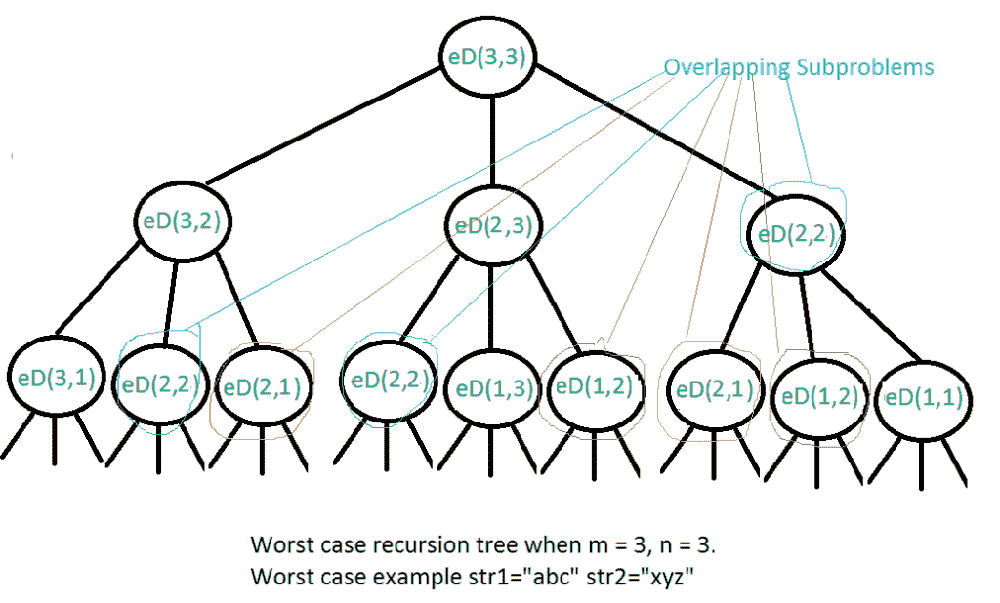

# 使用记忆功能编辑距离| DP

> 原文:[https://www . geesforgeks . org/edit-distance-DP-using-memo ization/](https://www.geeksforgeeks.org/edit-distance-dp-using-memoization/)

给定两个字符串 str1 和 str2 以及以下可以在 str1 上执行的操作。找到将“str1”转换为“str2”所需的最小编辑(操作)次数。

*   插入
*   去除
*   替换

上述所有操作的成本相同。

**示例:**

> **输入:** str1 =“极客”，str2 =“gesek”
> T3】输出: 1
> 我们可以通过插入一个‘s’将 str1 转换为 str 2。
> 
> **输入:**str1 =“cat”，str2 =“cut”
> **输出:** 1
> 我们可以通过将‘a’替换为‘u’来将 str 1 转换为 str 2。
> 
> **输入:** str1 =“星期日”，str2 =“星期六”
> **输出:** 3
> 后三个和前一个字符相同。我们基本上
> 需要把“un”转换成“atur”。这可以使用下面的
> 三个操作来完成。
> 将“n”改为“r”，插入 t，插入 a

**这种情况下有哪些子问题？**想法是从两个字符串的左侧或右侧开始，逐个处理所有字符。让我们从右上角遍历，每对被遍历的字符有两种可能。以下是条件:

1.  如果两个字符串的最后一个字符相同，就没什么可做的了。忽略最后一个字符，并获取剩余字符串的计数。所以我们重复长度 m-1 和 n-1。
2.  否则(如果最后一个字符不相同)，我们考虑“str1”上的所有操作，考虑第一个字符串最后一个字符上的所有三个操作，递归计算所有三个操作的最小开销，取三个值中的最小值。
    *   **插入:**重复 m 和 n-1
    *   **移除:**重复 m-1 和 n
    *   **替换:**重复 m-1 和 n-1

下面是上述方法的实现:

## C++

```
// A Naive recursive C++ program to find minimum number
// operations to convert str1 to str2
#include <bits/stdc++.h>
using namespace std;

// Utility function to find minimum of three numbers
int min(int x, int y, int z)
{
    return min(min(x, y), z);
}

int editDist(string str1, string str2, int m, int n)
{
    // If first string is empty, the only option is to
    // insert all characters of second string into first
    if (m == 0)
        return n;

    // If second string is empty, the only option is to
    // remove all characters of first string
    if (n == 0)
        return m;

    // If last characters of two strings are same, nothing
    // much to do. Ignore last characters and get count for
    // remaining strings.
    if (str1[m - 1] == str2[n - 1])
        return editDist(str1, str2, m - 1, n - 1);

    // If last characters are not same, consider all three
    // operations on last character of first string, recursively
    // compute minimum cost for all three operations and take
    // minimum of three values.
    return 1 + min(editDist(str1, str2, m, n - 1), // Insert
                   editDist(str1, str2, m - 1, n), // Remove
                   editDist(str1, str2, m - 1, n - 1) // Replace
                   );
}

// Driver program
int main()
{
    // your code goes here
    string str1 = "sunday";
    string str2 = "saturday";

    cout << editDist(str1, str2, str1.length(), str2.length());

    return 0;
}
```

## Java 语言(一种计算机语言，尤用于创建网站)

```
// A Naive recursive Java program to find minimum number
// operations to convert str1 to str2
class EDIST {
    static int min(int x, int y, int z)
    {
        if (x <= y && x <= z)
            return x;
        if (y <= x && y <= z)
            return y;
        else
            return z;
    }

    static int editDist(String str1, String str2, int m, int n)
    {
        // If first string is empty, the only option is to
        // insert all characters of second string into first
        if (m == 0)
            return n;

        // If second string is empty, the only option is to
        // remove all characters of first string
        if (n == 0)
            return m;

        // If last characters of two strings are same, nothing
        // much to do. Ignore last characters and get count for
        // remaining strings.
        if (str1.charAt(m - 1) == str2.charAt(n - 1))
            return editDist(str1, str2, m - 1, n - 1);

        // If last characters are not same, consider all three
        // operations on last character of first string, recursively
        // compute minimum cost for all three operations and take
        // minimum of three values.
        return 1 + min(editDist(str1, str2, m, n - 1), // Insert
                       editDist(str1, str2, m - 1, n), // Remove
                       editDist(str1, str2, m - 1, n - 1) // Replace
                       );
    }

    public static void main(String args[])
    {
        String str1 = "sunday";
        String str2 = "saturday";

        System.out.println(editDist(str1, str2, str1.length(), str2.length()));
    }
}
```

## 计算机编程语言

```
# A Naive recursive Python program to find minimum number
# operations to convert str1 to str2
def editDistance(str1, str2, m, n):

    # If first string is empty, the only option is to
    # insert all characters of second string into first
    if m == 0:
         return n

    # If second string is empty, the only option is to
    # remove all characters of first string
    if n == 0:
        return m

    # If last characters of two strings are same, nothing
    # much to do. Ignore last characters and get count for
    # remaining strings.
    if str1[m-1]== str2[n-1]:
        return editDistance(str1, str2, m-1, n-1)

    # If last characters are not same, consider all three
    # operations on last character of first string, recursively
    # compute minimum cost for all three operations and take
    # minimum of three values.
    return 1 + min(editDistance(str1, str2, m, n-1),    # Insert
                   editDistance(str1, str2, m-1, n),    # Remove
                   editDistance(str1, str2, m-1, n-1)    # Replace
                   )

# Driver program to test the above function
str1 = "sunday"
str2 = "saturday"
print editDistance(str1, str2, len(str1), len(str2))
```

## C#

```
// A Naive recursive C# program to
// find minimum numberoperations
// to convert str1 to str2
using System;

class GFG {
    static int min(int x, int y, int z)
    {
        if (x <= y && x <= z)
            return x;
        if (y <= x && y <= z)
            return y;
        else
            return z;
    }

    static int editDist(String str1, String str2, int m, int n)
    {
        // If first string is empty, the only option is to
        // insert all characters of second string into first
        if (m == 0)
            return n;

        // If second string is empty, the only option is to
        // remove all characters of first string
        if (n == 0)
            return m;

        // If last characters of two strings are same, nothing
        // much to do. Ignore last characters and get count for
        // remaining strings.
        if (str1[m - 1] == str2[n - 1])
            return editDist(str1, str2, m - 1, n - 1);

        // If last characters are not same, consider all three
        // operations on last character of first string, recursively
        // compute minimum cost for all three operations and take
        // minimum of three values.
        return 1 + min(editDist(str1, str2, m, n - 1), // Insert
                       editDist(str1, str2, m - 1, n), // Remove
                       editDist(str1, str2, m - 1, n - 1) // Replace
                       );
    }

    // Driver code
    public static void Main()
    {
        String str1 = "sunday";
        String str2 = "saturday";
        Console.WriteLine(editDist(str1, str2, str1.Length,
                                   str2.Length));
    }
}
```

## java 描述语言

```
<script>

// A Naive recursive Javascript
// program to find minimum number
// operations to convert str1 to str2

// Utility function to find minimum of three numbers
function min(x, y, z)
{
    return Math.min(Math.min(x, y), z);
}

function editDist(str1, str2, m, n)
{
    // If first string is empty, the only option is to
    // insert all characters of second string into first
    if (m == 0)
        return n;

    // If second string is empty, the only option is to
    // remove all characters of first string
    if (n == 0)
        return m;

    // If last characters of two strings are same, nothing
    // much to do. Ignore last characters and get count for
    // remaining strings.
    if (str1[m - 1] == str2[n - 1])
        return editDist(str1, str2, m - 1, n - 1);

    // If last characters are not same, consider all three
    // operations on last character of first string, recursively
    // compute minimum cost for all three operations and take
    // minimum of three values.
    return 1 + min(editDist(str1, str2, m, n - 1), // Insert
                   editDist(str1, str2, m - 1, n), // Remove
                   editDist(str1, str2, m - 1, n - 1) // Replace
                   );
}

// Driver program
// your code goes here
var str1 = "sunday";
var str2 = "saturday";
document.write( editDist(str1, str2, str1.length, str2.length));

</script>
```

**输出:**

```
3
```

上述解的时间复杂度是指数的 O(3^n。最坏的情况发生在两个字符串的字符都不匹配的时候。下面是最坏情况下的递归调用图。



我们可以看到很多子问题一次又一次的被解决，比如 eD(2，2)被调用了三次。由于相同的子问题被再次调用，这个问题具有重叠子问题的性质。所以编辑距离问题同时具有动态规划问题的两个属性(参见[这个](https://www.geeksforgeeks.org/archives/12635)和[这个](https://www.geeksforgeeks.org/archives/12819))。像其他典型的动态规划(DP)问题一样，可以通过构造存储子问题结果的临时数组来避免相同子问题的重新计算。自下而上的方法可以在[这里](https://www.geeksforgeeks.org/edit-distance-dp-5/)找到。

这个问题也可以用自顶向下的动态规划和[记忆来解决。](https://www.geeksforgeeks.org/memoization-1d-2d-and-3d/)在递归代码中，可以使用记忆来避免重叠问题。如果第一次调用时存储了值，那么在 O(1)中可以计算出几个重复的调用。在观察递归代码时，可以看到每次递归调用时最多有两个参数在改变它们的值。会有以前调用过相同递归调用的情况。因为两个参数不是常数，所以可以使用二维数组来避免重复调用。因此，返回值存储在某个二维数组中。以下是步骤:

*   在所有索引处用-1 初始化大小为 m *n 的二维 DP 数组。
*   每次递归调用时，将返回值存储在 dp[m][n]中，这样如果再次调用 *func(m，n)* ，则无需使用递归即可在 O(1)中应答。
*   通过检查 dp[m][n]处的值，检查递归调用以前是否被访问过。

下面是上述方法的实现:

## C++

```
// A memoization program to find minimum number
// operations to convert str1 to str2
#include <bits/stdc++.h>
using namespace std;

// Maximum 2-D array column size
const int maximum = 1000;

// Utility function to find minimum of three numbers
int min(int x, int y, int z)
{
    return min(min(x, y), z);
}

int editDist(string str1, string str2, int m, int n, int dp[][maximum])
{
    // If first string is empty, the only option is to
    // insert all characters of second string into first
    if (m == 0)
        return n;

    // If second string is empty, the only option is to
    // remove all characters of first string
    if (n == 0)
        return m;

    // if the recursive call has been
    // called previously, then return
    // the stored value that was calculated
    // previously
    if (dp[m - 1][n - 1] != -1)
        return dp[m - 1][n - 1];

    // If last characters of two strings are same, nothing
    // much to do. Ignore last characters and get count for
    // remaining strings.

    // Store the returned value at dp[m-1][n-1]
    // considering 1-based indexing
    if (str1[m - 1] == str2[n - 1])
        return dp[m - 1][n - 1] = editDist(str1, str2, m - 1, n - 1, dp);

    // If last characters are not same, consider all three
    // operations on last character of first string, recursively
    // compute minimum cost for all three operations and take
    // minimum of three values.

    // Store the returned value at dp[m-1][n-1]
    // considering 1-based indexing
    return dp[m - 1][n - 1] = 1 + min(editDist(str1, str2, m, n - 1, dp), // Insert
                                      editDist(str1, str2, m - 1, n, dp), // Remove
                                      editDist(str1, str2, m - 1, n - 1, dp) // Replace
                                      );
}

// Driver Code
int main()
{

    string str1 = "sunday";
    string str2 = "saturday";
    int m = str1.length();
    int n = str2.length();

    // Declare a dp array which stores
    // the answer to recursive calls
    int dp[m][maximum];

    // initially all index with -1
    memset(dp, -1, sizeof dp);

    // Function call
    // memoization and top-down approach
    cout << editDist(str1, str2, m, n, dp);

    return 0;
}
```

## 蟒蛇 3

```
# A memoization program to find minimum number
# operations to convert str1 to str2
def editDistance(str1, str2, m, n, d = {}):

    key = m, n

    # If first string is empty, the only option
    # is to insert all characters of second
    # string into first
    if m == 0:
        return n

    # If second string is empty, the only
    # option is to remove all characters
    # of first string
    if n == 0:
        return m

    if key in d:
        return d[key]

    # If last characters of two strings are same,
    # nothing much to do. Ignore last characters
    # and get count for remaining strings.
    if str1[m - 1] == str2[n - 1]:
        return editDistance(str1, str2, m - 1, n - 1)

    # If last characters are not same, consider
    # all three operations on last character of
    # first string, recursively compute minimum
    # cost for all three operations and take
    # minimum of three values.

    # Store the returned value at dp[m-1][n-1]
    # considering 1-based indexing
    d[key] = 1 + min(editDistance(str1, str2, m, n - 1), # Insert
                     editDistance(str1, str2, m - 1, n), # Remove
                     editDistance(str1, str2, m - 1, n - 1)) # Replace
    return d[key]

# Driver code
str1 = "sunday"
str2 = "saturday"

print(editDistance(str1, str2, len(str1), len(str2)))

# This code is contributed by puranjanprithu
```

**输出:**

```
3
```

**时间复杂度**:O(M * N)
T3】辅助空间 : O(M * N)