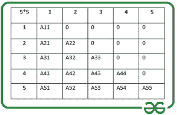
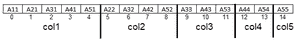

# 使用列主映射存储下三角矩阵的有效方法

> 原文:[https://www . geesforgeks . org/高效-方法-存储-下三角矩阵-使用-列-主要-映射/](https://www.geeksforgeeks.org/efficient-method-to-store-a-lower-triangular-matrix-using-column-major-mapping/)

给定一个 [<u>下三角矩阵</u>](https://www.geeksforgeeks.org/program-print-lower-triangular-upper-triangular-matrix-array/) **Mat[][]** ，任务是使用[列-主](https://www.geeksforgeeks.org/performance-analysis-of-row-major-and-column-major-order-of-storing-arrays-in-c/)映射存储矩阵。

**下三角矩阵:** A [<u>下三角矩阵</u>](https://www.geeksforgeeks.org/program-print-lower-triangular-upper-triangular-matrix-array/) 是一个正方形矩阵，其中矩阵的下三角部分由非零元素组成，上三角部分由 **0** s 组成。2D 矩阵 **Mat[][]** 的 [<u>下三角矩阵</u>](https://www.geeksforgeeks.org/program-check-matrix-lower-triangular/) 在数学上定义为:

*   如果 **i < j** ，设置 **Mat[i][j] = 0** 。
*   如果**和>= t1，则设置**食品【I】【j】>0**。**

**插图:**

> *下方是一个****5×5****的下三角矩阵。一般来说，这样的矩阵可以存储在一个* [*<u>2D 阵</u>*](https://www.geeksforgeeks.org/multidimensional-arrays-c-cpp/) *中，但对于大尺寸的矩阵来说，由于存储不需要的****0s****而导致内存消耗较高，因此不是一个好的选择。*
> *这样的矩阵可以通过优化的方式实现。*
> 
> 

存储大小为 **N** 的 [<u>下三角矩阵</u>](https://www.geeksforgeeks.org/java-program-to-display-lower-triangular-matrix/) 的有效方法:

*   非零元素计数= **1 + 2 + 3 + … + N = N * (N + 1) /2** 。
*   计数**0**s =**N<sup>2</sup>–(N *(N+1)/2 =(N *(N-1)/2**。

现在让我们看看如何在程序中表示下三角矩阵。请注意，必须避免存储 **0s** 以减少内存消耗。经计算，存储非零元素需要 **N*(N + 1)/2** 空间。以上述为例， **N = 5** 。需要大小为 **5 * (5 + 1)/2 = 15** 的数组来存储非零元素。

现在，2D 矩阵的元素可以一列一列地存储在 1D 数组中，如下所示:



存储下三角形元素的数组

除了将元素存储在数组中之外，还需要提取对应于行号和列号的元素的过程。使用 [列-主-映射](https://en.wikipedia.org/wiki/Row-_and_column-major_order) 来存储一个下三角矩阵，索引 **处的元素 Mat【I】【j】**可以表示为:

> ****的索引 Mat[i][j]*** *数组中的矩阵 A[]=[n *(j-1)-((j-2)*(j-1))/2)+(I-j))]**

*以下是上述条款的实施情况:*

## *C++*

```
*// C++ program for the above approach
#include <bits/stdc++.h>
#include<stdio.h>
using namespace std;

// Dimensions of the matrix
const int N = 5;

// Structure of a memory
// efficient matrix
struct Matrix {
    int* A;
    int size;
};

// Function to set the
// values in the Matrix
void Set(struct Matrix* m, int i,
         int j, int x)
{
    if (i >= j)
        m->A[((m->size)*(j-1)-(((j-2)
              *(j-1))/2)+(i-j))] = x;
}

// Function to store the
// values in the Matrix
int Get(struct Matrix m, int i, int j)
{
    if (i >= j)
        return m.A[((m.size)*(j-1)-(((j-2)
                   *(j-1))/2)+(i-j))];
    else
        return 0;
}

// Function to display the
// elements of the matrix
void Display(struct Matrix m)
{
    // Traverse the matrix
    for (int i = 1; i <= m.size; i++)
    {
        for (int j = 1; j <= m.size; j++)
        {
            if (i >= j)
                cout<< m.A[((m.size)*(j-1)-(((j-2)
                       *(j-1))/2)+(i-j))] <<" ";
            else
                cout<<"0 ";
        }
        cout<<endl;
    }
}

// Function to generate an efficient matrix
struct Matrix createMat(int Mat[N][N])
{
    // Declare efficient Matrix
    struct Matrix mat;

    // Initialize the Matrix
    mat.size = N;
    mat.A = (int*)malloc(
        mat.size * (mat.size + 1) / 2
        * sizeof(int));

    // Set the values in matrix
    for (int i = 1; i <= mat.size; i++) {

        for (int j = 1; j <= mat.size; j++) {

            Set(&mat, i, j, Mat[i - 1][j - 1]);
        }
    }

    // Return the matrix
    return mat;
}

// Driver Code
int main()
{

    // Given Input
    int Mat[5][5] = { { 1, 0, 0, 0, 0 },
                      { 1, 2, 0, 0, 0 },
                      { 1, 2, 3, 0, 0 },
                      { 1, 2, 3, 4, 0 },
                      { 1, 2, 3, 4, 5 } };

    // Function call to create a memory
    // efficient matrix
    struct Matrix mat = createMat(Mat);

    // Function call to
      // print the Matrix
    Display(mat);

    return 0;
}

// This code is contributed by rrrtnx.*
```

## *C*

```
*// C program for the above approach
#include <stdio.h>
#include <stdlib.h>

// Dimensions of the matrix
const int N = 5;

// Structure of a memory
// efficient matrix
struct Matrix {
    int* A;
    int size;
};

// Function to set the
// values in the Matrix
void Set(struct Matrix* m, int i,
         int j, int x)
{
    if (i >= j)
        m->A[((m->size)*(j-1)-(((j-2)
              *(j-1))/2)+(i-j))] = x;
}

// Function to store the
// values in the Matrix
int Get(struct Matrix m, int i, int j)
{
    if (i >= j)
        return m.A[((m.size)*(j-1)-(((j-2)
                   *(j-1))/2)+(i-j))];
    else
        return 0;
}

// Function to display the
// elements of the matrix
void Display(struct Matrix m)
{
    // Traverse the matrix
    for (int i = 1; i <= m.size; i++)
    {
        for (int j = 1; j <= m.size; j++)
        {
            if (i >= j)
                printf("%d ",
                       m.A[((m.size)*(j-1)-(((j-2)
                       *(j-1))/2)+(i-j))]);
            else
                printf("0 ");
        }
        printf("\n");
    }
}

// Function to generate an efficient matrix
struct Matrix createMat(int Mat[N][N])
{
    // Declare efficient Matrix
    struct Matrix mat;

    // Initialize the Matrix
    mat.size = N;
    mat.A = (int*)malloc(
        mat.size * (mat.size + 1) / 2
        * sizeof(int));

    // Set the values in matrix
    for (int i = 1; i <= mat.size; i++) {

        for (int j = 1; j <= mat.size; j++) {

            Set(&mat, i, j, Mat[i - 1][j - 1]);
        }
    }

    // Return the matrix
    return mat;
}

// Driver Code
int main()
{
    // Given Input
    int Mat[5][5] = { { 1, 0, 0, 0, 0 },
                      { 1, 2, 0, 0, 0 },
                      { 1, 2, 3, 0, 0 },
                      { 1, 2, 3, 4, 0 },
                      { 1, 2, 3, 4, 5 } };

    // Function call to create a memory
    // efficient matrix
    struct Matrix mat = createMat(Mat);

    // Function call to
      // print the Matrix
    Display(mat);

    return 0;
}*
```

***Output**

```
1 0 0 0 0 
1 2 0 0 0 
1 2 3 0 0 
1 2 3 4 0 
1 2 3 4 5 
```* 

****时间复杂度:**O(N<sup>2</sup>)*
***辅助空间:** O(N <sup>2</sup> )**