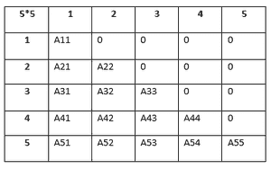
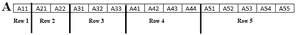

# 使用行主映射存储下三角矩阵的有效方法

> 原文:[https://www . geesforgeks . org/高效-方法-存储-下三角矩阵-使用-行-主要-映射/](https://www.geeksforgeeks.org/efficient-method-to-store-a-lower-triangular-matrix-using-row-major-mapping/)

给定一个[下三角矩阵](https://www.geeksforgeeks.org/program-print-lower-triangular-upper-triangular-matrix-array/) **Mat[][]** ，任务是使用行-主映射来存储矩阵。

**下三角矩阵:** A [下三角矩阵](https://www.geeksforgeeks.org/program-print-lower-triangular-upper-triangular-matrix-array/)是一个正方形矩阵，其中矩阵的下三角部分由非零元素组成，上三角部分由 **0** s 组成。2D 矩阵的[下三角矩阵](https://www.geeksforgeeks.org/program-check-matrix-lower-triangular/)在数学上定义为:

*   如果 **i < j** ，设置 **Mat[i][j] = 0** 。
*   如果**和>= t1，则设置**食品【I】【j】>0**。**

> **图解:**下图为 **5×5** 下三角矩阵。一般来说，这样的矩阵可以存储在一个 [2D 数组](https://www.geeksforgeeks.org/multidimensional-arrays-c-cpp/)中，但是对于大尺寸的矩阵来说，由于存储了不需要的 **0s** ，内存消耗很大，所以不是一个好的选择。
> 这样的矩阵可以以优化的方式实现。
> 
> 

存储大小为 **N** 的[下三角矩阵](https://www.geeksforgeeks.org/java-program-to-display-lower-triangular-matrix/)的有效方法:

*   非零元素计数= **1 + 2 + 3 + … + N = N * (N + 1) /2** 。
*   计数**0**s =**N<sup>2</sup>–(N *(N+1)/2 =(N *(N-1)/2**。

现在让我们看看如何在程序中表示下三角矩阵。请注意，必须避免存储 **0s** 以减少内存消耗。经计算，存储非零元素需要 **N*(N + 1)/2** 空间。以上述为例， **N = 5** 。需要大小为 **5 * (5 + 1)/2 = 15** 的数组来存储非零元素。

现在，2D 矩阵的元素可以一行一行地存储在 1D 数组中，如下所示:



除了将元素存储在数组中之外，还需要提取对应于行号和列号的元素的过程。
使用[行主映射](https://en.wikipedia.org/wiki/Row-_and_column-major_order)存储下三角矩阵，索引**Mat【I】【j】**处的元素可以表示为:

> 阵列中 **Mat[i][j]** 矩阵的索引**A[]**=**【I *(I–1)/2+j–1】**

下面是上述方法的实现:

## C

```
// C program for the above approach
#include <stdio.h>
#include <stdlib.h>

// Dimensions of a matrix
const int N = 5;

// Structure of the efficient matrix
struct Matrix {
    int* A;
    int size;
};

// Function to set the
// values in the Matrix
void Set(struct Matrix* mat,
         int i, int j, int x)
{
    if (i >= j)
        mat->A[i * (i - 1) / 2 + j - 1] = x;
}

// Function to store the
// values in the Matrix
int Get(struct Matrix mat, int i, int j)
{
    if (i >= j) {
        return mat.A[i * (i - 1) / 2 + j - 1];
    }
    else {
        return 0;
    }
}

// Function to display the
// elements of the matrix
void Display(struct Matrix mat)
{
    int i, j;

    // Traverse the matrix
    for (i = 1; i <= mat.size; i++) {
        for (j = 1; j <= mat.size; j++) {

            if (i >= j) {
                printf("%d ",
                       mat.A[i * (i - 1) / 2 + j - 1]);
            }
            else {
                printf("0 ");
            }
        }
        printf("\n");
    }
}

// Function to generate an efficient matrix
struct Matrix createMat(int Mat[N][N])
{
    // Declare efficient Matrix
    struct Matrix mat;

    // Initialize the Matrix
    mat.size = N;
    mat.A = (int*)malloc(
        mat.size * (mat.size + 1) / 2
        * sizeof(int));

    int i, j;

    // Set the values in matrix
    for (i = 1; i <= mat.size; i++) {

        for (j = 1; j <= mat.size; j++) {

            Set(&mat, i, j, Mat[i - 1][j - 1]);
        }
    }

    // Return the matrix
    return mat;
}

// Driver Code
int main()
{
    int Mat[5][5] = { { 1, 0, 0, 0, 0 },
                      { 1, 2, 0, 0, 0 },
                      { 1, 2, 3, 0, 0 },
                      { 1, 2, 3, 4, 0 },
                      { 1, 2, 3, 4, 5 } };

    // Stores the efficient matrix
    struct Matrix mat = createMat(Mat);

    // Print the Matrix
    Display(mat);

    return 0;
}
```

## Java 语言(一种计算机语言，尤用于创建网站)

```
// Java program for the above approach
class GFG
{

// Dimensions of a matrix
static int N = 5;

// Structure of the efficient matrix
static class Matrix {
    int[] A;
    int size;
};

// Function to set the
// values in the Matrix
static void Set(Matrix mat,
         int i, int j, int x)
{
    if (i >= j)
        mat.A[i * (i - 1) / 2 + j - 1] = x;
}

// Function to store the
// values in the Matrix
static int Get(Matrix mat, int i, int j)
{
    if (i >= j) {
        return mat.A[i * (i - 1) / 2 + j - 1];
    }
    else {
        return 0;
    }
}

// Function to display the
// elements of the matrix
static void Display(Matrix mat)
{
    int i, j;

    // Traverse the matrix
    for (i = 1; i <= mat.size; i++) {
        for (j = 1; j <= mat.size; j++) {

            if (i >= j) {
                System.out.printf("%d ",
                       mat.A[i * (i - 1) / 2 + j - 1]);
            }
            else {
                System.out.printf("0 ");
            }
        }
        System.out.printf("\n");
    }
}

// Function to generate an efficient matrix
static Matrix createMat(int Mat[][])
{

    // Declare efficient Matrix
    Matrix mat = new Matrix();

    // Initialize the Matrix
    mat.size = N;
    mat.A = new int[(mat.size*(mat.size + 1)) / 2];
    int i, j;

    // Set the values in matrix
    for (i = 1; i <= mat.size; i++)
    {
        for (j = 1; j <= mat.size; j++)
        {
            Set(mat, i, j, Mat[i - 1][j - 1]);
        }
    }

    // Return the matrix
    return mat;
}

// Driver Code
public static void main(String[] args)
{
    int Mat[][] = { { 1, 0, 0, 0, 0 },
                      { 1, 2, 0, 0, 0 },
                      { 1, 2, 3, 0, 0 },
                      { 1, 2, 3, 4, 0 },
                      { 1, 2, 3, 4, 5 } };

    // Stores the efficient matrix
    Matrix mat = createMat(Mat);

    // Print the Matrix
    Display(mat);
}
}

// This code is contributed by 29AjayKumar
```

## C#

```
// C# program for the above approach
using System;
public class GFG
{

  // Dimensions of a matrix
  static int N = 5;

  // Structure of the efficient matrix
  class Matrix {
    public int[] A;
    public int size;
  };

  // Function to set the
  // values in the Matrix
  static void Set(Matrix mat,
                  int i, int j, int x)
  {
    if (i >= j)
      mat.A[i * (i - 1) / 2 + j - 1] = x;
  }

  // Function to store the
  // values in the Matrix
  static int Get(Matrix mat, int i, int j)
  {
    if (i >= j) {
      return mat.A[i * (i - 1) / 2 + j - 1];
    }
    else {
      return 0;
    }
  }

  // Function to display the
  // elements of the matrix
  static void Display(Matrix mat)
  {
    int i, j;

    // Traverse the matrix
    for (i = 1; i <= mat.size; i++) {
      for (j = 1; j <= mat.size; j++) {

        if (i >= j) {
          Console.Write("{0} ",
                        mat.A[i * (i - 1) / 2 + j - 1]);
        }
        else {
          Console.Write("0 ");
        }
      }
      Console.Write("\n");
    }
  }

  // Function to generate an efficient matrix
  static Matrix createMat(int [,]Mat)
  {

    // Declare efficient Matrix
    Matrix mat = new Matrix();

    // Initialize the Matrix
    mat.size = N;
    mat.A = new int[(mat.size*(mat.size + 1)) / 2];
    int i, j;

    // Set the values in matrix
    for (i = 1; i <= mat.size; i++)
    {
      for (j = 1; j <= mat.size; j++)
      {
        Set(mat, i, j, Mat[i - 1,j - 1]);
      }
    }

    // Return the matrix
    return mat;
  }

  // Driver Code
  public static void Main(String[] args)
  {
    int [,]Mat = { { 1, 0, 0, 0, 0 },
                  { 1, 2, 0, 0, 0 },
                  { 1, 2, 3, 0, 0 },
                  { 1, 2, 3, 4, 0 },
                  { 1, 2, 3, 4, 5 } };

    // Stores the efficient matrix
    Matrix mat = createMat(Mat);

    // Print the Matrix
    Display(mat);
  }
}

// This code is contributed by 29AjayKumar
```

**Output:** 

```
1 0 0 0 0 
1 2 0 0 0 
1 2 3 0 0 
1 2 3 4 0 
1 2 3 4 5
```

***时间复杂度:**O(N<sup>2</sup>)*
***辅助空间:** O(N <sup>2</sup> )*