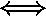

# 矩阵中的特征空间和特征谱值

> 原文:[https://www . geesforgeks . org/特征空间和特征谱矩阵值/](https://www.geeksforgeeks.org/eigenspace-and-eigenspectrum-values-in-a-matrix/)

**先决条件:**

*   [数学|特征值和特征向量](https://www.geeksforgeeks.org/eigen-values-and-eigen-vectors/)
*   [矩阵乘法](https://en.wikipedia.org/wiki/Matrix_multiplication)
*   [矩阵的零空间和零性](https://www.geeksforgeeks.org/null-space-and-nullity-of-a-matrix/)

对于给定的矩阵 *A* ，与特征值相关联的 *A* 的所有特征向量的集合跨越一个子空间，该子空间被称为 *A* 相对于的**特征空间**，并且由表示。 *A* 的所有特征值的集合称为 *A* 的**特征谱**，或简称为谱。
如果是 A 的特征值，那么对应的特征空间就是齐次线性方程组的解空间。几何上，对应于非零特征值的特征向量指向由线性映射拉伸的方向。特征值是它被拉伸的因子。如果特征值为负，则拉伸方向翻转。

除了已经在文章[数学|特征值和特征向量](https://www.geeksforgeeks.org/eigen-values-and-eigen-vectors/)中列出的属性之外，下面是特征值和特征向量的一些有用的属性。

*   矩阵 A 及其转置具有相同的特征值，但不一定具有相同的特征向量。*   The eigenspace  is the null space of  since
          

    **注:** ker 代表**内核**，是*空区*的别称。

    **计算特征值、特征向量和特征空间:**

    ```
    Consider given 2 X 2 matrix:

    Step 1: Characteristic polynomial and Eigenvalues.
    The characteristic polynomial is given by 
    det() 

    After we factorize the characteristic polynomial, we will get

    which gives eigenvalues as  and 

    Step 2: Eigenvectors and Eigenspaces
    We find the eigenvectors that correspond to these eigenvalues by looking 
    at vectors x such that 

    For  we obtain

    After solving the above homogeneous system of equations,
    we will obtain a solution space

    This eigenspace is one dimensional as it possesses a single basis vector.
    Similarly, we find eigenvector for  by solving
    the homogeneous system of equations

    This means any vector , where  
    such as  is an eigenvector with 
    eigenvalue 2\. This means eigenspace is given as 

    ```

    上例中的两个本征空间和是一维的，因为它们都被一个向量跨越。然而，在其他情况下，我们可能有多个相同的特征向量，并且特征空间可能有多个维度。