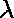
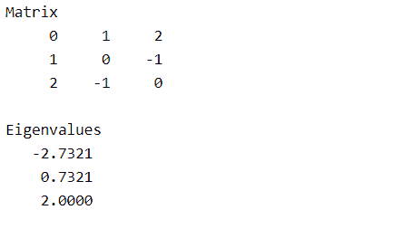
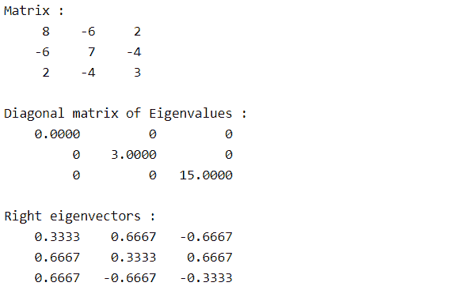
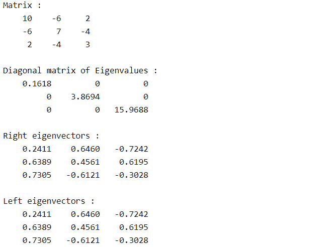
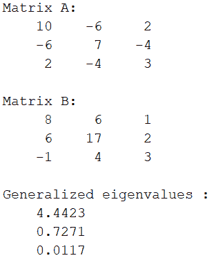

# MATLAB 中的特征值和特征向量

> 原文:[https://www . geesforgeks . org/特征值和特征向量-in-matlab/](https://www.geeksforgeeks.org/eigenvalues-and-eigenvectors-in-matlab/)

**特征值**和**特征向量**是正方形矩阵的性质。

让![ A =[a_{ij}]_{N*N}  ](img/275adee8630a48973d77034862c87280.png "Rendered by QuickLaTeX.com")是一个 **N*N 矩阵**， **X** 是一个大小为 N*1 的**向量，是一个**标量**。**

那么满足方程的值 X、分别是矩阵 A 的特征向量和特征值。

*   大小为 N*N 的矩阵具有 **N 个特征值**
*   每个特征值对应一个特征向量。

**Matlab** 允许用户使用 **eig()** 方法找到矩阵的特征值和特征向量。 **eig()** 方法的不同**语法**有:

*   e = eig(A)
*   [V，D] = eig(A)
*   [V，d，W] = eig(A)
*   e = eig(A，b)

让我们详细讨论一下上面的语法:

### **e = EII(a)**

*   返回**方阵 A** 的**特征值**的向量。

## 矩阵实验室

```
% Square matrix of size 3*3
A = [0 1 2;
    1 0 -1;
    2 -1 0];
disp("Matrix");
disp(A);

% Eigenvalues of matrix A
e = eig(A);
disp("Eigenvalues");
disp(e);
```

**输出:**



### **【V，D】= EIG(A)**

*   它返回对角线为**特征值的**对角矩阵 D** 。**
*   它还将**右向量的矩阵返回为 V** 。
*   正常**特征向量**被称为**右特征向量**。
*   **V** 是满足 **A*V = V*D** 的每个 N*1 尺寸(A 为 N*N 尺寸)的 N 个特征向量的集合

## 矩阵实验室

```
% Square matrix of size 3*3
A = [8 -6 2;
    -6 7 -4;
    2 -4 3];
disp("Matrix");
disp(A);

% Eigenvalues and right eigenvectors of matrix A
[V,D] = eig(A);
disp("Diagonal matrix of Eigenvalues");
disp(D);
disp("Right eigenvectors")
disp(V);
```

**输出:**



### **【V，D，W】= EIG(A)**

*   与特征值 **D** 和右特征向量 **V** 的对角矩阵一起，还返回矩阵 a 的**左特征向量**
*   左特征向量 **u** 是满足方程 **u*A = k*u** 的 **1*N 矩阵**，其中 **k** 是矩阵 A 的**左特征值。**
*   **W** 是满足**W’* A = D * W’**的 A 的 **N 个左特征向量**的集合。

## 矩阵实验室

```
% Square matrix of size 3*3
A = [10 -6 2;
    -6 7 -4;
     2 -4 3];
disp("Matrix :");
disp(A);

% Eigenvalues and right and left eigenvectors 
% of matrix A
[V,D,W] = eig(A);
disp("Diagonal matrix of Eigenvalues :");
disp(D);
disp("Right eigenvectors :")
disp(V);
disp("Left eigenvectors :")
disp(W);
```

**输出:**



### **e = eig(A，B)**

*   它返回相同大小的两个方阵 **A 和 B** 的**广义特征值**。
*   广义特征值 **λ** 和对应的**特征向量 v** 满足 **Av=λBv** 。

## 矩阵实验室

```
% Square matrix A and B of size 3*3
A = [10 -6 2;
    -6 7 -4;
     2 -4 3];
B = [8 6 1;
     6 17 2;
    -1 4 3];

disp("Matrix A:");
disp(A);
disp("Matrix B:");
disp(B);

% Generalized eigen values 
% of matrices A and B
e = eig(A,B);
disp("Generalized eigenvalues :")
disp(e);
```

**输出:**

