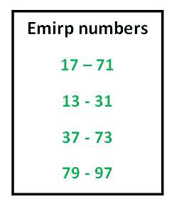

# Emirp 编号

> 原文:[https://www.geeksforgeeks.org/emirp-numbers/](https://www.geeksforgeeks.org/emirp-numbers/)

Emirp 是单词“质数”的倒拼，它指的是一个质数，当你把它的数字倒过来时，它就变成了一个新的质数。Emirps 不包括回文素数(如 151 或 787)也不包括 1 位数的素数(如 7)。107、113、149 和 157–反转它们，你手上就有了一个新的质数。来源:[维基](https://en.wikipedia.org/wiki/Emirp)



给定一个数字 n，任务是打印所有小于或等于 n 的 emrip。
**示例:**

```
Input  : n = 40
Output : 13 31 

Input  : n = 100
Output : 13 31 17 71 37 73 79 97
```

下面是步骤:
1)使用厄拉多塞的筛子生成所有小于或等于 n 的素数，我们也可以使用孙达拉姆的[筛子](https://www.geeksforgeeks.org/sieve-sundaram-print-primes-smaller-n/)。
2)遍历所有生成的素数。对于每个遍历的素数，如果满足以下条件，打印该数及其反数。
…………。a)如果反序也是质数。
…………。b)反转与质数不同(不允许回文)
…………。c) Reverse 小于等于 n.
下面是上面思路的实现。

## C++

```
// Program to print Emirp numbers less than n
#include <bits/stdc++.h>
using namespace std;

// Function to find reverse of any number
int reverse(int x)
{
    int rev = 0;
    while (x > 0)
    {
        rev = (rev*10) + x%10;
        x = x/10;
    }
    return rev;
}

// Sieve method used for generating emirp number
// (use of sieve of Eratosthenes)
void printEmirp(int n)
{
    // Create a boolean array "prime[0..n]" and initialize
    // all entries it as true. A value in prime[i] will
    // finally be false if i is Not a prime, else true.
    bool prime[n+1];
    memset(prime, true, sizeof(prime));

    for (int p=2; p*p<=n; p++)
    {
        // If prime[p] is not changed, then it is a prime
        if (prime[p] == true)
        {
            // Update all multiples of p
            for (int i=p*2; i<=n; i += p)
                prime[i] = false;
        }
    }

    // Traverse all prime numbers
    for (int p=2; p<=n; p++)
    {
        if (prime[p])
        {
            // Find reverse a number
            int rev = reverse(p);

            // A number is emrip if it is not a palindrome
            // number and its reverse is also prime.
            if (p != rev && rev <= n && prime[rev])
            {
               cout << p << " " << rev << " ";

               // Mark reverse prime as false so that it's
               // not printed again
               prime[rev] = false;
            }
        }
    }
}

// Driver program
int main()
{
    int n = 40;
    printEmirp(n);
    return 0;
}
```

## Java 语言(一种计算机语言，尤用于创建网站)

```
// Java program to print Emirp
// numbers less than n
import java.util.Arrays;

class GFG
{
    // Function to find reverse of any number
    static int reverse(int x)
    {
        int rev = 0;
        while (x > 0)
        {
            rev = (rev * 10) + x % 10;
            x = x / 10;
        }
        return rev;
    }

    // Sieve method used for generating emirp number
    // (use of sieve of Eratosthenes)
    static void printEmirp(int n)
    {
        // Create a boolean array "prime[0..n]" and initialize
        // all entries it as true. A value in prime[i] will
        // finally be false if i is Not a prime, else true.
        boolean prime[]=new boolean[n + 1];
        Arrays.fill(prime,true);

        for (int p = 2; p * p <= n; p++)
        {
            // If prime[p] is not changed, then it is a prime
            if (prime[p] == true)
            {
                // Update all multiples of p
                for (int i = p * 2; i <= n; i += p)
                    prime[i] = false;
            }
        }

        // Traverse all prime numbers
        for (int p = 2; p <= n; p++)
        {
            if (prime[p])
            {
                // Find reverse a number
                int rev = reverse(p);

                // A number is emrip if it is not a palindrome
                // number and its reverse is also prime.
                if (p != rev && rev <= n && prime[rev])
                {
                    System.out.print(p + " " + rev + " ");

                    // Mark reverse prime as false so that it's
                    // not printed again
                    prime[rev] = false;
                }
            }
        }
    }

    // Driver code
    public static void main (String[] args)
    {
        int n = 100;
        printEmirp(n);
    }
}

// This code is contributed by Anant Agarwal.
```

## 蟒蛇 3

```
# Program to print Emirp numbers
# less than n

# Function to find reverse
# of any number
def reverse(x):

    rev = 0;
    while (x > 0):
        rev = (rev * 10) + x % 10;
        x = int(x / 10);

    return rev;

# Sieve method used for generating
# emirp number(use of sieve of
# Eratosthenes)
def printEmirp(n):

    # Create a boolean array "prime[0..n]"
    # and initialize all entries it as true.
    # A value in prime[i] will finally be
    # false if i is Not a prime, else true.
    prime = [1] * (n + 1);
    p = 2;
    while (p * p <= n):

        # If prime[p] is not changed,
        # then it is a prime
        if (prime[p] == 1):

            # Update all multiples of p
            for i in range(p * 2, n + 1, p):
                prime[i] = 0;
        p += 1;

    # Traverse all prime numbers
    for p in range(2, n + 1):
        if (prime[p] == 1):

            # Find reverse a number
            rev = reverse(p);

            # A number is emrip if it is not
            # a palindrome number and its
            # reverse is also prime.
            if (p != rev and rev <= n and
                       prime[rev] == 1):
                print(p, rev, end = " ");

                # Mark reverse prime as
                # false so that it's
                # not printed again
                prime[rev] = 0;

# Driver Code
n = 100;
printEmirp(n);

# This code is contributed by mits
```

## C#

```
// C# program to print Emirp
// numbers less than n
using System;

class GFG
{
    // Function to find
    // reverse of any number
    static int reverse(int x)
    {
        int rev = 0;
        while (x > 0)
        {
            rev = (rev * 10) + x % 10;
            x = x / 10;
        }
        return rev;
    }

    // Sieve method used for
    // generating emirp number
    // (use of sieve of Eratosthenes)
    static void printEmirp(int n)
    {
        // Create a boolean array
        // "prime[0..n]" and initialize
        // all entries it as true. A value
        // in prime[i] will finally be false 
        // if i is Not a prime, else true.
        bool []prime = new bool[n + 1];
        for(int i = 0; i < n + 1; i++)
        prime[i] = true;

        for (int p = 2; p * p <= n; p++)
        {
            // If prime[p] is not changed,
            // then it is a prime
            if (prime[p] == true)
            {
                // Update all multiples of p
                for (int i = p * 2; i <= n; i += p)
                    prime[i] = false;
            }
        }

        // Traverse all prime numbers
        for (int p = 2; p <= n; p++)
        {
            if (prime[p])
            {
                // Find reverse a number
                int rev = reverse(p);

                // A number is emrip if it
                // is not a palindrome number
                // and its reverse is also prime.
                if (p != rev && rev <= n && prime[rev])
                {
                    Console.Write(p + " " + rev + " ");

                    // Mark reverse prime as false
                    // so that it's not printed again
                    prime[rev] = false;
                }
            }
        }
    }

    // Driver code
    public static void Main ()
    {
        int n = 100;
        printEmirp(n);
    }
}

// This code is contributed by nitin mittal.
```

## 服务器端编程语言（Professional Hypertext Preprocessor 的缩写）

```
<?php
// Program to print Emirp numbers
// less than n

// Function to find reverse
// of any number
function reverse($x)
{
    $rev = 0;
    while ($x > 0)
    {
         $rev = ($rev  * 10) + $x % 10;
        $x = (int)($x / 10);
    }
    return $rev;
}

// Sieve method used for generating
// emirp number(use of sieve of
// Eratosthenes)
function printEmirp($n)
{
    // Create a boolean array "prime[0..n]"
    // and initialize all entries it as true.
    // A value in prime[i] will finally be
    // false if i is Not a prime, else true.
    $prime = array_fill(0, ($n + 1), 1);

    for ($p = 2; $p * $p <= $n; $p++)
    {
        // If prime[p] is not changed,
        // then it is a prime
        if ($prime[$p] == 1)
        {
            // Update all multiples of p
            for ($i = $p * 2; $i <= $n; $i += $p)
                $prime[$i] = 0;
        }
    }

    // Traverse all prime numbers
    for ($p = 2; $p <= $n; $p++)
    {
        if ($prime[$p] == 1)
        {
            // Find reverse a number
            $rev = reverse($p);

            // A number is emrip if it is not
            // a palindrome number and its
            // reverse is also prime.
            if ($p != $rev && $rev <= $n &&
                $prime[$rev] == 1)
            {
                echo $p . " " . $rev . " ";

                // Mark reverse prime as
                // false so that it's
                // not printed again
                $prime[$rev] = 0;
            }
        }
    }
}

// Driver Code
$n = 100;
printEmirp($n);

// This code is contributed by mits
?>
```

## java 描述语言

```
<script>

// Javascript program to print Emirp
// numbers less than n

// Function to find reverse of any number
    function reverse(x)
    {
        var rev = 0;
        while (x > 0)
        {
            rev = (rev * 10) + x % 10;
            x = parseInt(x / 10);
        }
        return rev;
    }

    // Sieve method used for generating emirp number
    // (use of sieve of Eratosthenes)
    function printEmirp(n)
    {
        // Create a boolean array
        // "prime[0..n]" and initialize
        // all entries it as true.
        // A value in prime[i] will
        // finally be false if i is
        // Not a prime, else true.
       var  prime=Array.from({length: n+1},
                  (_, i) => true);

        for (p = 2; p * p <= n; p++)
        {
            // If prime[p] is not changed,
            // then it is a prime
            if (prime[p] == true)
            {
                // Update all multiples of p
                for (i = p * 2; i <= n; i += p)
                    prime[i] = false;
            }
        }

        // Traverse all prime numbers
        for (p = 2; p <= n; p++)
        {
            if (prime[p])
            {
                // Find reverse a number
                var rev = reverse(p);

                // A number is emrip if
                // it is not a palindrome
                // number and its reverse
                // is also prime.
                if (p != rev && rev <= n &&
                    prime[rev])
                {
                    document.write(p + " " + rev + " ");

                    // Mark reverse prime as false
                    // so that it's
                    // not printed again
                    prime[rev] = false;
                }
            }
        }
    }

    // Driver code
    var n = 100;
    printEmirp(n);

// This code contributed by Princi Singh

</script>
```

**输出:**

```
13 31 17 71 37 73 79 97
```

本文由**Shivam prad Han(anuj _ charm)**供稿。如果你喜欢 GeeksforGeeks 并想投稿，你也可以使用[contribute.geeksforgeeks.org](http://www.contribute.geeksforgeeks.org)写一篇文章或者把你的文章邮寄到 contribute@geeksforgeeks.org。看到你的文章出现在极客博客主页上，帮助其他极客。
如果你发现任何不正确的地方，或者你想分享更多关于上面讨论的话题的信息，请写评论。