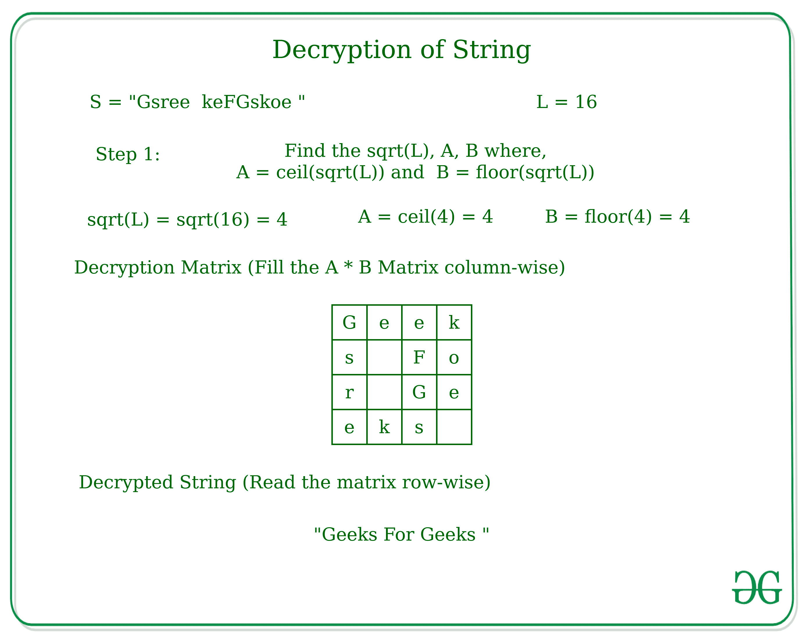

# 根据给定技术对字符串进行加密和解密

> 原文:[https://www . geesforgeks . org/按给定技术加密和解密字符串/](https://www.geeksforgeeks.org/encryption-and-decryption-of-string-according-to-given-technique/)

给定一个字符串 **S** ，任务是加密该字符串，并将该字符串再次解密为原始形式。
**加密技术:**如果 **L** 是字符串的长度，那么取两个值，一个是√L 的天花板(比如说 b)，另一个是√L 的地板(比如说 a)，做一个行= a，列= b 的二维矩阵
如果行*列< L，那么增加 a 或者 b 的值，取最小值。用原始字符串的字符顺序填充矩阵。获得矩阵后，逐列读取矩阵并打印获得的字符串。


**解密技巧:**如果 **L** 是加密字符串的长度，那么再次找到 a 和 b 两个值，其中 a 是√L 的天花板值，b 是√L 的地板值。类似地，创建一个 2D 矩阵，其中按列存储字符串，并按行读取矩阵以获得原始形式的字符串。



**加密方式:**

*   求弦的长度 **L** 。
*   找到√Length 的天花板和地板值，并将其分配给变量。
*   检查两个变量的乘积是否> =长度，如果不是，则将较小值的变量增加 1。
*   创建一个 2D 矩阵，并逐行填充字符串的字符。
*   逐列读取矩阵以获取加密字符串。

**解密方式:**

*   求弦的长度 **L** 。
*   找到√Length 的天花板和地板值，并将其分配给变量。
*   创建一个 2D 矩阵，用字符串填充矩阵。
*   逐行读取矩阵以获得解密的字符串。

以下是上述方法的实现:

## C++

```
// C++ implementation for Custom
// Encryption and Decryption of String

#include <bits/stdc++.h>
using namespace std;

// Function to encrypt the string
string encryption(string s)
{
    int l = s.length();
    int b = ceil(sqrt(l));
    int a = floor(sqrt(l));
    string encrypted;
    if (b * a < l) {
        if (min(b, a) == b) {
            b = b + 1;
        }
        else {
            a = a + 1;
        }
    }

    // Matrix to generate the
    // Encrypted String
    char arr[a][b];
    memset(arr, ' ', sizeof(arr));
    int k = 0;

    // Fill the matrix row-wise
    for (int j = 0; j < a; j++) {
        for (int i = 0; i < b; i++) {
            if (k < l){
                arr[j][i] = s[k];
            }
            k++;
        }
    }

    // Loop to generate
    // encrypted string
    for (int j = 0; j < b; j++) {
        for (int i = 0; i < a; i++) {
            encrypted = encrypted +
                         arr[i][j];
        }
    }
    return encrypted;
}

// Function to decrypt the string
string decryption(string s){
    int l = s.length();
    int b = ceil(sqrt(l));
    int a = floor(sqrt(l));
    string decrypted;

    // Matrix to generate the
    // Encrypted String
    char arr[a][b];
    memset(arr, ' ', sizeof(arr));
    int k = 0;

    // Fill the matrix column-wise
    for (int j = 0; j < b; j++) {
        for (int i = 0; i < a; i++) {
            if (k < l){
                arr[j][i] = s[k];
            }
            k++;
        }
    }

    // Loop to generate
    // decrypted string
    for (int j = 0; j < a; j++) {
        for (int i = 0; i < b; i++) {
            decrypted = decrypted +
                         arr[i][j];
        }
    }
    return decrypted;
}

// Driver Code
int main()
{
    string s = "Geeks For Geeks";
    string encrypted;
    string decrypted;

    // Encryption of String
    encrypted = encryption(s);
    cout << encrypted << endl;

    // Decryption of String
    decrypted = decryption(encrypted);
    cout << decrypted;
    return 0;
}
```

## Java 语言(一种计算机语言，尤用于创建网站)

```
// Java implementation for Custom
// Encryption and Decryption of String
class GFG
{

// Function to encrypt the String
static String encryption(char[] s)
{
    int l = s.length;
    int b = (int) Math.ceil(Math.sqrt(l));
    int a = (int) Math.floor(Math.sqrt(l));
    String encrypted = "";
    if (b * a < l)
    {
        if (Math.min(b, a) == b)
        {
            b = b + 1;
        }
        else
        {
            a = a + 1;
        }
    }

    // Matrix to generate the
    // Encrypted String
    char [][]arr = new char[a][b];
    int k = 0;

    // Fill the matrix row-wise
    for (int j = 0; j < a; j++)
    {
        for (int i = 0; i < b; i++)
        {
            if (k < l)
            {
                arr[j][i] = s[k];
            }
            k++;
        }
    }

    // Loop to generate
    // encrypted String
    for (int j = 0; j < b; j++)
    {
        for (int i = 0; i < a; i++)
        {
            encrypted = encrypted +
                        arr[i][j];
        }
    }
    return encrypted;
}

// Function to decrypt the String
static String decryption(char []s)
{
    int l = s.length;
    int b = (int) Math.ceil(Math.sqrt(l));
    int a = (int) Math.floor(Math.sqrt(l));
    String decrypted="";

    // Matrix to generate the
    // Encrypted String
    char [][]arr = new char[a][b];
    int k = 0;

    // Fill the matrix column-wise
    for (int j = 0; j < b; j++)
    {
        for (int i = 0; i < a; i++)
        {
            if (k < l)
            {
                arr[j][i] = s[k];
            }
            k++;
        }
    }

    // Loop to generate
    // decrypted String
    for (int j = 0; j < a; j++)
    {
        for (int i = 0; i < b; i++)
        {
            decrypted = decrypted +
                        arr[i][j];
        }
    }
    return decrypted;
}

// Driver Code
public static void main(String[] args)
{
    String s = "Geeks For Geeks";
    String encrypted;
    String decrypted;

    // Encryption of String
    encrypted = encryption(s.toCharArray());
    System.out.print(encrypted +"\n");

    // Decryption of String
    decrypted = decryption(encrypted.toCharArray());
    System.out.print(decrypted);
}
}

// This code is contributed by PrinciRaj1992
```

## 蟒蛇 3

```
# Python3 implementation for Custom
# Encryption and Decryption of String
from math import ceil,floor,sqrt

# Function to encrypt the
def encryption(s):
    l = len(s)
    b = ceil(sqrt(l))
    a = floor(sqrt(l))
    encrypted=""
    if (b * a < l):
        if (min(b, a) == b):
            b = b + 1
        else:
            a = a + 1

    # Matrix to generate the
    # Encrypted String
    arr = [[' ' for i in range(a)] for j in range(b)]
    k = 0

    # Fill the matrix row-wise
    for j in range(a):
        for i in range(b):
            if (k < l):
                arr[j][i] = s[k]
            k += 1

    # Loop to generate
    # encrypted
    for j in range(b):
        for i in range(a):
            encrypted = encrypted + arr[i][j]

    return encrypted

# Function to decrypt the
def decryption(s):
    l = len(s)
    b = ceil(sqrt(l))
    a = floor(sqrt(l))
    decrypted=""

    # Matrix to generate the
    # Encrypted String
    arr = [[' ' for i in range(a)] for j in range(b)]
    k = 0

    # Fill the matrix column-wise
    for j in range(b):
        for i in range(a):
            if (k < l):
                arr[j][i] = s[k]
            k += 1

    # Loop to generate
    # decrypted
    for j in range(a):
        for i in range(b):
            decrypted = decrypted + arr[i][j]
    return decrypted

# Driver Code

s = "Geeks For Geeks"
encrypted=""
decrypted=""

# Encryption of String
encrypted = encryption(s)
print(encrypted)

# Decryption of String
decrypted = decryption(encrypted)
print(decrypted)

# This code is contributed by mohit kumar 29
```

## C#

```
// C# implementation for Custom
// Encryption and Decryption of String
using System;

class GFG
{

// Function to encrypt the String
static String encryption(char[] s)
{
    int l = s.Length;
    int b = (int) Math.Ceiling(Math.Sqrt(l));
    int a = (int) Math.Floor(Math.Sqrt(l));
    String encrypted = "";
    if (b * a < l)
    {
        if (Math.Min(b, a) == b)
        {
            b = b + 1;
        }
        else
        {
            a = a + 1;
        }
    }

    // Matrix to generate the
    // Encrypted String
    char [,]arr = new char[a, b];
    int k = 0;

    // Fill the matrix row-wise
    for (int j = 0; j < a; j++)
    {
        for (int i = 0; i < b; i++)
        {
            if (k < l)
            {
                arr[j, i] = s[k];
            }
            k++;
        }
    }

    // Loop to generate
    // encrypted String
    for (int j = 0; j < b; j++)
    {
        for (int i = 0; i < a; i++)
        {
            encrypted = encrypted +
                        arr[i, j];
        }
    }
    return encrypted;
}

// Function to decrypt the String
static String decryption(char []s)
{
    int l = s.Length;
    int b = (int) Math.Ceiling(Math.Sqrt(l));
    int a = (int) Math.Floor(Math.Sqrt(l));
    String decrypted="";

    // Matrix to generate the
    // Encrypted String
    char [,]arr = new char[a, b];
    int k = 0;

    // Fill the matrix column-wise
    for (int j = 0; j < b; j++)
    {
        for (int i = 0; i < a; i++)
        {
            if (k < l)
            {
                arr[j, i] = s[k];
            }
            k++;
        }
    }

    // Loop to generate
    // decrypted String
    for (int j = 0; j < a; j++)
    {
        for (int i = 0; i < b; i++)
        {
            decrypted = decrypted +
                        arr[i, j];
        }
    }
    return decrypted;
}

// Driver Code
public static void Main(String[] args)
{
    String s = "Geeks For Geeks";
    String encrypted;
    String decrypted;

    // Encryption of String
    encrypted = encryption(s.ToCharArray());
    Console.Write(encrypted +"\n");

    // Decryption of String
    decrypted = decryption(encrypted.ToCharArray());
    Console.Write(decrypted);
}
}

// This code is contributed by PrinciRaj1992
```

## java 描述语言

```
<script>

// JavaScript implementation for Custom
// Encryption and Decryption of let

// Function to encrypt the let
function encryption(s) {
    let l = s.length;
    let b = Math.ceil(Math.sqrt(l));
    let a = Math.floor(Math.sqrt(l));
    let encrypted = '';
    if (b * a < l) {
        if (Math.min(b, a) == b) {
            b = b + 1;
        }
        else {
            a = a + 1;
        }
    }

    // Matrix to generate the
    // Encrypted let
    let arr = new Array();

    for (let i = 0; i < a; i++) {
        let temp = [];
        for (let j = 0; j < b; j++) {
            temp.push([])
        }
        arr.push(temp)
    }

    for (let i = 0; i < a; i++) {
        for (let j = 0; j < b; j++) {
            arr[i][j] = " "
        }
    }

    let k = 0;

    // Fill the matrix row-wise
    for (let j = 0; j < a; j++) {
        for (let i = 0; i < b; i++) {
            if (k < l) {
                arr[j][i] = s[k];
            }
            k++;
        }
    }

    // Loop to generate
    // encrypted let
    for (let j = 0; j < b; j++) {
        for (let i = 0; i < a; i++) {
            encrypted = encrypted +
                arr[i][j];
        }
    }
    return encrypted;
}

// Function to decrypt the let
function decryption(s) {
    let l = s.length;
    let b = Math.ceil(Math.sqrt(l));
    let a = Math.floor(Math.sqrt(l));
    let decrypted = '';

    // Matrix to generate the
    // Encrypted let
    let arr = new Array();
    for (let i = 0; i < a; i++) {
        let temp = [];
        for (let j = 0; j < b; j++) {
            temp.push([])
        }
        arr.push(temp)
    }
    for (let i = 0; i < a; i++) {
        for (let j = 0; j < b; j++) {
            arr[i][j] = " "
        }
    }
    let k = 0;

    // Fill the matrix column-wise
    for (let j = 0; j < b; j++) {
        for (let i = 0; i < a; i++) {
            if (k < l) {
                arr[j][i] = s[k];
            }
            k++;
        }
    }

    // Loop to generate
    // decrypted let
    for (let j = 0; j < a; j++) {
        for (let i = 0; i < b; i++) {
            decrypted = decrypted + arr[i][j];
        }
    }
    return decrypted;
}

// Driver Code

let s = "Geeks For Geeks";
let encrypted;
let decrypted;

// Encryption of let
encrypted = encryption(s);
document.write(encrypted + "<br>");

// Decryption of let
decrypted = decryption(encrypted);
document.write(decrypted);

// This code is contributed by gfgking

</script>
```

**Output:** 

```
Gsree  keFGskoe 
Geeks For Geeks
```