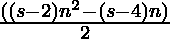
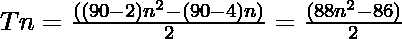

# 敌人数量

> 原文:[https://www.geeksforgeeks.org/enneacontagon-number/](https://www.geeksforgeeks.org/enneacontagon-number/)

给定一个编号 **N** ，任务是找到**N<sup>th</sup>T5[ennacontagon 编号](https://en.wikipedia.org/wiki/Enneacontagon)。** 

> 一个[ennacontagon 号](https://en.wikipedia.org/wiki/Enneacontagon)。是数字的类别。它有一个 90 边的多边形，叫做 enneacontagon。第 N 个 enneacontagon 数字计数是 90 个点，所有其他点被一个公共共享角包围并形成一个图案。最初的几个数字是 **1，90，267，532……**

**例:**

> **输入:** N = 2
> **输出:** 90
> **说明:**
> 第二个 enneacontagonol 号为 90。
> **输入:** N = 3
> **输出:** 267

**方法:**第 N 个 enneacontagon 数由公式给出:

*   s 边多边形的第 n 项= 

*   因此 90 边多边形的第 n 项是

> 

以下是上述方法的实现:

## C++

```
// C++ program for above approach
#include <bits/stdc++.h>
using namespace std;

// Finding the nth enneacontagon Number
int enneacontagonNum(int n)
{
    return (88 * n * n - 86 * n) / 2;
}

// Driver Code
int main()
{
    int n = 3;
    cout << "3rd enneacontagon Number is = "
         << enneacontagonNum(n);

    return 0;
}

// This code is contributed by Akanksha_Rai
```

## C

```
// C program for above approach
#include <stdio.h>
#include <stdlib.h>

// Finding the nth enneacontagon Number
int enneacontagonNum(int n)
{
    return (88 * n * n - 86 * n) / 2;
}

// Driver program to test above function
int main()
{
    int n = 3;
    printf("3rd enneacontagon Number is = %d",
           enneacontagonNum(n));

    return 0;
}
```

## Java 语言(一种计算机语言，尤用于创建网站)

```
// Java program for above approach
class GFG{

// Finding the nth enneacontagon number
public static int enneacontagonNum(int n)
{
    return (88 * n * n - 86 * n) / 2;
}

// Driver code   
public static void main(String[] args)
{
    int n = 3;

    System.out.println("3rd enneacontagon Number is = " +
                                    enneacontagonNum(n));
}
}

// This code is contributed by divyeshrabadiya07
```

## 蟒蛇 3

```
# Python3 program for above approach

# Finding the nth enneacontagon Number
def enneacontagonNum(n):

    return (88 * n * n - 86 * n) // 2

# Driver Code
n = 3
print("3rd enneacontagon Number is = ",
                   enneacontagonNum(n))

# This code is contributed by divyamohan123
```

## C#

```
// C# program for above approach
using System;
class GFG{

// Finding the nth enneacontagon number
public static int enneacontagonNum(int n)
{
    return (88 * n * n - 86 * n) / 2;
}

// Driver code
public static void Main(String[] args)
{
    int n = 3;

    Console.WriteLine("3rd enneacontagon Number is = " +
                                   enneacontagonNum(n));
}
}

// This code is contributed by Rajput-Ji
```

## java 描述语言

```
<script>

// JavaScript program for above approach

// Finding the nth enneacontagon Number
function enneacontagonNum(n)
{
    return (88 * n * n - 86 * n) / 2;
}

// Driver Code
var n = 3;
document.write("3rd enneacontagon Number is = " + enneacontagonNum(n));

</script>
```

**Output:** 

```
3rd enneacontagon Number is = 267
```

***时间复杂度:** O(1)*

***辅助空间:** O(1)*

**参考资料:**[https://en . Wikipedia . org/wiki/eneacontagon](https://en.wikipedia.org/wiki/Enneacontagon)