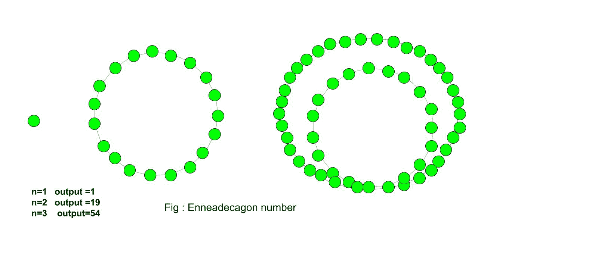

# 内部电话号码

> 原文:[https://www.geeksforgeeks.org/enneadecagonal-number/](https://www.geeksforgeeks.org/enneadecagonal-number/)

给定一个数 n，任务是找到第 n 个 Enneadecagonal 数。
一个 Enneadecagonal 数在数学中是一个十九边形。它属于一类比喻数字。数字包含点的数量，这些点排列成一个图案或系列。一个九进制数也被称为非十进制数。这些点具有公共点，所有其他点都排列在连续的层中。

**示例:**

> 输入:4
> 输出:106
> 输入:10
> 输出:775



计算第 n 个恩内卡数字的公式:

## C++

```
// C++ program to find
// nth Enneadecagonal number
#include <bits/stdc++.h>
using namespace std;

// Function to calculate
// Enneadecagonal number
int nthEnneadecagonal(long int n)
{
    // Formula for finding
    // nth Enneadecagonal number
    return (17 * n * n - 15 * n) / 2;
}

// Drivers code
int main()
{
    long int n = 6;
    cout << n << "th Enneadecagonal number :" << nthEnneadecagonal(n);
    return 0;
}
```

## Java 语言(一种计算机语言，尤用于创建网站)

```
// Java program to find
// nth Enneadecagonal number
import java.io.*;

class GFG {

    // Function to calculate
    // Enneadecagonal number
    static int nthEnneadecagonal(int n)
    {

        // Formula for finding
        // nth Enneadecagonal number
        return (17 * n * n - 15 * n) / 2;
    }

    // Driver Code
    public static void main (String[] args)
    {

        int n = 6;
        System.out.print(n + "th Enneadecagonal number :");

        System.out.println( nthEnneadecagonal(n));
    }
}

// This code is contributed by m_kit.
```

## 蟒蛇 3

```
# Program to find nth
# Enneadecagonal number

def nthEnneadecagonal(n) :

    # Formula to calculate nth
    # Enneadecagonal number
    return (17 * n * n - 15 * n) // 2

# Driver Code
if __name__ == '__main__' :

    n = 6
    print(n,"th Enneadecagonal number :"
                , nthEnneadecagonal(n))

# This code is contributed  by Ajit
```

## C#

```
// C# program to find
// nth Enneadecagonal number
using System;

class GFG
{
    // Function to calculate
    // Enneadecagonal number
    static int nthEnneadecagonal(int n)
    {

    // Formula for finding
    // nth Enneadecagonal number
    return (17 * n * n - 15 * n) / 2;
    }

    // Driver Code
    static public void Main ()
    {
    int n = 6;
    Console.Write(n + "th Enneadecagonal number :");

    Console.WriteLine( nthEnneadecagonal(n));
    }
}

// This code is contributed by aj_36
```

## 服务器端编程语言（Professional Hypertext Preprocessor 的缩写）

```
<?php
// PHP program to find
// nth Enneadecagonal number

// Function to calculate
// Enneadecagonal number
function nthEnneadecagonal($n)
{
    // Formula for finding
    // nth Enneadecagonal number
    return (17 * $n * $n -
            15 * $n) / 2;
}

// Driver Code
$n = 6;
echo $n , "th Enneadecagonal number :" ,
                  nthEnneadecagonal($n);

// This code is contributed by ajit
?>
```

## java 描述语言

```
<script>
    // Javascript program to find nth Enneadecagonal number

    // Function to calculate
    // Enneadecagonal number
    function nthEnneadecagonal(n)
    {

        // Formula for finding
        // nth Enneadecagonal number
        return (17 * n * n - 15 * n) / 2;
    }

    let n = 6;
    document.write(n + "th Enneadecagonal number :");

    document.write( nthEnneadecagonal(n));

</script>
```

**输出:**

```
6th Enneadecagonal number :261
```

**时间复杂度:**O(1)
T3】辅助空间: O(1)