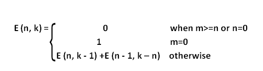

# 入口号

> 原文:[https://www.geeksforgeeks.org/entringer-number/](https://www.geeksforgeeks.org/entringer-number/)

**Entringer 数** E(n，k)是从 k + 1 开始的{1，2，…，n + 1}的排列数，在最初下降后，交替下降然后上升。条目由
给出



例如，对于 n = 4 和 k = 2，E(4，2)为 4。
它们是:
3 2 4 1 5
3 2 5 1 4
3 1 4 2 5
3 1 5 2 4
T6】示例:

```
Input : n = 4, k = 2
Output : 4

Input : n = 4, k = 3
Output : 5
```

下面是寻找入口数 E(n，k)的程序。该程序基于上述简单的递归公式。

## C++

```
// CPP Program to find Entringer Number E(n, k)
#include <bits/stdc++.h>
using namespace std;

// Return Entringer Number E(n, k)
int zigzag(int n, int k)
{
    // Base Case
    if (n == 0 && k == 0)
        return 1;

    // Base Case
    if (k == 0)
        return 0;

    // Recursive step
    return zigzag(n, k - 1) +
           zigzag(n - 1, n - k);
}

// Driven Program
int main()
{
    int n = 4, k = 3;
    cout << zigzag(n, k) << endl;
    return 0;
}
```

## Java 语言(一种计算机语言，尤用于创建网站)

```
// JAVA Code For Entringer Number
import java.util.*;

class GFG {

    // Return Entringer Number E(n, k)
    static int zigzag(int n, int k)
    {
        // Base Case
        if (n == 0 && k == 0)
            return 1;

        // Base Case
        if (k == 0)
            return 0;

        // Recursive step
        return zigzag(n, k - 1) +
               zigzag(n - 1, n - k);
    }

    /* Driver program to test above function */
    public static void main(String[] args)
    {
        int n = 4, k = 3;
        System.out.println(zigzag(n, k));

    }
}

// This code is contributed by Arnav Kr. Mandal.
```

## 蟒蛇 3

```
# Python Program to find Entringer Number E(n, k)

# Return Entringer Number E(n, k)
def zigzag(n, k):

    # Base Case
    if (n == 0 and k == 0):
        return 1

    # Base Case
    if (k == 0):
        return 0

    # Recursive step
    return zigzag(n, k - 1) + zigzag(n - 1, n - k);

# Driven Program
n = 4
k = 3
print(zigzag(n, k))

# This code is contributed by
# Smitha Dinesh Semwal   
```

## C#

```
// C# Code For Entringer Number
using System;

class GFG {

    // Return Entringer Number E(n, k)
    static int zigzag(int n, int k)
    {
        // Base Case
        if (n == 0 && k == 0)
            return 1;

        // Base Case
        if (k == 0)
            return 0;

        // Recursive step
        return zigzag(n, k - 1) +
               zigzag(n - 1, n - k);
    }

    /* Driver program to test above function */
    public static void Main()
    {
        int n = 4, k = 3;
        Console.WriteLine(zigzag(n, k));
    }
}

// This code is contributed by vt_m.
```

## 服务器端编程语言（Professional Hypertext Preprocessor 的缩写）

```
<?php
// PHP Program to find
// Entringer Number E(n, k)

// Return Entringer Number E(n, k)
function zigzag($n, $k)
{
    // Base Case
    if ($n == 0 and $k == 0)
        return 1;

    // Base Case
    if ($k == 0)
        return 0;

    // Recursive step
    return zigzag($n, $k - 1) +
        zigzag($n - 1,$n - $k);
}

// Driven Code
$n = 4; $k = 3;
echo zigzag($n, $k) ;

// This code is contributed by anuj_67.
?>
```

## java 描述语言

```
<script>
//  Program to find Entringer Number E(n, k)

// Return Entringer Number E(n, k)
function zigzag( n, k)
{
    // Base Case
    if (n == 0 && k == 0)
        return 1;

    // Base Case
    if (k == 0)
        return 0;

    // Recursive step
    return zigzag(n, k - 1) +
           zigzag(n - 1, n - k);
}

// Driven Program

     n = 4;
     k = 3;
    document.write( zigzag(n, k));
//This code is contributed by sweetyty
</script>
```

**输出:**

```
5
```

下面是用动态规划求入口数的实现:

## C++

```
// CPP Program to find Entringer Number E(n, k)
#include <bits/stdc++.h>
using namespace std;

// Return Entringer Number E(n, k)
int zigzag(int n, int k)
{
    int dp[n + 1][k + 1];
    memset(dp, 0, sizeof(dp));

    // Base cases
    dp[0][0] = 1;
    for (int i = 1; i <= n; i++)
        dp[i][0] = 0;   

    // Finding dp[i][j]
    for (int i = 1; i <= n; i++) {
        for (int j = 1; j <= i; j++)
            dp[i][j] = dp[i][j - 1] +
                       dp[i - 1][i - j];

    return dp[n][k];
}

// Driven Program
int main()
{
    int n = 4, k = 3;
    cout << zigzag(n, k) << endl;
    return 0;
}
```

## Java 语言(一种计算机语言，尤用于创建网站)

```
// JAVA Code For Entringer Number
import java.util.*;

class GFG {

    // Return Entringer Number E(n, k)
    static int zigzag(int n, int k)
    {
        int dp[][] = new int[n + 1][k + 1];

        // Base cases
        dp[0][0] = 1;
        for (int i = 1; i <= n; i++)
            dp[i][0] = 0;   

        // Finding dp[i][j]
        for (int i = 1; i <= n; i++) {
            for (int j = 1; j <= Math.min(i, k);
                                          j++)
                dp[i][j] = dp[i][j - 1] +
                           dp[i - 1][i - j];
            }

        return dp[n][k];
    }

    /* Driver program to test above function */
    public static void main(String[] args)
    {
        int n = 4, k = 3;
        System.out.println(zigzag(n, k));
    }
}

// This code is contributed by Arnav Kr. Mandal.   
```

## 蟒蛇 3

```
# Python3 Program to find Entringer
# Number E(n, k)

# Return Entringer Number E(n, k)
def zigzag(n, k):
    dp = [[0 for x in range(k+1)]
             for y in range(n+1)]

    # Base cases
    dp[0][0] = 1
    for i in range(1, n+1):
        dp[i][0] = 0

    # Finding dp[i][j]
    for i in range(1, n+1):
        for j in range(1, k+1):
            dp[i][j] = (dp[i][j - 1]
                 + dp[i - 1][i - j])

    return dp[n][k]

# Driven Program
n = 4
k = 3
print(zigzag(n, k))

# This code is contributed by
# Prasad Kshirsagar
```

## C#

```
// C# Code For Entringer Number
using System;

class GFG {

    // Return Entringer Number E(n, k)
    static int zigzag(int n, int k)
    {
        int[, ] dp = new int[n + 1, k + 1];

        // Base cases
        dp[0, 0] = 1;
        for (int i = 1; i <= n; i++)
            dp[i, 0] = 0;

        // Finding dp[i][j]
        for (int i = 1; i <= n; i++) {
            for (int j = 1; j <= Math.Min(i, k);
                j++)
                dp[i, j] = dp[i, j - 1] + dp[i - 1, i - j];
        }

        return dp[n, k];
    }

    /* Driver program to test above function */
    public static void Main()
    {
        int n = 4, k = 3;
        Console.WriteLine(zigzag(n, k));
    }
}

// This code is contributed by vt_m.
```

## 服务器端编程语言（Professional Hypertext Preprocessor 的缩写）

```
<?php
// PHP Program to find
// Entringer Number E(n, k)

// Return Entringer Number E(n, k)
function zigzag($n, $k)
{
    $dp = array(array());

    // Base cases
    $dp[0][0] = 1;
    for ($i = 1; $i <= $n; $i++)
        $dp[$i][0] = 0;

    // Finding dp[i][j]
    for ($i = 1; $i <= $n; $i++)
    {
        for ($j = 1; $j <= $i; $j++)
            $dp[$i][$j] = $dp[$i][$j - 1] +
                          $dp[$i - 1][$i - $j];
    }
    return $dp[$n][$k];
}

// Driven Code
$n = 4; $k = 3;
echo zigzag($n, $k);

// This code is contributed by anuj_67.
?>
```

## java 描述语言

```
<script>

// JavaScript program For Entringer Number

    // Return Entringer Number E(n, k)
    function zigzag(n, k)
    {
        let dp = new Array(n+1);

        // Loop to create 2D array using 1D array
        for (var i = 0; i < dp.length; i++) {
            dp[i] = new Array(2);
        }

        // Base cases
        dp[0][0] = 1;
        for (let i = 1; i <= n; i++)
            dp[i][0] = 0;   

        // Finding dp[i][j]
        for (let i = 1; i <= n; i++) {
            for (let j = 1; j <= Math.min(i, k);
                                          j++)
                dp[i][j] = dp[i][j - 1] +
                           dp[i - 1][i - j];
            }

        return dp[n][k];
    }

// Driver code

        let n = 4, k = 3;
        document.write(zigzag(n, k));

</script>
```

**输出:**

```
5
```