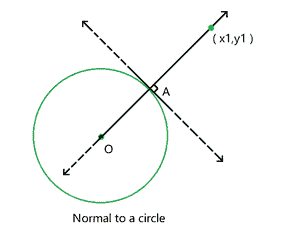

# 从给定点到圆的法线方程

> 原文:[https://www . geesforgeks . org/给定点法向圆方程/](https://www.geeksforgeeks.org/equation-of-a-normal-to-a-circle-from-a-given-point/)

给定三个整数 **a，b，c** 表示方程**x<sup>2</sup>+y<sup>2</sup>+ax+by+c = 0**的a [圆](https://en.wikipedia.org/wiki/Circle)的系数，任务是从给定点 **(x <sub>1</sub> ，y <sub>1</sub> )** 找到法线到圆的[方程。
***注:***](https://www.geeksforgeeks.org/tangents-and-normals/) [*【正常】*](https://www.geeksforgeeks.org/tangents-and-normals/) *是切线与曲线接触点处垂直于切线的直线。*



**示例:**

> **输入:** a = 4，b = 6，c = 5，x <sub>1</sub> = 12，y <sub>1</sub> = 14
> **输出:** y = 1.1x + 0.8
> 
> **输入:** a = 6，b = 12，c = 5，x <sub>1</sub> = 9，y <sub>1</sub> = 3
> **输出:** y = -0.5x + 7.5

**方法:**按照以下步骤解决问题:

*   圆的法线通过圆心。
*   因此，求圆心 **(g，f)** 的坐标，其中**g = a/2****f = b/2**。
*   由于圆心和法线所画的点位于法线上，计算法线的斜率 **(m)** 为**m =(y<sub>1</sub>–f)/(x<sub>1</sub>–g)**。
*   因此，法线方程为**y–y<sub>1</sub>= m *(x–x<sub>1</sub>)**。

下面是上述方法的实现:

## C++

```
// C++ program for the above approach
#include <bits/stdc++.h>
using namespace std;

// Function to calculate the slope
double normal_slope(double a, double b,
                    double x1, double y1)
{
    // Store the coordinates
    // the center of the circle
    double g = a / 2;
    double f = b / 2;

    // If slope becomes infinity
    if (g - x1 == 0)
        return (-1);

    // Stores the slope
    double slope = (f - y1) / (g - x1);

    // If slope is zero
    if (slope == 0)
        return (-2);

    // Return the result
    return slope;
}

// Function to find the equation of the
// normal to a circle from a given point
void normal_equation(double a, double b,
                     double x1, double y1)
{
    // Stores the slope of the normal
    double slope = normal_slope(a, b, x1, y1);

    // If slope becomes infinity
    if (slope == -1) {
        cout << "x = " << x1;
    }

    // If slope is zero
    if (slope == -2) {
        cout << "y = " << y1;
    }

    // Otherwise, print the
    // equation of the normal
    if (slope != -1 && slope != -2) {

        x1 *= -slope;
        x1 += y1;

        if (x1 > 0)
            cout << "y = " << slope
                 << "x + " << x1;
        else
            cout << "y = " << slope
                 << "x " << x1;
    }
}

// Driver Code
int main()
{
    // Given Input
    int a = 4, b = 6, c = 5;
    int x1 = 12, y1 = 14;

    // Function Call
    normal_equation(a, b, x1, y1);

    return 0;
}
```

## Java 语言(一种计算机语言，尤用于创建网站)

```
// Java program for the above approach
import java.util.*;

class GFG{

// Function to calculate the slope
static double normal_slope(double a, double b,
                           double x1, double y1)
{

    // Store the coordinates
    // the center of the circle
    double g = a / 2;
    double f = b / 2;

    // If slope becomes infinity
    if (g - x1 == 0)
        return (-1);

    // Stores the slope
    double slope = (f - y1) / (g - x1);

    // If slope is zero
    if (slope == 0)
        return (-2);

    // Return the result
    return slope;
}

// Function to find the equation of the
// normal to a circle from a given point
static void normal_equation(double a, double b,
                            double x1, double y1)
{

    // Stores the slope of the normal
    double slope = normal_slope(a, b, x1, y1);

    // If slope becomes infinity
    if (slope == -1)
    {
        System.out.print("x = " +  x1);
    }

    // If slope is zero
    if (slope == -2)
    {
        System.out.print("y = " +  y1);
    }

    // Otherwise, print the
    // equation of the normal
    if (slope != -1 && slope != -2)
    {
        x1 *= -slope;
        x1 += y1;

        if (x1 > 0)
            System.out.print("y = " +  slope +
                             "x + " +  x1);
        else
            System.out.print("y = " +  slope +
                             "x " +  x1);
    }
}

// Driver Code
public static void main(String[] args)
{

    // Given Input
    int a = 4, b = 6;
    int x1 = 12, y1 = 14;

    // Function Call
    normal_equation(a, b, x1, y1);
}
}

// This code is contributed by 29AjayKumar
```

## 蟒蛇 3

```
# Python3 program for the above approach

# Function to calculate the slope
def normal_slope(a, b, x1, y1):

    # Store the coordinates
    # the center of the circle
    g = a / 2
    f = b / 2

    # If slope becomes infinity
    if (g - x1 == 0):
        return (-1)

    # Stores the slope
    slope = (f - y1) / (g - x1)

    # If slope is zero
    if (slope == 0):
        return (-2)

    # Return the result
    return slope

# Function to find the equation of the
# normal to a circle from a given point
def normal_equation(a, b, x1, y1):

    # Stores the slope of the normal
    slope = normal_slope(a, b, x1, y1)

    # If slope becomes infinity
    if (slope == -1) :
        print("x = ", x1)

    # If slope is zero
    if (slope == -2) :
        print("y = ", y1)

    # Otherwise, print the
    # equation of the normal
    if (slope != -1 and slope != -2):

        x1 *= -slope
        x1 += y1

        if (x1 > 0) :
            print("y = ", slope, "x + ", x1)
        else :
            print("y = ", slope, "x ", x1)

# Driver Code

# Given Input
a = 4
b = 6
c = 5
x1 = 12
y1 = 14

# Function Call
normal_equation(a, b, x1, y1)

# This code is contributed by Dharanendra L V.
```

## C#

```
// C# program for the above approach
using System;

class GFG{

// Function to calculate the slope
static double normal_slope(double a, double b,
                           double x1, double y1)
{

    // Store the coordinates
    // the center of the circle
    double g = a / 2;
    double f = b / 2;

    // If slope becomes infinity
    if (g - x1 == 0)
        return (-1);

    // Stores the slope
    double slope = (f - y1) / (g - x1);

    // If slope is zero
    if (slope == 0)
        return (-2);

    // Return the result
    return slope;
}

// Function to find the equation of the
// normal to a circle from a given point
static void normal_equation(double a, double b,
                            double x1, double y1)
{

    // Stores the slope of the normal
    double slope = normal_slope(a, b, x1, y1);

    // If slope becomes infinity
    if (slope == -1)
    {
         Console.WriteLine( "x = " + x1);
    }

    // If slope is zero
    if (slope == -2)
    {
         Console.WriteLine("y = " + y1);
    }

    // Otherwise, print the
    // equation of the normal
    if (slope != -1 && slope != -2)
    {
        x1 *= -slope;
        x1 += y1;

        if (x1 > 0)
            Console.WriteLine("y = " + slope +
                              "x +" + Math.Round(x1, 2));
        else
            Console.WriteLine("y = " + slope +
                              "x " + Math.Round(x1, 2));
    }
}

// Driver code
public static void Main(String []args)
{

    // Given Input
    int a = 4, b = 6;
    //int c = 5;

    int x1 = 12, y1 = 14;

    // Function Call
    normal_equation(a, b, x1, y1);
}
}

// This code is contributed by sanjoy_62
```

## java 描述语言

```
<script>

// JavaScript program for the above approach

// Function to calculate the slope
function normal_slope( a,  b, x1,  y1)
{
    // Store the coordinates
    // the center of the circle
    var g = a / 2;
    var f = b / 2;

    // If slope becomes infinity
    if (g - x1 == 0)
        return (-1);

    // Stores the slope
    var slope = (f - y1) / (g - x1);

    // If slope is zero
    if (slope == 0)
        return (-2);

    // Return the result
    return slope;
}

// Function to find the equation of the
// normal to a circle from a given point

function normal_equation( a,  b, x1,  y1)
{
    // Stores the slope of the normal
    var slope = normal_slope(a, b, x1, y1);

    // If slope becomes infinity
    if (slope == -1) {
        document.write("x = " + x1);
    }

    // If slope is zero
    if (slope == -2) {
        document.write("y = " + y1);
    }

    // Otherwise, print the
    // equation of the normal
    if (slope != -1 && slope != -2) {

        x1 *= -slope;
        x1 += y1;

        if (x1 > 0)
            document.write(
            "y = " + slope + "x + " + x1.toFixed(1)
            );
        else
             document.write(
             "y = "  + slope+ "x " + x1.toFixed(1)
             );
    }
}

// Driver Code

    // Given Input
    var a = 4, b = 6, c = 5;
    var x1 = 12, y1 = 14;

    // Function Call
    normal_equation(a, b, x1, y1);

</script>
```

**Output:** 

```
y = 1.1x + 0.8
```

***时间复杂度:**O(1)*
T5**辅助空间:** O(1)