# 直线通过一点并与给定直线成给定角度的方程

> 原文:[https://www . geeksforgeeks . org/直线方程-通过一个点并与给定的线形成给定的角度/](https://www.geeksforgeeks.org/equation-of-a-straight-line-passing-through-a-point-and-making-a-given-angle-with-a-given-line/)

给定四个整数 **a、b、c** 和 **d** ，用方程(ax + by + c = 0)表示一条直线的系数，任务是求两条[直线](https://www.geeksforgeeks.org/point-slope-form-straight-lines-class-11-maths/)通过给定点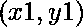并与给定直线成角度α的方程。

[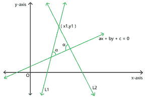](https://media.geeksforgeeks.org/wp-content/uploads/20210429105345/a7-300x197.png)

**示例:**

> **输入:** a = 2，b = 3，c = -7，x1 = 4，y1 = 9，α = 30
> **输出:** y = -0.49x +10
> y = -15.51x + 71
> 
> **输入:** a = 3，b = -2，c = 4，x1 = 3，y1 = 4，α = 55
> **输出:** y = 43.73x -127
> y = -0.39x +5

**进场:**

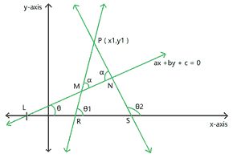

图 1

*   设 **P (x1，y1)** 为给定点，线 **LMN** (图 1)为与正 x 轴成角度 **θ** 的给定线。
*   让 **PMR** 和 **PNS** 成为两条所需的线，它们与给定的线形成一个角度 **(α)** 。
*   让这些线分别在 **R** 和 **S** 处与 x 轴相交。
*   假设直线 **PMR** 和 **PNS** 分别与 x 轴的正方向成角度 **(θ1)** 和 **(θ2)** 。
*   然后利用直线的[斜率点形式，两条线的方程为:](https://www.geeksforgeeks.org/point-slope-form-straight-lines-class-11-maths/)

> 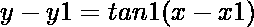……(1)
> 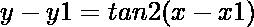……(2)
> 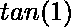和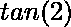分别是 PMR 线和 PNS 线的坡度。

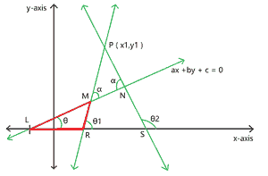

图 2

*   现在考虑三角形 **LMR** :

> 使用属性:三角形的外角等于两个相反内角的总和
> 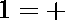
> 
> 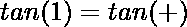
> 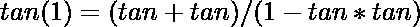……(3)

*   现在考虑三角形 **LNS** :

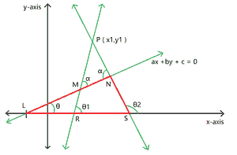

图 3

> 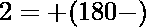
> 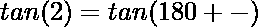
> 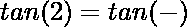
> 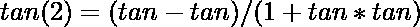……(4)

*   现在我们计算(tanθ)的值:

> 通过公式，
> 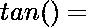给定直线的斜率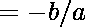 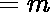

*   现在，将等式(3)和(4)中的(tan(θ1))和(tan(θ2))的值代入等式(1)和(2)，得到这两条线的最终等式:

> PMR 线: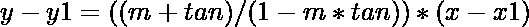
> PNS 线: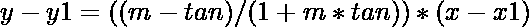

下面是上述方法的实现:

## C++

```
// C++ program for the above approach
#include <bits/stdc++.h>
using namespace std;

// Function to find slope of given line
double line_slope(double a, double b)
{
    if (a != 0)
        return -b / a;

    // Special case when slope of
    // line is infinity or is
    // perpendicular to x-axis
    else
        return (-2);
}

// Function to find equations of lines
// passing through the given point
// and making an angle with given line
void line_equation(double a, double b,
                   double c, double x1,
                   double y1, double alfa)
{
    // Set the precision
    cout << fixed << setprecision(2);

    // Store slope of given line
    double given_slope = line_slope(a, b);

    // Convert degrees to radians
    double x = alfa * 3.14159 / 180;

    // Special case when slope of
    // given line is infinity:
    // In this case slope of one line
    // will be equal to alfa
    // and the other line will be
    // equal to (180-alfa)
    if (given_slope == -2) {

        // In this case slope of
        // required lines can't be
        // infinity
        double slope_1 = tan(x);
        double slope_2 = tan(3.14159 - x);

        // g and f are the variables
        // of required equations
        int g = x1, f = x1;
        g *= (-slope_1);
        g += y1;

        // Print first line equation
        if (g > 0)
            cout << "y = " << slope_1
                 << "x +" << g << endl;
        if (g <= 0)
            cout << "y = " << slope_1
                 << "x " << g << endl;

        f *= (-slope_2);
        f += y1;

        // Print second line equation
        if (f > 0) {
            cout << "y = " << slope_2
                 << "x +" << f << endl;
        }
        if (f <= 0)
            cout << "y = " << slope_2
                 << "x " << f << endl;
        return;
    }

    // Special case when slope of
    // required line becomes infinity
    if (1 - tan(x) * given_slope == 0) {
        cout << "x = " << x1 << endl;
    }
    if (1 + tan(x) * given_slope == 0) {
        cout << "x = " << x1 << endl;
    }

    // General case
    double slope_1 = (given_slope + tan(x))
                     / (1 - tan(x) * given_slope);
    double slope_2 = (given_slope - tan(x))
                     / (1 + tan(x) * given_slope);

    // g and f are the variables
    // of required equations
    int g = x1, f = x1;
    g *= (-slope_1);
    g += y1;

    // Print first line equation
    if (g > 0 && 1 - tan(x) * given_slope != 0)
        cout << "y = " << slope_1
             << "x +" << g << endl;
    if (g <= 0 && 1 - tan(x) * given_slope != 0)
        cout << "y = " << slope_1
             << "x " << g << endl;
    f *= (-slope_2);
    f += y1;

    // Print second line equation
    if (f > 0 && 1 + tan(x) * given_slope != 0) {
        cout << "y = " << slope_2
             << "x +" << f << endl;
    }
    if (f <= 0 && 1 + tan(x) * given_slope != 0)
        cout << "y = " << slope_2
             << "x " << f << endl;
}

// Driver Code
int main()
{
    // Given Input
    double a = 2, b = 3, c = -7;
    double x1 = 4, y1 = 9;
    double alfa = 30;

    // Function Call
    line_equation(a, b, c, x1, y1, alfa);

    return 0;
}
```

## Java 语言(一种计算机语言，尤用于创建网站)

```
// Java program for the above approach
import java.io.*;

class GFG{

// Function to find slope of given line
static double line_slope(double a, double b)
{
    if (a != 0)
        return -b / a;

    // Special case when slope of
    // line is infinity or is
    // perpendicular to x-axis
    else
        return (-2);
}

// Function to find equations of lines
// passing through the given point
// and making an angle with given line
static void line_equation(double a, double b,
                          double c, double x1,
                          double y1, double alfa)
{

    // Store slope of given line
    double given_slope = line_slope(a, b);

    // Convert degrees to radians
    double x = alfa * 3.14159 / 180;

    // Special case when slope of
    // given line is infinity:
    // In this case slope of one line
    // will be equal to alfa
    // and the other line will be
    // equal to (180-alfa)
    if (given_slope == -2)
    {

        // In this case slope of
        // required lines can't be
        // infinity
        double slope_1 = Math.tan(x);
        double slope_2 = Math.tan(3.14159 - x);

        // g and f are the variables
        // of required equations
        int g = (int)x1, f = (int)x1;
        g *= (-slope_1);
        g += y1;

        // Print first line equation
        if (g > 0)
            System.out.println("y = " +
            (Math.round(slope_1 * 100.0) / 100.0) +
          "x +" + (Math.round(g * 100.0) / 100.0));
        if (g <= 0)
             System.out.println("y = " +
             (Math.round(slope_1 * 100.0) / 100.0) +
            "x " + (Math.round(g * 100.0) / 100.0));

        f *= (-slope_2);
        f += y1;

        // Print second line equation
        if (f > 0)
        {
             System.out.println("y = " +
             (Math.round(slope_2 * 100.0) / 100.0) +
           "x +" + (Math.round(f * 100.0) / 100.0));
        }
        if (f <= 0)
             System.out.println("y = " +
             (Math.round(slope_1 * 100.0) / 100.0) +
            "x " + (Math.round(g * 100.0) / 100.0));
        return;
    }

    // Special case when slope of
    // required line becomes infinity
    if (1 - Math.tan(x) * given_slope == 0)
    {
         System.out.println("x = " +
         (Math.round(x1 * 100.0) / 100.0));
    }
    if (1 + Math.tan(x) * given_slope == 0)
    {
        System.out.println("x = " +
        (Math.round(x1 * 100.0) / 100.0));
    }

    // General case
    double slope_1 = (given_slope + Math.tan(x)) /
                 (1 - Math.tan(x) * given_slope);
    double slope_2 = (given_slope - Math.tan(x)) /
                 (1 + Math.tan(x) * given_slope);

    // g and f are the variables
    // of required equations
    int g = (int)x1, f = (int)x1;
    g *= (-slope_1);
    g += y1;

    // Print first line equation
    if (g > 0 && 1 - Math.tan(x) * given_slope != 0)
          System.out.println("y = " +
          (Math.round(slope_1 * 100.0) / 100.0) +
      "x +" + (Math.round(g * 100.0) / 100.0));
    if (g <= 0 && 1 - Math.tan(x) * given_slope != 0)
       System.out.println("y = " +
       (Math.round(slope_1 * 100.0) / 100.0) +
      "x " + (Math.round(g * 100.0) / 100.0));

    f *= (-slope_2);
    f += y1;

    // Print second line equation
    if (f > 0 && 1 + Math.tan(x) * given_slope != 0)
    {
        System.out.println("y = " +
        (Math.round(slope_2 * 100.0) / 100.0) +
      "x +" + (Math.round(f * 100.0) / 100.0));
    }
    if (f <= 0 && 1 + Math.tan(x) * given_slope != 0)
        System.out.println("y = " +
        (Math.round(slope_2 * 100.0) / 100.0) +
      "x +" + (Math.round(f * 100.0) / 100.0));
}

// Driver Code
public static void main (String[] args)
{

    // Given Input
    double a = 2, b = 3, c = -7;
    double x1 = 4, y1 = 9;
    double alfa = 30;

    // Function Call
    line_equation(a, b, c, x1, y1, alfa);
}
}

// This code is contributed by Dharanendra L V.
```

## 蟒蛇 3

```
# Python3 program for the above approach
import math

# Function to find slope of given line
def line_slope(a, b):

    if (a != 0):
        return -b / a

    # Special case when slope of
    # line is infinity or is
    # perpendicular to x-axis
    else:
        return (-2)

# Function to find equations of lines
# passing through the given point
# and making an angle with given line
def line_equation(a, b, c, x1, y1, alfa):

    # Store slope of given line
    given_slope = line_slope(a, b)

    # Convert degrees to radians
    x = alfa * 3.14159 / 180

    # Special case when slope of
    # given line is infinity:
    # In this case slope of one line
    # will be equal to alfa
    # and the other line will be
    # equal to (180-alfa)
    if (given_slope == -2):

        # In this case slope of
        # required lines can't be
        # infinity
        slope_1 = math.tan(x)
        slope_2 = math.tan(3.14159 - x)

        # g and f are the variables
        # of required equations
        g = x1, f = x1
        g *= (-slope_1)
        g += y1

        # Print first line equation
        if (g > 0):
            print("y = ", round(slope_1, 2),
                  "x +" , round(g));
        if (g <= 0):
            print("y = ", round(slope_1, 2),
                  "x ", round(g))

        f *= (-slope_2)
        f += y1

        # Print second line equation
        if (f > 0):
            print("y = ", round(slope_2, 2),
                  "x +", round(f))

        if (f <= 0):
            print("y = " , round(slope_2, 2),
                  "x " , round(f))
        return

    # Special case when slope of
    # required line becomes infinity
    if (1 - math.tan(x) * given_slope == 0):
        print("x =", x1)

    if (1 + math.tan(x) * given_slope == 0):
        print("x =", x1)

    # General case
    slope_1 = ((given_slope + math.tan(x)) /
           (1 - math.tan(x) * given_slope))
    slope_2 = ((given_slope - math.tan(x)) /
           (1 + math.tan(x) * given_slope))

    # g and f are the variables
    # of required equations
    g = x1
    f = x1
    g *= (-slope_1)
    g += y1

    # Print first line equation
    if (g > 0 and 1 - math.tan(x) * given_slope != 0):
        print("y = ", round(slope_1, 2),
              "x +", round(g))
    if (g <= 0 and 1 - math.tan(x) * given_slope != 0):
        print("y = ", round(slope_1, 2),
              "x ", round(g))

    f *= (-slope_2)
    f += y1

    # Print second line equation
    if (f > 0 and 1 + math.tan(x) * given_slope != 0):
        print("y = ", round(slope_2, 2),
              "x +", round(f))

    if (f <= 0 and 1 + math.tan(x) * given_slope != 0):
        print("y = ", round(slope_2, 2),
              "x " , round(f))

# Driver Code
if __name__ == "__main__":

    # Given Input
    a = 2
    b = 3
    c = -7
    x1 = 4
    y1 = 9
    alfa = 30

    # Function Call
    line_equation(a, b, c, x1, y1, alfa)

# This code is contributed by ukasp
```

## C#

```
// C# program for the above approach

using System;
using System.Collections.Generic;
public class GFG{

// Function to find slope of given line
static double line_slope(double a, double b)
{
    if (a != 0)
        return -b / a;

    // Special case when slope of
    // line is infinity or is
    // perpendicular to x-axis
    else
        return (-2);
}

// Function to find equations of lines
// passing through the given point
// and making an angle with given line
static void line_equation(double a, double b,
                          double c, double x1,
                          double y1, double alfa)
{

    // Store slope of given line
    double given_slope = line_slope(a, b);

    // Convert degrees to radians
    double x = alfa * 3.14159 / 180;
    double slope_1,slope_2;
    double g,f;
    // Special case when slope of
    // given line is infinity:
    // In this case slope of one line
    // will be equal to alfa
    // and the other line will be
    // equal to (180-alfa)
    if (given_slope == -2)
    {

        // In this case slope of
        // required lines can't be
        // infinity
        slope_1 = Math.Tan(x);
        slope_2 = Math.Tan(3.14159 - x);

        // g and f are the variables
        // of required equations
        g = (int)x1;
        f = (int)x1;
        g *= (-slope_1);
        g += y1;

        // Print first line equation
        if (g > 0)
            Console.WriteLine("y = " +
            (Math.Round(slope_1 * 100.0) / 100.0) +
          "x +" + (Math.Round((int)g * 100.0) / 100.0));
        if (g <= 0)
             Console.WriteLine("y = " +
             (Math.Round(slope_1 * 100.0) / 100.0) +
            "x " + (Math.Round((int)g * 100.0) / 100.0));

        f *= (-slope_2);
        f += y1;

        // Print second line equation
        if (f > 0)
        {
             Console.WriteLine("y = " +
             (Math.Round(slope_2 * 100.0) / 100.0) +
           "x +" + (Math.Round((int)f * 100.0) / 100.0));
        }
        if (f <= 0)
             Console.WriteLine("y = " +
             (Math.Round(slope_1 * 100.0) / 100.0) +
            "x " + (Math.Round((int)g * 100.0) / 100.0));
        return;
    }

    // Special case when slope of
    // required line becomes infinity
    if (1 - Math.Tan(x) * given_slope == 0)
    {
         Console.WriteLine("x = " +
         (Math.Round(x1 * 100.0) / 100.0));
    }
    if (1 + Math.Tan(x) * given_slope == 0)
    {
        Console.WriteLine("x = " +
        (Math.Round(x1 * 100.0) / 100.0));
    }

    // General case
    slope_1 = (given_slope + Math.Tan(x)) /
                 (1 - Math.Tan(x) * given_slope);
    slope_2 = (given_slope - Math.Tan(x)) /
                 (1 + Math.Tan(x) * given_slope);

    // g and f are the variables
    // of required equations
    g = (int)x1;
    f = (int)x1;
    g *= (-slope_1);
    g += y1;

    // Print first line equation
    if (g > 0 && 1 - Math.Tan(x) * given_slope != 0)
          Console.WriteLine("y = " +
          (Math.Round(slope_1 * 100.0) / 100.0) +
      "x +" + (Math.Round((int)g * 100.0) / 100.0));
    if (g <= 0 && 1 - Math.Tan(x) * given_slope != 0)
       Console.WriteLine("y = " +
       (Math.Round(slope_1 * 100.0) / 100.0) +
      "x " + (Math.Round((int)g * 100.0) / 100.0));

    f *= (-slope_2);
    f += y1;

    // Print second line equation
    if (f > 0 && 1 + Math.Tan(x) * given_slope != 0)
    {
        Console.WriteLine("y = " +
        (Math.Round(slope_2 * 100.0) / 100.0) +
      "x +" + (Math.Round((int)f * 100.0) / 100.0));
    }
    if (f <= 0 && 1 + Math.Tan(x) * given_slope != 0)
        Console.WriteLine("y = " +
        (Math.Round(slope_2 * 100.0) / 100.0) +
      "x +" + (Math.Round((int)f * 100.0) / 100.0));
}

// Driver Code
public static void Main(String[] args)
{

    // Given Input
    double a = 2, b = 3, c = -7;
    double x1 = 4, y1 = 9;
    double alfa = 30;

    // Function Call
    line_equation(a, b, c, x1, y1, alfa);
}
}

// This code contributed by shikhasingrajput
```

**Output:** 

```
y = -0.49x +10
y = -15.51x +71
```

***时间复杂度:**O(1)*
T5**辅助空间:** O(1)