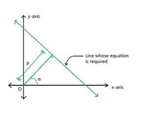
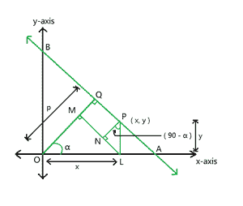
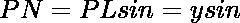
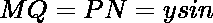
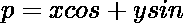

# 与原点垂直距离为 D，与 x 轴垂直距离为 A 的直线方程

> 原文:[https://www . geeksforgeeks . org/具有垂直于原点的距离 d 和垂直于原点的距离与 x 轴之间的角度 a 的直线方程/](https://www.geeksforgeeks.org/equation-of-a-straight-line-with-perpendicular-distance-d-from-origin-and-an-angle-a-between-the-perpendicular-from-origin-and-x-axis/)

给定两个整数 **D** 和 **A** ，分别表示原点到直线的[垂直距离和垂线与正 **x** 轴的夹角，任务是求直线方程。](https://www.geeksforgeeks.org/perpendicular-distance-between-a-point-and-a-line-in-2-d/)

**示例:**

> **输入:** D = 10，A = 30 度
> T3】输出: 0.87x +0.50y = 10
> 
> **输入:** D = 12，A = 45 度
> T3】输出: 0.71x +0.71y = 12

**方法:**给定的问题可以基于以下观察来解决:



图 1

*   假设垂直距离为 **(p)** ，垂线与正 x 轴的夹角为 **(α)度**。
*   考虑一个点 **P** ，坐标 **(x，y)** 在要求的线上。
*   从 **P** 画一条垂线，在 **L** 处与 x 轴相交。
*   从 **L** 开始，在 **M** 处的 **OQ** 上画一条垂线。
*   现在，从 **P** 画一条垂线在 **N** 与 **ML** 会合。



图 2

> 现在考虑直角三角形**OLM**
> 
> ——(1)
> 
> 现在考虑直角三角形**PNL**
> 
> 
> 
> ——(2)
> 
> 现在
> 使用方程式(1)和(2)
> 这是所需线的方程式

下面是上述方法的实现:

## C++

```
// C++ program for the approach
#include <bits/stdc++.h>
using namespace std;

// Function to find equation of a line whose
// distance from origin and angle made by the
// perpendicular from origin with x-axis is given
void findLine(int distance, float degree)
{
    // Convert angle from degree to radian
    float x = degree * 3.14159 / 180;

    // Handle the special case
    if (degree > 90) {
        cout << "Not Possible";
        return;
    }

    // Calculate the sin and cos of angle
    float result_1 = sin(x);
    float result_2 = cos(x);

    // Print the equation of the line
    cout << fixed << setprecision(2)
         << result_2 << "x +"
         << result_1 << "y = " << distance;
}

// Driver Code
int main()
{
    // Given Input
    int D = 10;
    float A = 30;

    // Function Call
    findLine(D, A);

    return 0;
}
```

## Java 语言(一种计算机语言，尤用于创建网站)

```
// Java program for the approach

class GFG{

// Function to find equation of a line whose
// distance from origin and angle made by the
// perpendicular from origin with x-axis is given
static void findLine(int distance, float degree)
{
    // Convert angle from degree to radian
    float x = (float) (degree * 3.14159 / 180);

    // Handle the special case
    if (degree > 90) {
        System.out.print("Not Possible");
        return;
    }

    // Calculate the sin and cos of angle
    float result_1 = (float) Math.sin(x);
    float result_2 = (float) Math.cos(x);

    // Print the equation of the line
    System.out.print(String.format("%.2f",result_2)+ "x +"
         + String.format("%.2f",result_1)+ "y = " +  distance);
}

// Driver Code
public static void main(String[] args)
{
    // Given Input
    int D = 10;
    float A = 30;

    // Function Call
    findLine(D, A);

}
}

// This code is contributed by shikhasingrajput
```

## 蟒蛇 3

```
# Python3 program for the approach
import math

# Function to find equation of a line whose
# distance from origin and angle made by the
# perpendicular from origin with x-axis is given
def findLine(distance, degree):

    # Convert angle from degree to radian
    x = degree * 3.14159 / 180

    # Handle the special case
    if (degree > 90):
        print("Not Possible")
        return

    # Calculate the sin and cos of angle
    result_1 = math.sin(x)
    result_2 = math.cos(x)

    # Print the equation of the line
    print('%.2f' % result_2,
          "x +", '%.2f' % result_1,
          "y = ", distance, sep = "")

# Driver code

# Given Input
D = 10
A = 30

# Function Call
findLine(D, A)

# This code is contributed by mukesh07
```

## C#

```
// C# program for the approach
using System;
class GFG
{

    // Function to find equation of a line whose
    // distance from origin and angle made by the
    // perpendicular from origin with x-axis is given
    static void findLine(int distance, float degree)
    {
        // Convert angle from degree to radian
        float x = (float)(degree * 3.14159 / 180);

        // Handle the special case
        if (degree > 90) {
            Console.WriteLine("Not Possible");
            return;
        }

        // Calculate the sin and cos of angle
        float result_1 = (float)(Math.Sin(x));
        float result_2 = (float)(Math.Cos(x));

        // Print the equation of the line
        Console.WriteLine(result_2.ToString("0.00") + "x +"
             + result_1.ToString("0.00") + "y = " + distance);
    }

  static void Main ()
  {
    // Given Input
    int D = 10;
    float A = 30;

    // Function Call
    findLine(D, A);
  }
}

// This code is contributed by suresh07.
```

## java 描述语言

```
<script>

        // JavaScript program for the above approach

        // Function to find equation of a line whose
        // distance from origin and angle made by the
        // perpendicular from origin with x-axis is given
        function findLine(distance, degree) {
            // Convert angle from degree to radian
            let x = degree * 3.14159 / 180;

            // Handle the special case
            if (degree > 90) {
                document.write("Not Possible");
                return;
            }

            // Calculate the sin and cos of angle
            let result_1 = Math.sin(x);
            let result_2 = Math.cos(x);

            // Print the equation of the line
            document.write(result_2.toPrecision(2) + "x + "
             + result_1.toPrecision(2) + "y = " + distance);
        }

        // Driver Code

        // Given Input
        let D = 10;
        let A = 30;

        // Function Call
        findLine(D, A);

        // This code is contributed by Hritik

</script>
```

**Output:** 

```
0.87x +0.50y = 10
```

***时间复杂度:**O(1)*
T5**辅助空间:** O(1)