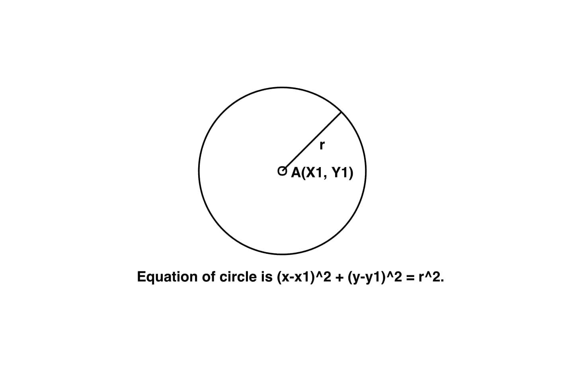

# 圆心与半径的方程式

> 原文:[https://www . geeksforgeeks . org/圆心和半径圆方程/](https://www.geeksforgeeks.org/equation-of-circle-from-centre-and-radius/)

给定圆心(x1，y1)和半径 r，求圆心(x1，y1)和半径 r 的圆的方程
**例:**

> **输入:** x1 = 2，y1 = -3，r = 8
> **输出:**x^2+y^2–4 * x+6 * y = 51。
> **输入:** x1 = 0，y1 = 0，r = 2
> **输出:**x^2+y^2–0 * x+0 * y = 4。



**逼近:**
给定圆心(x1，y1)和半径 r，我们必须求出圆心(x1，y1)和半径 r 的圆的方程。
圆心(x1，y1)和半径 r 的圆的方程由:-
给出

在展开上述方程
时

在安排上面我们得到

以下是上述方法的实现:

## C++

```
// CPP program to find the equation
// of circle.
#include <iostream>
using namespace std;

// Function to find the equation of circle
void circle_equation(double x1, double y1, double r)
{
    double a = -2 * x1;

    double b = -2 * y1;

    double c = (r * r) - (x1 * x1) - (y1 * y1);

    // Printing result
    cout << "x^2 + (" << a << " x) + ";
    cout << "y^2 + (" << b << " y) = ";
    cout << c << "." << endl;
}

// Driver code
int main()
{
    double x1 = 2, y1 = -3, r = 8;
    circle_equation(x1, y1, r);
    return 0;
}
```

## Java 语言(一种计算机语言，尤用于创建网站)

```
// Java program to find the equation
// of circle.
import java.util.*;

class solution
{

 // Function to find the equation of circle
static void circle_equation(double x1, double y1, double r)
{
    double a = -2 * x1;

    double b = -2 * y1;

    double c = (r * r) - (x1 * x1) - (y1 * y1);

    // Printing result
    System.out.print("x^2 + (" +a+ " x) + ");
     System.out.print("y^2 + ("+b + " y) = ");
     System.out.println(c +"." );
}

// Driver code
public static void main(String arr[])
{
    double x1 = 2, y1 = -3, r = 8;
    circle_equation(x1, y1, r);

}

}
```

## 蟒蛇 3

```
# Python3 program to find the
# equation of circle.

# Function to find the
# equation of circle
def circle_equation(x1, y1, r):
    a = -2 * x1;

    b = -2 * y1;

    c = (r * r) - (x1 * x1) - (y1 * y1);

    # Printing result
    print("x^2 + (", a, "x) + ", end = "");
    print("y^2 + (", b, "y) = ", end = "");
    print(c, ".");

# Driver code
x1 = 2;
y1 = -3;
r = 8;
circle_equation(x1, y1, r);

# This code is contributed
# by mits
```

## C#

```
// C# program to find the equation
// of circle.
using System;

class GFG
{

// Function to find the equation of circle
public static void circle_equation(double x1,
                                   double y1,
                                   double r)
{
    double a = -2 * x1;

    double b = -2 * y1;

    double c = (r * r) - (x1 * x1) - (y1 * y1);

    // Printing result
    Console.Write("x^2 + (" + a + " x) + ");
    Console.Write("y^2 + ("+ b + " y) = ");
    Console.WriteLine(c + "." );
}

// Driver code
public static void Main(string []arr)
{
    double x1 = 2, y1 = -3, r = 8;
    circle_equation(x1, y1, r);
}
}

// This code is contributed
// by SoumkMondal
```

## 服务器端编程语言（Professional Hypertext Preprocessor 的缩写）

```
<?php
// PHP program to find the equation
// of circle.

// Function to find the
// equation of circle
function circle_equation($x1, $y1, $r)
{
    $a = -2 * $x1;

    $b = -2 * $y1;

    $c = ($r * $r) - ($x1 * $x1) -
                     ($y1 * $y1);

    // Printing result
    echo "x^2 + (" . $a . " x) + ";
    echo "y^2 + (" . $b . " y) = ";
    echo $c . "." . "\n";
}

// Driver code
$x1 = 2; $y1 = -3; $r = 8;
circle_equation($x1, $y1, $r);

// This code is contributed
// by Akanksha Rai
?>
```

## java 描述语言

```
<script>
// java script  program to find the equation
// of circle.

// Function to find the
// equation of circle
function circle_equation(x1, y1, r)
{
    let a = -2 * x1;

    let b = -2 * y1;

    let c = (r * r) - (x1 * x1) -
                    (y1 * y1);

    // Printing result
    document.write( "x^2 + (" +a + " x) + ");
    document.write( "y^2 + (" +b+ " y) = ");
    document.write( c+ "<br>");
}

// Driver code
let x1 = 2;
let y1 = -3;
let r = 8;
circle_equation(x1, y1, r);

// This code is contributed by sravan kumar
</script>
```

**Output:** 

```
x^2 + (-4 x) + y^2 + (6 y) = 51.
```