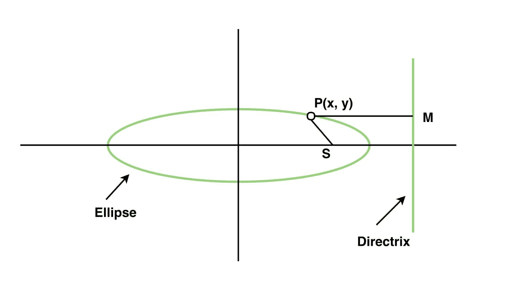

# 椭圆从其焦点、准线和偏心的方程

> 原文:[https://www . geeksforgeeks . org/椭圆离焦方程准线和偏心率/](https://www.geeksforgeeks.org/equation-of-ellipse-from-its-focus-directrix-and-eccentricity/)

给定椭圆的焦点(x，y)、准线(ax + by + c)和偏心率 **e** ，任务是利用椭圆的焦点、准线和偏心率求出椭圆方程。
**例:**

```
Input: x1 = 1, y1 = 1, a = 1, b = -1, c = 3, e = 0.5
Output: 1.75 x^2 + 1.75 y^2 + -5.50 x + -2.50 y + 0.50 xy + 1.75 = 0

Input: x1 = -1, y1 = 1, a = 1, b = -1, c = 3, e = 0.5
Output: 1.75 x^2 + 1.75 y^2 + 2.50 x + -2.50 y + 0.50 xy + 1.75 = 0 
```



设 P(x，y)为椭圆上焦点为 S(x1，y1)的任意点，准线为直线 ax + by + c = 0，偏心距为 e.
在准线上从 P 画出 PM 垂线。然后根据椭圆距离的定义 SP = e * PM = > SP^2 = (e * PM)^2

> (x–x1)^2+(y–y1)^2 = e *(a * x+b * y+c)/(sqrt(a * a+b * b)))^ 2
> let(a * a+b * b)= t
> x^2+x1^2–2 * x1 * x+y^2+y1^2–2 * y1 * y = e *(a * x+b * y+c)^ 2)/t

在上面的交叉乘法中，我们得到

> **t * x ^ 2+t * x1 ^ 2–2 * t * x1 * x+t * y ^ 2+t * y ^ 2–2 * t * y 1 * y = e *((a * x+b * y+c)^ 2)**
> **【t * x ^ 2+t * x1 ^ 2–2 * t * x1 * x+t * y ^ 2+t * y ^ 1 ^ 1 ^ 2** T6**t * x ^ 2+t * x1 ^ 2–2 * t * x1 * x+t * y ^ 2+t * y ^ 2–2 * t * y 1 * y = e * a ^ 2 * x ^ 2+e * b ^ 2 * y ^ 2+2 * e * a * x * b * y+2 * e * a * e * c ^ 2+2 * e * c * a * x+2 * e * c * c * a * x+2 * e * c * b * y**

这可以和一个通用的形式相比较，那就是:

> a*x^2+2 * h * x * y+b*y^2+2 * g * x+2 * f * y+c = 0

以下是上述方法的实现:

## C++

```
// C++ program to find equation of an ellipse
// using focus and directrix.
#include <bits/stdc++.h>
#include <iomanip>
#include <iostream>
#include <math.h>

using namespace std;

// Function to find equation of ellipse.
void equation_ellipse(float x1, float y1,
                      float a, float b,
                      float c, float e)
{
    float t = a * a + b * b;
    float a1 = t - e * (a * a);
    float b1 = t - e * (b * b);
    float c1 = (-2 * t * x1) - (2 * e * c * a);
    float d1 = (-2 * t * y1) - (2 * e * c * b);
    float e1 = -2 * e * a * b;
    float f1 = (-e * c * c) + (t * x1 * x1) + (t * y1 * y1);

    cout << fixed;
    cout << setprecision(2);
    cout << "Equation of ellipse is \n"
         << a1
         << " x^2 + " << b1 << " y^2 + "
         << c1 << " x + " << d1 << " y + "
         << e1 << " xy + " << f1 << " = 0";
}

// Driver Code
int main()
{
    float x1 = 1, y1 = 1, a = 1, b = -1, c = 3, e = 0.5 * 0.5;
    equation_ellipse(x1, y1, a, b, c, e);

    return 0;
}
```

## Java 语言(一种计算机语言，尤用于创建网站)

```
// Java program to find equation of an ellipse
// using focus and directrix.
import java.util.*;

class solution
{

// Function to find equation of ellipse.
static void equation_ellipse(float x1, float y1,
                    float a, float b,
                    float c, float e)
{
    float t = a * a + b * b;
    float a1 = t - e * (a * a);
    float b1 = t - e * (b * b);
    float c1 = (-2 * t * x1) - (2 * e * c * a);
    float d1 = (-2 * t * y1) - (2 * e * c * b);
    float e1 = -2 * e * a * b;
    float f1 = (-e * c * c) + (t * x1 * x1) + (t * y1 * y1);

    System.out.println("Equation of ellipse is ");
    System.out.print(a1+" x^2 + "+ b1 + " y^2 + "+ c1 + " x + "
                    + d1 + " y + " + e1 + " xy + " + f1 + " = 0");

}

// Driver Code
public static void main(String arr[])
{
    float x1 = 1, y1 = 1, a = 1, b = -1, c = 3, e = (float)0.5 * (float)0.5;
    equation_ellipse(x1, y1, a, b, c, e);

}
}

//This code is contributed by Surendra_Gaangwar
```

## 蟒蛇 3

```
# Python3 program to find equation of an ellipse
# using focus and directrix.

# Function to find equation of ellipse.
def equation_ellipse(x1, y1, a, b, c,  e) :

    t = a * a + b * b
    a1 = t - e * (a * a)
    b1 = t - e * (b * b)
    c1 = (-2 * t * x1) - (2 * e * c * a)
    d1 = (-2 * t * y1) - (2 * e * c * b)
    e1 = -2 * e * a * b
    f1 = (-e * c * c) + (t * x1 * x1) + (t * y1 * y1)

    print("Equation of ellipse is",a1,"x^2 +", b1 ,"y^2 +",
    c1, "x +" ,d1 ,"y +", e1 ,"xy +" , f1 ,"= 0")

# Driver Code
if __name__ == "__main__" :

    x1, y1, a, b, c, e = 1, 1, 1, -1, 3, 0.5 * 0.5

    equation_ellipse(x1, y1, a, b, c, e)

# This code is contributed by Ryuga
```

## C#

```
// C# program to find equation of an ellipse
// using focus and directrix.

class solution
{

// Function to find equation of ellipse.
static void equation_ellipse(float x1, float y1,
                    float a, float b,
                    float c, float e)
{
    float t = a * a + b * b;
    float a1 = t - e * (a * a);
    float b1 = t - e * (b * b);
    float c1 = (-2 * t * x1) - (2 * e * c * a);
    float d1 = (-2 * t * y1) - (2 * e * c * b);
    float e1 = -2 * e * a * b;
    float f1 = (-e * c * c) + (t * x1 * x1) + (t * y1 * y1);

    System.Console.WriteLine("Equation of ellipse is ");
    System.Console.WriteLine(a1+" x^2 + "+ b1 + " y^2 + "+ c1 + " x + "
                    + d1 + " y + " + e1 + " xy + " + f1 + " = 0");

}

// Driver Code
public static void Main()
{
    float x1 = 1, y1 = 1, a = 1, b = -1, c = 3, e = (float)0.5 * (float)0.5;
    equation_ellipse(x1, y1, a, b, c, e);

}
}

//This code is contributed by mits
```

## 服务器端编程语言（Professional Hypertext Preprocessor 的缩写）

```
<?php
// PHP program to find equation of
// an ellipse using focus and directrix.

// Function to find equation of ellipse.
function equation_ellipse($x1, $y1, $a,
                            $b, $c, $e)
{
    $t = ($a * $a) + ($b * $b);
    $a1 = $t - $e * ($a * $a);
    $b1 = $t - $e * ($b * $b);
    $c1 = (-2 * $t * $x1) -
           (2 * $e * $c * $a);
    $d1 = (-2 * $t * $y1) -
           (2 * $e * $c * $b);
    $e1 = -2 * $e * $a * $b;
    $f1 = (-$e * $c * $c) +
          ($t * $x1 * $x1) + ($t * $y1 * $y1);

    $fixed;

    // echo setprecision(2);
    echo "Equation of ellipse is \n" ,
          $a1, " x^2 + ", $b1 , " y^2 + ",
          $c1 , " x + " , $d1 , " y + ",
          $e1 , " xy + " , $f1 , " = 0";
}

// Driver Code
$x1 = 1; $y1 = 1;
$a = 1;
$b = -1;
$c = 3;
$e = 0.5 * 0.5;
equation_ellipse($x1, $y1, $a,
                 $b, $c, $e);

// This code is contributed by jit_t
?>
```

## java 描述语言

```
<script>

// Javascript program to find equation
// of an ellipse using focus and directrix.

// Function to find equation of ellipse.
function equation_ellipse(x1, y1, a, b, c, e)
{
    var t = a * a + b * b;
    var a1 = t - e * (a * a);
    var b1 = t - e * (b * b);
    var c1 = (-2 * t * x1) - (2 * e * c * a);
    var d1 = (-2 * t * y1) - (2 * e * c * b);
    var e1 = -2 * e * a * b;
    var f1 = (-e * c * c) + (t * x1 * x1) + (t * y1 * y1);

    document.write("Equation of ellipse is " + "<br>");
    document.write(a1+" x^2 + "+ b1 + " y^2 + "+ c1 + " x + "
                    + d1 + " y + " + e1 + " xy + " + f1 + " = 0");
}

// Driver Code
var x1 = 1, y1 = 1, a = 1, b = -1, c = 3, e = 0.5 * 0.5;
equation_ellipse(x1, y1, a, b, c, e);

// This code is contributed by Khushboogoyal499

</script>
```

**Output:** 

```
Equation of ellipse is 
1.75 x^2 + 1.75 y^2 + -5.50 x + -2.50 y + 0.50 xy + 1.75 = 0
```