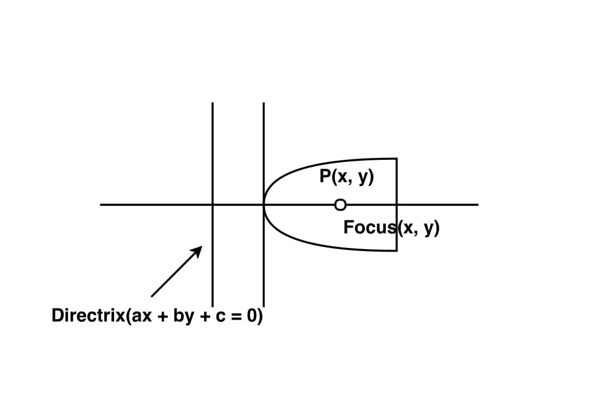

# 抛物线从其焦点到准线的方程

> 原文:[https://www . geeksforgeeks . org/焦点与准线抛物线方程/](https://www.geeksforgeeks.org/equation-of-parabola-from-its-focus-and-directrix/)

给我们一个抛物线的焦点(x，y)和准线(ax + by + c)，我们要用它的焦点和准线来求抛物线的方程。
**例:**

> **输入:** x1 = 0，y1 = 0，a = 2，b = 1，c = 2
> **输出:**抛物线方程为 16.0 x^2+9.0 y^2+-12.0 x+16.0y+24.0 xy+-4.0 = 0。
> **输入:** x1 = -1，y1 = -2，a = 1，b = -2，c = 3
> **输出:**抛物线方程为 4.0 x^2+1.0 y^2+4.0 x+32.0y+4.0 xy+16.0 = 0。



设 P(x，y)是抛物线上的任意点，其焦点 S(x1，y1)和准线是直线 ax + by + c =0。
在准线上从 P 画出 PM 垂线。那么根据定义，抛物线距离 SP = PM
SP^2 = PM^2

```
(x - x1)^2 + (y - y1)^2 = ( ( a*x + b*y + c ) / (sqrt( a*a + b*b )) ) ^ 2
```

//让(a*a + b*b ) = t

```
x^2 + x1^2 - 2*x1*x + y^2 + y1^2 - 2*y1*y  = ( ( a*x + b*y + c ) ^ 2 )/ t
```

在上面的交叉乘法中，我们得到

```
t*x^2 + t*x1^2 - 2*t*x1*x + t*y^2 + t*y1^2 - 2*t*y1*y  = ( ( a*x + b*y + c ) ^ 2 )  
t*x^2 + t*x1^2 - 2*t*x1*x + t*y^2 + t*y1^2 - 2*t*y1*y  = a^2*x^2 + b^2*y^2 + 2*a*x*b*y + c^2 + 2*c*(a*x + b*y)
t*x^2 + t*x1^2 - 2*t*x1*x + t*y^2 + t*y1^2 - 2*t*y1*y  = a^2*x^2 + b^2*y^2 + 2*a*x*b*y + c^2 + 2*c*a*x + 2*c*b*y
t*x^2 - a^2*x^2 +  t*y^2 - b^2*y^2 - 2*t*x1*x - 2*c*a*x - 2*t*y1*y - 2*c*b*y - 2*a*x*b*y - c^2  + t*x1^2 + t*y1^2 =0.
```

这可以和一般形式
相比

```
a*x^2 + 2*h*x*y + b*y^2 + 2*g*x + 2*f*y + c = 0.
```

下面是上面的实现:

## C++

```
// C++ program to find equation of a parbola
// using focus and directrix.
#include <bits/stdc++.h>
#include <iomanip>
#include <iostream>
#include <math.h>

using namespace std;

// Function to find equation of parabola.
void equation_parabola(float x1, float y1,
                       float a, float b, float c)
{
    float t = a * a + b * b;
    float a1 = t - (a * a);
    float b1 = t - (b * b);
    float c1 = (-2 * t * x1) - (2 * c * a);
    float d1 = (-2 * t * y1) - (2 * c * b);
    float e1 = -2 * a * b;
    float f1 = (-c * c) + (t * x1 * x1) + (t * y1 * y1);
    std::cout << std::fixed;
    std::cout << std::setprecision(1);
    cout << "equation of parabola is " << a1
         << " x^2 + " << b1 << " y^2 + "
         << c1 << " x + " << d1 << " y + "
         << e1 << " xy + " << f1 << " = 0.";
}

// Driver Code
int main()
{
    float x1 = 0;
    float y1 = 0;
    float a = 3;
    float b = -4;
    float c = 2;
    equation_parabola(x1, y1, a, b, c);
    return 0;
}
// This code is contributed by Amber_Saxena.
```

## Java 语言(一种计算机语言，尤用于创建网站)

```
// Java program to find equation of a parbola
// using focus and directrix.
import java.util.*;

class solution
{

//Function to find equation of parabola.
static void equation_parabola(float x1, float y1,
                    float a, float b, float c)
{
    float t = a * a + b * b;
    float a1 = t - (a * a);
    float b1 = t - (b * b);
    float c1 = (-2 * t * x1) - (2 * c * a);
    float d1 = (-2 * t * y1) - (2 * c * b);
    float e1 = -2 * a * b;
    float f1 = (-c * c) + (t * x1 * x1) + (t * y1 * y1);
    System.out.println( "equation of parabola is "+ a1+
                        " x^2 + " +b1 +" y^2 + "+
                        c1 + " x + " +d1 + " y + "
                        + e1+" xy + " + f1 +" = 0.");

}

// Driver Code
public static void main(String arr[])
{
    float x1 = 0;
    float y1 = 0;
    float a = 3;
    float b = -4;
    float c = 2;
    equation_parabola(x1, y1, a, b, c);

}

}
```

## 蟒蛇 3

```
# Python3 program to find equation of a parbola
# using focus and directrix.

# Function to find equation of parabola.
def equation_parabola(x1, y1, a, b, c) :

    t = a * a + b * b
    a1 = t - (a * a)
    b1 = t - (b * b);
    c1 = (-2 * t * x1) - (2 * c * a)
    d1 = (-2 * t * y1) - (2 * c * b)
    e1 = -2 * a * b
    f1 = (-c * c) + (t * x1 * x1) + (t * y1 * y1)
    print("equation of parabola is", a1 ,"x^2 +" ,b1,
    "y^2 +",c1,"x +", d1,"y + ",e1 ,"xy +",f1,"= 0.")

# Driver Code
if __name__ == "__main__" :

    x1, y1, a, b, c = 0,0,3,-4,2
    equation_parabola(x1, y1, a, b, c)

# This code is contributed by Ryuga
```

## C#

```
// C# program to find equation of a parbola
// using focus and directrix.
using System;

class solution
{

//Function to find equation of parabola.
static void equation_parabola(float x1, float y1,
                    float a, float b, float c)
{
    float t = a * a + b * b;
    float a1 = t - (a * a);
    float b1 = t - (b * b);
    float c1 = (-2 * t * x1) - (2 * c * a);
    float d1 = (-2 * t * y1) - (2 * c * b);
    float e1 = -2 * a * b;
    float f1 = (-c * c) + (t * x1 * x1) + (t * y1 * y1);
    Console.WriteLine( "equation of parabola is "+ a1+
                        " x^2 + " +b1 +" y^2 + "+
                        c1 + " x + " +d1 + " y + "
                        + e1+" xy + " + f1 +" = 0.");

}

// Driver Code
public static void Main()
{
    float x1 = 0;
    float y1 = 0;
    float a = 3;
    float b = -4;
    float c = 2;
    equation_parabola(x1, y1, a, b, c);

// This Code is contributed
// by shs
}

}
```

## java 描述语言

```
<script>
// javascript program to find equation of a parbola
// using focus and directrix.

    // Function to find equation of parabola.
    function equation_parabola(x1 , y1 , a , b , c) {
        var t = a * a + b * b;
        var a1 = t - (a * a);
        var b1 = t - (b * b);
        var c1 = (-2 * t * x1) - (2 * c * a);
        var d1 = (-2 * t * y1) - (2 * c * b);
        var e1 = -2 * a * b;
        var f1 = (-c * c) + (t * x1 * x1) + (t * y1 * y1);
        document.write("equation of parabola is " + a1 + " x^2 + " + b1 + " y^2 + " + c1 + " x + " + d1 + " y + "
                + e1 + " xy + " + f1 + " = 0.");

    }

    // Driver Code
        var x1 = 0;
        var y1 = 0;
        var a = 3;
        var b = -4;
        var c = 2;
        equation_parabola(x1, y1, a, b, c);

// This code contributed by gauravrajput1
</script>
```

**Output:** 

```
equation of parabola is 16.0 x^2 + 9.0 y^2 + -12.0 x + 16.0 y + 24.0 xy + -4.0 = 0.
```