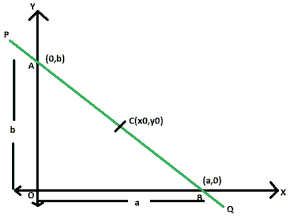

# 通过给定点的直线方程，该给定点将直线分为两条相等的线段

> 原文:[https://www . geeksforgeeks . org/直线通过给定点的方程式，该方程式将给定点一分为二为相等的线段/](https://www.geeksforgeeks.org/equation-of-straight-line-passing-through-a-given-point-which-bisects-it-into-two-equal-line-segments/)

给定一条通过给定点 **(x <sub>0</sub> 、y <sub>0</sub> )** 的直线，使得该点将线段一分为二。任务是找到这条直线的方程式。
**举例:**

> **输入:** x <sub>0</sub> = 4，y <sub>0</sub> = 3
> **输出:** 3x + 4y = 24
> **输入:** x <sub>0</sub> = 7，y <sub>0</sub> = 12
> **输出:** 12x + 7y = 168

**进场:**



设 **PQ** 为直线， **AB** 为轴间线段。x 截距和 y 截距分别为 **a** & **b** 。
现在，由于 **C(x <sub>0</sub> ，y <sub>0</sub> )** 平分 **AB** 所以，
T18】x<sub>0</sub>=(a+0)/2 即 **a = 2x <sub>0</sub>**
同理， **y <sub>0</sub> = (0 + b)**

> **x / a + y / b = 1**
> 在这里，**a = 2x<sub>**&**【b = 2y** **x * y<sub>0</sub>+y * x<sub>0</sub>= 2 * x<sub>0</sub>* y<sub>0</sub>**t36】**</sub>**

**以下是上述方法的实现:** 

## **C++**

```
// C++ implementation of the approach
#include <iostream>
using namespace std;

// Function to print the equation
// of the required line
void line(double x0, double y0)
{
    double c = 2 * y0 * x0;
    cout << y0 << "x"
         << " + " << x0 << "y = " << c;
}

// Driver code
int main()
{
    double x0 = 4, y0 = 3;
    line(x0, y0);

    return 0;
}
```

## **Java 语言(一种计算机语言，尤用于创建网站)**

```
// Java implementation of the approach
class GFG
{

// Function to print the equation
// of the required line
static void line(double x0, double y0)
{
    double c = (int)(2 * y0 * x0);
    System.out.println(y0 + "x" + " + " +
                       x0 + "y = " + c);
}

// Driver code
public static void main(String[] args)
{
    double x0 = 4, y0 = 3;
    line(x0, y0);
}
}

// This code is contributed
// by Code_Mech
```

## **蟒蛇 3**

```
# Python 3 implementation of the approach

# Function to print the equation
# of the required line
def line(x0, y0):
    c = 2 * y0 * x0
    print(y0, "x", "+", x0, "y=", c)

# Driver code
if __name__ == '__main__':
    x0 = 4
    y0 = 3
    line(x0, y0)

# This code is contributed by
# Surendra_Gangwar
```

## **C#**

```
// C# implementation of the approach
using System;

class GFG
{

// Function to print the equation
// of the required line
static void line(double x0, double y0)
{
    double c = (int)(2 * y0 * x0);
    Console.WriteLine(y0 + "x" + " + " +
                    x0 + "y = " + c);
}

// Driver code
public static void Main(String[] args)
{
    double x0 = 4, y0 = 3;
    line(x0, y0);
}
}

/* This code contributed by PrinciRaj1992 */
```

## **服务器端编程语言（Professional Hypertext Preprocessor 的缩写）**

```
<?php
// PHP implementation of the approach

// Function to print the equation
// of the required line
function line($x0, $y0)
{
    $c = 2 * $y0 * $x0;
    echo $y0 , "x"," + ",
         $x0 , "y = " , $c;
}

// Driver code
$x0 = 4; $y0 = 3;
line($x0, $y0);

// This code is contributed by Ryuga
?>
```

## **java 描述语言**

```
<script>

// javascript implementation of the approach

// Function to print the equation
// of the required line
function line(x0 , y0)
{
    var c = parseInt(2 * y0 * x0);
    document.write(y0 + "x" + " + " +
                       x0 + "y = " + c);
}

// Driver code
var x0 = 4, y0 = 3;
line(x0, y0);

// This code is contributed by Amit Katiyar

</script>
```

****Output:** 

```
3x + 4y = 24
```**